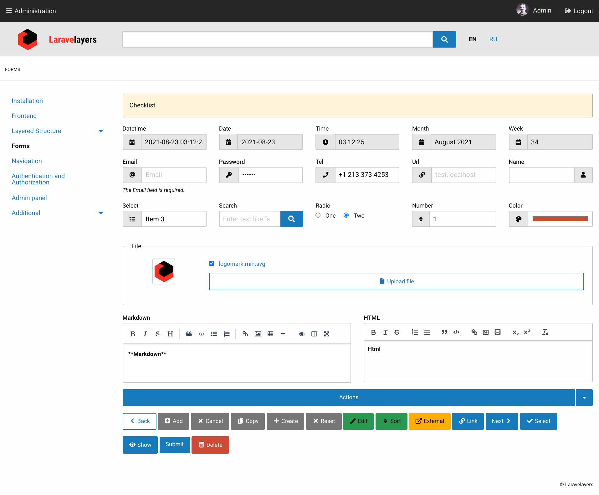

# Laravelayers Documentation

Documentation in [English](src/readme/en/readme.md) and [Russian](src/readme/ru/readme.md).

## Local Installation

You can install the Composer package to view the documentation after installing Laravelayers:

```php
composer config repositories.laravelayers-docs vcs https://github.com/laravelayers/laravelayers-docs

composer require laravelayers/laravelayers-docs
```

Update the admin panel menu cache to add a menu item with a link to local documentation like `https://localhost/laravelayers/docs`:

```php
php artisan admin:menu
```


