# Admin panel

- [Introduction](#introduction)
- [Defining classes](#defining-classes)
- [Controllers](#controllers)
	- [Routing](#routing)
	- [Authorization](#authorizing)
	- [Navigation](#navgation)
	- [Methods](#methods)
- [Services](#services)
	- [Methods for receiving and saving data](#methods-for-receiving-and-saving-data) 
- [Data decorators](#data-decorators)
	- [Forms](#forms)
	- [Actions](#actions)
- [Collection decorators](#collection-decorators)
	- [Tables](#tables)
	- [Search and filter forms](#search-and-filter-forms) 
	- [General forms](#general-forms)
	- [Group actions](#group-actions)
- [Repositories](#repositories)
- [Localization](#localization)

<a name="introduction"></a>
## Introduction

The administration panel is implemented on the basis of [layered structure of classes](layers.md), includes additional classes, views and Artisan commands for quickly creating interfaces for data management.

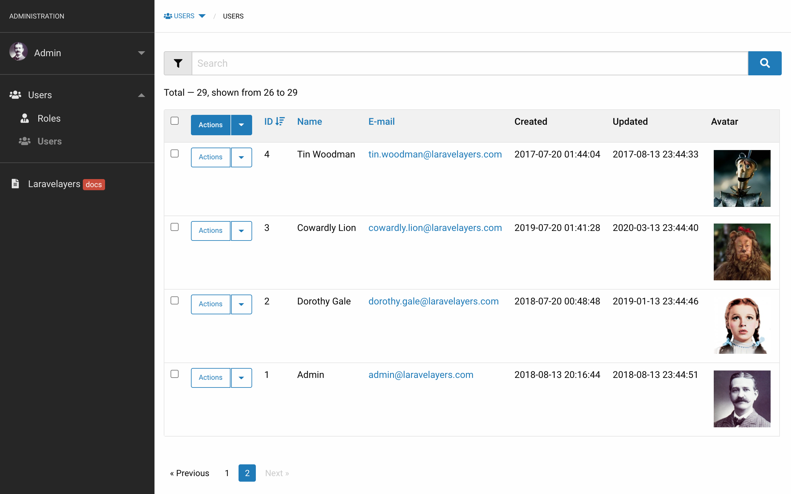

<a name="defining-classes"></a>	
## Definition of classes

The easiest way to create all class layers at once is to create a resource controller by running the `admin:make-controller` Artisan command:

```php
php artisan admin:make-controller Auth/User --parent --lang
```

As a result of this command, the following classes will be created:

- [Controller](#controllers) `App\Http\Controllers\Admin\Auth\UserController`.
- [Service](#services) `App\Services\Admin\Auth\UserService`.
- [Repository](#repositories) `App\Repositories\Admin\Auth\UserRepository`.
- [Data Decorator](#data-decorators) `App\Decorators\Admin\Auth\UserDecorator`.
- [Collection decorator](#collection-decorators)  `App\Decorators\Admin\Auth\UserCollectionDecorator`.
- [Model](models.md) `App\Models\Auth\User`.

The [resource controller routes](#routing) will be added to the `routes/web.php` file:

```php
Route::adminResource('auth/user', '\Laravelayers\Admin\Controllers\Auth\UserController');
```

Using the `--parent` (`-p`) option for the service, repository and decorator classes, extensible classes of the public part of the site will be added, which will be created if they do not exist:
	
- Service `App\Services\Auth\UserService`.
- Repository `App\Repositories\Auth\UserRepository`.
- Decorator `App\Decorators\Auth\UserDecorator`.

The `--lang` (`-l`) option will create a language file in the default `/resources/lang/en/admin/auth/user.php` directory.

> Note that if you first [add the route for the controller](#adding-route), then the [language file](#language-files) will be created according to the route URI for the `index` action, for example, for the route `admin/auth/users/{user}/actions` the language file `/resources/lang/en/admin/auth/users/actions.php` will be created.

To change the name of the service class, use the `--sn` option:

```php
php artisan admin:make-controller Auth/Action --sn Auth/UserActionService
```	

To publish the stub files to the `/stubs/admin` directory, which are used to create classes, run the following Artisan command:

```php
php artisan stub:publish --admin
```
	
To publish views and translations, run the command:

```php
php artisan vendor:publish --tag=laravelayers-admin
```

<a name="controllers"></a>	
## Controllers

The following is a resource controller class with an embedded [service layer](#services) created using the `admin:make-controller` Artisan command.

> Note that the controller extends the dashboard controller base class, which in turn extends the [base controller class](controllers.md#base-controller) base included in Laravelayers.

```php
<?php
	
namespace App\Http\Controllers\Admin\Auth;
	
use App\Services\Admin\Auth\UserService;
use Illuminate\Http\Request;
use Illuminate\Support\Facades\Route;
use Laravelayers\Admin\Controllers\Controller as AdminController;
use Laravelayers\Previous\PreviousUrl;
	
class UserController extends AdminController
{
    /**
     * Create a new UserController instance.
     *
     * @param UserService $userService
     */
    public function __construct(UserService $userService)
    {
        $this->authorizeResource();
	
        $this->service = $userService
            ->setSorting('id', 'desc')
            ->setPerPage(25);
    }
	
    /**
     * Initialize items for the admin menu bar.	     *
     * @return array
     */
    protected function initMenu()
    {
        return [
            'route' => 'admin.auth.users.index',
            'name' => trans('admin/auth/users.menu.name'),
            'parent' => '',
            'icon' => ''
        ];
    }
	
    /**
     * Display a listing of the resource.
     *
     * @param Request $request
     * @return \Illuminate\View\View
     */
    public function index(Request $request)
    {
        $items = $this->service->paginate($request);
	
        return view("admin::layouts.action.index", compact('items'));
    }
	
    /**
     * Show the form for creating a new resource.
     *
     * @param Request $request
     * @return \Illuminate\View\View
     */
    public function create(Request $request)
    {
        $item = $this->service->fill($request);
	
        return view('admin::layouts.action.create', compact('item'));
    }
	
    /**
     * Store a newly created resource in the repository.
     *
     * @param Request $request
     * @return \Illuminate\Http\RedirectResponse
     */
    public function store(Request $request)
    {
        $item = $this->service->fill($request);
	
        $item->getElements()->validate();
	
        $item = $this->service->save($item);
	
        return redirect()->route('admin.DummyRouteName.edit', array_merge([
        	$item->getKey()
		], PreviousUrl::getQuery()));
    }
	
	/**
	 * Display the specified resource.
	 *
	 * @param int $id
	 * @return \Illuminate\Http\RedirectResponse|\Illuminate\View\View
	 */
	public function show($id)
	{
		return Route::has('auth.users.show')
			? redirect()->route('auth.users.show', [$id])
			: $this->edit($id);
	}	    
	
    /**
     * Show the form for editing the specified resource.
     *
     * @param int $id
     * @return \Illuminate\View\View
     */
    public function edit($id)
    {
        $item = $this->service->find($id);
	
        return view('admin::layouts.action.edit', compact('item'));
    }
	
    /**
     * Update the specified resource in the repository.
     *
     * @param int $id
     * @return \Illuminate\Http\RedirectResponse
     */
    public function update($id)
    {
        $item = $this->service->find($id);
	
        $item->getElements()->validate();
	
        $this->service->save($item);
	
        return back();
    }
	
    /**
     * Remove the specified resource from the repository.
     *
     * @param int $id
     * @return \Illuminate\Http\RedirectResponse
     */
    public function destroy($id)
    {
        $this->service->destroy($id);
	
        return back();
    }
	
    /**
     * Show the form for editing multiple resources.
     *
     * @param Request $request
     * @return \Illuminate\View\View
     */
    public function editMultiple(Request $request)
    {
        $items = $this->service->paginate($request);
	
        return view('admin::layouts.action.multiple', compact('items'));
    }

    /**
     * Update multiple resources in the repository.
     *
     * @param  \Illuminate\Http\Request  $request
     * @return \Illuminate\Http\Response
     */
    public function updateMultiple(Request $request)
    {
        $items = $this->service->paginate($request);
	
        $items->getElements()->validate($items);
	
        $this->service->updateMultiple($items);
	
        return back();
    }
	
    /**
     * Show the form for delete multiple resources.
     *
     * @param Request $request
     * @return \Illuminate\View\View
     */
    public function deleteMultiple(Request $request)
    {
        $items = $this->service->paginate($request);
	
        return view('admin::layouts.action.multiple', compact('items'));
    }
	
    /**
     * Remove multiple resources from the repository.
     *
     * @param Request $request
     * @return \Illuminate\Http\RedirectResponse
     */
    public function destroyMultiple(Request $request)
    {
        $items = $this->service->paginate($request);
	
        $items->getElements()->validate();
	
        $this->service->destroy($items->getKeys());
	
        return back();
    }
}
```

> Note that when creating a service object, the [`setSorting()`](services.md#sorting) method of the service is called in the controller's constructor, which sets the default sorting. The [`setPerPage()`](services.md#get-per-page) method of the service is also called, with the help of which the number of elements displayed on the page is set.

<a name="routing"></a>
### Routing

[Installing Laravelayers](installation.md) and executing the `laravelayers-foundation --no-interaction` Artisan command will automatically execute the `admin:make-routes` command, which will add routes to the `routes file/web.php` for the main page of the admin panel and sections for managing users, actions, roles and actions of roles:
	
```php	
// Admin routes

Route::adminResource('/', '\Laravelayers\Admin\Controllers\IndexController', ['only' => 'index']);
	
Route::adminResource('auth/users', '\Laravelayers\Admin\Controllers\Auth\UserController');
	
Route::adminResource('auth/users.actions', '\Laravelayers\Admin\Controllers\Auth\UserActionController');
	
Route::adminResource('auth/roles', '\Laravelayers\Admin\Controllers\Auth\UserRoleController');
	
Route::adminResource('auth/roles.users', '\Laravelayers\Admin\Controllers\Auth\RoleUserController');
	
Route::adminResource('auth/roles.actions', '\Laravelayers\Admin\Controllers\Auth\UserRoleActionController');
```

When creating a resource controller using the `admin:make-controller` Artisan command, routes for it will be added to the `routes/web.php` file if other routes have already been added in the file using the `adminResource` method.

The `adminResource` macro of the `Illuminate\Support\Facades\Route` facade will register the [resource route](https://laravel.com/docs/controllers#resource-controllers) for the controller with the `admin` prefix, which can be changed by setting the value config `admin.prefix`:

Method        | URI                           | Action    | Route Name              |
------------|-------------------------------|-----------|---------------------------
GET         | /admin/auth/users              | index     | admin.auth.users.index     |
GET         | /admin/auth/users/create       | create    | admin.auth.users.create    |
POST        | /admin/auth/users              | store     | admin.auth.users.store     |
GET         | /admin/auth/users/{user}       | show      | admin.auth.users.show      |
GET         | /admin/auth/users/{user}/edit  | edit      | admin.auth.users.edit      |
PUT/PATCH   | /admin/auth/users/{user}       | update    | admin.auth.users.update    |
GET      | /admin/auth/users/{user}/delete   | delete   | admin.auth.users.delete    |
DELETE      | /admin/auth/users/{user}       | destroy   | admin.auth.users.destroy   |

> Note that the full path specified as the first argument to the `adminResource` method is used as the route name.

If you want to place the routes of the admin panel in another file, for example, `routes/admin.php`, then you need to register the file in the service provider `App\Providers\RouteServiceProvider`:

```php
/**
 * Define the "web" routes for the application.
 *
 * These routes all receive session state, CSRF protection, etc.
 *
 * @return void
 */
protected function mapWebRoutes()
{
	Route::middleware('web')
		 ->namespace($this->namespace)
		 ->group(base_path('routes/web.php'));

	Route::middleware('web')
		->namespace($this->namespace)
		->group(base_path('routes/admin.php'));
}
```

> Note that when using the `admin:make-controller` Artisan command, routes will be added to that file in the`routes/` directory, where other routes will be added using the `adminResource` macro.

<a name="authorizing"></a>
### Authorization

For [authorization](auth.md#authorization), the [`authorizeResource`](auth.md#authorizing-resource-controllers) method is called in the controller constructor.

The following admin panel controller methods will be mapped to their respective user actions, using the `/admin/auth/users` route as an example:

Controller method | User action
------------------|-----------------------
index             | admin.auth.users.*
show              | admin.auth.users.view
create            | admin.auth.users.create
store             | admin.auth.users.create
edit              | admin.auth.users.update
update            | admin.auth.users.update
editMultiple      | admin.auth.users.update
updateMultiple    | admin.auth.users.update
destroy           | admin.auth.users.delete
destroyMultiple   | admin.auth.users.delete

<a name="navgation"></a>
### Navigation

<a name="side-menu-bar"></a>
#### Side menu bar

Add the section name for the menu item to the localization file `/resources/lang/en/admin/auth/users.php`:

```php
'menu' => [
    'name' => 'Users'
],
```

To initialize a menu item, it is necessary to define the `initMenu` method in the controller, with the help of which an array with the parameters of the menu item is added, where each parameter is the key and the value of the array:

```php    
// App\Http\Controllers\Admin\Auth\UserController
    
protected function initMenu()
{
	return [
		'route' => 'admin.auth.users.index',
		'name' => trans('admin/auth/users.menu.name'),
		'parent' => '',
		'icon' => ''
	];
}
```
	
> Note that the `route` parameter is used by default as the ID of the menu item, and also to generate the URL if the `url` parameter is not added. The `name` parameter is used by default for menu sorting if the `sorting` parameter is not added.
    
To add a menu item icon, add the `icon` parameter with the [icon] class value (frontend.md#icons):

```php	
return [
	'route' => 'admin.auth.users.index',
	'name' => trans('admin/auth/users.menu.name'),
	'parent' => '',
	'icon' => 'icon-user'
];
```
	
To add a parent menu item, you need to add the `parent` parameter with the value of the parent menu parameters:

```php
return [
	'route' => 'admin.auth.users.index',
	'name' => trans('admin/auth/users.menu.name'),
	'parent' => [
	    'route' => 'admin.auth.index',
	    'name' => trans('admin/auth/users.menu.parent_name'),
	    'url' => route('admin.auth.users.index'),
	    'icon' => 'icon-users',
	],
	'icon' => 'icon-user'
];
```	

> Note that in order to add the same parent menu item for another menu item, it is enough to add as the value for the `parent` parameter only the value of the `route` parameter of the parent menu, for example, `admin.auth.index`.
	
In order to hide a menu item, add the `hidden` parameter with the value `true` or an empty value `name`.

To add a dynamic value to the name of a menu item inside the HTML element `<span class="label secondary">`, you need to add the parameters `label` and `class`, and then update the cache of the menu bar:

```php
// App\Http\Controllers\Admin\Auth\UserController
    
protected function initMenu()
{
	return [
		'route' => 'admin.auth.users.index',
		'name' => trans('admin/auth/users.menu.name'),
		'parent' => '',
		'icon' => '',
		'label' => $this->service->getNewUsersCount(),
		'class' => 'secondary' // primary, success, alert, warning
	];
}
```

To refresh the menu bar cache, run the following Artisan command or open the menu item URL in a browser:

```php
php artisan admin:menu-cache
```
	
The menu object obtained by the `getMenu` method with the argument `menu` is passed to the views `admin::layouts.menuBar` and `admin::layouts.header` in the variable `menu` using the view composer registered with the service provider `Laravelayers\Admin\AdminServiceProvider`.

The `getMenuItem` method of the controller returns an array with the data of the current menu item, prepared using the `prepareMenuItem` method.

<a name="breadcrumbs"></a>
#### Bread crumbs


The navigation chain for the current menu item added using the `initMenu()` method is automatically created, including if the item is hidden from the menu bar using the `hidden` parameter.

You can also initialize the menu path item using the `initMenuPath()` method, including for the [nested resource](#https://laravel.com/docs/controllers#restful-nested-resources) route, for example, to display the path `AUTH / USERS / № 20 / ROLES` for the route URL `/admin/auth/users/20/roles`, where `№ 20` is a link to `/admin/auth/users/20/edit`:

```php
// App\Http\Controllers\Admin\Auth\UserController

/**
 * Initialize path items for the admin menu.
 *
 * @return array
 */
protected function initMenuPath()
{
	return [
	    'route' => 'admin.auth.users.roles.index',
	    'parent' => 'admin.auth.users.edit',
	    'name' => trans('admin/auth/users/roles.menu.name'),
	];
}
```
	
> Note that the `parent` parameter specifies a route with the action method name `edit` to automatically add a menu item for this route.
    
You can also add several items to the breadcrumbs, including the nested resource route, for example, to display the path `AUTH / USERS / № 20 / ROLES / № 1 / ACTIONS` for the route URL `/admin/auth/users/20/roles/1/actions`, where `№ 1` is a link to `/admin/auth/users/20/roles/1/edit`:

```php
return [
	[
		'route' => 'admin.auth.users.roles.index',
		'parent' => 'admin.auth.users.edit',
		'name' => trans('admin/auth/users/roles.menu.name'),
	],
	[
		'route' => 'admin.auth.users.roles.actions.index',
		'parent' => 'admin.auth.users.roles.edit',
		'name' => trans('admin/auth/users/actions.menu.name'),
	]
];
```
	
The menu path object obtained by the `getMenu` method with the argument `path` is passed to the views `admin::layouts.menuBar` and `admin::layouts.header` in the variable `path` using the view composer registered with the service provider `Laravelayers\Admin\AdminServiceProvider`.

Likewise, the string for the HTML `title` tag, obtained with the `getMenu` method with the `title` argument, is passed to the `admin::layouts.app` view in the `title` variable.

The controller's `getIsBackLinkForMenuPath` method returns the `isBackLinkForMenuPath` property `true` if it is allowed to display the Back link in the menu path when passing the [previous URL](previous.md) argument in the request. You can change this value by calling the static method `setIsBackLinkForMenuPath` with the argument `false`. 

<a name="submenu-bar"></a>
#### Submenu panel

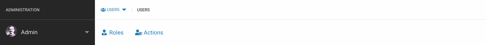

The submenu panel is designed to display subsections of the current menu item below the navigation chain, which do not need to be displayed in the sidebar. To initialize menu level items, it is necessary to define the `initSubmenu` method in the controller, with the help of which an array with menu items is added, if the menu item is already initialized in another controller, then it is enough to add only the `route` parameter for the menu item:

```php
// App\Http\Controllers\Admin\Auth\UserController

/**
 * Initialize items for the admin submenu.
 *
 * @return array
 */
protected function initSubmenu()
{
	return [
		0 => [
			'route' => 'admin.auth.roles.index',
			'name' => trans('admin/auth/users/roles.menu.name'),
			'icon' => 'icon-user-tie',
			'sorting' => 1
		],
		1 => [
			'route' => 'admin.auth.actions.index',
			'sorting' => 2
		],
	];
}
```

The submenu object is called in the view from the current menu item as [subtree](navigation.md#get-item-tree):

```php
$path->last()->getTree();
```

<a name="methods"></a>		
### Methods

The following controller methods correspond to route actions: 

- [`index()`](#index)
- [`create()` and `store()`](#create-and-store)
- [`show()`](#show)
- [`edit()` and `update()`](#edit-and-update)
- [`destroy()`](#destroy)

The following additional controller methods are called when the `store` method is called and the `action` argument is passed in the HTTP request, the value of which is used as the name of the controller method called:

- [`editeMultiple()` and `updateMultiple()`](#edit-multiple-and-update-multiple)
- [`deleteMultiple()`/`destroyMultiple()`](#delete-multiple-and-destroy-multiple)

> Note that this is possible by overriding the `dispatch` method of the `Illuminate\Routing\ControllerDispatcher` class in the `Laravelayers\Admin\ActionRouteDispatcher` class it is associated with in the `Laravelayers\Admin\AdminServiceProvider` service provider. 

<a name="index"></a>
**`index()`**

The `index` method returns the `admin::layouts.action.index` view to display the data collection.


<a name="create-and-store"></a>
**`create()` и `store()`**

The `create` method returns the `admin::layouts.action.create` view to display the data creation form.

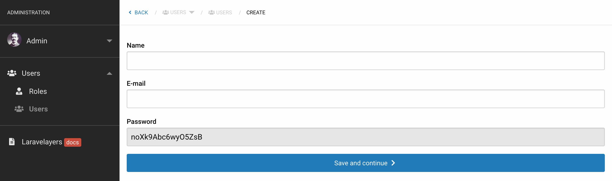

After submitting the form, the request data is passed to the `store` method, in which it is validated and passed to the [`save`](#save) method of the service object, after which it redirects to the `edit` action of the route.

<a name="show"></a>
**`show()`**

The `show` method redirects to the public page of the site to display data, if such a route exists, or returns the `admin::layouts.action.edit` view to display the data editing form, but without the ability to submit the form.

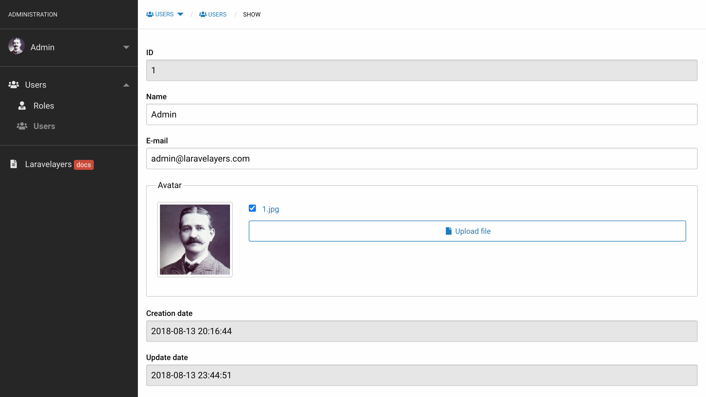

<a name="edit-and-update"></a>
**`edit()` and `update()`**

The `edit` method returns the `admin::layouts.action.edit` view to display the data edit form.

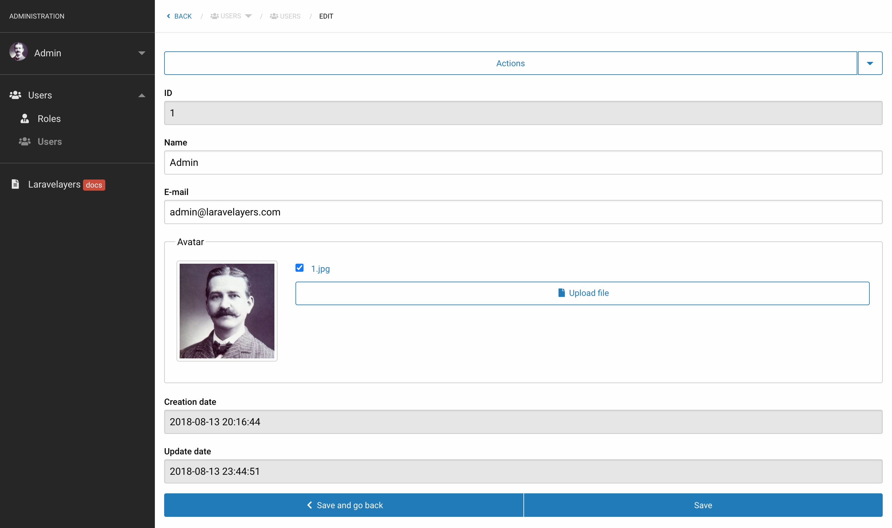

After submitting the form, the HTTP request data is passed to the `update` method, in which it is validated and passed to the [`save`](#save) method of the service object.

<a name="destroy"></a>
**`destroy()`**

The `destroy` method removes data using the [`destroy`](#service-destroy) method of the service.

<a name="edit-multiple-and-update-multiple"></a>
**`editMultiple()` and `updateMultiple()`**

The `editMultiple` method returns the `admin::layouts.action.multiple` view to display an edit form for all collection items displayed on the page for the controller method [`index`](#index), or selected elements whose IDs are passed in HTTP request.

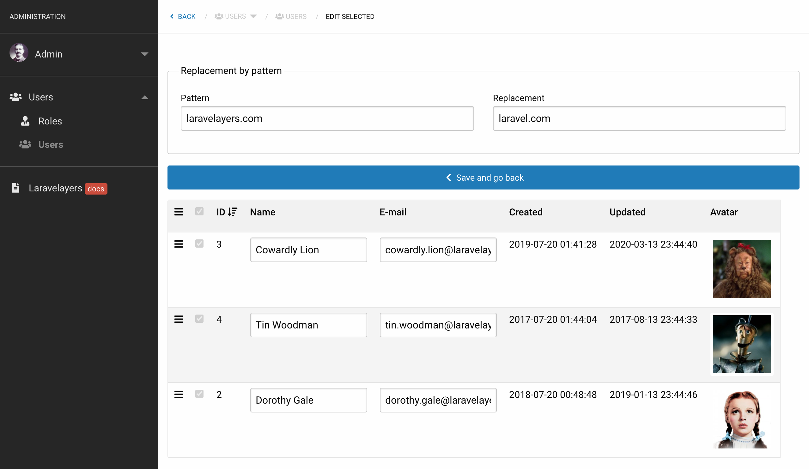

After submitting the form, the HTTP request data is passed to the `updateMultiple` method, where it is validated and passed to the [`updateMultiple`](#update-multiple) method of the service object.

<a name="delete-multiple-and-destroy-multiple"></a>
**`deleteMultiple()` and `destroyMultiple()`**

The `deleteMultiple` method returns the `admin::layouts.action.multiple` view to display a form for deleting all collection items displayed on the page for the controller method [`index`](#index), or selected elements whose IDs are passed in HTTP request.

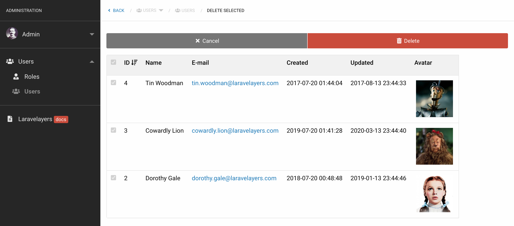

After the form is submitted, the HTTP request data is passed to the `destroyMultiple` method, in which it is passed to the [`destroy`](#service-destroy) method of the service object.

<a name="services"></a>	
## Services

Below is the class of the service layer with embedded [repository](#repositories), created using the `admin:make-service` Artisan command with the option `--parent` or [`admin:make-controller`](#defining-classes).

> Note that the service extends the base service class of the public part of the site, but if it were created without the `--parent` option, then it would extend the [base service class](services.md#base-service) included in Laravelayers. The `--parent` option should be used when it is necessary to separate the administration methods from the methods of the public part of the site.

```php
<?php
	
namespace App\Services\Admin\Auth;
	
use App\Decorators\Admin\Auth\UserDecorator;
use App\Decorators\Admin\Auth\UserCollectionDecorator;
use App\Repositories\Admin\Auth\UserRepository;
use App\Services\Auth\UserService as BaseUserService;
use Illuminate\Http\Request;
use Laravelayers\Foundation\Decorators\CollectionDecorator;
	
class UserService extends BaseUserService
{
    /**
     * Create a new UserService instance.
     *
     * @param UserRepository $userRepository
     */
    public function __construct(UserRepository $userRepository)
    {
        $this->repository = $userRepository;
	
        $this->setDecorators([
            UserDecorator::class,
            UserCollectionDecorator::class,
        ]);
    }
	
    /**
     * Fill the resource instance with values.
     *
     * @param Request $request
     * @return \Laravelayers\Foundation\Decorators\DataDecorator|UserDecorator
     */
    public function fill(Request $request)
    {
        if ($request->has('id')) {
            return ($item = $this->find($request->get('id')))->forget($item->getKeyName());
        }
	
        return $this->repository->fill();
    }
	
    /**
     * Find the resource by the specified ID.
     *
     * @param int $id
     * @return \Laravelayers\Foundation\Decorators\DataDecorator|UserDecorator
     */
    public function find($id)
    {
        return $this->repository->findOrFail($id);
    }
	
    /**
     * Paginate resources.
     *
     * @param Request $request
     * @return \Laravelayers\Pagination\Decorators\PaginatorDecorator|CollectionDecorator|UserCollectionDecorator
     */
    public function paginate(Request $request)
    {
        $this->search($request)
            ->sort($request)
            ->whereStatus();
	
        return ($ids = $this->getFormElements($request, 'id'))
            ? $this->repository->findOrFail($ids)
            : $this->repository->paginate($this->getPerPage($request));
    }
	
    /**
     * Update multiple resources in the repository.
     *
     * @param CollectionDecorator|UserCollectionDecorator $items
     * @return CollectionDecorator|UserCollectionDecorator
     */
    public function updateMultiple(CollectionDecorator $items)
    {
        $request = $items->getElements()->getRequest();
	
        foreach($items as $key => $item) {
            $item = $items->setSorting($this->getFormElements($request, 'id')[$key]);
	
            if ($request->get('pattern')) {
                $item->replaceElements($request->pattern, $request->replacement);
            }
	
            $this->repository->save($item);
        }
	
        return $items;
    }
}
```

> Note that decorators are set in the service constructor using the [`setDecorators`](services.md#set-decorators) method.

To change the name of the repository class, use the `--rn` option:

```php
php artisan admin:make-service Auth/Action --rn Auth/UserActionRepository
```

<a name="methods-for-receiving-and-saving-data"></a>
### Methods for getting and saving data

The service defines the following default methods that are called in the controller:

- [`fill`](#fill)
- [`find`](#find)
- [`paginate`](#paginate)
- [`updateMultiple`](#update-multiple)
- [`save`](#save)
- [`destroy`](#service-destroy)

<a name="fill"></a>
**`fill()`**

The `fill` method is used to fill the data decorator object with the names of the resource columns with the value `null` using the [`fill`](repositories.md#fill) method of the repository:

```php
$this->repository->fill(['userActions']);
	
/*
	UserDecorator {
		#dataKey: "data"
		#data: array:10 [
			"id" => null
			"login" => null
			"password" => null
			"email" => null
			"remember_token" => null
			"created_at" => null
			"updated_at" => null
			"userActions" => array:13 []
		]
		#primaryKey: "id"
		#originalKeys: array:7 []
		#dateKeys: array:3 []
		#timestampKeys: array:2 []
		#relationKeys: array:1 []
		#hiddenKeys: array:2 []	
		...
	}
*/
```

Or the method is used to get data by the ID of the copied resource:

```php
$item = $this->find($request->get('id')));
$item->forget($item->getKeyName());

/*
	UserDecorator {
		#dataKey: "data"
		#data: array:10 [
			"login" => "Test"
			"password" => "$1$Ij1.x14.$1vL1gUVCT8QlfO7XXZn2o."
			"email" => "test@example.com"
			"remember_token" => "mz2dEw8vz370ppsVluP0cpEj1basg8SX1xFEnu06qM2pKdWg7zn7nOokgtPx"
			"created_at" => 2020-12-20 03:25:00
			"updated_at" => 2020-12-20 04:25:00
			"userActions" => array:13 []
		]
		#primaryKey: "id"
		#originalKeys: array:7 []
		#dateKeys: array:3 []
		#timestampKeys: array:2 []
		#relationKeys: array:1 []
		#hiddenKeys: array:2 []	
		...
	}
*/
```

<a name="find"></a>
**`find()`**

The `find` method retrieves data by the ID of the specified resource or returns a 404. error.

<a name="paginate"></a>
**`paginate()`**

The `paginate` method is used to filter and retrieve the elements of a paginated collection, taking the number of displayed elements that it gets with the [`getPerPage`](services.md#get-per-page) method.

If the IDs of the selected items are passed in the HTTP request, the method returns the selected items:

```php
return ($ids = $this->getFormElements($request, 'id'))
	? $this->repository->findOrFail($ids)
	: $this->repository->paginate($this->getPerPage($request));
```

> Note that the IDs of the selected items are passed to the controller methods [`editMultiple`](#edit-multiple-and-update-multiple and [`deleteMultiple`](#delete-multiple-and-destroy-multiple).

<a name="update-multiple"></a>
**`updateMultiple()`**

The `updateMultiple` method is used to update the data collection by the passed ID using the [`save`](repositories.md#save) method of the repository, including to change the general values of the data collection, for example, to replace text or change the status:

```php   
$request = $items->getElements()->getRequest();
   
foreach($items as $key => $item) {
	if ($request->get('pattern')) {
	    $item->replaceElements($request->pattern, $request->replacement);
	}
            
	if ($request->has('status')) {
		$item->put('status', $request->get('status'));
	}
	
	$this->repository->save($item);
}
```
	
Also the method is used to save [changed sort order in data collection](#sort-order-for-group-editing):

```php	
foreach(clone $items as $key => $item) {
	$item = $items->setSorting($this->getFormElements($request, 'id')[$key]);
	
	$this->repository->save($item);
}
```	

<a name="save"></a>
**`save()`**

The `save` method is not defined in the service, so the [`save`](repositories.md#save) method from the repository is called.

<a name="service-destroy"></a>
**`destroy()`**

The `destroy` method is not defined in the service layer, so the [`destroy`](repositories.md#destroy) method from the repository is called.

<a name="data-decorators"></a>	
## Data decorators

Below is a data decorator class created with the command `admin:make-decorator` or [`admin:make-controller`](#defining-classes).

> Note that the data decorator implements the `Laravelayers\Contracts\Admin\DataDecorator` administration decorator interface with the embedded `Laravelayers\Contracts\Admin\DataDecorator` trait.

```php
<?php
	
namespace App\Decorators\Admin\Auth;
	
use Laravelayers\Admin\Decorators\DataDecorator as TraitDataDecorator;
use Laravelayers\Contracts\Admin\DataDecorator as DataDecoratorContract;
use App\Decorators\Auth\UserDecorator as BaseUserDecorator;
	
class UserDecorator extends BaseUserDecorator implements DataDecoratorContract
{
    use TraitDataDecorator;
	
    /**
     * Initialize form elements.
     *
     * @return array
     */
    protected function initElements()
    {
        return $this->getDefaultElements();
    }
	
    /**
     * Initialize the form actions element.
     *
     * @return array
     */
    protected function initActionsElement()
    {
        return $this->getDefaultActions(['show', 'create']);
    }
	
    /**
     * Initialize form elements for editing multiple collection elements.
     *
     * @return array
     */
    protected function initMultipleElements()
    {
        return array_keys($this->initElements());
    }
    
	/**
	 * Get the sort order.
	 *
	 * @return int|null
	 */
	public function getSorting()
	{
		return $this->get($this->getSortKey());
	}
	
	/**
	 * Set the sort order.
	 *
	 * @param int|string $value
	 * @return $this
	 */
	public function setSorting($value)
	{
		return !is_null($this->getSorting()) ? $this->put($this->getSortKey(), (int) $value) : $this;
	}	    
}
```

<a name="forms"></a>
### Forms


For the controller methods [`create`](#create-and-store) and [`edit`](#edit-and-update), a form is displayed for creating and editing data, therefore, to initialize the [form](forms.md#initialization-of-form-elements) an abstract method `initElements` must be defined.

> Note that using the `prepareElements` method of the `DataDecorator` trait, when receiving form elements using the [`getElements`](forms.md#get-form-elements) method, additional elements will be added: form element, [element forms for actions](#form-element-for-actions), disabled primary key element, disabled elements of the date of creation and data update, button elements for submitting the form.

By default, the `initElements` method returns the result of calling the `getDefaultElements` method, which creates default form elements for all non-hidden columns.

Add the required form elements:

```php
protected function initElements()
{
	return [
		'login' => [
			'type' => 'text',
			//'name' => 'login',
			//'value' => $this->login,
			'required' => '',
			'rules' => 'required'
		],
		'email' => [
			'type' => 'email',
			'value' => $this->email,
			'label' => '',
			'required' => '',
			'rules' => 'required|email'
		]
	];
}
```

> Note that if no `value` attribute is added for the form element, then the value for the key of the decorator object corresponding to the `name` attribute will be returned.

To add for a form element [label text](forms.md#labels), text inside the text box, [help text](forms.md#help-text), [tooltip text](forms.md#tooltip-text) and [Javscript error text](forms.md#error-text), just add the translation for the name of the form element with the appropriate postfix to the localization file `/resources/lang/en/admin/auth/users.php`:

```php	
'elements' => [
	'login_label' => 'Login',
	'login_placeholder' => 'Placeholder text',
	'login_help' => 'Help text.',
	'login_tooltip' => 'Tooltip text.',
	'login_error' => 'Javascript error text for :attribute.',
	'email_label' => '',
],
```
	
> Note that in order not to display the label text, you must specify an empty value for the translation string, or add the `label` parameter with an empty value for the form element.

To get the translation string from the [language file](#language-files), the static method `transOfElement` is used, which takes the key of the translation string as the first argument, an array of replacements as the second argument, and the value `true` to return an empty string. when no translation was found:

```php
static::transOfElement('id_label');
	
// "ID"
	
static::transOfElement('test_label');
	
// "/lang/en/admin/auth/users.elements.test_label"
	
static::transOfElement('login_error', ['attribute' => 'Login']);
	
// "Javascript error text for Login."
	
static::transOfElement('test_label', [], true);
	
// ""
```

You can hide the form element for specified actions by calling the `isAction` method, which returns `true` if one of the specified actions matches the current controller method:

```php
'password' => [
	'type' => 'password',
	'required' => '',
	'rules' => 'required|email',
	'hidden' => $this->isAction(['edit', 'editMultiple'])
	//'hidden' => !$this->isAction('create')
],
```
		
<a name="form-element-for-actions"></a>
#### Form element for actions

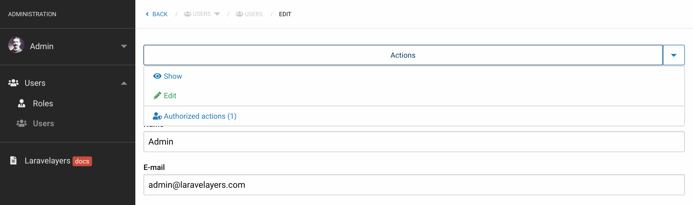

To initialize a form element that maps [dropdown links](forms.md#type-button-dropdown) to other actions, you need to define an abstract method `initActionsElement`.

> Note that when receiving form elements, actions will be added at the beginning of all [initialized elements](#forms).

By default, the `initActionsElement` method returns the result of calling the `getDefaultActions` method according to the array of `show` and` create` actions.

You can add the required actions or return an empty array:

```php
protected function initActionsElement()
{
	return [
		'copy' => [
			'link' => 'create',
			'httpQuery' => ['id' => $this->getKey()],
			'text' => static::transOfAction('copy'),
			'view' => 'copy',
			'group' => 0
		],
		'show' => [
			'link' => 'show',
			'group' => 0
		],
		'actions' => [
			'type' => 'link',
			'link' => 'admin.auth.users.actions.index',
			'text' => static::transOfAction('actions', ['count' => $this->user_actions_count]),
			'icon' => 'icon-user-shield',
			'group' => 1
		],
		'roles' => [
			//'type' => 'link',
			'link' => 'admin.auth.users.roles.index',
			'text' => $this->user_role_count,
			'icon' => 'icon-user-tag',
			'group' => 1
		],			
	];
}
```
	
> Note that if a `type` parameter is not added to an action, then its default value will be `link`.

For the `link` parameter, a route name or URL can be added. If you add only the action name of the current route or the name of a nested route, the route parameters will be added automatically. An array of parameters for the route can also be passed using the `routeParameters` parameter of the form element. An array of parameters for the HTTP request string can be passed using the `httpQuery` parameter of the form element. If a route name is specified, then the action will be hidden for the user not [authorized](auth.md#authorization) for the route name.

To add text for a form element, just add a translation for the name of the form element in the localization file `/resources/lang/en/admin/auth/users.php`:

```php
'actions' => [
	'actions' => 'Actions :count',
	'roles' => 'Roles :count'
],
```

To get the translation string from the [language file](#language-files), the static method `transOfAction` is used, which takes the key of the translation string as the first argument, and can also take an array of replacements as the second argument, and the value `true` to return an empty string when no translation is found:

```php
static::transOfAction('roles', ['count' => $this->user_roles_count], false);
	
// Actions 1
```
	
> Note that if the `text` parameter is not used, then the `name` parameter of the form element is used as the translation string key. If the `text` parameter contains an integer, then it will be passed to the `transAction` method in the substitution array as the second argument.

<a name="form-elements-for-group-editing"></a>
#### Form elements for group editing


To initialize form elements displayed when editing a data collection for the controller method [`editMultiple`](#edit-multiple-and-update-multiple), you must define an abstract method `initMultipleElements`.

By default, the `initMultipleElements` method returns the keys of all [initialized elements](#forms) obtained by calling the `initElements` method.

You can add the required keys or return an empty array:

```php
protected function initMultipleElements()
{
    return [
    	0 => 'login',
    	1 => 'email',
    ];
}
```
    
You can also change parameters for initialized form elements, including setting the element's minimum width using the `width` parameter:

```php
protected function initMultipleElements()
{
    return [
    	'login' => [
    		'width' => 100,
  			'rules' => 'required|min:5|max:50',
			'data-validator' => 'validator',
			'data-validator-name' => 'isLength',
			'data-validator-options' => "'min':5,'max':50"
    	],
    	'email' => 100
    ];
}
```

<a name="sort-order-for-group-editing"></a>    
**To be able to change the sort order in the data collection** displayed for the controller method [`editMultiple`](#edit-multiple-and-update-multiple), you need to define methods for getting and changing the sort order in the data decorator:

```php
/**
 * Get the sort order.
 *
 * @return int|null
 */
public function getSorting()
{
	return $this->get($this->getSortKey());
}
	
/**
 * Set the sort order.
 *
 * @param int|string $value
 * @return $this
 */
public function setSorting($value)
{
	return !is_null($this->getSorting()) ? $this->put($this->getSortKey(), (int) $value) : $this;
}
```
	
> Note that the `getSorting` method returns the `sorting` value of the `$sortKey` property, which you can change if you need to use a different method name to get and change the sort.

The `getIsSortableRows` method of the collection decorator calls the `getSortKey` method of the data decorator to retrieve the sort key, which verifies that the data decorator's sort order value does not return `null`.

When you save the changed sort order using the [`updateMultiple`](#update-multiple) method of the service, the `setSorting` method of the collection decorator is called, which takes the primary key of the data decorator during each iteration and changes the sort order value.
 
<a name="actions"></a>
### Actions

For the controller method [`index`](#index), each element of the collection, i.e. data decorator, displayed on the [table](#tables) row along with a [action dropdown](forms.md#type-button-dropdown) to manipulate the data.

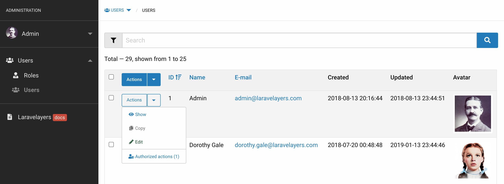

In order to change the displayed actions, you need to override the `initActions` method of the data decorator, which by default returns the result of calling the `getDefaultActions` method with an array of action elements:

```php
/**
 * Initialize actions.
 *
 * @return array
 */
protected function initActions()
{
	return $this->getDefaultActions(['show', 'create', 'edit']);
}
```
	
> Note that the `getDefaultActions` method by default only returns actions that match the controller method by the key of the array element, unless an array with the keys of allowed actions is passed to the method.

You can also override the default action initiation methods: `initActionToShow`, `initActionToCreate`, `initActionToEdit`.
	
<a name="collection-decorators"></a>	
## Collection decorators

Below is the data collection decorator class created with the `admin: make-decorator` Artisan command with the `--collection` or [`admin:make-controller`](#defining-classes) option.

> Note that the collection decorator extends the `Laravelayers\Admin\Decorators\CollectionDecorator` class, which in turn extends the [collection decorator base class](decorators.md#collection-decorator).

```php
<?php
	
namespace App\Decorators\Admin\Auth;
	
use Laravelayers\Admin\Decorators\CollectionDecorator;
	
class UserCollectionDecorator extends CollectionDecorator
{
	/**
	 * Initialize the columns.
	 *
	 * @return array
	 */
	protected function initColumns()
	{
		return $this->getDefaultColumns();
	}
	
	/**
	 * Initialize the filter.
	 *
	 * @return array
	 */
	protected function initFilter()
	{
		return [];
	}
	
	/**
	 * Initialize the search options.
	 *
	 * @return array
	 */
	protected function initSearch()
	{
		return parent::initSearch();
	}
	
	/**
	 * Initialize the quick filter.
	 *
	 * @return array
	 */
	protected function initQuickFilter()
	{
		return [];
	}
	
	/**
	 * Initialize form elements.
	 *
	 * @return mixed
	 */
	protected function initElements()
	{
		return $this->getDefaultElements();
	}
}
```

<a name="tables"></a>
### Tables


For controller methods [`index`](#index), [`editMultiple`](#edit-multiple-and-update-multiple) and [`deleteMultiple`](#edit-multiple-and-update-multiple) data collection is displayed as a table, therefore, to initialize the table columns, it is necessary to implement the abstract method `initColumns` of the collection decorator, which must return an array of parameters for the table columns, where the array key must match the name of the collection item key, i.e. of the data decorator, if the `column` parameter is not specified, to fill the table cell with the value corresponding to the key of the data decorator:

```php
// App\Decorators\Admin\Auth\UserCollectionDecorator
	
protected function initColumns()
{
	return [
		'login' => [
			'column' => 'login',
			'name' => 'Login',			
		],
		'email' => [],
		'created_at' => []
	];
}
```
	
> Note that using the `prepareColumns` method of the collection decorator, when you get the columns using the `getColumns` method, the ID column is automatically added.

You can also use the `addColumn` method to add a column and the `addColumn` prefix methods to add the appropriate parameters:

```php
protected function initColumns()
{
	return [
		$this->addColumn('login')
			->addColumnName('Login'),
			
		$this->addColumn('email'),
		
		$this->addColumn('created_at')
	];
}
```

<a name="column-name"></a>
#### Column name

Add the column name to the localization file `/resources/lang/en/admin/auth/users.php` according to the column name, or add a `name` parameter for the column:

```php
'columns' => [
	'login' => 'Lgoin',
	'email' => 'Email',
	'created_at' => 'Created at'
],
```

If you used the `addColumn` method to add a column, use the `addColumnName` method to add the `name` parameter:

```php
	$this->addColumn('login')->addColumnName('Login'),
```
	
To display additional text under the column name, add the translation string to the localization file according to the column name and the `_text` postfix, or add the `text` parameter for the column:

```php
'columns' => [
	//...
	'login_text' => 'Additional text',
],
```
	
If you used the `addColumn` method to add a column, use the `addColumnText` method to add the `text` parameter:

```php
$this->addColumn('login')->addColumnText('Additional text'),
```
	
To display the tooltip text for the column name, add the translation string to the localization file according to the column name and the `_tooltip` postfix, or add the `tooltip` parameter for the column:

```php
'columns' => [
	//...
	'login_tooltip' => 'Tooltip text'
],
```
	
If you used the `addColumn` method to add a column, use the `addColumnTooltip` method to add the `tooltip` parameter:

```php
$this->addColumn('login')->addColumnTooltip('Tooltip text'),
```	
	
To get the translation string from the [language file](#language-files), the static method `transOfColumn` is used, which takes the key of the translation string as the first argument, and can also take an array of replacements as the second argument, and the value `true` to return an empty string when no translation is found:

```php
static::transOfColumn('login_text', [], false);
	
// Actions 1
```	

<a name="column-sort"></a>	
#### Sort by Column

To be able to sort the data collection by column, you need to add the `sort` and `desc` parameters, as well as `checked` for the default column: 

```php
protected function initColumns()
{
	return [
		'login' => [
			'sort' => 'login',
			'desc' => true,
			'checked' => true			
		],
		'email' => [
			'sort' => 'email'
		],
		'created_at' => [
			'sort' => 'created',
			'desc' => 0
		]
	];
}
```
	
> Note that the value of the `sort` and` desc` parameter is used to form the link of the column `/admin/auth/users?sort=created_at&desc=1` if the `link` parameter is not added.

If you used the `addColumn` method to add a column, then use the `addColumnSorting` method to add the `sort`, `desc`, `checked` and `link` parameters:

```php
$this->addColumn('login')->addColumnSorting('login', true, true, null),
```

You also need to set the default repository sorting method, this can be done when creating a service object in the controller using the `setSorting` method:

```php
// App\Http\Controllers\Admin\Auth\UserController
	
public function __construct(UserService $userService)
{
	$this->authorizeResource();
		
	$this->service = $userService
		->setSorting('login', 'desc')
		->setPerPage(25);
}
```

> Note that if the service's `setSorting` method is used, then when getting the table columns, for the column with the corresponding value of the `sort` parameter, the `checked` parameter with the `true` value and the `desc` parameter will be added.

Using the [`sort`](services.md#sort) method of the service, depending on the value of the `sort` argument in the HTTP request line, the corresponding repository method will be called:

```php
// ?sort=login&desc=0
$this->repository->sortingByLogin('asc');
	
// ?sort=created_at&desc=1
$this->repository->sortingByCreatedAt('desc');
```
	
> Please note that when [calling a non-existent repository method](repositories.md#call), the corresponding model method with the `scope` prefix will be called.

As a result, it is enough to add a method for the model with the `scopeSortingBy` prefix and a name corresponding to the value of the `sort` argument:

```php
// App\Models\Auth\User

/**
 * Sorting by login.
 *
 * @param \Illuminate\Database\Eloquent\Builder $query
 * @param string $direction
 * @return \Illuminate\Database\Eloquent\Builder
 */
public function scopeSortingByLogin($query, $direction = 'asc')
{
	return $query->orderBy($this->loginColumn, $direction);
}
	
/**
 * Sorting by creation date.
 *
 * @param \Illuminate\Database\Eloquent\Builder $query
 * @param string $direction
 * @return \Illuminate\Database\Eloquent\Builder
 */
public function scopeSortingByCreatedAt($query, $direction = 'desc')
{
    return $query->orderBy(static::CREATED_AT, $direction);
}
```
	
Or, pass the column name in the value of the `sort` argument in the HTTP request string, which will be passed to the default `scopeSorting` method, if a column with that name exists:

```php
/**
 * Sort by default.
 *
 * @param \Illuminate\Database\Eloquent\Builder $query
 * @param string $direction
 * @param string|null $column
 * @return \Illuminate\Database\Eloquent\Builder
 */
public function scopeSort($query, $direction = 'desc', $column = null)
{
	return $query->orderBy($column ?: $this->getQualifiedKeyName(), $direction);
}
```

<a name="cell-text"></a>	
#### Text in a cell

To limit the length of the displayed text in a table cell, you need to add the `length` parameter, in which case the full text will be displayed in the modal window when you click on the text in the cell:

```php
protected function initColumns()
{
	return [
		'login' => [],
		'email' => [
			'length' => 50,
			'html' => true
		],
		'created_at' => []
	];
}
```
	
> Note that the `html` parameter with the value `true` is added automatically, if you change the value to `false`, then the full text without HTML code will be displayed in the cell when you click on the text.

If you used the `addColumn` method to add a column, use the `addColumnLength` method to add the `length` and `html` parameters:

```php
$this->addColumn('login')->addColumnLength(50, false),
```

When filling a table cell with a value obtained from the [data decorator](#data-decorators) by the column key or the value of the `column` parameter, you can transform the displayed text using the method with the [`render`](decorators.md#get-renderer) data decorator:

```php
// App\Decorators\Admin\Auth\UserDecorator
	
/**
 * Render the email.
 *
 * @return string
 */
public function renderEmail()
{
	return view('admin::layouts.table.a', [
		'slot' => $this->email,
		'href' => 'mailto:' . $this->email
	]);
}
```

<a name="render-methods"></a>
**You can also use additional methods to convert the display text:**

- `renderAsHint` - the method accepts the text and text of the displayed hint. The third argument can be passed the value `true` to display the tooltip text without line breaks.
- `renderAsLink` - the method accepts text and URL to display the link, also as the first argument you can pass an array of links, where the key is the text, the value is the URL. The third argument can be passed the value `true` to open the link in a new window. The fourth argument can be passed the value `true` to display the link text without line breaks. The fifth argument can be a class value for the reference, or an array of classes corresponding to an array of references.
- `renderAsIcon` - the method accepts a class for displaying [icons](frontend.md#icons). Instead of the icon class, the method can take on a default value, for example, `&mdash;`.
- `renderAsImage` - the method accepts a URL to display the image. URL can be passed as the second argument  to display the image in the modal window when clicking on the image thumbnail.
- `renderAsList` - the method accepts an array of values to display the list. The second argument can be passed the value `true` to display a numbered list. The third argument can be passed the value `true` to display the list text without line breaks. The class value for the list can be passed as the fourth argument.

Additional methods are called inside the method with the `render` prefix of the data decorator:

```php
public function renderEmail()
{
	return $this-renderAsLink(this->email, 'mailto:' . $this->email);
}
	
/*
	<a href="mailto:user@email.com">user@email.com</a>
*/
```

<a name="hidden-column"></a>
#### Hidden column

To hide a column, add the `hidden` parameter:

```php
protected function initColumns()
{
	return [
		'id' => [
			'hidden' => true
		],		
		'login' => [],
		'email' => [
			'hidden' => Gate::denies('edit')
		],
		'created_at' => []
	];
}
```
	
If you used the `addColumn` method to add a column, use the `addColumnHidden` method to add the `hidden` parameter:

```php
$this->addColumn('login')->addColumnHidden(true),
```

<a name="additional-parameters"></a>	
#### Additional options

All additional parameters for the column are applied to the cell with the column name as HTML attributes:

```php
protected function initColumns()
{
	return [	
		'login' => [
			'name' => 'Login',
			'class' => 'example',
			'data-test' => ''	
		],
		'email' => [],
		'created_at' => []
	];
}
	
/*
	<thead>
		<tr>
			...		
			<th class="example" data-test>
				<nobr>Login</nobr>
			</th>	
			...
		</tr>
	</thead>
*/
```
	
If you used the `addColumn` method to add a column, use the `addColumnAttributes` method to add additional parameters:

```php
$this->addColumn('login')->addColumnAttributes([
	'class' => 'example',
	'data-test' => ''	
]),
```

<a name="search-and-filter-forms"></a>
### Search and filter forms

For the controller method [`index`](#index), the filter form is displayed in a modal window that opens when you click on the search form.

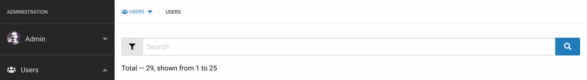

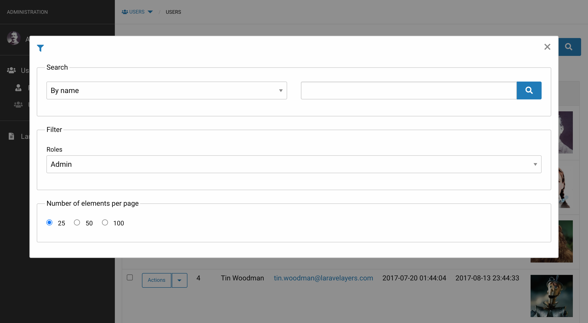

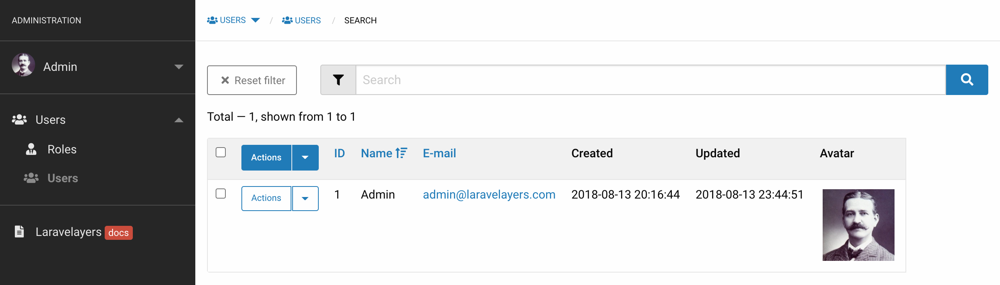

<a name="filter-form"></a>
#### Filter form

To initialize filter elements, it is necessary to implement the abstract `initFilters` method of the collection decorator, which must return an empty array or an array with form elements, for which a translation can be added to the localization file, just like when [initializing form elements in the data decorator](#forms):

```php
// App\Decorators\Admin\Auth\UserCollectionDecorator 
	
protected function initFilter()
{
	return [
		'role' => [
			'type' => 'select',
			'value' => [
				'role_admin' => [
					'id' => 'admin',
					'value' => 'admin',
					'name' => "role_admin"
				],
				'role_user' => 'user'
			]
		]
	];
}
	
// /resources/lang/en/admin/auth/users.php

'elements' => [
	'role_label' => 'Roles',
	'role_admin_text' => 'Administrator',
	'role_user_text' => 'User',
	//...
],
```
	
> Note that using the `prepareFilter` method of the collection decorator, when getting the filter using the `getFilter` method, the search form elements are added at the beginning of all elements, and the `group` parameter is added for all filter elements.
	
Now, after submitting the filter form, depending on the value of the `role` argument in the HTTP request string, you will need to call the corresponding repository method in the service, for example:

```php
// App\Services\Admin\Auth\UserService

public function paginate(Request $request)
{
	$this->search($request)
		->sort($request)
		->whereStatus();
	
	// ?role=admin
	if ($role = $request->get('role')) {
		$this->repository->whereRole($role)
	}	

	return ($ids = $this->getFormElements($request, 'id'))
		? $this->repository->findOrFail($ids)
		: $this->repository->paginate($this->getPerPage($request));
}
```

<a name="search-form"></a>
#### Search form

By default, search is performed only by ID, and in order to add additional search options displayed for selection using the HTML element [`<select>`](forms.md#type-select), you need to override the `initSearch` method by adding the values of the HTML elements `<option>`, for which a translation can be added to the localization file, for example:

```php
// App\Decorators\Admin\Auth\UserCollectionDecorator 
	
protected function initSearch()
{
	return array_merge(parent::initSearch(), [
		'name' => [
			'name' => 'name',
			'value' => 'name'
		],
		'email' => []
	]);
}

// /resources/lang/en/admin/auth/users.php

'elements' => [
	'search_by_name_text' => 'By name',
	'search_by_email_text' => 'By e-mail',
	//...
],
```
	
After sending the filter form, using the [`search`](services.md#search) method of the service, depending on the value of the `search_by` argument in the HTTP request string, the corresponding repository method will be called:

```php
// ?search=text&search_by=login
$this->repository->searchByLogin($request->search);
```

> Please note that when [calling a non-existent repository method](repositories.md#call), the corresponding model method with the `scope` prefix will be called.

As a result, it is enough to add a method for the model with the `scopeSearchBy` prefix and the name corresponding to the value of the `search_by` argument:

```php
// App\Models\Auth\User
	
/**
 * Search by login.
 *
 * @param \Illuminate\Database\Eloquent\Builder $query
 * @param string $search
 * @return \Illuminate\Database\Eloquent\Builder
 */
public function scopeSearchByName($query, $search)
{
	return $query->where('login', 'like', "%{$search}%");
}	

/**
 * Search by email.
 *
 * @param \Illuminate\Database\Eloquent\Builder $query
 * @param string $search
 * @return \Illuminate\Database\Eloquent\Builder
 */
public function scopeSearchByEmail($query, $search)
{
	return $query->where('email', 'like', "%{$search}%");
}
```
Or pass the name of the column in the value of the argument `search_by` in the HTTP request string, which will be passed to the method `scopeSearch` by default, if a column with that name exists:

```php
/**
 * Search by default.
 *
 * @param \Illuminate\Database\Eloquent\Builder $query
 * @param string $search
 * @param string|null $column
 * @return \Illuminate\Database\Eloquent\Builder
 */
public function scopeSearch($query, $search, $column = null)
{
	return $query->where($column ?: $this->getQualifiedKeyName(), 'like', "{$search}%");
}
```

You can hide the search form when initializing filter elements:

```php
protected function initFilter()
{
	return [
		'search' => [
			'hidden' => true
		],
	];
}
```

<a name="pagination-form"></a>
#### Pagination form

You can change the number of items displayed on the page by overriding the `initPagination` method of the collection decorator, which by default returns three options for selection in the filter form:

```php
/**
 * Initialize the pagination options.
 *
 * @return array
 */
protected function initPagination()
{
	return [25, 50, 100];
}
```
	
> Note that the value of the first element of the array is used as the default, which must also be set using the [`getPerPage`](services.md#get-per-page method of the service.

<a name="quick-filter"></a>
#### Quick filter

Immediately below the search form, you can display links for a quick filter. 

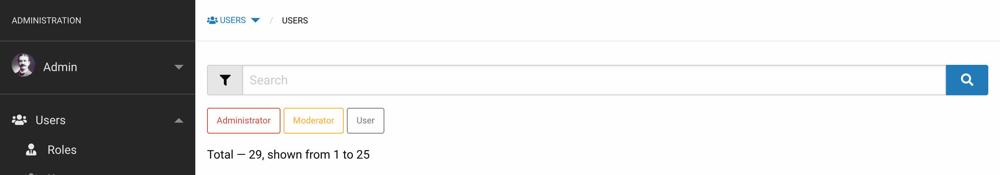
	
To initialize the elements of the quick filter, you must initialize the abstract method `initQuickFilter` of the collection decorator, which must return an array with link parameters or an empty array:

```php
// App\Decorators\Admin\Auth\UserCollectionDecorator 

/**
 * Initialize the quick filter.
 *
 * @return array
 */
protected function initQuickFilter()
{
	return [
		'admin' => [
			'name' => 'role',
			'value' => 'admin',
			'class' => 'primary' // secondary, success, alert, warning
		],
		'user' => [],
	];
}
	
// App\Http\Controllers\Admin\Auth\UserController
	
public function index(Request $request)
{
	$items = $this->service->paginate($request);
	
	return view("admin::layouts.action.index", compact('items'));
}
	
// admin::layouts.table.filter 
	
/*
	<div id="quick" class=" ">
	    <a href="?role=admin&search=" id="quick_role" class="button primary alert small hollow">
	    	<nobr>Administrator</nobr>
		</a>
		<a href="?role=user&search=" id="quick_role" class="button primary small hollow">
			<nobr>User</nobr>
		</a>
	</div>	
*/
```
	
> Note that if a `name` parameter is added for the first element, then it is applied to all subsequent elements for which the `name` parameter is not added.
 
By default as an argument in the HTTP request string  the name `quick` is used if the `name` parameter is not specified for the link element. The `value` parameter or key for the link element is used as an argument in the HTTP request string. The link color can be changed using the `class` parameter. You can specify the full URL using the `link` parameter.

To get a quick filter, the `getQuickFilter` method is called in the `admin::layouts.table.filter` view, which, when converted to a string, returns the HTML code of the links, therefore, by overriding the `getQuickFilter` method, you can return any HTML code:

```php
{!! $items->getQuickFilter() !!}
```

<a name="general-forms"></a>
### General Forms

On the edit data collection page displayed for the controller method [`editMultiple`](#edit-multiple-and-update-multiple), you can add form elements to edit shared data.


To initialize [form](forms.md#initialization-of-form-elements), an abstract method `initElements` must be defined.

> Note that using the `prepareElements` method of the collection decorator, when receiving form elements using the [`getElements`](forms.md#get-form-elements) method, additional elements will be added: form element, button elements to submit forms.

By default, the `initElements` method returns the result of calling the `getDefaultElements` method, which creates two form elements to replace the text.

You can add the required form elements, for which a translation can be added to the localization file, just like when [initializing form elements in the data decorator](#forms), or return an empty array:

```php
// App\Decorators\Admin\Auth\UserCollectionDecorator 
	
protected function initElements()
{
	return [
		'pattern' => [
			'type' => 'text',
			'group' => 'preg_replace',
			'line' => 'preg_replace'
		],
		'replacement' => [
			'type' => 'text',
			'group' => 'Preg replace',
			'line' => 'preg_replace'
		]
	];
}
	
// /resources/lang/en/admin/auth/users.php

'elements' => [
	'preg_replace_group' => 'Replacement',
	'pattern_label' => 'Pattern',
	'replacement_label' => 'Replacement',
	//...
],
```
	
> Note that after submitting the form, the data collection will be updated using the [`updateMultiple`](#update-multiple) method of the service.

<a name="group-actions"></a>
### Group actions

For the controller method [`index`](#index), a [dropdown action menu](forms.md#type-button-dropdown) is displayed in the table header for managing data, including managing selected items in the data collection.

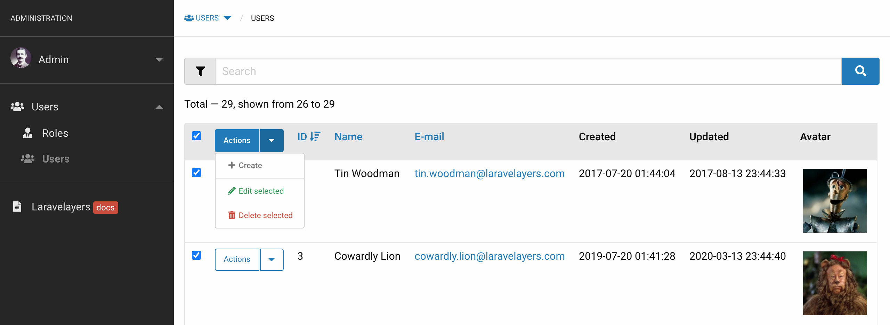

In order to change the displayed actions, you need to override the `initActions` method of the data collection decorator, which by default returns the result of calling the `getDefaultActions` method with an array of action elements:

```php
/**
 * Initialize actions.
 *
 * @return array
 */
protected function initActions()
{
	return $this->getDefaultActions(['create', 'editMultiple', 'deleteMultiple']);
}
```
	
> Note that the `getDefaultActions` method by default only returns actions that match the controller method by the key of the array element, unless an array with the keys of allowed actions is passed to the method.

You can also override the default action initiation methods: `initActionToAdd`, `initActionToSelect`, `initActionToCreate`, `initActionToEdit`, `initActionToDelete`.

The selection of elements is done using HTML elements `<input type="checkbox">` displayed in the table row for each collection item along with the [action menu](#actions). To be able to select only one element of the collection, it is enough to hide the HTML of the elements `<input type="checkbox">` to select all elements of the collection using the `initActionCheckbox` method of the collection decorator:

```php
/**
 * Initialize an action checkbox.
 *
 * @return array
 */
protected function initActionCheckbox()
{
	return [
		'type' => 'hidden'
	];
}
```
	
Additionally, you can display two hidden action elements `add` and `select` by passing their keys to the `getDefaultActions` method:

```php
$this->getDefaultActions(['add', `select`, 'editMultiple', 'deleteMultiple']);
```

> Note that the `add` and `select` actions, unlike the `create` actions, will only be displayed to users authorized for editing.

The `add` action is intended to go to the current Url with the `action=add` argument in the HTTP request lines, as a result of which the `select` action will be displayed for sending the request to the [`editMultiple`](#edit-multiple-and-update-multiple) method of the controller, and all other action items will be hidden. This feature is intended for cases when, for example, for the author of a book, only the books added for him are displayed, and new ones need to be added, in this case, when you click on the `add` action link, you can display all the books in the service layer, and then select new books and add them using the `select` button: 

```php
// App\Services\Admin\Auth\UserService

public function paginate(Request $request)
{
	$this->search($request)
		->sort($request)
		->whereStatus();
		
	if ($request->query('action', $request->get('_action')) != 'add') {
		$this->repository->whereAuthorId($request->author);
	} else {
		$this->repository->whereNotAuthorId($request->author);
	}

	return ($ids = $this->getFormElements($request, 'id'))
		? $this->repository->findOrFail($ids)
		: $this->repository->paginate($this->getPerPage($request));
}
```

> Note that the `select` action button HTML element contains the `name="action"` and `value="editMultiple"` attributes, so the value of the  action` argument from the HTTP request string is passed to the form using the hidden HTML element `_action`.

<a name="repositories"></a>	
## Repositories

Below is a model-embedded repository class created with the command `admin:make-repository` with the option `--parent` or [`admin:make-controller`](#defining-classes).

> Note that the repository extends the base repository class of the public part of the site, but if it were created without the `--parent` option, then it would extend the [base repository class](repositories.md#base-repository) included in Laravelayers. The `--parent` option should be used when it is necessary to separate the administration methods from the methods of the public part of the site.

```php
<?php
	
namespace App\Repositories\Admin\Auth;
	
use App\Repositories\Auth\UserRepository as BaseUserRepository;
	
class UserRepository extends BaseUserRepository
{
    //
}
```

To change the name of a model class use the `--mn` option:

```php
php artisan admin:make-service Auth/Action --mn Auth/UserAction
```

<a name="localization"></a>	
## Localization

By default, a language file can be created when creating a [controller](#controllers), which produces a translation string with the name of the menu.

[In data decorators](#data-decorators) and [collection decorators](#collection-decorators) language files are used to get translation strings when initializing form elements, initializing actions, and initializing table columns. By default, the path to the language file is determined using the `initTranslationPath` method of the `Laravelayers\Admin\Decorators\Translator` trait, which returns the path  according to the URI of the current route without parameters and action method, for example, for the route `admin/auth/users/{user}/actions/{action}/edit`, the language file `admin/auth/users/actions` will be used.

You can specify an additional path to the language file by overriding the `initTranslationPath` method in the data decorator and collection decorator:

```php
/**
 * Initialize the translation path.
 *
 * @return string
 */
protected static function initTranslationPath()
{
	return 'admin/auth/users.php';
}
```

> Note that the path to the language file is processed by the `trans` static method of the `Laravelayers\Admin\Decorators\Translator` trait, which first checks the translation string in the `admin/auth/users.elements.id_label` file if no translation is found, then in the file `admin/auth/users/actions.elements.id_label` according to the URI of the current route, and then in the default file `admin::admin.elements.id_label`.
