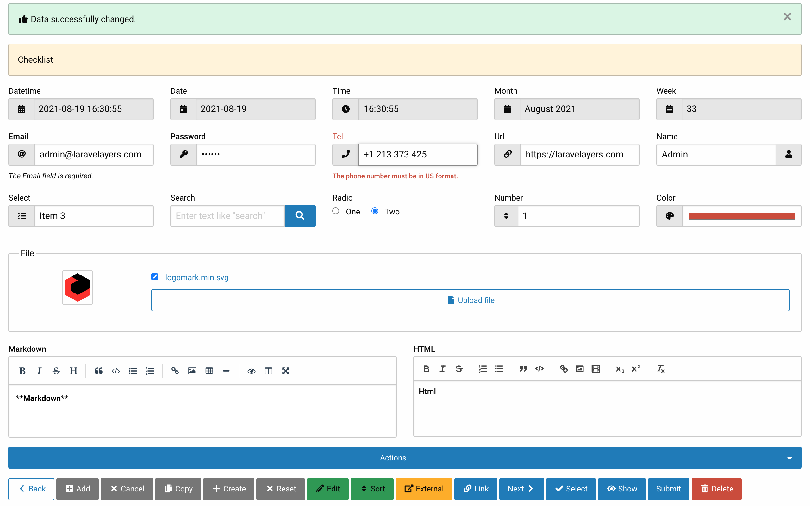
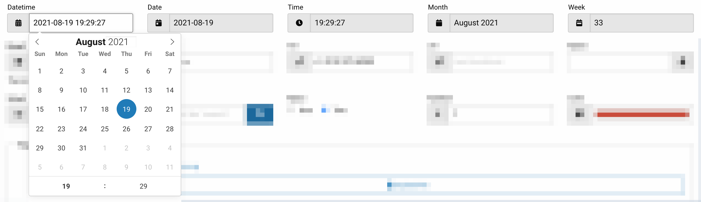
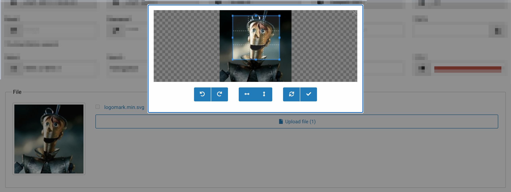
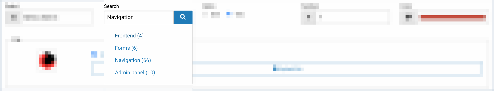
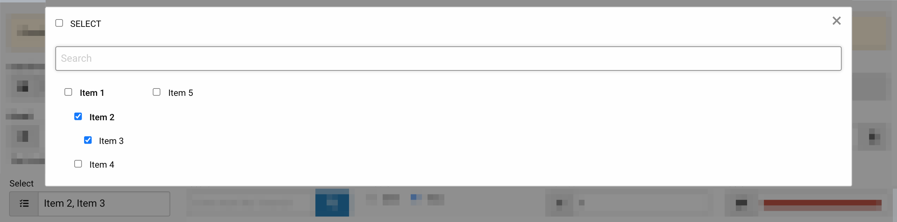

# Forms

- [Introduction](#introduction)
- [Initialization of form elements](#initialization-of-form-elements)
	- [Types](#types)
	- [Hidden elements](#hidden-elements)
	- [Labels](#labels)
	- [Help text](#help-text)
	- [Error text](#error-text)
	- [Grouping elements](#group)
	- [Validation rules](#rules)
- [Getting form elements](#get-form-elements)
	- [Form decorator](#form-decorator) 
	- [Form element decorator](#form-element-decorator)
	- [Form element interface](#form-element-interface)
- [Retrieving input](#retrieving-input)
	- [Uploading files](#uploading-files)
	- [Uploading images](#uploading-images)
- [Validation](#validation)
	- [Javascript validation](#javascript-validation)

<a name="introduction"></a>
## Introduction

A form decorator is used to initialize and [display](#render) form elements.



<a name="initialization-of-form-elements"></a>
## Initializing form elements

To initialize form elements, in the [data decorator](decorators.md#data-decorator), inject the `Laravelayers\Form\Decorators\Form` trait into the decorator and define the `initElements` method required by the trait to initialize the form elements:

```php
<?php

namespace App\Decorators\Feedback;

use Laravelayers\Form\Decorators\Form;
use Laravelayers\Foundation\Decorators\DataDecorator;

class FeedbackDecorator extends DataDecorator
{
	use Form;

	/**
	 * Initialize form elements.
	 *
	 * @return array
	 */
	protected function initElements()
	{
		return [
			'form' => [
				'type' => 'form.js',
				'method' => 'POST',
				'action' => route('feedback.store')
			],
			'feedback_name' => [
				'type' => 'text',
				'value' => $this->feedback_name,
				'label' => 'Name',
				'required' => '',
				'rules' => 'required|max:255'
			],
			'feedback_message' => [
				'type' => 'textarea',
				'value' => $this->feedback_message,
				'label' => 'Message',
				'rows' => 3,
				'required' => '',
				'rules' => 'required|max:1000'
			],				
			'button' => [
				'type' => 'button',
				'value' => 'submit'
			]
		];
	}
}
```

> Note that the `initElements` method must return an array of form elements. The value of each element in the array must contain an array of keys and values that specify the type of HTML form element, HTML attributes, validation rules, and other parameters. If the `name` attribute is not specified for a form element, then the key of the form array element is used by default. If the `id` attribute is not specified, then the value of the `name` attribute is used by default.

You can also use the [`Laravelayers\Form\Decorators\FormElementDecorator`](#form-element-decorator) class to create a form element using the `make` method and methods with the `add` prefix to add the appropriate parameters:

```php
protected function initElements()
{
	return [
		FormElementDecorator::make('form')
			->addType('form.js')
			->addValue([
				'method' => 'POST',
				'action' => route('feedback.store')
			]),
			
		FormElementDecorator::make('button')
			->addType('button')
			->addValue('submit'),
			
		FormElementDecorator::make('feedback_name')
			->addType('text')
			->addValue('')
			->addLabel('Name')
			->addRules('required|max:255')
			->addAttribute('required', ''),
			
		FormElementDecorator::make('button')
			->addType('button')
			->addValue('submit')
	];
}
```

If you do not use a trait, then you can define your own method in the decorator for receiving form elements by passing an array with form elements to the [`make`](#make) method of the form decorator:

```php
/**
 * Get the form elements.
 *
 * @param string $id
 * @return \Laravelayers\Form\Decorators\FormDecorator
 */
public function getElements()
{
	$elements = [
		'form' => [
			'type' => 'form',
			'method' => 'POST'
		],
		'feedback_name' => [
			'type' => 'text',
			'value' => $this->feedback_name
		]	
	];
	
	return app(FormDecorator::class, [$elements])->getElements($this);
	
	//return FormDecorator::make($elements)->getElements($this)
}
```

<a name="types"></a>
### Types

The value of the `type` parameter contains the type of the form element. The table below lists the default types and corresponding subtypes that provide additional options for displaying and using form elements:

Type            								| Subtype             
----------------------------------------|--------------------------
[button](#type-button)						| button.dropdown, button.group, button.inline
[checkbox](#type-checkbox)					| checkbox.group, checkbox.readonly, checkbox.tree
[color](#type-color)						| color.group
[date](#type-date)							| date.group, date.js
[datetime](#type-datetime)					| datetime.group, datetime.js
[datetime-local](#type-datetime-local)	| datetime-local.group, datetime-local.js
[email](#type-email)           			| email.group, email.js
[file](#type-file)            			| file.group, file.js
[form](#type-form)            			| form.js
[hidden](#type-hidden)          			| -
[month](#type-month)         				| month.group, month.js
[number](#type-number)          			| number.group, number.js
[password](#type-password)        		| password.group
[radio](#type-radio)           			| radio.group, radio.readonly, radio.tree
[search](#type-search)          			| search.group. search.js
[select](#type-select)          			| select.js
[tel](#type-tel)              			| tel.group, tel.js
[text](#type-text)            			| text.group
[textarea](#type-textarea)        		| textarea.js
[time](#type-time)            			| time.group, time.js
[url](#type-url)             				| url.group, url.js
[week](#type-week)            			| week.group, week.js

<!--form:checklist-link-->

By default, each type has a corresponding view of the form `form::layouts.{$type}.element`, where `{$type}` is the type of the form element, for example: `form::layouts.button.element` or `form::layouts.button.dropdown.element`.

To publish views and translations of form elements, run the command:

```php
php artisan vendor:publish --tag=laravelayers-form
```
	
Also, to add a new type of form element, you can create a view in the directory `resources/views/layouts/form/`, for example, for the type `button.test`, you need to create a view  `resources/views/layouts/form/button/test/element.blade.php`.

After [getting the form elements](#get-form-elements), a view is automatically determined for each form element if it is not specified as a value for the `view` parameter of the form element:

```php
'button' => [
	'type' => 'button',
	'view' => `layouts.form.button.test.element'
],
```	
	
<a name="type-button"></a>	
#### button

The `button` form element type is intended to display HTML elements `<button>`. 

The `value` parameter of the `button` form element must contain an array or [collection](#form-element-interface) of HTML `<button>` elements. The key of each element in the array is used by default as the `type` parameter. The element value must contain an array of keys and values, which are used to specify HTML attributes and other parameters:

```php
'button' => [
	'type' => 'button',
	'class' => 'callout',
	'value' => [
		'submit' => [
			'type' => 'submit',
			'class' => 'expanded'
		]
	]
],
	
/*
	<div id="button" class="callout">
		<button type="submit" name="button" value="" id="button_submit" class="button primary expanded">
    		<nobr><i class="icon icon-paper-plane"></i> Send</nobr>
		</button>
	</div>
*/
```

<!--form:button-->
	
> Note that the attributes added to the `button` form element apply to the HTML element `<div>` inside which HTML elements are displayed `<button>`, except for the attributes `name` and `id`. 

**The `type` parameter for the HTML element `<button>`** is used to specify the type of presentation. The list below lists the default view types that provide additional display options for `<button>` items:

- `add`
- `back`
- `cancel`
- `copy`
- `create`
- `delete`
- `edit`
- `external`
- `link`
- `next`
- `reset`
- `select`
- `show`
- `sort`
- `submit`

<!--form:buttons-->

By default, each view type has a corresponding `form::layouts.button.action.{$type}` view, where `{$type}` is the view type for the HTML element `<button>`, for example: `form::layouts.button.action.submit`.

Also, to add a new HTML element view type `<button>`, you can create a view in the resources `resources/views/layouts/form/button/action` action directory, for example, for the test view type, you need to create the resources `resources/views/layouts/form/button/action/test.blade.php`.

To change the view for an existing type, you need to add it as a value for the `view` parameter of the HTML element `<button>`:

```php
'button' => [
	'type' => 'button',
	'value' => [
		'submit' => [
			'view' => 'layouts.form.button.action.test'
		]
	]
],
```

By default, each submission type has a corresponding translation of the `form::form.button_{$type}`, where `{$ type}` is the presentation type for the HTML `<button>` element, for example: `form::form.button_submit`.

Also, to add a translation for the new HTML element representation type `<button>`, you can create a translation file `form.php` in the `resources/lang` directory, for example, for the `test` representation type, you need to add the translation string `resources/lang/en/form.button_test`.

**The `text` parameter for the HTML element `<button>`** is used to specify the text inside the element:

```php
'button' => [
	'type' => 'button',
	'value' => [
		'submit' => [
			'text' => 'Text'
		]
	]
],
	
/*
	<div id="button" class="">
		<button type="submit" name="button" value="" id="button_submit" class="button primary">
    		<nobr>Text</nobr>
		</button>
	</div>
*/
```

<!--form:button_text-->

**The `icon` parameter for the HTML element `<button>`** is used to specify the [icon](frontend.md#icons) class. To display the icon to the right of the text, add the `reverse` parameter:

```php	
'button' => [
	'type' => 'button',
	'value' => [[
		'type' => 'submit',
		'icon' => 'icon-paper-plane',
		'reverse' => true,
		'class' => 'warning'
	]]
],
	
/*
	<div id="button" class="">
		<button type="submit" name="button" value="" id="button_back" class="button warning">
			<nobr>Submit <i class="icon icon-paper-plane"></i></nobr>
		</button>
	</div>
*/
```

<!--form:button_icon-->
	
**The `link` parameter for the HTML element `<button>`** is used to convert the button to a link:

```php
'button' => [
	'type' => 'button',
	'value' => [[
		'type' => 'back',
		'link' => url()->previous()
	]]
],
	
/*
	<div id="button" class="">
		<a href="https://localhost" id="button_back" class="button primary hollow">
			<nobr><i class="icon icon-chevron-left"></i> Back</nobr>
		</a>
	</div>
*/
```

<!--form:button_link-->
	
**The `hidden` parameter for the HTML element `<button>`** is used to hide the element.

```php
'button' => [
	'type' => 'button',
	'value' => [
		'edit' => [
			'hidden' => false
		],
		'delete' => [
			'hidden' => true
		]		
	]
],

/*
	<div id="button" class="">
		<button type="submit" name="button" value="" id="button_edit" class="button success">
			<nobr><i class="icon icon-pencil-alt"></i> Edit</nobr>
		</button>
	</div>
*/
```	

<a name="type-button-dropdown"></a>		
**Subtype `button.dropdown`** is used to display a dropdown menu of buttons:

```php
'button' => [
	'type' => 'button.dropdown',
	'text' => 'Actions',
	'value' => [
		'edit' => [
			'value' => 'edit',
			'group' => 1
		],
		'back' => [
			'link' => url()->previous(),
			'group' => 2
		],			
		'delete' => [
			'value' => 'delete',
			'group' => 1
		],			
	]
],

/*
	<div class="dropdown-button">
	    <div class="button-group expanded" data-toggle="button">
	        <a class="dropdown button">Actions</a>
	    </div>
	    <div id="button" class="dropdown-pane" data-dropdown data-hover="true" data-hover-pane="true">
	        <div class="menu vertical">
				<li>
					<button type="submit" name="button" value="edit" id="button2_edit" class="button success ">
						<nobr><i class="icon icon-pencil-alt"></i> Edit</nobr>
					</button>
				</li>
				<li>
					<button type="submit" name="button" value="delete" id="button2_delete" class="button alert ">
						<nobr><i class="icon icon-trash-alt"></i> Delete</nobr>
					</button>
				</li>
				</div>
				<div class="menu vertical">
					<li>
						<a href="https://localhost" id="button_back" class="button primary hollow">
							<nobr><i class="icon icon-chevron-left"></i> Back</nobr>
						</a>
					</li>
				</div>				
		</div>
	</div>	
*/
```

<!--form:button_dropdown-->

> Note that the `group` parameter for the HTML element `<button>` is used to group the elements and display the groups in the view.

<a name="type-button-group"></a>	
**Subtype `button.group`** is used to display a group of buttons:

```php	
'button' => [
	'type' => 'button.group',
	'value' => [
		'edit' => 'Edit message',
		'delete' => 'Delete message',
	]
],
	
/*
	<div id="button" class="button-group expanded-for-medium stacked-for-small">
		<button type="submit" name="button" value="edit" id="button_edit" class="button success">
			<nobr><i class="icon icon-pencil-alt"></i> Edit message</nobr>
		</button>
		<button type="submit" name="button" value="delete" id="button_delete" class="button alert">
			<nobr><i class="icon icon-trash-alt"></i> Delete message</nobr>
		</button>
	</div>
*/
```

<!--form:button_group-->
	
> Note that if the value of an array element of HTML elements '<button>' contains a string, then it is used as the `text` parameter, and the key of the array element is used as the `value` parameter.		

<a name="type-button-inline"></a>	
**Subtype `button.inline`** is used to exclude the HTML element `<div>` when displaying buttons:

```php
'button' => [
	'type' => 'button.inline',
	'value' => 'submit'
],
	
/*
	<button type="submit" name="button" value="" id="button_submit" class="button primary ">
    	<nobr>Send</nobr>
	</button>
*/
```

> Note that if the `value` parameter of the `button` form element contains a string, it is used as the `type` parameter.

<a name="type-checkbox"></a>	
#### checkbox

The `checkbox` form element type is intended to display the HTML element `<input type="checkbox">`. 

The `value` parameter of the `checkbox` form element must contain an array or [collection](#form-element-interface) of HTML elements `<input type="checkbox">`. The key of each element in the array is used by default as the `value` attribute. The element value contains an array of keys and values used to specify HTML attributes and other parameters:

```php
'checkbox' => [
	'type' => 'checkbox',
	'class' => 'callout',
	'value' => [
		1 => [
			'value' => 1,
			'text' => 'One'
		],
		2 => [
			'value' => 2,
			'text' => 'Two',
			'checked' => true, //'selected' => true
			'class' => 'stat'
		]
	]
],
    
/*        
	<div class="callout">
	    <div>
			<nobr>
				<input type="checkbox" name="checkbox[1]" value="1" id="checkbox_1">
				<label for="checkbox_1" class="">One</label>
			</nobr>
		</div>
		<div>
			<nobr>
				<input type="checkbox" name="checkbox[2]" value="1" id="checkbox_2" checked>
				<label for="checkbox_2" class="stat">Two</label>
			</nobr>
	    </div>  
	</div>	
*/
```

<!--form:checkbox-->

> Note that the attributes added to the `button` form element apply to the HTML element `<div>` inside which HTML elements are displayed `<input type="checkbox">`, except for the `name` and `id` attributes.   

**Parameter `text` for HTML element `<input type="checkbox"`** is used to specify the text inside the `<label>` element:

```php
'checkbox' => [
	'type' => 'checkbox',
	'value' => [
		1 => [
			'text' => 'One'
		],
		2 => 'Two'
	]
],
    
/*        
	<div class="">
	    <div>
			<nobr>
				<input type="checkbox" name="checkbox[1]" value="1" id="checkbox_1">
				<label for="checkbox_1" class="">One</label>
			</nobr>
		</div>
		<div>
			<nobr>
				<input type="checkbox" name="checkbox[2]" value="1" id="checkbox_2" checked>
				<label for="checkbox_2" class="">Two</label>
			</nobr>
	    </div>  
	</div>	
*/
```

> Note that if the element value of an array of HTML elements is `<input type="checkbox">` contains a string, then it is used as the `text` parameter, and the key of the array element is used as the `value` parameter.

**Parameter `hidden` for HTML element `<input type="checkbox"`** is used to hide the element:

```php
'checkbox' => [
	'type' => 'checkbox',
	'value' => [
		1 => [
			'text' => 'One',
			'hidden' => true
		],
		2 => 'Two'		
	]
],
	
/*        
	<div class="">
	    <div>
			<nobr>
				<input type="checkbox" name="checkbox[2]" value="2" id="checkbox_2">
				<label for="checkbox_2" class="">Two</label>
			</nobr>
		</div> 
	</div>	
*/
```

**Subtype `checkbox.group`** is used to display a group of HTML elements `<input type="checkbox">`:

```php
'checkbox' => [
	'type' => 'checkbox.group',
	'value' => [
		1 => 'One',
		2 => 'Two'
	]
],
    
/*        
	<div class="">
	    <div>
			<nobr>
				<input type="checkbox" name="checkbox[1]" value="1" id="checkbox_1">
				<label for="checkbox_1" class="">One</label>
			</nobr>
			<nobr>
				<input type="checkbox" name="checkbox[2]" value="1" id="checkbox_2" checked>
				<label for="checkbox_2" class="">Two</label>
			</nobr>
	    </div>  
	</div>	
*/
```

<!--form:checkbox_group-->

**Subtype `checkbox.readonly`** is used to display the HTML element of `<input type="checkbox">` read-only:

```php
'checkbox' => [
	'type' => 'checkbox.readonly',
	'value' => 1
],

/*
	<div class="">
	    <nobr>
	        <input type="checkbox" disabled="">
	        <input type="hidden" name="checkbox" value="1" id="checkbox_1" class="">
	    </nobr>
	</div>
*/
```

<!--form:checkbox_readonly-->
	
> Note that if the `value` parameter of the `button` form element contains a string, then it is used as the `value` attribute for the HTML element `<input type="checkbox">`.

<a name="type-checkbox-tree"></a>
**Subtype `checkbox.tree`** is used to display a tree of HTML elements `<input type="checkbox">`, for this, the `value` parameter must contain [a menu decorator object with a tree of elements](navigation.md#getting-tree), in which each element must implement [interface of the form element](#form-element-interface):

```php
'checkbox' => [
	'type' => 'checkbox.tree',
	'value' => MenuDecorator::make([
		0 => [
			'id' => 1,
			'name' => 'Category 1',
			'url' => '#category1',
			'sorting' => 1,
			'parent_id' => 0,
		],
		1 => [
			'id' => 2,
			'name' => 'Category 2',
			'url' => '#category2',
			'sorting' => 2,
			'parent_id' => 1,
		],
	])->getMenu()->getTree()
],
	
/*
	<ul class="menu ">        
		<li class="is-subtree-parent">
	    	<a>
	    		<nobr>
	    			<input type="checkbox" name="checkbox[1]" value="1" id="checkbox_1">
					<label for="checkbox_1" class="is-status-opened">Category 1</label>
				</nobr>
			</a>
	    	<ul class="menu nested vertical is-subtree">
				<li class="">
				<a>
	        		<nobr>
	    				<input type="checkbox" name="checkbox[2]" value="2" id="checkbox_2">
						<label for="checkbox_2" class="is-status-opened">Category 2</label>
	    			</nobr>
	    		</a>
				</li>
			</ul>
		</li>
	</ul>
*/
```

<!--form:checkbox_tree-->

<a name="type-color"></a>	
#### color

The `color` form element type is intended to display the HTML element `<input type="color">`.

It is also used as a form element [`text`](#type-text):

```php
'color' => [
	'type' => 'color.group'
],
	
/*
	<div class="input-group">
		<span class="input-group-label"><i class="icon icon-palette"></i></span>
	   <input type="text" name="color" value="" id="color" class="input-group-field">
	</div>
*/
```

<!--form:color-->

<a name="type-date"></a>	
#### date

The `date` form element type is intended to display the HTML element `<input type="date">`.

Also used as a form element [`datetime`](#type-datetime):

```php
'date' => [
    'type' => 'date.js'
],

/*
	<div class="input-group">
		<span class="input-group-label"><i class="icon icon-calendar-day"></i></span>
		<input type="text" name="date" value="" id="date" class="input-group-field form-datetime flatpickr-input" data-form-datetime data-date-format="Y-m-d H:i:s" data-alt-format="Y-m-d" data-enable-time="false" readonly="readonly">
	</div>
*/
```

<!--form:date_js-->

<a name="type-datetime"></a>	
#### datetime

The `datetime` form element type is intended to display the HTML element `<input type="datetime">`.

It is also used as a form element [`text`](#type-text):

```php
'datetime' => [
	'type' => 'datetime.group'
],
	
/*
	<div class="input-group">
		<span class="input-group-label"><i class="icon icon-calendar-alt"></i></span>
	   <input type="datetime" name="datetime" value="" id="datetime" class="input-group-field">
	</div>
*/
```

**Subtype `datetime.js`** is used to add to HTML element `<input type="text">` JavaScript for date and time picker:

```php
'datetime' => [
    'type' => 'datetime.js',
    'value' => Carbon::now(),
    'data-date-format' => 'Y-m-d H:i:s',
    'data-alt-format' => "d.m.Y H:i:S"
],

/*
	<div class="input-group">
		<span class="input-group-label"><i class="icon icon-calendar-alt"></i></span>
		<input type="text" name="datetime" value="2019-08-19 12:22:21" id="datetime" class="input-group-field form-datetime flatpickr-input" data-form-datetime data-date-format="Y-m-d H:i:s" data-alt-format="d.m.Y H:i:S" readonly="readonly">
	</div>
*/
```



<!--form:datetime_js-->
	
Using the `data-form-datetime` attribute on the HTML element `<input type="text">` includes the plugin `resources/js/vendor/foundation/formDatetime.js`, which has a built-in JavaScript date and time picker [github.com/flatpickr/flatpickr](https://github.com/flatpickr/flatpickr). The table below shows the available attribute names and descriptions for the plugin configuration:

Name              | Description
----------------------|-----------------------
`data-lang`           | Used to change the localization of a plugin. Accepts a 2-letter language code as a value. The default is the HTML language of the element `<html lang="en">` or Javascript variable `window.Laravel.lang`.
`data-date-format`.   | Используется для указания оригинального формата даты, например: `Y-m-d H:i:s`. By default, the value of the configuration variable [`config('date.datetime.format')`](date.md#configuration) is used.
`data-alt-format`.   | Используется для указания отображаемого формата даты, например: `d.m.Y H:i:S`. По умолчанию используется значение `data-date-format`.
`data-default-date`.  | Datetime default. For example: `2020-12-20`.
`data-enable-time`    | Enable selection of time. Default is `true`.
`data-enable-seconds` | Enable selection of seconds. Defaults is `false`.
`data-week-numbers`.  | Allow display of week numbers. Defaults is `false`.
`data-min-date`       | The minimum date available for selection. For example: `2020-01-01`.
`data-max-date`.      | Maximum date available for selection. For example: `2020-12-31`.
`data-min-time`.      | The minimum time available for selection. For example: `09:00:00`.
`data-max-time`.      | The maximum time available for selection. For example: `22:00:00`.
`data-multiple-dates`.      | Multiple dates selection. Defaults is `false`.
`data-dates-separator`.     | Separator for multiple dates. Default is `, `.
`data-date-range`.         | Allow date range selection. Defaults is `false`.
`data-disable-dates`. | Prohibited dates. For example: `2020-01-01,2020-01-10`.
`data-enable-dates`.  | Permitted dates. For example: `2020-01-01,2020-01-10`.
`data-picker-options`        | Options for the JSON date picker. For example: `htmlspecialchars('{"disable":[{"from":"2020-01-01", "to":"2020-01-10"}]}')`.

<a name="type-datetime-local"></a>	
#### datetime-local

The `date` form element type is intended to display the HTML element `<input type="date">`.

Also used as a form element [`datetime`](#type-datetime).

<a name="type-email"></a>	
#### email

The `email` form element type is intended to display the HTML element `<input type="email">`.

Also used as a form element [`text`](#type-text).
	
**Subtype `email.js`** is used to add to HTML element `<input type="email">` validate e-mail using [JavaScript validator](#javascript-validation):

```php
'email' => [
	'type' => 'email.js'
],

/*
	<div class="input-group">
		<span class="input-group-label"><i class="icon icon-at"></i></span>
		<input type="email" name="email" value="" id="email" class="input-group-field" data-validator="validator" data-validator-name="email">
	</div>
*/
```

<!--form:email_js-->

<a name="type-file"></a>	
#### file

The `file` form element type is intended to display the HTML element `<input type="file">`:

```php
'form' => [
	'type' => 'form.js',
	'method' => 'POST',
	'action' => route('feedback.store'),
	//'enctype' => 'multipart/form-data'
],
'feedback_files' => [
	'type' => 'file',
	'multiple' => true,
	'class' => 'expanded',
	'accept' => [
	    'image/jpeg',
	    'image/png'
	],
	'rules' => 'mimes:jpg,png'		
],	
    
/*
	<span>
		<label id="label_file_feedback_files" for="feedback_files" class="button expanded">Upload files</label>
		<input type="file" name="feedback_files[]" id="feedback_files" class="show-for-sr" multiple accept="image/jpeg,image/png">
	</span>
*/
```

You can save uploaded files to the file system disk using the [file upload trait](#uploading-files). 

**The `file.group` subtype** is used to display the [icon](frontend.md#icons), which is changed with the `icon` parameter. To display the icon on the right, add the `reverse` parameter:

```php	
'feedback_files' => [
	'type' => 'file',
	//'icon' => 'icon-file-alt',
	//'reverse' => true
],
	
/*
	<span>
		<label id="label_file_feedback_files" for="feedback_files" class="button hollow expanded ">
			<i class="icon icon-file-alt"></i> Upload file
		</label>
		<input type="file" name="feedback_files" id="feedback_files" class="show-for-sr">
	</span>	
*/
```
	
<a name="type-file-js"></a>	
**Subtype `file.js`** is used to add to HTML element `<input type="file">` Javascript plugin for previewing and editing an image before loading, as well as displaying an icon corresponding to the type of the selected file, and displaying the number of selected files:

```php
'feedback_files' => [
	'type' => 'file.js',
	'text' => 'Upload file',
	'data-image-mode' => 3,
	'accept' => [
		'image/jpeg',
		'image/png'
	],
	'rules' => 'mimes:jpg,png'     
],

/*
	<div class="grid-x grid-padding-x" id="file_wrapper_feedback_files">
		<div class="cell medium-3 large-2 hide" id="image_preview_feedback_files">
	    	<div data-open="file_container_feedback_files" class="text-center">
	        	
	    	</div>
		</div>
		<div class="cell shrink hide" id="file_preview_feedback_files">
	    	<i class="icon icon-file icon-5x secondary"></i>
	    </div>
	    <div class="cell auto">         
	        <label id="label_file_feedback_files" for="feedback_files" class="button hollow expanded">
	        	<i class="icon icon-file"></i> Upload file
	    	</label>
	    	<input type="file" name="feedback_files[" id="feedback_files" class="show-for-sr" data-form-file data-image-mode="3" accept="image/jpeg,image/png">
	    </div> 
	</div>
	
	<div class="reveal " id="file_container_feedback_files" data-reveal data-multiple-opened="true">
		...
	</div>
*/
```



<!--form:file_js-->
		
Using the `data-form-file` attribute on the HTML element `<input type="file">` includes the plugin `resources/js/vendor/foundation/formFile.js`, which has a built-in Javascript tool for editing the image before loading [github.com/fengyuanchen/cropperjs](https://github.com/fengyuanchen/cropperjs). The table below shows the available attribute names and descriptions for the plugin configuration:	

Name                  | Description
--------------------------|-----------------------
`data-image-mode`         | Preview and edit images before uploading. Default is `0`. Value `1` - only preview image; `2` - activate the image cropping tool; `3` - activate the image editing tool. The data of the cropped or edited image is passed in a hidden form element whose name consists of the prefix `cropped_` and the name of the form element `file.js`, for example: `cropped_feedback_image`.
`data-image-aspect-ratio` | Setting the [`aspectRatio`](https://github.com/fengyuanchen/cropperjs#aspectratio) parameter when calling the `cropperjs` plugin to distribute a fixed aspect ratio of the cropping frame.
`data-file-extensions`.   | The parameter is used to specify the names of the icons and the corresponding file extensions. The default is {"image": ["jpg", "jpeg", "png", "gif", "svg"], "word": ["doc", "docx"], "excel": ["xls", "xlsx"], "powerpoint": ["ppt", "pptx"], "pdf": ["pdf"], "archive": ["zip","rar"]}. Icon names are specified without a prefix, the prefix is specified using the `data-file-icon-prefix` attribute, which has a default value of `icon-file-`.
`data-ajax-url`           | The attribute value specifies a link for sending data using the PUT method using Ajax. Used to display, load and delete images specified in the `value` parameter of the `file.js` form element as an array of image URLs. The images to be removed are selected using the HTML element `<input type="checkbox">` whose name consists of the prefix `delete_` and the name of the form element `file.js`, for example: `delete_feedback_files[]`. Used when getting an image gallery using Ajax for the [`textarea.js`](#type-textarea-js) form element.
`data-ajax-url-to-get`    | The attribute value specifies a link to Ajax update the HTML of the `file.js` form element after images have been loaded or deleted. By default, the current URL is used as the link value.
`debugAjax`               | Used to display errors in the console when saving or deleting files. Defaults is `false`.  

You can save uploaded images to the file system disk using the [image upload trait](#uploading-images).

<a name="type-form"></a>	
#### form

The `form` element type is for displaying the HTML element `<form>`:

```php
'form' => [
    'type' => 'form',
    'method' => 'POST',
    'methodField' => 'POST',
    'action' => route('feedback.store'),
    'hidden' => session()->has('success'),
],
    
/*    	
	<form method="POST" action="https://localhost/feedback" name="form" id="form" class="expanded">
	    <input type="hidden" name="_token" value="kwEvUSIe2I35rm96qg9LpjTKc8MCoTshzMH18Oto">
	    <input type="hidden" name="_method" value="POST">
	    ...
	</form>    	
*/
```
    
> Note that the hidden form field `_token` is added automatically. After submitting the form, an error or successful submission message will be displayed. With the `hidden` parameter, the form is not displayed after successful submission.

<a name="type-form-js"></a>	    
**Subtype `form.js`** is used to add to HTML element `<form>` plugin [Foundation.Abide](https://get.foundation/sites/docs/abide.html) using the attribute `data-abide` for extended form validation, as well as adding to the parent HTML element of the `<span>` plugin `resources/js/vendor/foundation/formBeforeunload.js` to display a message about unsaved changes in the form when leaving the page.

```php
'form' => [
    'type' => 'form.js',
    'method' => 'POST',
    'action' => route('feedback.store'),
    //'data-confirm' => ''
],
        
/*
	<span data-form-beforeunload class="form-beforeunload">
    	<form method="POST" action="https://localhost/feedback" name="form" id="form" class="abide expanded" data-abide novalidate data-unsaved="false">
		    <input type="hidden" name="_token" value="kwEvUSIe2I35rm96qg9LpjTKc8MCoTshzMH18Oto">
		    <input type="hidden" name="_method" value="POST">
		    <div class="callout success" id="5f583dfd5cc7f" style="display: none;" data-closable>
				<button class="close-button" aria-label="Dismiss alert" type="button" data-close>
					<span aria-hidden="true">×</span>
				</button>
		        <p><i class="icon icon-thumbs-up icon-fw"></i> Data successfully changed.</p>
		    </div>
		    <div class="callout alert" style="display: none;">    
		    	<p><i class="icon icon-exclamation-triangle"></i> There are errors in the form.</p>
		    </div>	    	
				...
		</form>
	</span>
*/
```

<!--form:form_js-->
	
> Please note that hidden blocks for notification about successful form save and warning about errors in form are added automatically.

When a change is made to the form, the `formBeforeunload.js` plugin adds a `<form>` attribute `data-unsaved="true"`. To disable the plugin, add the `data-confirm=""` attribute with an empty value.

When closing a modal window with the class `.reveal`, the unsaved form will be automatically submitted, to disable this function, add the attribute `data-form-container=""` with an empty value.

<a name="type-hidden"></a>	
#### hidden

The form element type `hidden` is for displaying the HTML element of `<input type="hidden">`.

It is also used as a form element [`text`](#type-text):

```php
'hidden' => [
	//'type' => 'hidden',
	'value' => 1
],
	
/*
	<span>
		<input type="hidden" name="hidden" value="1" id="hidden" class="">
	</span>	
*/
```

<a name="type-month"></a>	
#### month

The form element type `month` is for displaying the HTML element `<input type="month">`.

Also used as a form element [`datetime`](#type-datetime):

```php
'month' => [
    'type' => 'month.js'
],

/*
	<div class="input-group">
		<span class="input-group-label"><i class="icon icon-calendar"></i></span>
		<input type="text" name="month" value="" id="month" class="input-group-field form-datetime flatpickr-input" data-form-datetime data-date-format="Y-m-d H:i:s" data-alt-format="F Y" data-enable-time="false" readonly="readonly">
	</div>	
*/
```

<!--form:month_js-->

<a name="type-number"></a>	
#### number

The `number` form element type is for displaying the HTML element `<input type="number">`.

Also used as a form element [`text`](#type-text).
	
**Subtype `number.js`** is used to add to the HTML element `<input type="number">` validate numbers with [JavaScript validator](#javascript-validation):

```php
'number' => [
	'type' => 'number.js',
	'data-validator-options' => htmlspecialchars('{"min": 0, "max": 99}')
],

/*
	<div class="input-group">
		<span class="input-group-label"><i class="icon icon-sort"></i></span>
		<input type="number" name="number" value="" id="number" class="input-group-field" data-validator="number" data-validator-options="{"min": 0, "max": 99}">
	</div>
*/
```

<!--form:number_js-->

<a name="type-password"></a>	
#### password

The `password` form element type is intended to display the HTML element `<input type="password">`.

It is also used as a form element [`text`](#type-text):

```php
'password' => [
	'type' => 'password',
	'required' => ''
],

/*
	<div class="input-group">
		<span class="input-group-label"><i class="icon icon-key"></i></span>
	   <input type="password" name="password" value="" id="password" class="input-group-field">
	</div>
*/
```

<!--form:password-->

<a name="type-radio"></a>	
#### radio

The `radio` form element type is intended to display the HTML element `<input type="radio">`.

Also used as a form element [`checkbox`](#type-checkbox):

```php
'radio' => [
	'type' => 'radio',
	'value' => [
		1 => 'One',
		2 => [
			'value' => 2,
			'text' => 'Two',
			'checked' => true,
		]
	]
],
    
/*        
	<div class="">
		<nobr>
			<input type="radio" name="radio" value="1" id="radio_1">
			<label for="radio_1" class="">One</label>
		</nobr>
		<nobr>
			<input type="radio" name="radio" value="2" id="radio_2" checked>
			<label for="radio_2" class="">Two</label>
		</nobr>
	</div>	
*/
```

<!--form:radio_group-->
	
> Note that adding the `multiple` attribute will render the HTML elements `<input type="checkbox">`.

<a name="type-search"></a>	
#### search

The `search` form element type is for displaying the HTML element `<input type="search">`.

It is also used as a form element [`text`](#type-text):

```php
'search' => [
	'type' => 'search.group',
	//'text' => 'icon-search',
],
	
/*
	<div class="input-group">
		<input type="search" name="search" value="" id="search" class="input-group-field">
		<div class="input-group-button">
			<button type="submit" class="button"><i class="icon icon-search"></i></button>
		</div>
	</div>
*/
```

> Note that with the `text` parameter you can change the button text or the [icon](frontend.md#icons) class if the value starts with the`icon-` prefix. To hide the button, add the `false` value for the `text` parameter.

<a name="type-search-js"></a>	
**Subtype `search.js`** is used to add to the HTML element `<input type="search">` JavaScript plugin for selecting items.

```php
'text' => [
    'type' => 'search.js',
    //'name' => 'text',
    'text' => 'icon-search',
    'data-ajax-url' => route('search')
],

/*
	<div class="form-search-wrapper">
	    <div class="input-group ">
			<input type="search"name="text" value="" id="text" class="input-group-field form-search" data-form-search data-toggle="search_pane_text" autocomplete="off" >
	            <div class="input-group-button">
	                <button type="submit" class="button ">
	                    <i class="icon icon-search" ></i>
	                </button>
	            </div>
		</div>
		<div class="dropdown-pane" id="search_pane_text" data-dropdown data-auto-focus="true" data-close-on-click="true"></div>
	</div>
*/
```


<!--form:search_js-->
	
Using the `data-form-search` attribute on the HTML element `<input type="search">` connects the `resources/js/vendor/foundation/formSearch.js` plugin, with which, when entering text, an Ajax request is made to get the result in HTML format, which is displayed in the drop-down panel below, if the result is not an empty string. By default, the Url for the Ajax request is the value of the `action` attribute from the parent `<form>`, otherwise the current Url is used, if no value is specified for the `data-ajax-url` attribute.

<a name="type-select"></a>	
#### select

The `select` form element type is intended to display the HTML element `<select>`.

The `value` parameter of a `select` form element must contain an array or [collection](#form-element-interface) of nested HTML elements `<option>`. The key of each element in the array is used by default as the `name` parameter. The element value must contain an array of keys and values, which are used to specify HTML attributes and other parameters:

```php
'select' => [
	'type' => 'select',
	'multiple' => true,
	'required' => '',
	'value' => [
		1 => [
			'value' => 1,
			'text' => 'One'
		],
		2 => [
			'value' => 2,
			'text' => 'Two',
			'selected' => true
		]
	],
],

/*
	<span>
		<select name="select[]" id="select" class="" required multiple">
			<option value="1" id="select_1">One</option>
			<option value="2" id="select_2" selected>Two</option>
		</select>
	</span>
*/
```
	
> Also, the `value` parameter can contain a [menu decorator object with a tree of elements](navigation.md#getting-tree), in which each element implement [a interface of the form element](#form-element-interface).

<a name="type-select-js"></a>	
**Subtype `select.js`** is used to add to HTML element `<input type="text">` JavaScript plugin for selecting items.

```php
'category_id' => [
	'type' => 'select.js',
	'value' => MenuDecorator::make([
		0 => [
			'id' => 1,
			'name' => 'Item 1',
			'url' => '/menu/1',
			'sorting' => 1,
			'parent_id' => 0,
		],
		1 => [
			'id' => 2,
			'name' => 'Item 2',
			'url' => '/menu/2',
			'sorting' => 2,
			'parent_id' => 1,
		],
		2 => [
			'id' => 3,
			'name' => 'Item 3',
			'url' => '/menu/3',
			'sorting' => 3,
			'parent_id' => 2,
		],
	])->getMenu()->setSelectedItems(3)->getTree(),
	'label' => 'Items',
	'multiple' => true,
	//'data-multiple' => true,
	'required' => '',
	//'data-ajax-url' => route('category.index')
],

/*
	<div class="input-group">
		<span class="input-group-label"><i class="icon icon-tasks"></i></span>
		<input type="text" value="Two" id="category_id" class="input-group-field form-select" data-form-select data-open="container_category_id" data-multiple="true" required> 
		<span id="from_container_category_id">
			<input type="hidden" name="category_id[2]" value="2" id="category_id_2" data-abide-ignore="">
		</span>			
	</div>
	
	<div class="reveal large" id="container_category_id" data-reveal data-multiple-opened="true" data-deep-link="true" data-update-history="true" aria-labelledby="header_container_select">
		...
	</div>
*/
```



<!--form:select_js-->

> Note that the HTML element `<input type="text">` does not contain the `name` attribute, and the `value` attribute displays only the text of the selected elements from the list in the modal window that opens when you click on the HTML element. After selecting an element from the list, its name and value are added to the form using the HTML element `<input type="hidden">`. 
	
Using the `data-form-select` attribute on the HTML element `<input type="text">` connects the `resources/js/vendor/foundation/formSelect.js` plugin, with which items can be selected from a list or tree in a searchable modal window. The table below shows the available attribute names and descriptions for the plugin configuration:

Name                | Description
--------------------------|-----------------------
`data-select-parent`      | Allow selection of parent elements of the tree. Default is `true`.
`data-multiple`           | Allow multiple items to be selected. The value is used to add the `multiple` parameter to the link specified in the `data-ajax-url` attribute. Defaults is `false`.
`data-disabled-ids`.      | Used to specify item IDs, separated by commas, to be disabled for selection.
`data-select-by-id`       | Allow to use in the value of the `value` attribute of the HTML element `<input type="text">` the IDs of the elements to select from the list in the modal window. Default is `true`.
`data-list-separator`     | Separator for IDs of elements in the value of the `value` attribute of the HTML element `<input type="text">`. Default is `, `.
`data-container-header`   | Heading text for the modal. By default, the text of the parent HTML element is used `<label>`.
`data-link-to-create`     | Used to display a link to the page for adding a new item in a modal window if no matches were found in the search result.
`data-link-text-to-create`| Used to change the text of the link to the add new element page in the modal window. 
`data-ajax-url`           | It is used to load elements in a modal window using Ajax from the specified link, to which, by default, the parameters obtained from the HTML element are added `<input type="text">`: `name`, `prefixName`, `prefix`, `multiple`. The link should return the HTML-code of the form element [`radio.tree`](#type-radio) or [`checkbox.tree`](#type-checkbox-tree) depending on the `multiple` parameter.
`data-allow-input-name`   | Allow the use of the `name` attribute on the HTML element `<input type="text">` when loading elements with Ajax. Defaults is `false`.

Below is a sample code that returns the HTML of the `checkbox.tree` form element when loading elements using Ajax at the `route('category.index')` link:

```php	
// App\Http\Controllers\Category\CategoryController

/**
 * Display a listing of repository items.
 *
 * @param Request $request
 * @return \Illuminate\Support\HtmlString|\Illuminate\View\View
 * @throws \Throwable
 */
 public function index(Request $request)
 {
	if (request()->ajax()) {
	    return $this->service->select($request);
	}
            
	$items = $this->service->getCategories($request);

	return view("admin::layouts.action.index", compact('items'));
}

// App\Services\Category\CategoryService
	
/**
 * Display a listing of the repository items for selection.
 *
 * @param Request $request
 * @return \Illuminate\Support\HtmlString
 * @throws \Throwable
 */
public function select(Request $request)
{
	return FormDecorator::make([
		'categories' => [
			'type' => 'radio.tree',
			'name' => $request->get('name'),
			'value' => $this->getCategories()->getTree(),
			'multiple' => (bool) $request->get('multiple'),
			'data-link-to-add' => route('admin.category.create'),
			'data-link-text-to-add' => 'Add a new category.'
		]
	])->setElementsPrefix($request->get('prefix'), $request->get('prefix_name'))
		->getElements()
		->first()
		->render();    
}	
	
/*
	<ul class="menu" data-link-to-create="https://localhost/category/create" data-link-text-to-create="Add a new category.">
		...
	</ul>
*/
```
	
> Note that in the returned HTML code for the HTML element `<ul class="menu">` it is allowed to use the `data-link-to-create` and `data-link-text-to-create` attributes.

<a name="type-tel"></a>	
#### tel

The `tel` form element type is intended to display the HTML element `<input type="tel">`.

Also used as a form element [`text`](#type-text).

**Subtype `tel.js`** is used to add to HTML element `<input type="tel">` phone number validator JavaScript:

```php
'feedback_phone' => [
    'type' => 'tel.js',
    'value' => $this->feedback_phone,
    'required' => true,
    'data-validator-options' => "'isNotTollFreePhone': false, 'country': 'US'",
    'rules' => 'phone:US'
],

/*
	<div class="input-group">
		<span class="input-group-label"><i class="icon icon-phone"></i></span>
		<input type="tel" name="feedback_phone" value="" id="feedback_phone" class="input-group-field" data-validator="phone" required data-validator-options="'isMobilePhone': true">  
	</div>
*/
```

<!--form:phone_js-->
	
> Note that by default the `isNotTollFreePhone` option is `true` and the `country` option is `window.Laravel.country`. To use the `phone` validation rule, the [Laravelayers installation](installation.md) process will install the [Laravel Phone](https://github.com/Propaganistas/Laravel-Phone) package using Composer.

Using the attribute `data-validator="phone"` the JavaScript phone number validator [github.com/catamphetamine/libphonenumber-js](https://github.com/catamphetamine/libphonenumber-js) is connected to the form element, which is built into script `resources/js/vendor/foundation/foundation.abide.js`. The `data-validator-options` attribute specifies the validator options.

<a name="type-text"></a>	
#### text

The form element type `text` is for displaying the HTML element `<input type="text">`:

```php
'feedback_name' => [
	'type' => 'text',
	'value' => $this->feedback_name,
	'required' => ''
],

/*
	<span>
		<input type="text" name="feedback_name" value="" id="feedback_name" class="" required>
	<span>		
*/
```

**The subtype `text.group`** is used to display an [icon](frontend.md#icons), which is specified with the `icon` parameter and a button that is specified with a text or icon class using the `text` parameter, for example, for the form [`search`](#type-search). To display the icon on the right, add the `reverse` parameter:

```php
'feedback_name' => [
	'type' => 'text.group',
	'value' => $this->feedback_name,
	'icon' => 'icon-user',
	'reverse' => true
],
	
/*
	<div class="input-group">
	    <input type="text" name="feedback_name" value="" id="feedback_name" class="input-group-field">
		<span class="input-group-label"><i class="icon icon-user"></i></span>
	</div>
*/
```

<!--form:text_group-->

<a name="type-textarea"></a>	
#### textarea

The `textarea` form element type is intended to display the HTML element `<textarea>`:

```php
'feedback_message' => [
	'type' => 'textarea',
	'value' => $this->feedback_message,
	'row' => 3
],

/*
	<span>
		<textarea name="feedback_message" id="feedback_message" class="" rows="3"></textarea>
	</span>
*/
```

<a name="type-textarea-js"></a>	
**Subtype `textarea.js`** is used to add to the HTML element `<textarea>`Markdown or HTML editor:

```php
'feedback_message' => [
    'type' => 'textarea.js',
    'value' => '',
    'data-editor-toolbar' => 'medium',
    'data-editor-gallery' => true
],   

/*
	<textarea name="feedback_message" id="feedback_message" class="form-editor" data-form-editor data-editor-toolbar="medium" data-editor-gallery="true" data-editor-gallery-url="https://localhost/feedback/images"></textarea>
	<div class="reveal large" id="image_container_feedback_message" data-reveal data-multiple-opened="true" data-deep-link="true" data-update-history="true">
*/
```

<!--form:textarea_js-->
<!--form:textarea_js_html-->
	
Using the `data-form-editor` attribute on the HTML element `<textarea>` connects the plugin `resources/js/vendor/foundation/formEditor.js`, which has a built-in Markdown editor [github.com/sparksuite/simplemde-markdown-editor](https://github.com/sparksuite/simplemde-markdown-editor) and Html editor [github.com/quilljs/quill](https://github.com/quilljs/quill). The table below shows the available attribute names and descriptions for the plugin configuration:

Name                      | Description
------------------------------|-----------------------
`data-editor-type`				| The type of editor is `markdown` or `html`. The default is `markdown`.
`data-editor-height`        	| The minimum height of the editor's text area, in pixels. The `auto` value is used to automatically change the height.
`data-editort-toolbar`     	| Editor toolbar. The `simple` value is used to display a simple toolbar; `medium` - for extended; `full` - for full.
`data-editor-options`			| Options for built-in editors in JSON format. For example: `htmlspecialchars('{"status": ["lines", "words", "cursor"]}')` or `htmlspecialchars(json_encode(['spellChecker' => true]))`
`data-editor-gallery`			| Enable [Ajax Image Gallery](#ajax-image-gallery) to load and insert images into the editor area.
`data-editor-gallery-url`		| The attribute value contains a link to get the image gallery using Ajax. The link should return the HTML code of the [`file.js`](#type-file-js) form element with the `data-ajax-url` attribute. By default, the current URL is used as the link value.

<a name="type-time"></a>	
#### time

The `time` form element type is intended to display the HTML element `<input type="time">`.

Also used as a form element [`datetime`](#type-datetime):

```php
'time' => [
    'type' => 'time.js'
],

/*
	<div class="input-group">
		<span class="input-group-label"><i class="icon icon-clock"></i></span>
		<input type="text" name="time" value="" id="time" class="input-group-field form-datetime flatpickr-input" data-form-datetime data-date-format="Y-m-d H:i:s" data-alt-format="H:i:S" data-enable-date="false" readonly="readonly">
	</div>
*/
```

<!--form:time_js-->

<a name="type-url"></a>	
#### url

The `url` form element type is intended to display the HTML element `<input type="url">`.

Also used as a form element [`text`](#type-text).
	
**Subtype `url.js`** is used to add to HTML element `<input type="url">` validate URL with [JavaScript validator](#javascript-validation):

```php
'url' => [
	'type' => 'url.js',
	'data-validator-options' => htmlspecialchars(json_encode([
		//'require_protocol' => true,
		'protocols' => ["https","http"]
	]))
],

/*
	<div class="input-group">   
		<span class="input-group-label"><i class="icon icon-link"></i></span>
		<input type="url" name="url" value="" id="url" class="input-group-field" data-validator="url" data-validator-options="{"protocols":["https","http"]}">
	</div>	
*/
```

<!--form:url_js-->

<a name="type-week"></a>	
#### week

The `week` form element type is intended to display the HTML element `<input type="week">`.

Also used as a form element [`datetime`](#type-datetime):

```php
'week' => [
    'type' => 'week.js'
],

/*
	<div class="input-group">
		<span class="input-group-label"><i class="icon icon-calendar-week"></i></span>
		<input type="text" name="week" value="" id="week" class="input-group-field form-datetime flatpickr-input" data-form-datetime data-date-format="Y-m-d H:i:s" data-alt-format="W" data-enable-time="false" data-week-numbers="true" readonly="readonly">
	</div>	
*/
```

<!--form:week_js-->

<a name="hidden-elements"></a>	
### Hide elements

When initializing a form element with the parameter `hidden` with the value `true`, it will be hidden when displayed:

```php
'feedback_name' => [
	'type' => 'text',
	'value' => $this->feedback_name,
	'hidden' => true
],
```

<a name="labels"></a>	
### Labels

The value of the `label` parameter is used as the display text before the form element inside the HTML element `<label>`:

```php
'feedback_name' => [
	'type' => 'text',
	'label' => 'Label'
],

/*
	<label id="label_feedback_name" class="">
		Label
		<input type="text" name="feedback_name" value="" id="feedback_name" class="" required>
	</label>		
*/
```

<!--form:text_label-->
	
<a name="help-text"></a>	
### Help text

The value of the `help` parameter is used as the display text of the help after the form element:

```php
'feedback_name' => [
	'type' => 'text',
	'label' => 'Help',
	'help' => 'Required field.',
	'required' => '',
],
	
/*
	<label id="label_feedback_name">
		<strong>Help</strong> 
		<input type="text" name="feedback_name" value="" id="feedback_name" class="" aria-describedby="feedback_name_help">  
	</label>
	<p id="feedback_name_help" class="help-text">Required field.</p>
*/
```

<!--form:text_help-->

<a name="tooltip-text"></a>	
The value of the `tooltip` parameter is used as the display text of the tooltip for the form element using the plugin [`Foundation.Tooltip`](https://get.foundation/sites/docs/tooltip.html):

```php
'feedback_name' => [
	'type' => 'text',
	'label' => 'Tooltip',
	'tooltip' => 'Required field.',
	'required' => ''
],
	
/*
	<label id="label_feedback_name" data-tooltip data-trigger-class="" data-alignment="left" data-tooltip-class="tooltip form-tooltip" title="Help text.">
		<strong>Tooltip</strong> 
		<input type="text" name="feedback_name" value="" id="feedback_name" class="">
	</label>
*/
```

<!--form:text_tooltip-->

<a name="error-text"></a>	
### Error message

The value of the `error` parameter is used as the Javascript display text of the error after the form element, so the form element subtype [`form.js`](#type-form-js) is used:

```php
'form' => [
    'type' => 'form.js',
    'method' => 'POST',
    'action' => route('feedback.store')
],
'feedback_name' => [
	'type' => 'text',
	'label' => 'Error',
	'required' => '',
	'error' => trans('validation.required', ['attribute' => 'Error'])
],
	
/*
	<label id="label_feedback_name">
		<strong>Error</strong>
		<input type="text" name="feedback_name" value="" id="feedback_name" class="" required>
		<span id="feedback_name_error" class="form-error" data-form-error-for="feedback_name">
			<i class="icon icon-exclamation-triangle"></i> The Error field is required.	
		</span>
	</label>
*/
```

<!--form:text_error-->

<a name="group"></a>	
### Grouping elements

The value of the `group` parameter is used as a name for the group of form elements to be displayed inside the HTML element `<fieldset>`:

```php
'first_name' => [
	'type' => 'text',
	'value' => $this->feedback_name,
	'label' => 'First Name',
	'required' => '',
	'group' => 'Name'
],
'second_name' => [
	'type' => 'text',
	'value' => $this->feedback_name,
	'label' => 'Second Name',
	'required' => '',
	'group' => 'Name',
],

/*
	<fieldset class="fieldset">
		<legend>Name</legend>
		<label id="label_first_name">
			<strong>First Name</strong>
			<input type="text" name="first_name" value="" id="first_name" class="" required>
		</label>
		<label id="label_second_name">
			<strong>Second Name</strong>
			<input type="text" name="second_name" value="" id="second_name" class="" required>
		</label>
	</fieldset>
*/
```

<!--form:text_grouping-->

The value of the `line` parameter is used to combine elements and display them on one line:

```php	
'first_name' => [
	'type' => 'text',
	'value' => $this->feedback_name,
	'label' => 'First Name',
	'required' => '',
	'line' => 'Name'
],
'second_name' => [
	'type' => 'text',
	'value' => $this->feedback_name,
	'label' => 'Second Name',
	'required' => '',
	'line' => 'Name',
],
	
/*
	<div class="grid-x grid-padding-x">
	    <div class="medium-auto cell">
	    	<label id="label_first_name">
				<strong>First Name</strong>
				<input type="text" name="first_name" value="" id="first_name" class="" required>  
			</label>
		</div>
		<div class="medium-auto cell">
	    	<label id="label_second_name">
	    		<strong>Second Name</strong>
	    		<input type="text" name="second_name" value="" id="second_name" class="" required>    
			</label>
		</div>
	</div>
*/
```

<!--form:text_line-->

<a name="rules"></a>	
### Validation rules

The value of the `rules` parameter is used to specify the [available Laravel validation rules](#https://laravel.com/docs/validation#available-validation-rules) to be used in [validation](#validation):

```php
'email' => [
	'type' => 'email',
	'value' => $this->feedback_email,
	'required' => '',
	'rules' => 'required|email|max:255'
],
```
	
<a name="get-form-elements"></a>
## Retrieving form elements

After [initialization of form elements](#initialization-of-form-elements) in the data decorator, to get them, you need to call the `getElements` method of the `Laravelayers\Form\Decorators\Form` trait, which will return the [form decorator](#form-decorator) with a collection of elements, where each element is a [form element decorator](#form-element-decorator).

> Note that when you call the `getElements` method of the trait again, the same form decorator object will be returned.

Below is an example of code, where first the data decorator is set in the [service layer](services.md#inject-repository), then the decorated data is passed in the controller to the view, where the `getElements` method is used to get the form elements and the [`render`](#render) to render them:

```php
// App\Services\Feedback\FeedbackService

/**
 * Create a new FeedbackService instance.
 *
 * @param \App\Repositories\Feedback\FeedbackRepository $feedbackRepository
 */
public function __construct(FeedbackRepository $feedbackRepository)
{
	$this->repository = $feedbackRepository;

	$this->setDecorators([
		FeedbackDecorator::class
	]);
}
	
// App\Http\Controllers\Feedback\FeedbackController
	
/**
 * Display a listing of repository items.
 *
 * @return \Illuminate\Contracts\View\Factory|\Illuminate\View\View
 */
public function index()
{
	$item = $this->service->getColumns();
	
	return view('feedback.index', compact('item'));
}	
	
// resources/views/feedback/index.blade.php
	
{{ $item->getElements()->render() }}	
{{-- $item->getElements() --}}	
	
/*
	<span data-form-beforeunload class="form-beforeunload">
    	<form method="POST" action="https://localhost/feedback" name="form" id="form" class="abide expanded" data-abide novalidate data-unsaved="false">
    		...
    	</form>
    </span>
*/
```

> Note that when converting a form decorator object to a string, the `render` method will also be called.

<a name="form-decorator"></a>
### Form decorator

The following methods are defined in the form decorator:

- [`make`](#make)
- [`getElements`](#get-elements)
- [`getForm`](#get-form)
- [`getElementsPrefix`](#get-elements-prefix)
- [`getRules`](#get-rules)
- [`getErrors`](#get-errors)
- [`getMessages`](#get-messages)
- [`getWarnings`](#get-warnings)
- [`getSuccess`](#get-success)
- [`render`](#render)
- [`validate`](#validate)
- [`getRequest`](#get-request)

<a name="make"></a>
**`make()`**

The static method `make` creates a form decorator object, accepting an array of elements:

```php
FormDecorator::make($this->initElements());
	
/*
    FormDecorator {
        #original: null
        #form: array:6 []
        #elementsPrefix: null
        #rules: []
        #errors: []
        #warnings: []
        #success: null
        +redirectToPrevious: false
        #dataKey: "items"
        #items: Collection {
            #items: array:4 [
                "feedback_name" => array: 6 []
                ...
            ]
        }
        ...
    }
*/
```
	
If you pass a decorator object in which [the form elements are initialized](#initialization-of-form-elements), then the [`getElements`](#get-elements) method will be called immediately, into which the data decorator object will be passed:

```php
FormDecorator::make($this);
```

<a name="get-elements"></a>
**`getElements()`**

The `getElements` method returns a form decorator object with a collection of elements, in which each element is decorated with a [form element decorator](#form-element-decorator). The `getElements` method accepts a `$this` data decorator object to update the values of the data decorator elements after the form is submitted:

```php
FormDecorator::make($this->initElements())->getElements($this);
	
/*
	FormDecorator {
		#original: Collection {}
		#form: FormElementDecorator {}
		#elementsPrefix: null
		#rules: []
		#errors: []
		#warnings: []
		#success: null
		+redirectToPrevious: false
		#dataKey: "items"
		#items: Collection {
			#items: array:4 [
				"feedback_name" => FormElementDecorator {}
				...
			]
		}
		...
	}
*/
```
	
> Note that when you call the `getElements` method again, the same form decorator object will be returned, so if you need to add a new element to the collection, you must do this before calling the `getElements` method.

<a name="get-form"></a>
**`getForm()`**

The `getForm` method returns the `form` form element decorator object, which is kept separate from the collection of the rest of the form elements:

```php
$elements = FormDecorator::make($this->initElements())->getElements($this);

$elements->getForm();
	
/*
	FormElementDecorator {
		#elementsPrefix: null
		#isRendered: false
		#dataKey: "data"
		#data: array:19 [
			"type" => "form"
			"hidden" => false
			"value" => array:4 [
				"method" => "POST"
				"methodField" => "POST"
				"action" => "https://localhost/feedback"
				"type" => ""
			]
			"name" => "form"
			"attributes" => Collection {}
			"view" => "form::layouts.form.element"
			"id" => "form"
			...
		]
		...
	}
*/
```
	
> Note that the form element is selected from the collection of elements by the key `form` or by [form type](#type-form).

The method can also take a string, which is used as a key to get the value from the form object contained in the `value` attribute using the [`getValue`](#get-value) method:

```php
$elements->getForm('method');
	
// POST
```

You can also set new data for a `form` element using the `setForm` method, passing an array with form parameters:

```php
$elements = FormDecorator::make($this->initElements())
	
$elements->setForm([
	'type' => 'form',
	'method' => 'POST',
	'action' => route('feedback.store')
]);
	
$elements->getElements($this);
```
	
<a name="get-elements-prefix"></a>
**`getElementsPrefix()`**

The `getElementsPrefix` method returns the prefix for the name of the form element set with the `setElementsPrefix` method:

```php
$elements = FormDecorator::make($this->initElements());
	
$elements->setElementsPrefix(1)->getElements($this);
	
/*
	FormDecorator {
		#original: Collection {}
		#form: FormElementDecorator {}
		#elementsPrefix: "element[1]"
		#rules: []
		#errors: []
		#warnings: []
		#success: null
		+redirectToPrevious: false
		#dataKey: "items"
		#items: Collection {
			#items: array:4 [
				"feedback_name" => FormElementDecorator {
					#elementPrefix: "element[1]"
					#isRendered: false
					#dataKey: "data"
					#data: array:19 [...]
					...
				}
				...
			]
		}
		...
	}
*/
	
$item->getElements()->feedback_name->render();
	
/*
	<label id="label_element1_feedback_name">
		<strong>First Name</strong>
		<input type="text" name="element[1][feedback_name]" value="" id="element1_feedback_name" class="" required>
	</label>
*/
```	
	
You can change the prefix name using the static `setElementsPrefixName` method before calling the `setElementsPrefix` method:

```php
$elements = FormDecorator::make($this->initElements());
	
$elements->getElementsPrefixName();
	
// element
	
$elements->setElementsPrefixName('new')->setElementsPrefix(1);
	
$elements->getElements($this)->getElementsPrefix();
	
// new[1]
```

<a name="get-rules"></a>
**`getRules()`**

The `getRules` method returns all the [validation rules](#rules) set for form elements or added using the `addRules` method, which takes the name of the form element and validation rules:

```php
$item->getElements()
	->addRules('feedback_name', 'required|max:50')
	->addRules('feedback_message', '')
	->getRules();	

/*
	array:1 [
	  "feedback_name" => "required|max:50"
	]
*/
```

<a name="get-messages"></a>
**`getMessages()`**

The `getMessages` method returns all custom error messages added using the `setMessages` method, which takes an array of messages:
	
```php
$item->getElements()
	->setMessages(['required' => 'The :attribute field is required.'])
	->getMessages();

/*
	array:1 [
	  "required" => "The :attribute field is required."
	]
*/
```

<a name="get-errors"></a>
**`getErrors()`**

The `getErrors` method returns errors added using the `setError` method, which takes the name of the form element and the error text, or using the `setErrors` method, which accepts an array of errors:

```php
$item->getElements()
	->setError('feedback_name', 'Error text.')
	->getErrors();

/*
	array:1 [
	  "feedback_name" => "Error text."
	]
*/
```
	
> Please note that when adding errors after submitting the form, [validation](#validation) will fail and errors will be displayed when the [`render`](#render) method is called.

<a name="get-warnings"></a>
**`getWarnings()`**

The `getWarnings` method returns warnings added with the `setWarning` method, which accepts the warning text, or using the `setWarnings` method, which accepts an array of warnings:

```php
$item->getElements()
	->setWarning('Warning text.')
	->getWarnings();

/*
	Collection {
		#items: array:1 [
			0 => "Warning text."
		]
	}
*/
```
	
> Note that the added warnings will be displayed when the [`render`](#render) method is called.

<a name="get-success"></a>
**`getSuccess()`**

The `getSuccess` method returns a notification about the successful form submission, the text of which can be changed using the `setSuccess` method, which accepts the notification text:

```php
$item->getElements()->getSuccess();
	
// Data successfully changed.

$item->getElements()
	->setSuccess('Successfully.')
	->validate();

$item->getElements()->getSuccess();
	
// Successfully.
```
	
> Please note that a notification about successful form submission will be displayed when the [`render`](#render) method is called.
	
<a name="render"></a>
**`render()`**

The `render` method is used to render the form and all its elements using view templates compatible with the [Foundation](https://get.foundation/sites/docs/) frontend framework:

```php	
$item->getElements()->render();
// (string) $item->getElements()
	
/*
	<span data-form-beforeunload class="form-beforeunload">
    	<form method="POST" action="https://localhost/feedback" name="form" id="form" class="abide expanded" data-abide novalidate data-unsaved="false">
    		...
    	</form>
    </span>
*/
```
	
> Note that when converting a form decorator object to a string, the `render` method will be called.
	
To display an individual form element, you must use the [render](#render-element) method of the form element decorator.
	
<a name="validate"></a>
**`validate()`**	
	
The `validate` method is used for [validation](#validation), which in turn uses the `Illuminate\Support\Facades\Validator` facade to manually instantiate the validator and call the `validate` method on an existing instance.

When instantiating the validator, three methods of the form decorator are called, the result of calling the [`getRequest`](#get-request) method is passed as the first argument, [`getRules`](#get-rules) as the second argument, [`getMessages`](#get-messages) - as the second argument.

The `validate` method can accept a collection of elements for each of which the `getElements` method will be called to get a [form-decorator](#form-decorator) object for which the `validate` method will be called. 

<a name="get-request"></a>
**`getRequest()`**

The `getRequest()` method returns the object of the current HTTP request. 

The HTTP request object can be modified using the `setRequest` method, which takes the `Illuminate\Http\Request` HTTP request object as an argument. If you pass `null` or call the method without an argument, then the request object will not be set and the values of the form elements will not be updated from the HTTP request.

<a name="form-element-decorator"></a>
### Form element decorator

The form element decorator `Laravelayers\Form\Decorators\FormElementDecorator` implements [form element interface](#form-element-interface). The following methods are defined in the decorator:

- [`make`](#make-element)
- [`getType`](#get-type)
- [`getView`](#get-view)
- [`getName`](#get-name)
- [`getId`](#get-id)
- [`getValue`](#get-value)
- [`getText`](#get-text)
- [`getIsSelected`](#get-is-selected)
- [`getMultiple`](#get-multiple)
- [`getLabel`](#get-label)
- [`getClass`](#get-class)
- [`getHelp`](#get-help)
- [`getIcon`](#get-icon)
- [`getGroup`](#get-group)
- [`getLine`](#get-line)
- [`getHidden`](#get-hidden)
- [`getAttributes`](#get-attributes)
- [`getError`](#get-error)
- [`getTooltip`](#get-tooltip)
- [`getRules`](#get-rules-of-element)
- [`getElement`](#get-element)
- [`getElementPrefix`](#get-element-prefix)
- [`render`](#render-element)

<a name="make-element"></a>
**`make()`**

The static method `make` creates a form element decorator object, accepting an array of element parameters:

```php
FormDecorator::make([
	'type' => 'text',
	'value' => $this->feedback_name,
	'label' => 'Name',
	'required' => '',
	'rules' => 'required|max:255'
]);
	
/*
	FormElementDecorator {
		#original: null
		#elementPrefix: null
		#isRendered: false
		#dataKey: "data"
		#data: array:5 [
			"type" => "text"
			"value" => null
			"label" => "Name"
			"required" => ""
			"rules" => "required|max:255"
		]
		...
	}
*/
```
> Note that to prepare the data for display, you must also call the [`getElement`](#get-element) method.

If you pass a string to the method, it will be used as a value for the `name` parameter:

```php
$element = FormElementDecorator::make('feedback_name')
	->addType('text')
	->addValue('')
	->addLabel('Name')
	->addRules('required|max:255')
	->addAttribute('required', '')
);

$element->getElement()->render();

/*
	<label id="label_feedback_name">
		<strong>Name</strong>
		<input type="text" name="feedback_name" value="" id="feedback_name" class="" required="">
	</label>
*/

```

<a name="get-type"></a>
**`getType()`**

The `getType` method returns the value of the [`type`](#types) parameter of the form element without a subtype.

With the `addType` method you can add or change the value of the `type` parameter:

```php
$element = FormElementDecorator::make()->addType('text.group');

$element->getType();

// text

$element->get('type');

// text.group

```

<a name="get-view"></a>
**`getView()`**

The `getView` method returns the value of the `view` parameter of the form element.

With the `addView` method you can add or change the value of the `view` parameter:

```php
FormElementDecorator::make()
	->addType('text')
	->addView('layouts.form.text.element');
```	

<a name="get-name"></a>
**`getName()`**

The `getName` method returns the value of the `name` attribute of the form element taking into account the [prefix](#get-element-prefix).

The method can take a decorator object that implements the [interface of the form element](#form-element-interface), for example:

```php
$element = FormElementDecorator::make([
	'type' => 'checkbox',
	'name' => 'option',
	'value' => [
		1 => [
			'name' => 1,
			'text' => 'One'
		],
		2 => 'Two'
	]
])->getElement();

$checkbox = $element->getValue()->first();

$element->getName($checkbox);
    
// option[1]
	
$element->getName();
	
// option[]
	
$checkbox->getName();
	
// 1
```
	
The `getNameDot` method returns the name of the element in dotted notation:

```php
$element->getName($checkbox);
    
// checkbox.1
```	
	
The `getPrefixedName` method returns the name of the element with the specified prefix:

```php
$element->getPrefixedName('prefix');
	
// prefix_checkbox[]	
```

With the `addName` method you can add or change the value of the `name` parameter:

```php
$element->addName('option_name');
```
	
<a name="get-id"></a>
**`getId()`**

The `getId` method returns the value of the `id` attribute of the form element taking into account the [prefix](#get-element-prefix).

The method can take a decorator object that implements the [interface of the form element](#form-element-interface), for example:

```php
$element = FormElementDecorator::make([
	'type' => 'checkbox',
	'name' => 'option',
	'value' => [
		1 => [
			'name' => 1,
			'text' => 'One'
		],
		2 => 'Two'
	]
])->getElement();

$checkbox = $element->getValue()->first();
	
$element->getId($checkbox);
    
// option_1
	
$element->getId();
	
// option
	
$checkbox->getId();
	
// 1
```

With the `addId` method you can add or change the value of the `id` parameter:

```php
$element->addId('option_id');
```
	
<a name="get-value"></a>
**`getValue()`**

The `getValue` method returns the value of the `value` attribute of the form element.

The method can take a decorator object that implements the [interface of the form element](#form-element-interface), in which case it returns the value of the decorator object's `value`, if the element exists, or the result of the decorator object's `getFormElementId` method.

Also, the `getValue` method can take a string, which is used as a key to get the value from the object contained in the `value` attribute:

```php
$element = FormElementDecorator::make('option')
	->addType('checkbox')
	->addValue([
		'yes' => [
			'text' => 'Yes',
			'value' => 1,
		],
		'no' => [
			'text' => 'No',
			'value' => 0,
		]
	]);

$element->getValue('yes');
	
/*
DataDecorator {
	#dataKey: "data"
	#data: array:8 [
		"text" => "Yes"
		"value" => 1
		"name" => "yes"
		"selected" => false
		"attributes" => Collection {}
		"id" => "yes"
		"class" => null
		"hidden" => false
	]
	...
}
*/
```

With the `addValue` method you can add or change the value of the `value` parameter:

```php
FormElementDecorator::make()
	->addType('checkbox')
	->addName('option')
	->addValue([
		1 => [
			'id' => 1,
			'text' => 'One'
		],
		2 => 'Two'
	]);
```	

<a name="get-text"></a>
**`getText()`**

The `getText` method returns the value of the `text` parameter of the form element. 

The method can take a decorator object that implements the [interface of the form element](#form-element-interface), in which case the result of the `getFormElementText` method of the decorator object is returned.

With the `addText` method you can add or change the value of the `text` parameter:

```php
FormElementDecorator::make()->addText('Send');
```

<a name="get-is-selected"></a>
**`getIsSelected()`**

The `getIsSelected` method returns the value of the `selected` parameter of the form element.

The method can take a decorator object that implements the [interface of the form element](#form-element-interface), in which case the result of the `getIsFormElementSelected` method of the decorator object is returned.

<a name="get-multiple"></a>
**`getMultiple()`**

The `getMultiple` method returns the value of the `multiple` attribute of the form element.

With the `addMultiple` method you can add or change the value of the `multiple` parameter:

```php
FormElementDecorator::make()->addMultiple(true);
```

<a name="get-label"></a>
**`getLabel()`**

The `getLabel` method returns the value of the [`label`](#labels) attribute of the form element.

With the `addLabel` method you can add or change the value of the `label` parameter:

```php
FormElementDecorator::make()->addLabel('Names');
```

<a name="get-class"></a>
**`getClass()`**

The `getClass` method returns the value of the `class` attribute of the form element. 

The method can take a decorator object that implements the [interface of the form element](#form-element-interface) in which case the result of the `getFormElementClass` method of the decorator object is returned.

Also, the method can take an array or a string of values to filter classes:

```php
$element = $item->getElements()->first();
	
$element->getClass();
	
// "test hide example"
	
$element->getClass('hide);
	
// "hide"
```

With the `addClass` method you can add or change the value of the `class` parameter:

```php
FormElementDecorator::make()->addClass('secondary');
```

<a name="get-help"></a>
**`getHelp()`**

The `getHelp` method returns the value of the `help` parameter of the form element. 

The `getHelpId` method returns the element ID with [help text](#help-text).

With the `addHelp` method, you can add or change the value of the `help` parameter:

```php
FormElementDecorator::make()->addHelp('secondary');
```

<a name="get-icon"></a>
**`getIcon()`**

The `getIcon` method returns the view rendering result for the [icon](frontend.md#icons) specified for the`icon` parameter of the form element.

With the `addIcon` method you can add or change the value of the `icon` parameter:

```php
FormElementDecorator::make()->addIcon('icon-plus');
```

<a name="get-group"></a>
**`getGroup()`**

The `getGroup` method returns the value of the [`group`](#group) parameter of the form element.

With the `addGroup` method you can add or change the value of the `group` parameter:

```php
FormElementDecorator::make()->addGroup('names');
```

<a name="get-line"></a>
**`getLine()`**

The `getLine` method returns the value of the [`line`](#group) parameter of the form element.

With the `addLine` method you can add or change the value of the `line` parameter:

```php
FormElementDecorator::make()->addLine('names');
```

<a name="get-hidden"></a>
**`getHidden()`**

The `getHidden` method returns the value of the [`hidden`](#hidden-elements) parameter of the form element.

With the `addHidden` method you can add or change the value of the `hidden` parameter:

```php
FormElementDecorator::make()->addHidden(true);
```

<a name="get-attributes"></a>
**`getAttributes()`**

The `getAttributes` method returns the value of the `attributes` parameter of the form element, which contains all additional attributes specified for the form element upon initialization.

```php
// App\Decorators\Feedback\FeedbackDecorator::initElements()
	
'feedback_name' => [
	'type' => 'text',
	'value' => $this->feedback_name,
	'placeholder' => 'Name',
	'required' => true,    
],
	
// App\Http\Controllers\Feedback\FeedbackController::index()
	
$item->getElements()->feedback_name;

/*
	FormElementDecorator {
		#elementPrefix: null
		#isRendered: false
		#dataKey: "data"
		#data: array:19 [
		"type" => "text"
		"value" => ""
		"name" => "feedback_name"
		"attributes" => Collection {
		  #items: array:2 [
			"placeholder" => "Name"
			"required" => ''
		  ]
		}
		"view" => "form::layouts.text.group.element"
		"id" => "feedback_name"
		...
		]
		...
	}
*/
	
$item->getElements()->feedback_name->getAttributes();
	
// placeholder="Name" required=""
```

If you pass the name of the attribute to the method, then its value will be returned:

```php
$item->getElements()->feedback_name->getAttributes('placeholder');

// Name
```
	
The `getAttributesExcept` method will return all additional attributes except those specified:

```php
$item->getElements()->feedback_name->getAttributesExcept(['required']);
	
// placeholder="Name"
```
	
The `getAttributesOnly` method will only return the specified additional attributes:

```php
$item->getElements()->feedback_name->getAttributesOnly(['required']);
	
// required=""	
```

The `addAttributes` method allows you to add attributes:

```php
$item->getElements()->feedback_name->addAttributes(['data-test' => 'test'])->getAttributes()
	
// placeholder="Name" required="" data-test="test"
```

With the `addAttribute` method you can add an attribute:

```php
FormElementDecorator::make()->addAttribute('data-test', 'test');
```

<a name="get-error"></a>
**`getError()`**

The `getError` method returns the first error from the session `session('errors')` for the key of the corresponding form element name or the value of the [`error`](#error-text) parameter of the form element.

The `getErrors` method returns all errors from the session `session('errors')` for the key of the corresponding form element name.

With the `addError` method you can add or change the value of the `error` parameter:

```php
FormElementDecorator::make()->addError('Error message.');
```

<a name="get-tooltip"></a>
**`getTooltip()`**

The `getTooltip` method returns [tooltip text](#help-text).

With the `addTooltip method you can add or change the value of the `tooltip` parameter:

```php
FormElementDecorator::make()->addTooltip('Tooltip text.');
```

<a name="get-rules-of-element"></a>
**`getRules()`**

The `getRules` method returns the [validation rules](#rules) set for the form element:

With the `addRules` method you can add or change the value of the `rules` parameter:

```php
FormElementDecorator::make()->addRules('required|email|max:255');
```

<a name="get-element"></a>
**`getElement()`**

Calling the `getElement` method creates an instance of the `Laravelayers\Form\Form` class, which takes an array of the form element, and returns an array of the form element, prepared for display. The class implements the `Laravelayers\Contracts\Form\Form` interface, which is associated with it in the `Laravelayers\Form\FormServiceProvider` service provider:

```php
// Laravelayers\Form\FormServiceProvider::register()
	
$this->app->bind(
    \Laravelayers\Contracts\Form\Form::class,
    Form::class
);
```
	
The method is called when creating a collection of elements in the [form decorator](#form-decorator).

Using this method, you can pass an array of parameters to be changed in the form element.

```php
$item->getElements()
	->get('feedback_name')
	->getElement(['type' => 'hidden]);
```	

<a name="get-element-prefix"></a>
**`getElementPrefix()`**

The `getElementPrefix` method returns the prefix for the name of the form element, set with the `setElementPrefix` method in the [`form decorator`](#get-elements-prefix).

<a name="render-element"></a>
**`render()`**

The `render` method is used to render a form element:

```php
@component('form::layouts.form.js.element', ['elements' => $item->getElements()])
	
	{!! $item->getElements()->feedback_name !!}
	
@endcomponent
	
/*
    <form method="POST" action="https://localhost/feedback" name="form" id="form" class="expanded">
    	<input type="hidden" name="_token" value="kwEvUSIe2I35rm96qg9LpjTKc8MCoTshzMH18Oto">
    	<input type="hidden" name="_method" value="POST">
		<span>
		    <input type="text" name="feedback_name" value="" id="feedback_name" class="" placeholder="Name" required>
		</span>
	</form>
*/
```
	
> Note that when converting a form element's decorator object to a string, the `render` method will be called.	
<a name="form-element-interface"></a>
### Form element interface

The `Laravelayers\Contracts\Form\FormElement` interface is implemented by the form element decorator and collection elements used in the value of the form element.

For example, a form element [`checkbox.tree`](#type-checkbox-tree) may contain in the attribute` value` [a menu decorator object with a tree of elements](navigation.md#building-tree), in which each element must implement form element interface.

In the data decorator, to implement the interface of the form element, you must use the `Laravelayers\Form\Decorators\FormElement` trait in which abstract private methods are defined:

```php
<?php
	
namespace App\Decorators\Feedback\Category;
	
use Laravelayers\Contracts\Form\FormElement as FormElementContract;
use Laravelayers\Form\Decorators\FormElement;
use Laravelayers\Foundation\Decorators\DataDecorator;
	
class CategoryDecorator extends DataDecorator implements FormElementContract
{
	use FormElement;
	
	/**
	 * Get the form element text.
	 *
	 * @return string
	 */
	protected function getFormElementText()
	{
		return $this->name;
	}   
	
	/**
	 * Get the value of the HTML attribute of the class of the form element.
	 *
	 * @return string
	 */
	protected function getFormElementClass()
	{
		return $this->get('status') === 0 ? 'is-status-closed' : '';
	}
	
	//...
}
```

<a name="get-form-element-text"></a>
**`getFormElementText()`**

The `getFormElementText` method returns the text displayed for the form element.

<a name="get-form-element-text"></a>
**`getFormElementClass()`**

The `getFormElementClass` method returns the HTML class attribute value for the form element.

<a name="retrieving-input"></a>
## Receiving input

If the key of the form array element corresponds to the key of the data decorator element, then after submitting the form and calling the `getElements` method of the decorator object, the `value` attribute of the form element will be updated, if its value and the request value are a string, and the value of the data decorator element will also be updated :

```php
// App\Decorators\Feedback\FeedbackDecorator::initElements()

'feedback_name' => [
	'type' => 'text',
	'name' => 'name',
	'value' => $this->feedback_name
],
	
// App\Http\Controllers\Feedback\FeedbackController::store()
	
$item->getElements()->feedback_name->value;
	
// Test
	
$item->feedback_name;	
	
// Test
```

> Note that if the value of the data decorator is a `Carbon\Carbon` object, then the value is changed using the object's `setTimeFromTimeString` method.
	
**Also, the data can be updated after submitting the form using the setter method for the data decorator,** consisting of the `set` prefix and the name of the form element in the CamelCase style. The method accepts the request value as the first argument, and an array with the form element data as the second argument:
	
```php	
// App\Decorators\Feedback\FeedbackDecorator
	
/**
 * Get the feedback name.
 *
 * @return string
 */
public function getName()
{
	return $this->feedback_name;
}
	
/**
 * Set the feedback name.
 *
 * @param string $value
 * @param array $element
 * @return array|string|$this
 */
public function setName($value, $element = [])
{
	$this->put('feedback_name', $value);
		
	return array_merge($element, [
		'value' => $value
	]);
}
	
/*
	array:2 [
		"type" => "text"
		"value" => "Test"
	]
*/
```
	
> Please note that the method must return an array with the data of the form element, a string or the current decorator object, in this case the value of the form element will be obtained from the decorator object by the key corresponding to the name of the form element, if the method with the [`get`](decorators.md#defining-decorators) prefix is not defined and the name of the form element.

<a name="uploading-files"></a>
### Uploading files

To upload files using a form element [`<input type="file">`](#type-file) and save them on the file system disk, you need to call the [`storeFiles`](services.md#store-files) method of the service, which accepts a data decorator object using the `Laravelayers\Form\Decorators\Files` trait included in the [`Laravelayers\Form\Decorators\Form`](#initialization-of-form-elements) trait:

```php
<?php

namespace App\Decorators\Feedback;

use Laravelayers\Form\Decorators\Form;
use Laravelayers\Foundation\Decorators\DataDecorator;

class FeedbackDecorator extends DataDecorator
{
	use Form;

	/**
	 * Initialize form elements.
	 *
	 * @return array
	 */
	protected function initElements()
	{
		return [
			'form' => [
				'type' => 'form',
				'method' => 'POST',
				'action' => route('feedback.update', $this->getKey()),
				//'enctype' => 'multipart/form-data'
			],
			'files' => [
				'type' => 'file',
				'value' => $this->getStoredFiles('public', 'path/to/file'),
				'multiple' => true,
				'accept' => [
					'application/pdf
				   'image/jpeg',
				   'image/png'
				],
				'rules' => 'mimes:pdf,jpg,png'	
			],
			'button' => [
				'type' => 'button',
				'value' => 'submit'
			]
		];
	}	

	/**
	 * Set the uploaded files.
	 *
	 * @param array|\Illuminate\Http\UploadedFile $value
	 * @return array
	 */
	public function setFiles($value)
	{
		return $this->setUploadedFiles($value, 'public', 'path/to/file');
	}				
}
```

Before saving files to the file system disk, you must  call the `setUploadedFiles` method inside the [setter](#retrieving-input) method on the `file` form element type.

The `setUploadedFiles` method must be passed an uploaded file object `Illuminate\Http\UploadedFile` or an array of files. The name of the [file storage](https://laravel.com/docs/filesystem) disk must be passed as the second argument. The path to the file on disk can be passed as the third argument. The name of the prefix for the file can be passed as the fourth argument, which can also be changed by overriding the `getFilePrefix` method of the trait.

> Note that by default, the prefix is [primary key](decorators.md#get-primary-key), and the file name is the value returned by the `hashName` method of the file object, which can be changed by overriding the method `getFileName` trait.

The `setUploadedFiles` method returns an array of URLs for uploaded files.

Using the `getStoredFiles` method, you can get an array with the URL of the saved files and pass it as the `value` parameter for the `file` form element type to display the uploaded files for viewing and deleting the selected ones. The name of the disk must be passed to the method. The path to the file on disk can be passed as the second parameter. The name of the prefix for the file can be passed as the third parameter.

<a name="uploading-images"></a>
### Loading images

To load images using a form element [`<input type="file.js">`](#type-file-js) and save them to the file system disk, you need to call the [`storeImages`](services.md#store-images) method of the service, which accepts a data decorator object using the `Laravelayers\Form\Decorators\Images` included in the [`Laravelayers\Form\Decorators\Form`](#initialization-of-form-elements) trait:

```php
<?php

namespace App\Decorators\Feedback;

use Laravelayers\Form\Decorators\Form;
use Laravelayers\Foundation\Decorators\DataDecorator;

class FeedbackDecorator extends DataDecorator
{
	use Form;

	/**
	 * Initialize form elements.
	 *
	 * @return array
	 */
	protected function initElements()
	{
		return [
			'form' => [
				'type' => 'form.js',
				'method' => 'POST',
				'action' => route('feedback.update', $this->getKey()),
			],
			'file' => [
				'type' => 'file',
				'value' => $this->getImageSize($this->image, '', 'public', 'path/to/file'),
				'accept' => [
				    'image/jpeg',
				    'image/png'
				],
				'data-image-mode' => 3,
				'rules' => 'mimes:jpg,png'	
			],
			'button' => [
				'type' => 'button',
				'value' => 'submit'
			]			
		];
	}	
	
	/**
	 * Set the uploaded image.
	 *
	 * @param \Illuminate\Http\UploadedFile|string $value
	 * @return array
	 */
	public function setFile($value)
	{
		$this->setUploadedImages($value, 'public', 'path/to/file')
			->setImageSize('preview', 100, 100, 90)
			->setImageSize('');
	
		return $this->put('image', basename($this->getImageUrls('')) ?: null)->getImageUrls('');
	}
	
	/**
	 * Set data of cropped image.
	 *
	 * @param string $value
	 * @return void
	 */
	public function setCroppedFile($value)
	{
		$this->setCroppedImage($value);
	}					
}
```

Before saving the image to the file system disk, you must  call the `setUploadedImages` method inside the [setter](#retrieving-input) method on the `file` form element type.

The `setUploadedImages` method must be passed the object of the uploaded file `Illuminate\Http\UploadedFile`, the URL of the saved file, or an empty string, in which case the saved file will be deleted. The name of the [file storage](https://laravel.com/docs/filesystem) disk must be passed as the second argument. The path to the file on disk can be passed as the third argument. The name of the prefix for the file can be passed as the fourth argument, which can also be changed by overriding the `getImagePrefix` method of the trait.

> Note that by default, the name is [primary key](decorators.md#get-primary-key).

To load multiple image sizes, you need to use the `setImageSize` method, into which you need to pass the name of the image size or an empty string. Image size name, used as filename prefixed with the primary key. To resize the image, you must pass the maximum width and height using the second and third arguments, respectively. Compressed image quality can be passed as the fourth argument, default is `90`.

To set the loaded filenames to save to the database, use the `getImageUrls` method to get an array of URL, or the URL of the specified image size name that you can set to save to the database.

When using the `data-image-mode` attribute with a value greater than `1` to crop and edit the image, call the `setCroppedImage` method inside the [setter](#retrieving-input) method with the `setCropped` prefix and a name for the form element type `file.js`, to retrieve cropped image data from a hidden form field, consisting of the `cropped_` prefix and the name of the form element.

> Note that if the name of the form element is `image`, then the `setCroppedImage` method does not need to be called. 

To get the URL of the specified image size saved in the database, you need to use the `getImageSize` method, into which you need to pass the file URL, image file name or image file extension. The name of the image size or an empty string must be passed as the second argument. The third argument must be the drive name. The path to the file on disk can be passed as the fourth argument. The name of the prefix for the file can be passed as the fifth argument.

> Note that to use the `getImageSize` method, you only need to store one image name in the database, to use its extension to get other files according to the image size name.

You can override the set parameters for getting and saving the image before calling the `getImageSize` and `storeImages` methods:

```php
// App\Http\Controllers\Feedback\FeedbackController

public function edit($id)
{
	$item = $this->service->find($id);
	
	$item->setUploadedImages('png', 'local', 'new/path/to/file');

	return view('admin::layouts.action.edit', compact('item'));
}

public function update($id)
{
	$item = $this->service->find($id);

	$item->getElements()->validate();

	$item->setUploadedImages($item->getUploadedImages()->file, 'local', 'new/path/to/file')
		->setImageExtension('png');

	$this->service->save($item);

	$this->service->storeImages($item);

	return back();
}
```

> Note that the `setUploadedImages` method can accept an image extension before calling the `getImageSize` method.

With the `getStoredImages` method, you can get an array with the URL of the uploaded image sizes and pass it as a `value` parameter for the `file.js` form element type to display the uploaded image size files for viewing and deleting. The name of the disk must be passed to the method. The path to the file on disk can be passed as the second parameter. The name of the prefix for the file can be passed as the third parameter.

<a name="ajax-image-gallery"></a>
#### Ajax image gallery

To display a gallery of images, save and delete images using Ajax, you need to add the attribute `data-ajax-url` for the type of the form element [`file.js`](#type-file-js) with a link to send data using the `PUT` method using Ajax.

In the example below, for the [`textarea.js`](#type-textarea-js) form element, the `data-image-gallery-ajax-url` attribute contains a link that returns the HTML code of the hidden `files` form element with with the `data-ajax-url` attribute on an Ajax request, to display the image gallery used in a text editor:

```php
<?php

namespace App\Decorators\Feedback;

use Laravelayers\Form\Decorators\Form;
use Laravelayers\Foundation\Decorators\DataDecorator;

class FeedbackDecorator extends DataDecorator
{
	use Form;

	/**
	 * Initialize form elements.
	 *
	 * @return array
	 */
	protected function initElements()
	{
		return [
			'form' => [
				'type' => 'form.js',
				'method' => 'POST',
				'action' => route('feedback.update', $this->getKey()),
			],
			'text' => [
				'type' => 'textarea.js',
				'value' => '',
				'data-editor-toolbar' => 'medium',
				'data-image-gallery' => true,
				'data-image-gallery-ajax-url' => route('feedback.edit', $this->getKey()),
				'hidden' => request()->ajax()
			],
			'files' => [
				'type' => 'file',
				'value' => $this->getImageSize($this->image, '', 'public', 'path/to/file'),
				'accept' => [
				    'image/jpeg',
				    'image/png'
				],
				'multiple' => true,
				'data-ajax-url' => route('feedback.update', $this->getKey()),
				'data-ajax-url-to-get' => route('feedback.edit', $this->getKey()),
				'rules' => 'mimes:jpg,png',
				'hidden' => !request()->ajax()
			],
			'button' => [
				'type' => 'button',
				'value' => 'submit'
			]			
		];
	}	
	
	/**
	 * Set the uploaded images.
	 *
	 * @param array $value
	 * @return array
	 */
	public function setFiles($value)
	{	
		return $this->setUploadedImages($value, 'public', 'path/to/file');
	}					
}
```

> Please note that the `files` form element is only displayed on Ajax request, and all other form elements must be hidden on Ajax request so that they are not taken into account in validation.

For getting images using the `GET` method using Ajax, the current URL is used by default, which can be changed using the `data-ajax-url-to-get` attribute. The URL should return the HTML code of the `files.js` form element in an Ajax request:

```php
// App\Http\Controllers\Feedback\FeedbackController

public function edit($id)
{
	$item = $this->service->find($id);

	return $item->getElements()->files->toHtml()
		?: view('admin::layouts.action.edit', compact('item'));
}
```

When requesting using the `PUT` method using the URL specified for the `data-ajax-url` attribute, an empty string should be returned for an Ajax request:

```php
// App\Http\Controllers\Feedback\FeedbackController

public function update($id)
{
	$item = $this->service->find($id);
	
	$item->getElements()->validate();
	
	$this->service->save($item);
	
	$this->service->storeImages($item);
	
	return $item->getElements()->files->hidden ? back() : '';
}
```
		
<a name="validation"></a>
## Validation

To validate the incoming HTTP request, use the [`validate()`](#validate) method of the form decorator:

```php
// App\Http\Controllers\Feedback\FeedbackController
	
/**
 * Store a newly created item in repository.
 *
 * @return \Illuminate\Http\Response
 */
public function store()
{
	$item = $this->service->getColumns();
	
	$item->getElements()->validate();
	
  	$this->service->save($item);
	
	return redirect()->back();
}
```
	
> Note that if the [previous URL](previous.md) parameter was used to go to the form URL, then after returning to the form URL when using the `previous.url` interceptor, a redirect to the previous URL will be performed, provided the form is submitted using a `submit` button with `submit` in the `value` attribute and `true` for the `redirectToPrevious` property of the form decorator, unless set to `false` with the `setRedirectToPrevious` method before calling the `validate` method.

<a name="javascript-validation"></a>
### Javascript validation

Using the attribute `data-validator="validator"`, a validator is connected to the form element [github.com/chriso/validator.js](https://github.com/chriso/validator.js), which is embedded in the script `resources/js/vendor/foundation/foundation.abide.js`, so the form element subtype [`form.js`](#type-form) is used. The validator name is specified in the `data-validator-name` attribute, the validator options - in the `data-validator-options` attribute:

```php
'form' => [
    'type' => 'form.js',
    'method' => 'POST',
    'action' => route('feedback.store')
],
'feedback_name' => [
	'type' => 'text',
	'value' => $this->feedback_name,
	//'required' => '',
	'data-validator' => 'validator',
	'data-validator-name' => 'isLength',
	'data-validator-options' => htmlspecialchars(json_encode([
		'min' => 5,
		'max' => 50
	])),
	//'data-validator-options' => htmlspecialchars('{"min":"5", "max":"50"}'),
	//'data-validator-options' => "'min':5,'max':50"     
],
    
/*
	<span>
	    <input type="text" name="feedback_name" value="" id="feedback_name" class="" required data-validator="validator" data-validator-name="isLength" data-validator-options="'min':5,'max':50">
	</span>
*/
```
