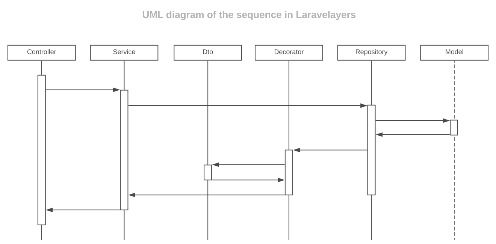

# Models

- [Introduction](#introduction)
- [Defining models](#defining-models)
- [Base model](#base-model)	

<a name="introduction"></a>
## Introduction

[Layer](layers.md) model is embedded in the repository, contains data about the database table and its relationships, as well as query templates.

**General UML Layered Structure Diagram**

[](https://lucid.app/documents/view/16a364a8-19b7-4136-a555-02f58b0c696e)

**UML diagram of the sequence of interaction of layers**

[
](https://lucid.app/documents/view/6c217ff3-3a7a-4806-bdf8-7a9b117c9de4)

<a name="defining-models"></a>
## Defining Models

Below is the model class.

> Note that the model extends the base model class included in Laravelayers, which in turn extends the base model class included in Laravel.

```php
<?php
	
namespace App\Models\Character;
	
use App\Models\Book\Book;
use App\Models\Book\Book2Character;
use Laravelayers\Foundation\Models\Model;
	
class Character extends Model
{
	/**
     * Define the relationship to the book.
     *
     * @return \Illuminate\Database\Eloquent\Relations\HasOne
     */
    public function books()
    {
		return $this->hasManyThrough(
			Book::class,
			Book2Character::class,
			'character_id',
			'book_id',
			'id',
			'id'
		);
    }
    
	/**
	 * Search by default.
	 *
	 * @param \Illuminate\Database\Eloquent\Builder $query
	 * @param string $search
	 * @param string|null $column
	 * @return \Illuminate\Database\Eloquent\Builder
	 */
	public function scopeSearch($query, $search, $column = null)
	{
		return $column
			? $query->where($column, 'like', "{$search}%")
			: $query->whereKey($search);
	}
	
	/**
	 * Sort by default.
	 *
	 * @param $query
	 * @param string $direction
	 * @param string|null $column
	 * @return \Illuminate\Database\Eloquent\Builder
	 */
	public function scopeSort($query, $direction = 'desc', $column = null)
	{
		return $query->orderBy($column ?: $this->getQualifiedKeyName(), $direction);
	}	
}
```
	
> All custom models used to represent intermediate relationship tables must extend the `Laravelayers\Foundation\Models\Pivot` class included in Laravelayers, which extends the `Illuminate\Database\Eloquent\Relations\Pivot` class included in Laravel.
	
The easiest way to create a model is to run the `make:model` Artisan command:

```php
php artisan make:model Character/Character
```

As a result of executing this command, the model class `App\Models\Character\Character` will be created.

UML class structure diagram:

[](https://lucid.app/documents/view/4f287ac4-f718-4216-b508-105fa1b035f4)

By default, models are created in the `app/Models` directory, but if you specify a slash `/Character/Character` at the beginning of the model name, the model will be created in the application's `app/Character/Character` directory.

By default, the name of the class, file and directory will be converted to a CamelCase string with a capital letter at the beginning. To cancel conversion, use the `--nm` option:

```php
php artisan make:model Character/Character --nm
```
	
To generate the default model template, use the `--template` option:	

```php
php artisan make:model Character/Character -t App/Models/Model
```

To change the name of the base model class, use the `--rp` option:

```php
php artisan make:model Character/Character --rp App/Models/Model
```

Or, override the call to the create model command in the service provider:

```php
<?php
	
namespace App\Providers;
	
use Illuminate\Support\ServiceProvider;
	
class AppServiceProvider extends ServiceProvider
{
    /**
     * Bootstrap any application services.
     *
     * @return void
     */
    public function boot()
    {
        $this->app->extend('command.model.make', function () {
            return $this->app
                ->make(\Laravelayers\Foundation\Console\Commands\ModelMakeCommand::class)
                ->setBaseClass('App/Model/Model');
        });
    }
}
```
	
You can also customize the stub files that are used when executing the create model command. To do this, run the command to publish the most common stubs:

```php
php artisan stub:publish
```

<a name="base-model"></a>
## Basic Model

The base model class `Laravelayers\Foundation\Models\Model` defines additional methods:

- [`scopePaginateManually`](#scope-paginate-manually)
- [`scopeDisctinctCount`](#scope-disctinct-count)
- [`scopeJoinModel`](#scope-join-model)
- [`getColumnListing`](#get-column-listing)
- [`getColumnTypes`](#get-column-types)

<a name="scope-paginate-manually"></a>	
**`scopePaginateManually()`**

The `scopePaginateManually` method gets the result of the base `paginate` method, but the result is returned in the `Laravelayers\Pagination\Paginator` object included in Laravelayers:

```php
// Laravelayers\Foundation\Repositories\Repository
	
/**
 * Paginate the given query and make it.
 *
 * @param int|null $perPage
 * @param string $pageName
 * @param int|null $page
 * @return \Laravelayers\Foundation\Pagination\Decorators\PaginatorDecorator
 */
public function paginate($perPage = null, $pageName = 'page', $page = null)
{
    return $this->decorate(
        $this->model->PaginateManually($perPage, ['*'], $pageName, $page)
    );
}
```
	
> Note that if the query contains the `distinct` or `groupBy` operator, the [`scopeDisctinctCount()`](#scope-disctinct-count) method is used to get the number of rows. To change the column passed to the `count` method, you must pass its name as the second argument to the `scopePaginateManually` method, instead of an array of columns.

<a name="simple-paginate-manually"></a>
The `scopeSimplePaginateManually` method receives the result of the base `simplePaginate` method, but the result is returned in the `Laravelayers\Pagination\SimplePaginator` object included in Laravelayers:

```php
// Laravelayers\Foundation\Repositories\Repository
	
/**
 * Simple paginate the given query and make it.
 *
 * @param int|null $perPage
 * @param string $pageName
 * @param int|null $page
 * @return \Laravelayers\Foundation\Pagination\Decorators\PaginatorDecorator
 */
public function simplePaginate($perPage = null, $pageName = 'page', $page = null)
{
    return $this->decorate(
        $this->model->simplePaginateManually($perPage, ['*'], $pageName, $page)
    );
}
```

<a name="scope-disctinct-count"></a>	
**`scopeDisctinctCount()`**

The `scopeDisctinctCount` method gets the result of the base `count` method, but if the query contains the `distinct` or `groupBy` operator, the query `$query->distinct()->count($this->getQualifiedKeyName())` without `groupBy` is executed to get the number of rows:

```php
// Laravelayers\Foundation\Repositories\Repository

/**
 * Retrieve the "count" result of the query.
 *
 * @param  string  $columns
 * @return int
 */
public function count($columns = '*')
{
	$result = $this->model->distinctCount($columns);
	
	$this->model = $this->model->getModel();
	
	return $result;
}
```

> Note that if no column name is passed to the method in `scopePaginateManually`, the `$this->getQualifiedKeyName()` column is used by default if the request contains the `distinct` or `groupBy` operator.

<a name="scope-join-model"></a>	
**`scopeJoinModel()`**

The `scopeJoinModel`, `scopeLeftJoinModel` and `scopeRightJoinModel` methods take as the first parameter the name of the model relationship method or an array with a callback function, as in the [`with`](https://laravel.com/docs/eloquent-relationships#eager-loading) method . From the relationship, the names of the tables and primary key columns are obtained, which are passed to the basic `join`, `leftJoin`, or `rightJoin` table join methods.

```php	
// App\Models\Character\Character
	
public function scopeSortingByRating($query, $direction = 'desc')
{
    return $query->leftJoinModel(['rating' => function($query) use($direction) {
        $query->sorting($direction);
    }]);
}
```	
	
<a name="get-column-listing"></a>	
**`getColumnListing()`**

The `getColumnListing` method gets the list of columns of the database table.

<a name="get-column-types"></a>	
**`getColumnTypes()`**

The `getColumnTypes` method gets the list of types for the columns of the database table.

Before getting the column types, be sure to add the `doctrine/dbal` dependency to your `composer.json` file: 

```php
composer require doctrine/dbal
```
