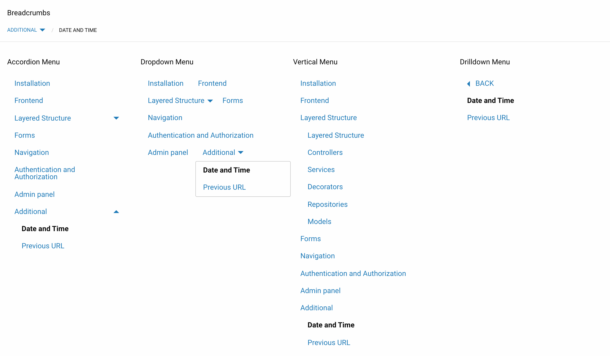

# Navigation 

- [Introduction](#introduction)
- [Menu decorator](#menu-decorator)
- [Defining menu item decorator](#defining-menu-item-decorator)
	- [Basic menu item decorator](#basic-menu-item-decorator)
	- [Trait of a menu item](#menu-item-trait)
- [Building a tree](#building-tree)
- [Displaying a menu](#menu-display)

<a name="introduction"></a>
## Introduction

The menu decorator and the menu item decorator are used to build the tree and display the navigation.



<a name="menu-decorator"></a>
## Menu decorators

The `Laravelayers\Navigation\Decorators\MenuDecorator` menu decorator is for a collection of items, where each item is a [menu item decorator](#defining-menu-item-decorator).

In the [service layer](services.md#inject-repository) you can set the menu decorator for the collection of data returned by the repository and the menu item decorator:

```php
// App\Services\Article\CategoryService

/**
 * Create a new CategoryService instance.
 *
 * @param \App\Repositories\Article\CategoryRepository $categoryRepository
 */
public function __construct(CategoryRepository $categoryRepository)
{
	$this->repository = $categoryRepository;

	$this->setDecorators([
		MenuDecorator::class,
		CategoryDecorator::class,
	]);
}
```

<a name="defining-menu-item-decorator"></a>
## Defining a menu item decorator

The [data decorator](decorators.md#defining-decorators) must implement the interface of the menu item and tree node `Laravelayers\Contracts\Navigation\MenuItem`, use the [menu item and tree node trait](#menu-item-trait) and additional methods are defined to implement the interface:

```php
<?php
	
namespace App\Decorators\Article\Category;
	
use Laravelayers\Contracts\Navigation\MenuItem as MenuItemContract;
use Laravelayers\Foundation\Decorators\DataDecorator;
use Laravelayers\Navigation\Decorators\MenuItem;
	
class CategoryDecorator extends DataDecorator implements MenuItemContract
{
    use MenuItem;

	/**
	 * Get the menu item name.
	 *
	 * @return string
	 */
	public function getMenuName()
	{
		return $this->name;
	}
	
	/**
	 * Get the menu item url.
	 *
	 * @return string
	 */
	public function getMenuUrl()
	{
		return return route('category.show', ['id' => $this->getKey()]);
	}
	
	/**
	 * Get the value of the HTML attribute of the class of the menu item icon.
	 *
	 * @return string
	 */
	public function getMenuIcon()
	{
		return $this->category_icon ?: '';
	}
	
	/**
	 * Get the sort value of the menu item.
	 *
	 * @return int
	 */
	public function getMenuSorting()
	{
		return $this->categoryTree->sorting ?? 0;
	}
	
	/**
	 * Get the value of the HTML attribute of the class of the menu item.
	 *
	 * @return string
	 */
	public function getMenuClass()
	{
		return $this->get('status') === 0 ? 'is-status-closed' : '';
	}
	
	/**
	 * Get the parent menu item ID.
	 *
	 * @return int|string
	 */
	public function getMenuParentId()
	{
		return $this->categoryTree->parent_id ?? 0;
	}     
}
```

<a name="get-menu-name"></a>
**`getMenuName()`**

The `getMenuName` method returns the name of the menu item displayed as text.

<a name="get-menu-url"></a>
**`getMenuUrl()`**

The `getMenuUrl` method returns the URL of the menu item.

<a name="get-menu-icon"></a>
**`getMenuIcon()`**

The `getMenuIcon` method returns the HTML class attribute value for the [icon](frontend.md#icons) menu item.

<a name="get-menu-sorting"></a>
**`getMenuSorting()`**

The `getMenuSorting` method returns the default sort order for a menu item.

<a name="get-menu-class"></a>
**`getMenuClass()`**

The `getClass` method returns the value of the HTML class attribute for the menu item.

<a name="get-menu-parent-id"></a>
**`getMenuParentId()`**
	
The `getMenuParentId` method returns the default ID for the parent menu item.

<a name="basic-menu-item-decorator"></a>
### Basic menu item decorator

The base menu item decorator `Laravelayers\Navigation\Decorators\MenuItemDecorator` implements the `Laravelayers\Contracts\Navigation\MenuItem` interface and uses the [menu item and tree node trait](#menu-item-trait).

When the data decorator inherits the base menu decorator, it is enough to implement only the `getMenuName` and `getMenuUrl` methods, the rest of the methods in the base class will be used as stubs:

```php
<?php
	
namespace App\Decorators\Article\Category;
	
use Laravelayers\Navigation\Decorators\MenuItemDecorator;
	
class CategoryDecorator extends MenuItemDecorator
{
	/**
	 * Get the menu item name.
	 *
	 * @return string
	 */
	public function getMenuName()
	{
		return $this->name;
	}
	
	/**
	 * Get the menu item url.
	 *
	 * @return string
	 */
	public function getMenuUrl()
	{
		return return route('category.show', ['id' => $this->getKey()]);
	}
}
```

If you create a menu decorator object from a collection where each item is an array, then you need to call the `getMenu` method of the menu decorator, which decorates each item using the base menu item decorator:

```php
$menu = MenuDecorator::make(collect([
	0 => [
		'id' => 1,
		'name' => 'Element 1',
		'url' => '/element/1',
		'parent_id' => 0
	],
	0 => [
		'id' => 2,
		'name' => 'Element 2',
		'url' => '/element/2',
		'parent_id' => 1
	],
]));

$menu->getMenu();
	
/*
	MenuDecorator {
	  #original: null
	  #treeMethod: []
	  #dataKey: "items"
	  #items: Collection {
	    #items: array: [
	      0 => MenuItemDecorator {}
	      1 => MenuItemDecorator {}
	    ]
	  }
	  #visibleProperties: []
	  #visibleGetters: []
	}
*/

$menu->getMenu()->count();

// 2
```
	
In this case, the keys of the array elements must match the keys used by the base decorator methods to retrieve data from the array:

Key      | Method
----------|------------------
id        | `getKeyName`
name      | `getMenuName`
url       | `getMenuUrl`
icon      | `getMenuIcon`
sorting   | `getMenuSorting`
class     | `getMenuClass`
parent_id | `getMenuParentId`

After that, you can call the [building-tree](#building-tree) methods:

```php
$menu->getMenu()->getTree()->count();

// 1

$menu->getMenu()->getTree()->first()->getTree()->isNotEmpty();

// true
```

<a name="menu-item-trait"></a>
### Trait menu item

The menu item and tree node tree `Laravelayers\Navigation\Decorators\MenuItem` is used in [defining menu item and tree node decorator](#defining-menu-item-decorator), also implements [form item interface](forms.md#form-element-interface)

After building the tree, each menu item is a tree node, contains a subtree and a nesting level:

```php
// App\Services\Article\CategoryService

$this->repository
	->get()
	->getTree()
	->first()

/*
	CategoryDecorator {
		#original: MenuDecorator {}
		#dataKey: "data"
		#data: array:8 [
		  "id" => 1
		  ...
		]
		#primaryKey: "id"
		#menu: array: 2 [
			"level" => 0
			"tree" => Collection {}
		]		
		
		...
	}
*/
```
	
The trait defines the following methods:

- [`getMenuLabel`](#get-menu-label)
- [`getNodeId`](#get-node-id)
- [`getNodeParentId`](#get-node-parent-id)
- [`getNodeSorting`](#get-node-sorting)
- [`getNodeLevel`](#get-node-level)
- [`getIsNodeSelected`](#get-is-node-selected)
- [`getTree`](#get-item-tree)
- [`getSiblings`](#get-item-siblings)
- [`getPath`](#get-item-path)
- [`getParent`](#get-item-parent)

<a name="get-menu-label"></a>
**`getMenuLabel()`**

The `getMenuLabel` method returns an array with the value and class for the label displayed after the menu name inside the HTML element [`<span class="label alert">`](https://get.foundation/sites/docs/label.html). To add a label, you need to use the `setMenuLabel` method, which takes the label value as the first argument, and the class's HTML attribute value as the second.

By default, the method returns an empty string for the menu path, using the `getTreeMethod ('path')` method to check.

<a name="get-node-id"></a>
**`getNodeId()`**

The `getNodeId` method returns the ID of the tree node using the [`getKey`](decorators.md#get-primary-key) method.

> Note that if the element was used to [add to the tree node](#add-nodes), then the method returns the modified ID of the tree node, in which the value returned by the [`getNodeParentId`](#get-node-parent-id) is used as a prefix.

<a name="get-node-parent-id"></a>
**`getNodeParentId()`**

The `getNodeParentId` method returns the ID of the parent tree node using the [`getMenuParentId`](#get-menu-parent-id) method.

> Note that the value can be changed using the `setNodeParentId` method if the [tree nodes were added](#add-nodes) element.

<a name="get-node-sorting"></a>
**`getNodeSorting()`**

The `getNodeSorting` method returns the sort order of the tree node using the [`getMenuSorting`](#get-menu-sorting) method.

> Note that the value can be changed using the `setNodeSorting` method if the element was used to [add to a tree node](#add-nodes).

<a name="get-node-level"></a>
**`getNodeLevel()`**

The `getNodeLevel` method returns the nesting level of the tree node. Modified by the `setNodeLevel` method when [building the tree](#building-tree).

<a name="get-is-node-selected"></a>
**`getIsNodeSelected()`**

The `getIsNodeSelected` method returns `true` if the tree node is selected, or `false`. The `setIsNodeSelected` method is used to change the value.

> Note that the [`setIsSelected`](decorators.md#get-is-selected) method also calls the `setIsNodeSelected` method.

<a name="get-item-tree"></a>
**`getTree()`**

The `getTree` method returns the subtree of the tree node:

```php
$this->repository->get()
	->getTree()
	->first()
	->getTree();

/*
	MenuDecorator {
		#original: MenuDecorator {}
		#treeMethod: []
		#dataKey: "items"
		#items: Collection {}
		...
	}	
*/
```
	
<a name="get-item-siblings"></a>
**`getSiblings()`**

The `getSiblings` method returns the sub-level of the tree node:

```php
$this->repository->get()
	->getTree()
	->first()
	->getSiblings();
```
	
<a name="get-item-path"></a>
**`getPath()`**

The `getPath` method returns the path for the tree node. The method can take as the second argument the maximum number of parents up to which the path will be loaded, for example, `1` to load only the parent tree node:

```php
$this->repository->get()
	->getNode(5)
	->first()
	->getPath(1);
```
	
<a name="get-item-parent"></a>
**`getParent()`**

The `getParent` method returns the parent node and its subtree for the tree node:

```php
$this->repository->get()
	->getNode(5)
	->first()
	->getParent();
```

<a name="building-tree"></a>
## Building a tree

To build a tree in the `Laravelayers\Navigation\Decorators\MenuDecorator` menu decorator, an instance of the `Laravelayers\Navigation\Tree` class is created, which takes a collection of items and returns a tree. The class implements the `Laravelayers\Contracts\Navigation\Tree` interface, which is associated with it in the `Laravelayers\Navigation\NavigationServiceProvider` service provider:

```php
// Laravelayers\Navigation\NavigationServiceProvider::register()
	
$this->app->bind(
    \Laravelayers\Contracts\Navigation\Tree::class,
    \Laravelayers\Navigation\Tree::class
);
```

The menu decorator defines the following methods for getting tree nodes:

- [`getTree`](#get-tree)
- [`getSiblings`](#get-siblings)
- [`getPath`](#get-path)
- [`getParent`](#get-parent)
- [`getNode`](#get-node)
- [`getTitle`](#get-title)
- [`getOriginal`](#get-original)
- [`getSelectedItems`](#get-selected-items)
- [`addNodes`](#add-nodes)
- [`reloadNodes`](#reload-nodes)
- [`getTreeMethod`](#get-tree-method)

<a name="get-tree"></a>
**`getTree()`**

The `getTree` method returns a tree, where each item is a [tree node](#defining-menu-item-decorator):

```php	
// App\Services\Article\CategoryService
	
$this->repository
	->get()
	->getTree();
	
/*
	MenuDecorator {
		#original: MenuDecorator {}
		#treeMethod: []
		#dataKey: "items"
		#items: Collection {
			#items: array:5 [
				0 => CategoryDecorator {
					#original: MenuDecorator {}
					#dataKey: "data"
					#data: array:8 [
					  "id" => 1
					  "name" => "Name"
					  "image" => "1.png"
					  "icon" => "icon-plus"
					  "status" => 1
					  "categoryTree" => DataDecorator {}
					]
					#primaryKey: "id"
					#menu: array: 2 [
						"level" => 0
						"tree" => Collection {}
					]
					...
				}
				1 => CategoryDecorator {}
				2 => CategoryDecorator {}
				3 => CategoryDecorator {}
				4 => CategoryDecorator {}
			]
		}
		...
	}	
*/
```
	
The method can take as the first argument an object or the ID of the tree node for which the subtree will be loaded, as the second argument it can take the maximum level up to which the tree will be loaded, for example, `0` to load only the sublevel for the specified ID of the tree node:

```php
$this->repository
	->get()
	->getTree(2, 0);
```

<a name="get-siblings"></a>
**`getSiblings()`**

The `getSiblings` method returns the sublevel for the specified object or menu item ID, where each menu item is a [tree node](#defining-menu-item-decorator):

```php
$this->repository
	->get()
	->getSiblings(2);
```
	
<a name="get-path"></a>
**`getPath()`**

The `getPath` method returns the path for the specified object or menu item ID, where each item is a [tree node](#defining-menu-item-decorator). The method can take as the second argument the maximum number of parents up to which the path will be loaded, for example, `1` to load only the parent tree node:

```php
$this->repository
	->get()
	->getPath(2, 1);
```
	
<a name="get-parent"></a>
**`getParent()`**

The `getParent` method returns the parent node and its subtree for the specified object or menu item ID, where each item is a [tree node](#defining-menu-item-decorator):

```php
$this->repository
	->get()
	->getParent(2);
```
	
<a name="get-node"></a>
**`getNode()`**

The `getNode` method returns the tree node and its subtree for the specified object or menu item ID, where each item is a [tree node](#defining-menu-item-decorator). The method can take as the second argument the maximum level up to which the tree will be loaded, for example, `1` to load only the sublevel for the specified tree node ID:

```php
$this->repository
	->get()
	->getNode(2, 1);
```

<a name="get-title"></a>
**`getTitle()`**

The `getTitle` method returns a string of the names of the path elements in reverse order:

```php
$menu->getPath(2)->implode('name', ' / ');
	
// Users / Actions
	
$menu->getTitle(2);
	
// Actions / Users
```

The method takes the same arguments as the first two arguments as the [`getPath`](#get-path) method. The method can accept text as the third argument, which will be added at the end of the line. The method can take a separator for the names of the path elements as the fourth argument. If you call the `getTitle` method immediately after calling the `getPath` method, then the text and separator can be passed as the first two arguments:

```php
$path = $menu->getPath(2);
	
$path->getTitle('Administration', ' | ');
	
// Actions | Users | Administration
```
	
<a name="get-original"></a>
**`getOriginal()`**	

The `getOriginal` method returns the original collection of items:

```php
$this->repository
	->get()
	->getTree()
	->getOriginal();	
	
/*
	TreeDecorator {
		#original: null
	  	#treeMethod: array:2 [
    		0 => "getTree"
    		1 => []
    	]
		#dataKey: "items"
		#items: Collection {
			#items: array:5 [
				0 => CategoryDecorator {}
				1 => CategoryDecorator {}
				2 => CategoryDecorator {}
				3 => CategoryDecorator {}
				4 => CategoryDecorator {}
			]
		}
		...
	}	
*/
```

The `hasOriginal` method determines whether the original collection of elements exists:

```php
$this->repository
	->get()
	->getTree()
	->hasOriginal();
	
// true
	
$this->repository
	->get()
	->hasOriginal();
	
// false
```

<a name="add-nodes"></a>
**`addNodes()`**

The `addNodes` method accepts a collection or array of elements to add to the specified tree node. As the second and third arguments, the method can take the same arguments as the [`addNode`](#add-node) method, which is passed each item in the collection as the first argument:

```php
$tree = $this->repository
	->get()
	->getTree(2);
	
$tree->count(); 
	
// 6		

$nodes = $tree->getOriginal()->whereIn('id', [6, 7]);
	
$tree = $tree->addNodes($nodes, 2, 0);
	
$tree->count();
	
// 8
```

<a name="add-node"></a>	
The `addNode` method takes a menu item decorator object and returns [the original collection of items](#get-original). The method can take as the second argument the ID of the parent tree node, and as the third argument it can take the key of the tree node before which the node should be added:

```php
$first = $nodes->first();
	
$first->getNodeId();
	
// 1
	
$path = $tree->getPath(2);
	
$path->count();
	
// 1

$path = $path->addNode($first, 2)->getPath(1);
	
$path->count();
	
// 2
	
$path->last()->getNodeId();
	
// 1_2
```
	
> Note that when calling the addNode method, the following values can be changed for tree nodes: [tree node id](#get-node-id), [tree parent id](#get-node-parent-id ), [sort order](#get-node-sorting), [nesting level](#get-node-level).   

<a name="reload-nodes"></a>
**`reloadNodes()`**

The `reloadNodes` method is intended to reload a tree from the original collection, for example, after adding a new tree node:
	
```php
$tree = $this->repository
	->get()
	->getTree(2);
	
$tree = $tree->addNode($nodes->first(), 2, 0)->reloadNodes();
// $tree = $tree->addNode($nodes->first(), 2, 0)->getTree(2);
	
$tree->hasOriginal();
	
// true
```

<a name="get-tree-method"></a>
**`getTreeMethod()`**
	
The `getTreeMethod` method returns an array with the name of the current method used to get tree elements and the parameters of the method. May take a method name to check if it matches the current method.

<a name="menu-display"></a>
## Menu display
	
The menu decorator's `render` method is used to render items using view templates compatible with the [Foundation](https://get.foundation/sites/docs/) frontend framework:

```php
$menu = $this->repository->get();
	
$menu->render();
//$menu->render('menu');
//(string) $menu;
	
// navigation::layouts.menu
	
$menu->getPath(2)->render();
	
// navigation::layouts.breadcrumbs.nav.menu
```
	
The method can take a path to one of the available views inside `navigation::layouts` or `layouts.menu` named `menu`.

> Note that when converting a menu decorator object to a string, the `render` method will also be called.

[Accordion menu](https://get.foundation/sites/docs/accordion-menu.html): 

```php
$tree = $menu->getTree();
	
$tree->render('accordion.drilldown');
	
// navigation::layouts.accordion.drilldown.menu

$tree->render('accordion');
	
// navigation::layouts.accordion.menu
```
	
[Breadcrumbs](https://get.foundation/sites/docs/breadcrumbs.html):

```php	
$menu->getPath(2)->render('breadcrumbs');
	
// navigation::layouts.breadcrumbs.menu	
```	

[Drilldown menu](https://get.foundation/sites/docs/drilldown-menu.html):

```php
$tree->render('drilldown');

// navigation::layouts.drilldown.menu	
```

[Dropdown menu](https://get.foundation/sites/docs/dropdown-menu.html):	

```php
$tree->render('dropdown.accordion');

// navigation::layouts.dropdown.accordion.menu
	
$tree->render('dropdown.drilldown');

// navigation::layouts.dropdown.drilldown.menu
	
$tree->render('dropdown.vertical');
	
// navigation::layouts.dropdown.vertical.menu
	
$tree->render('dropdown');
	
// navigation::layouts.dropdown.menu	
```

[Menu](https://get.foundation/sites/docs/menu.html):

```php
$tree->render('vertical');

// navigation::layouts.vertical.menu	
```

Also you can use views directly:

```php
@include('navigation::layouts.menu', ['tree' => $tree])

@include('navigation::layouts.breadcrumbs.nav.menu', ['tree' => $menu->getPath(2)])
```
	
To publish views, run the command:

```php
php artisan vendor:publish --tag=laravelayers-menu
```

To add a new menu view, you need to create a subdirectory and a `menu.blade.php` file inside `resources/views/layouts/menu/` or `resources/views/vendor/menu/layouts/`:

```php	
$tree->render('test');

// layouts.menu.test
```
