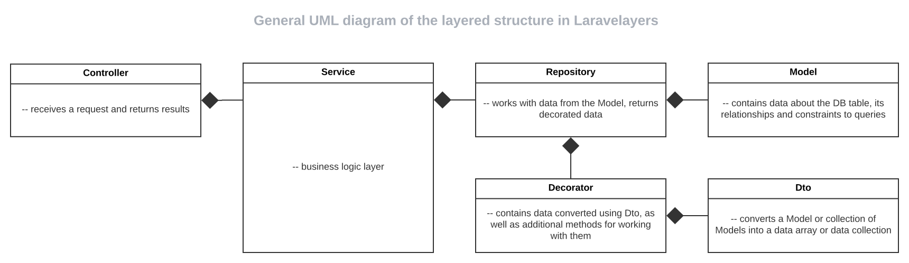

# Repositories

- [Introduction](#introduction)
- [Defining a repository](#defining-repository)
	- [Model injection](#inject-model)
- [Base repository](#base-repository)

<a name="introduction"></a>
## Introduction

The [Layer](layers.md) repository is injected into the service layer, calls the methods of the embedded model, and returns the transformed data in a decorator object.

**General UML Layered Structure Diagram**

[](https://lucid.app/documents/view/16a364a8-19b7-4136-a555-02f58b0c696e)

**UML diagram of the sequence of interaction of layers**

[
](https://lucid.app/documents/view/6c217ff3-3a7a-4806-bdf8-7a9b117c9de4)

<a name="defining-repository"></a>
## Defining a repository

Below is a repository class with an embedded [model](models.md). 

> Note that the repository extends the base repository class included with Laravelayers.

```php
<?php
	
namespace App\Repositories\Character;
	
use App\Models\Book\Character;
use Laravelayers\Foundation\Repositories\Repository;
	
class CharacterRepository extends Repository
{
    /**
     * Create a new CharacterRepository instance.
     *
     * @param Character $character
     */
    public function __construct(Character $character)
    {
        $this->model = $character;
    }
    
	/**
	 * Loading books for the character.
	 *
	 * @return $this
	 */
	public function withBooks()
	{
		return $this->query(
			$this->model->with(['books' => function($query) {
				$query->with('author')->sort();
			}])
		);
	}    
}
```

<a name="inject-model"></a>	
### Model injection
	
The easiest way to create a repository with an embedded model is to run the `make:repository` Artisan command with the `--model` option:

```php
php artisan make:repository Character/Character -m
```

As a result of this command, the following classes will be created:

- Repository `App\Repositories\Character\CharacterRepository`.
- Model `App\Models\Character\Character`.

UML class structure diagram:

[](https://lucid.app/documents/view/4f287ac4-f718-4216-b508-105fa1b035f4)

The specified subdirectory `Character` will be created in the directory for each layer.

By default, repositories are created in the `app/Repositories` directory, but if you specify the slash `/Character/Character` at the beginning of the repository name, the repository will be created in the application directory `app/Character/CharacterRepository.

The repository class name will contain a postfix corresponding to the layer name `CharacterRepository`. By default, all names of classes, files and directories will be converted to a CamelCase string with a capital letter at the beginning. To cancel conversion, use the `--nm` option:

```php
php artisan make:repository Character/Character --model --nm
```

To change the name of a model class use the `--mn` option:

```php
php artisan make:repository Character/Character --model --mn Book/Character
```
	
To change the name of the base repository class, use the `--rp` option:

```php
php artisan make:repository Character/Character --rp App/Repository/Repository
```

Or, override the call to the repository creation command in the service provider:

```php
<?php
	
namespace App\Providers;
	
use Illuminate\Support\ServiceProvider;
	
class AppServiceProvider extends ServiceProvider
{
    /**
     * Bootstrap any application services.
     *
     * @return void
     */
    public function boot()
    {
        $this->app->extend('command.repository.make', function () {
            return $this->app
                ->make(\Laravelayers\Foundation\Console\Commands\RepositoryMakeCommand::class)
                ->setBaseClass('App/Repositories/Repository');
        });
    }
}
```
	
You can also customize the stub files used when you run the command to create a repository. To do this, run the command to publish the most common stubs:

```php
php artisan stub:publish
```

<a name="base-repository"></a>
## Base repository

The base repository class `Laravelayers\Foundation\Repositories\Repository` will define a private `model` property for the model object and additional methods for working with the repository:

- [fill](#fill)
- [find](#find)
- [first](#first) 
- [paginate](#paginate)
- [get](#get)
- [count](#count)
- [exist](#exist)
- [doesntExist](#doesnt-exist)
- [save](#save)
- [destroy](#destroy)
- [query](#query)
- [decorate](#decorate)
- [macro](#macro)
- [__call](#call)

<a name="fill"></a>		
**`fill()`**

The `fill` method receives an array of column names for the model table, filled with empty values and converted to a data decorator object using the [`decorate`](#decorate) method. Below is the code of the service layer, in which this method is called and an array of relations names is passed, for which an array with column names will also be obtained:

```php
// App\Services\Character\CharacterService;

/**
 * Fill the resource instance with values.
 *
 * @return \App\Decorators\Character\CharacterDecorator
 */
public function fill()
{
    return $this->repository->fill(['books.author'], ['books.characters']);
}
	
/*
	CharacterDecorator {
		#dataKey: "data"
		#data: array:5 [
			"id" => null
			"name" => null
			"created_at" => null
			"updated_at" => null 
			"books" => array:9 [...]
		]						
		#primaryKey: "id"
		#originalKeys: array:4 [...]
		#dateKeys: array:2 [...]
		#timestampKeys: array:2 [...]
		#relationKeys: array:1 [...]
		#hiddenKeys: []
	}	
*/
```
	
> Note that you can retrieve data for nested relationships using the dot syntax. You can also pass an array of default values as the second argument, including for relationships.

The additional `fillWithTypes` method adds the `types` property to the decorator object, which contains the types of the table columns in the database, obtained using the [`getColumnTypes`](models.md#get-column-types) method of the model. The method also gets the column types for the passed array of related table names.
	
<a name="find"></a>		
**`find()`**

The `find` method gets the query result for the specified primary key, converted to a decorator object using the [`decorate`](#decorate) method:

```php
// Laravelayers\Foundation\Repositories\Repository
	
/**
 * Find a model by its primary key and make it.
 *
 * @param mixed $id
 * @param array $columns
 * @return \Laravelayers\Foundation\Decorators\DataDecorator
 */
public function find($id, $columns = ['*'])
{
    return $this->decorate(
        $this->model->find($id, $columns)
    );
}
```
	
The `findOrFail` method, unlike the `find()` method, throws an exception if the result is not found:

```php
// Laravelayers\Foundation\Repositories\Repository
	
/**
 * Find a model by its primary key and make it or throw an exception.
 *
 * @param mixed $id
 * @param array $columns
 * @return \Laravelayers\Foundation\Decorators\DataDecorator
 *
 * @throws \Illuminate\Database\Eloquent\ModelNotFoundException
 */
public function findOrFail($id, $columns = ['*'])
{
    return $this->decorate(
        $this->model->findOrFail($id, $columns)
    );
}
```
	
Below is the code of the service layer in which the repository is used as [query builder](#query):

```php
// App\Services\Character\CharacterService;
	
/**
 * Find the repository item by the specified ID.
 *
 * @param int $id
 * @return \App\Decorators\Character\CharacterDecorator
 */
public function find($id)
{			
	return $this->repository
		->withBooks()
		->findOrFail($id);
}
	
/*
	CharacterDecorator {
		#dataKey: "data"
		#data: array:6 [
			"id" => 1
			"name" => "Toto"
			"created_at" => Carbon @ {...}
			"updated_at" => Carbon @ {...}  
			"books" => Collection {...}
			"friends" => Collection {...}
		]					
		#primaryKey: "id"
		#originalKeys: array:4 [...]
		#dateKeys: array:2 [...]
		#timestampKeys: array:2 [...]
		#relationKeys: array:2 [...]
		#hiddenKeys: []
	}	
*/
```

<a name="first"></a>		
**`first`**

The `first()` method gets the query result, converted to a decorator object using the [`decorate`](#decorate) method, for the first entry found:

```php
// Laravelayers\Foundation\Repositories\Repository
	
/**
 * Execute the query, get the first result and make it.
 *
 * @param array $columns
 * @return \Laravelayers\Foundation\Decorators\DataDecorator
 */
public function first($columns = ['*'])
{
    return $this->decorate(
        $this->model->first($columns)
    );
}
```
	
The `firstOrFail()` method, unlike the `first()` method, throws an exception if the result is not found:

```php
// Laravelayers\Foundation\Repositories\Repository
	
/**
 * Execute the query, get the first result and make it or throw an exception.
 *
 * @param array $columns
 * @return \Laravelayers\Foundation\Decorators\DataDecorator
 *
 * @throws \Illuminate\Database\Eloquent\ModelNotFoundException
 */
public function firstOrFail($columns = ['*'])
{
    return $this->decorate(
        $this->model->firstOrFail($columns)
    );
}
```

<a name="paginate"></a>	
**`paginate()`**

The `paginate` method gets the query result using the [`PaginateManually`](models.md#scope-paginate-manually) method of the base Laravelayers model, converted to a decorator object using the [`decorate`](#decorate) method, for paginating items, calculating the total number of elements and pages, including for queries that contain the operator `distinct` or `groupBy`.

The `simplePaginate` method gets the query result using the [`SimplePaginateManually`](models.md#scope-simple-paginate-manually) method of the base Laravelayers model, converted to a decorator object using the [`decorate`](#decorate) method, for paging elements, calculating only the presence of the previous and next pages:

Below is the code of the service layer, in which the repository is used as [query builder](#query) and the repository methods are called depending on the conditions, which excludes the use of conditions in the repository:

```php
// App\Services\Character\CharacterService;
	
/**
 * Paginate repository items.
 *
 * @param Request $request
 * @return PaginatorDecorator
 */
public function paginate(Request $request)
{
	if ($request->has('search')) {
		$this->repository->search($request->get('search'));
	}
	
	return $this->repository
    	->withBooks()
    	->sort($request->get('desc') ? 'desc' : 'asc')
    	->paginate();
}

/*  
	PaginatorDecorator {
		#dataKey: "items"
		#items: Paginator {
			#total: 151
			#lastPage: 7
			#items: Collection {
				#items: array:25 [
					0 => CharacterDecorator {...}
					1 => CharacterDecorator {...}
					2 => CharacterDecorator {...}
					...
				]
			}
			#perPage: 25
			#currentPage: 1
			#path: "/"
			#query: []
			#fragment: null
			#pageName: "page"
		}
	}	     
*/
```

<a name="get"></a>		
**`get()`**

The `get` method gets the result of the query, converted to a decorator object using the [`decorate`](#decorate) method.

```php
// Laravelayers\Foundation\Repositories\Repository
	
/**
 * Execute the query as a "select" statement and make it.
 *
 * @param array $columns
 * @return CollectionDecorator
 */
public function get($columns = ['*'])
{
    return $this->decorate(
        $this->model->get($columns)
    );
}
```

Below is the code of the service layer in which the repository is used as [query builder](#query):

```php
// App\Services\Character\CharacterService;
	
/**
 * Get repository items.
 *
 * @return CollectionDecorator
 */
public function get()
{			
	return $this->repository
		->withBooks()
		->get();
}
	
/*
    CollectionDecorator {
      #dataKey: "items"
      #items: Collection {
        #items: array:151 [
          0 => CharacterDecorator {...}
          1 => CharacterDecorator {...}
          2 => CharacterDecorator {...}
          ...
        ]
      }
    }   
*/
```

<a name="count"></a>		
**`count()`**

The `count` method gets the number of records for the specified columns that match the query using the [`DisctinctCount`](models.md#scope-disctinct-count) method of the Laravelayers base model, including for queries that contain the `distinct` or `groupBy` operator.

```php
/**
 * Retrieve the "count" result of the query.
 *
 * @param  string  $columns
 * @return int
 */
public function count($columns = '*')
{
    $result = $this->model->distinctCount($columns);

    $this->model = $this->model->getModel();

    return $result;
}
```

<a name="exists"></a>		
**`exists()`**

The `exists` method returns `true` if there are any records matching the query.

<a name="doesnt-exist"></a>		
**`doesntExist()`**

The `doesntExist` method returns` true` if there are no records matching the query.

<a name="save"></a>
**`save()`**

The `save` method accepts a decorator object, from which it gets an array of data using the [`get`](decorators.md#get) method, fills the model with them using the `foreFill` method and creates a new record in the database or updates the model:

```php
/**
 * Save the model to the database.
 *
 * @param DataDecorator $item
 * @return DataDecorator|CollectionDecorator|PaginatorDecorator
 */
public function save(DataDecorator $item)
{
	$result = $this->result($item);
	
	$timestamps = $result->timestamps;
	
	$this->result($item)->timestamps = $item->timestamps;
	
	$saved = $result->forcefill($item->get())->save();
	
	$result->timestamps = $timestamps;
	
	return $this->decorate($saved ? $this->result() : []);
}
```
	
> Note that only the data from the form that you initialize with the [form decorator](forms.md) will be updated in the decorator object. With the public property `timestamps` of the decorator object, you can change the value of the `timestamps` property of the model object before saving the data.

To create a new record, first use the [`fill`](#fill) method in the [service layer](services.md#inject-repository), which will get the data decorator object containing an array with the original model attributes and empty values:

```php
// App\Services\Character\CharacterService

$item = $this->repository->fill();
	
$item->put('name', 'Scarecrow');
	
$result = $this->repository->save($item);

$result->isNotEmpty();

// true
```
	
When updating a record, you first need to get the data, as a result, the resulting model or collection of models will be saved in the `result` property, then transfer the changed decorator data to the `save` repository method:

```php
// App\Services\Character\CharacterService

$item = $this->repository->find(1);
	
$item->put('name', 'Totoshka');
	
$this->repository->save($item);
```
	
To get the result of the request, the `result` method is called in the `save` method, into which the resulting decorator object is passed. If the query result in the `result` property contains a collection of models, then the `result()` method will return from the collection the model corresponding to the primary key of the decorator object, and the `save` method will update the model:

```php
$items = $this->repository->find([1,2,3]);	
$item = $item->first()->put('name', 'Totoshka');
	
$this->repository->save($item);
```
	
> Note that the `getResult` method of the repository allows you to get the saved query result, converted to a decorator object using the [`decorate`](#decorate) method. 

If you need to update related models, you can override the `save` method in the repository:

```php
<?php
	
namespace App\Repositories\Character;
	
use App\Models\Book\Character;
use Laravelayers\Foundation\Repositories\Repository;
	
class CharacterRepository extends Repository
{
	/**
	 * Create a new CharacterRepository instance.
	 *
	 * @param Character $character
	 */
	public function __construct(Character $character)
	{
		$this->model = $character;
	}
	
    /**
     * Save the model to the database.
     *
     * @param DataDecorator|ProductDecorator $item
     * @return \Laravelayers\Foundation\Decorators\DataDecorator
     */
    public function save(DataDecorator $item)
    {
        DB::transaction(function() use($item) {
            parent::save($item);
	
            $saved = $this->result($item)
                ->book()
                ->save(
                    $this->result($item)
                        ->books
                        ->forcefill($item->book->get())
                );
                
            foreach($item->friends as $key => $friend) {
                $saved = $this->result($item)
                    ->friends
                    ->get($key)
                    ->forcefill($friend->get())
                    ->save();
            }                
        });
	
        return $this->decorate($saved ? $this->result() : []);
    }    
}
```
	
> Note that when updating linked models, [database transactions](#https://laravel.com/docs/database#database-transactions) are used.

You can also update data in other embedded repositories:

```php
class CharacterRepository extends Repository
{
	/**
	 * Create a new CharacterRepository instance.
	 *
	 * @param Character $character
	 */
	public function __construct(Character $character, CharacterImage $characterImage)
	{
		$this->model = $character;
		$this->characterImage = $characterImage;
	}
	
    /**
     * Save the model to the database.
     *
     * @param DataDecorator|ProductDecorator $item
     * @return \Laravelayers\Foundation\Decorators\DataDecorator
     */
    public function save(DataDecorator $item)
    {
        DB::transaction(function() use($item) {
            $saved = parent::save($item);
            
            foreach($item->images as $image) {
                $saved = $this->characterImage->forcefill($image->get())->save();
            }
                           
        });
	
        return $this->decorate($saved ? $this->result() : []);
    }    
}
```

<a name="destroy"></a>	
**`destroy()`**

The `destroy` method removes the model by the specified primary key or array of keys:

```php
/**
 * Destroy the models for the given IDs.
 *
 * @param array|int $ids
 * @return int
 */
public function destroy($ids)
{
    return $this->model->destroy($ids);
}
```
	
> To remove data from linked tables you can add [foreign keys](https://laravel.com/docs/migrations#foreign-key-constraints) or use [Eloquent events](https://laravel.com/docs/eloquent#events).	
	
<a name="query"></a>		
**`query()`**
	
The private `query` method takes an Eloquent query builder object, stores it in the `model` property, and returns the `$this` repository object.

```php
// Laravelayers\Foundation\Repositories\Repository

/**
 * Set the query for the model.
 *
 * @param \Illuminate\Database\Eloquent\Builder $query
 * @return $this
 */
protected function query(Builder $query)
{
    $this->model = $query;
	
    return $this;
}
```
	
> The `query` method is for all repository methods that are used to build a query.

For example, the following code defines a repository method for adding a constraint to a request:

```php
// App\Repositories\Character\CharacterRepository
	
/**
 * Add a where clause on the primary key to the query.
 *
 * @param mixed $id
 * @return $this
 */
public function whereKeyNot($id)
{
	return $this->query(
		$this->model->whereKeyNot($id)
	);
}
```
	
<a name="decorate"></a>		
**`decorate()`**

The private method `decorate` takes the result of the query and returns a [decorator](decorators.md) object with the converted data into an array or collection. In this case, the result of the request is stored in the private property `result`, and the model instance - in the property `model`.

Set decorators for the elements and the collection of elements returned by the repository in the [service layer](services.md#inject-repository).

> The `decorate` method is for all repository methods that return a query result.

<a name="macro"></a>	
**`macro()`**

Repositories are «macro-implementable», which allows custom methods to be added to the base class of the repository at run time. For example, the following code adds the `all` method to the repository class:

```php  
<?php
	
namespace App\Providers;
	
use Illuminate\Support\ServiceProvider;
use Laravelayers\Foundation\Repositories\Repository;
	
class AppServiceProvider extends ServiceProvider
{
	/**
	 * Bootstrap any application services.
	 *
	 * @return void
	 */
	public function boot()
	{
		Repository::macro('all', function() {
			return $this->decorate(
			    $this->model->all()
			);
		});
	}
}
```
	
<a name="call"></a>	    
**`__call()`**

If a non-existent repository method is called, but such a public method with the `scope` prefix exists in the model, then the model method will be called:

```php
// App\Services\Character\CharacterService;
	
/**
 * Paginate repository items.
 *
 * @param Request $request
 * @return PaginatorDecorator
 */
public function paginate(Request $request)
{		
	return $this->repository
    	->search($request)
    	->sort($request)
    	->paginate();
}
	
// App\Models\Character\Character;
	
/**
 * Search by default.
 *
 * @param \Illuminate\Database\Eloquent\Builder $query
 * @param string $search
 * @param string|null $column
 * @return \Illuminate\Database\Eloquent\Builder
 */
public function scopeSearch($query, $search, $column = null)
{
	return $column
		? $query->where($column, 'like', "{$search}%")
		: $query->whereKey($search);
}
	
/**
 * Sort by default.
 *
 * @param \Illuminate\Database\Eloquent\Builder $query
 * @param string $direction
 * @param string|null $column
 * @return \Illuminate\Database\Eloquent\Builder
 */
public function scopeSort($query, $direction = 'desc', $column = null)
{
	return $query->orderBy($column ?: $this->getQualifiedKeyName(), $direction);
}
```
	
> Using query templates in models, using methods with the `scope` prefix, excludes specifying the name of the database table columns in the repositories.

If a non-existent repository method is called with the `with`, `withCount`, `has` or `doesntHave` prefix, then the corresponding model method will be called, using the method name as the passed parameter:

```php
// App\Services\Character\CharacterService;
	
/**
 * Get repository items.
 *
 * @return CollectionDecorator
 */
public function get()
{			
	return $this->repository
		->withCountBooks()
		->get();
}
	
// App\Repositories\Character\CharacterRepository
	
/*
	public function withCountBooks()
	{
	    return $this->query(
	        $this->model->withCount('books')
	    );
	}
*/
```
