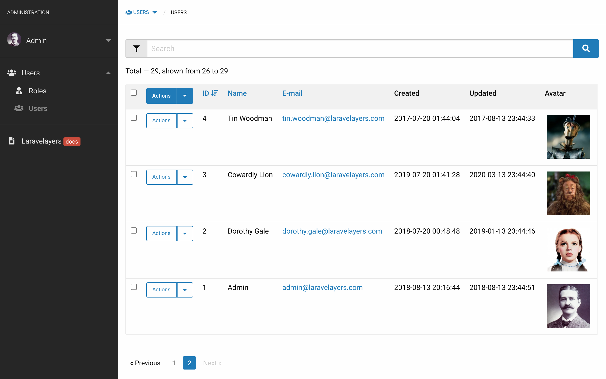
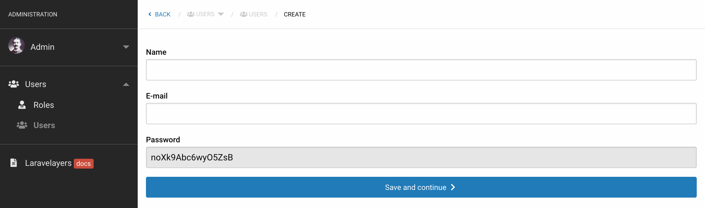
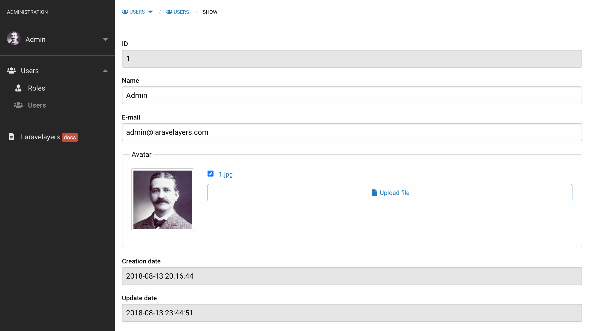
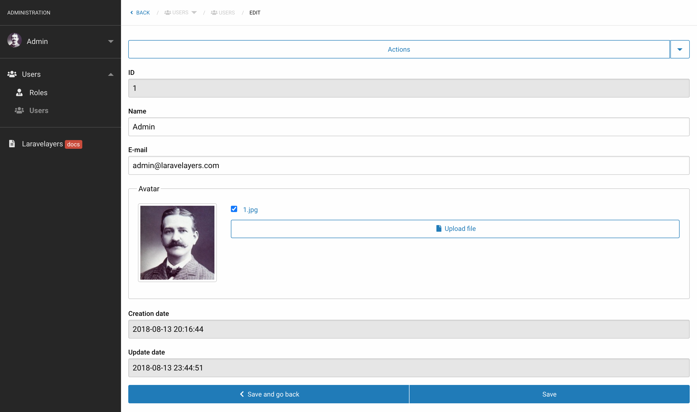
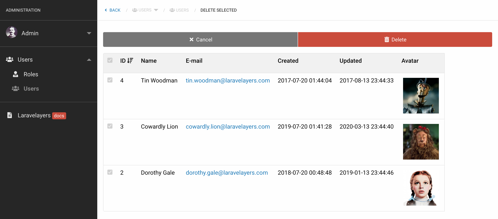
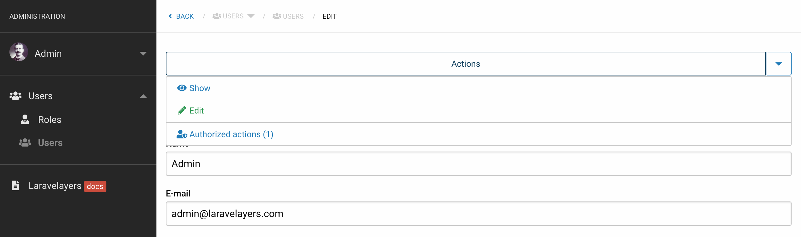
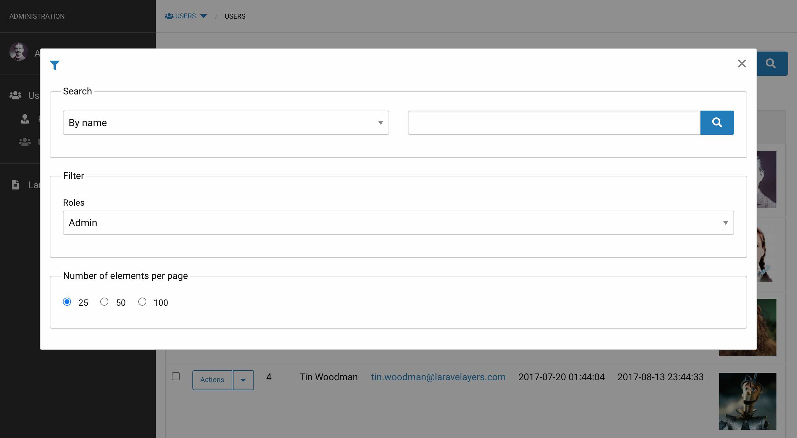
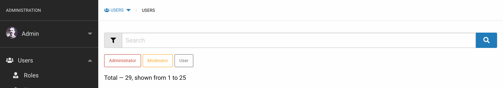

# Панель aдминистрирования

- [Введение](#introduction)
- [Определение классов](#defining-classes)
- [Контроллеры](#controllers)
	- [Маршрутизация](#routing)
	- [Авторизация](#authorizing)
	- [Навигация](#navgation)
	- [Методы](#methods)
- [Сервисы](#services)
	- [Методы для получения и сохранения данных](#methods-for-receiving-and-saving-data) 
- [Декораторы данных](#data-decorators)
	- [Формы](#forms)
	- [Действия](#actions)
- [Декораторы коллекции](#collection-decorators)
	- [Таблицы](#tables)
	- [Формы поиска и фильтрации](#search-and-filter-forms) 
	- [Общие формы](#general-forms)
	- [Групповые действия](#group-actions)
- [Репозитории](#repositories)
- [Локализация](#localization)

<a name="introduction"></a>
## Введение

Панель администрирования реализована на основе [слоистой структуры классов](layers.md), включает в себя дополнительные классы, представления и Artisan-команды для быстрого создания интерфейсов для управления данными.



<a name="defining-classes"></a>	
## Определение классов

Простейший способ создать все слои классов сразу — создать контроллер ресусра, выполнив Artisan-команду `admin:make-controller`:

```php
php artisan admin:make-controller Auth/User --parent --lang
```

В результате выполнения данной команды будут созданы следующие классы:

- [Контроллер](#controllers) `App\Http\Controllers\Admin\Auth\UserController`.
- [Сервис](#services) `App\Services\Admin\Auth\UserService`.
- [Репозиторий](#repositories) `App\Repositories\Admin\Auth\UserRepository`.
- [Декоратор данных](#data-decorators) `App\Decorators\Admin\Auth\UserDecorator`.
- [Декоратор коллекции](#collection-decorators)  `App\Decorators\Admin\Auth\UserCollectionDecorator`.
- [Модель](models.md) `App\Models\Auth\User`.

Будут добавлены [маршруты контроллера ресурса](#routing) в файл `routes/web.php`:

```php
Route::adminResource('auth/user', '\Laravelayers\Admin\Controllers\Auth\UserController');
```

С помощью опции `--parent` (`-p`) для классов сервиса, репозитория и декоратора будут добавлены расширяемые классы публичной части сайта, которые будут созданы, если они не существуют:
	
- Сервис `App\Services\Auth\UserService`.
- Репозиторий `App\Repositories\Auth\UserRepository`.
- Декоратор `App\Decorators\Auth\UserDecorator`.

С помощью опции `--lang` (`-l`) будет создан языковый файл в директории по умолчанию `/resources/lang/en/admin/auth/user.php`.

> Обратите внимание, что если сначала [добавить маршрут для контроллера](#adding-route), то [языковый файл](#language-files) будет создан в соответствии с URI маршрута для действия `index`, например, для маршрута `admin/auth/users/{user}/actions` будет создан языковый файл `/resources/lang/en/admin/auth/users/actions.php`.

Для изменения имени класса сервиса следует использовать опцию `--sn`:

```php
php artisan admin:make-controller Auth/Action --sn Auth/UserActionService
```	

Для публикации файлов заглушек в директорию `/stubs/admin`, которые используются для создания классов, выполните следующую Artisan-команду:

```php
php artisan stub:publish --admin
```
	
Для публикации представлений и переводов, выполните команду:

```php
php artisan vendor:publish --tag=laravelayers-admin
```

<a name="controllers"></a>	
## Контроллеры

Ниже приведен класс контроллера ресурса с внедренным [сервисным слоем](#services), созданный с помощью Artisan-команды `admin:make-controller`.

> Обратите внимание, что контроллер расширяет базовый класс контроллера панели администрирования, который в свою очередь расширяет базовый [базовый класс контроллера](controllers.md#base-controller), включенный в Laravelayers.

```php
<?php
	
namespace App\Http\Controllers\Admin\Auth;
	
use App\Services\Admin\Auth\UserService;
use Illuminate\Http\Request;
use Illuminate\Support\Facades\Route;
use Laravelayers\Admin\Controllers\Controller as AdminController;
use Laravelayers\Previous\PreviousUrl;
	
class UserController extends AdminController
{
    /**
     * Create a new UserController instance.
     *
     * @param UserService $userService
     */
    public function __construct(UserService $userService)
    {
        $this->authorizeResource();
	
        $this->service = $userService
            ->setSorting('id', 'desc')
            ->setPerPage(25);
    }
	
    /**
     * Initialize items for the admin menu bar.	     *
     * @return array
     */
    protected function initMenu()
    {
        return [
            'route' => 'admin.auth.users.index',
            'name' => trans('admin/auth/users.menu.name'),
            'parent' => '',
            'icon' => ''
        ];
    }
	
    /**
     * Display a listing of the resource.
     *
     * @param Request $request
     * @return \Illuminate\View\View
     */
    public function index(Request $request)
    {
        $items = $this->service->paginate($request);
	
        return view("admin::layouts.action.index", compact('items'));
    }
	
    /**
     * Show the form for creating a new resource.
     *
     * @param Request $request
     * @return \Illuminate\View\View
     */
    public function create(Request $request)
    {
        $item = $this->service->fill($request);
	
        return view('admin::layouts.action.create', compact('item'));
    }
	
    /**
     * Store a newly created resource in the repository.
     *
     * @param Request $request
     * @return \Illuminate\Http\RedirectResponse
     */
    public function store(Request $request)
    {
        $item = $this->service->fill($request);
	
        $item->getElements()->validate();
	
        $item = $this->service->save($item);
	
        return redirect()->route('admin.DummyRouteName.edit', array_merge([
        	$item->getKey()
		], PreviousUrl::getQuery()));
    }
	
	/**
	 * Display the specified resource.
	 *
	 * @param int $id
	 * @return \Illuminate\Http\RedirectResponse|\Illuminate\View\View
	 */
	public function show($id)
	{
		return Route::has('auth.users.show')
			? redirect()->route('auth.users.show', [$id])
			: $this->edit($id);
	}	    
	
    /**
     * Show the form for editing the specified resource.
     *
     * @param int $id
     * @return \Illuminate\View\View
     */
    public function edit($id)
    {
        $item = $this->service->find($id);
	
        return view('admin::layouts.action.edit', compact('item'));
    }
	
    /**
     * Update the specified resource in the repository.
     *
     * @param int $id
     * @return \Illuminate\Http\RedirectResponse
     */
    public function update($id)
    {
        $item = $this->service->find($id);
	
        $item->getElements()->validate();
	
        $this->service->save($item);
	
        return back();
    }
	
    /**
     * Remove the specified resource from the repository.
     *
     * @param int $id
     * @return \Illuminate\Http\RedirectResponse
     */
    public function destroy($id)
    {
        $this->service->destroy($id);
	
        return back();
    }
	
    /**
     * Show the form for editing multiple resources.
     *
     * @param Request $request
     * @return \Illuminate\View\View
     */
    public function editMultiple(Request $request)
    {
        $items = $this->service->paginate($request);
	
        return view('admin::layouts.action.multiple', compact('items'));
    }

    /**
     * Update multiple resources in the repository.
     *
     * @param  \Illuminate\Http\Request  $request
     * @return \Illuminate\Http\Response
     */
    public function updateMultiple(Request $request)
    {
        $items = $this->service->paginate($request);
	
        $items->getElements()->validate($items);
	
        $this->service->updateMultiple($items);
	
        return back();
    }
	
    /**
     * Show the form for delete multiple resources.
     *
     * @param Request $request
     * @return \Illuminate\View\View
     */
    public function deleteMultiple(Request $request)
    {
        $items = $this->service->paginate($request);
	
        return view('admin::layouts.action.multiple', compact('items'));
    }
	
    /**
     * Remove multiple resources from the repository.
     *
     * @param Request $request
     * @return \Illuminate\Http\RedirectResponse
     */
    public function destroyMultiple(Request $request)
    {
        $items = $this->service->paginate($request);
	
        $items->getElements()->validate();
	
        $this->service->destroy($items->getKeys());
	
        return back();
    }
}
```

> Обратите внимание, что при создании объекта сервиса в конструкторе контроллера вызывается метод [`setSorting()`](services.md#sorting) сервиса, с помощью которого устанавливается сортировка по умолчанию. Также вызывается метод [`setPerPage()`](services.md#get-per-page) сервиса, с помощью которого устанавливается количество элементов отображаемых на странице.

<a name="routing"></a>
### Маршрутизация

В процессе [установки Laravelayers](installation.md) и выполнения Artisan-команды `laravelayers:install --no-interaction`, будет автоматически выполнена команда `admin:make-routes`, в результате выполнения которой будут добавлены маршруты в файл `routes/web.php` для главной страницы панели администрирования и разделов управления пользователями, действиями, ролями и действиями ролей:
	
```php	
// Admin routes

Route::adminResource('/', '\Laravelayers\Admin\Controllers\IndexController', ['only' => 'index']);
	
Route::adminResource('auth/users', '\Laravelayers\Admin\Controllers\Auth\UserController');
	
Route::adminResource('auth/users.actions', '\Laravelayers\Admin\Controllers\Auth\UserActionController');
	
Route::adminResource('auth/roles', '\Laravelayers\Admin\Controllers\Auth\UserRoleController');
	
Route::adminResource('auth/roles.users', '\Laravelayers\Admin\Controllers\Auth\RoleUserController');
	
Route::adminResource('auth/roles.actions', '\Laravelayers\Admin\Controllers\Auth\UserRoleActionController');
```

При создании контроллера ресурса с помощью Artisan-команды `admin:make-controller`, для него будут добавлены маршруты в файл `routes/web.php`, если в файле уже добавлены другие маршруты с помощью метода `adminResource`.

Макрос `adminResource` фасада `Illuminate\Support\Facades\Route` зарегистрирует [маршрут ресурса](https://laravel.com/docs/controllers#resource-controllers) для контроллера с префиксом `admin`, который можно изменить, установив значение конфигурации `admin.prefix`:

Метод        | URI                           | Действие    | Имя маршрута              |
------------|-------------------------------|-----------|---------------------------
GET         | /admin/auth/users              | index     | admin.auth.users.index     |
GET         | /admin/auth/users/create       | create    | admin.auth.users.create    |
POST        | /admin/auth/users              | store     | admin.auth.users.store     |
GET         | /admin/auth/users/{user}       | show      | admin.auth.users.show      |
GET         | /admin/auth/users/{user}/edit  | edit      | admin.auth.users.edit      |
PUT/PATCH   | /admin/auth/users/{user}       | update    | admin.auth.users.update    |
GET      | /admin/auth/users/{user}/delete   | delete   | admin.auth.users.delete    |
DELETE      | /admin/auth/users/{user}       | destroy   | admin.auth.users.destroy   |

> Обратите внимание, что в качестве имени маршрута используется полный путь, указанный в качестве первого аргумента для метода `adminResource`.

Если вы захотите разместить маршруты панели администрирования в другом файле, например, `routes/admin.php`, то вам необходимо зарегистрировать файл в сервис-провайдере `App\Providers\RouteServiceProvider`:

```php
/**
 * Define the "web" routes for the application.
 *
 * These routes all receive session state, CSRF protection, etc.
 *
 * @return void
 */
protected function mapWebRoutes()
{
	Route::middleware('web')
		 ->namespace($this->namespace)
		 ->group(base_path('routes/web.php'));

	Route::middleware('web')
		->namespace($this->namespace)
		->group(base_path('routes/admin.php'));
}
```

> Обратите внимание, что при использовании Artisan-команды `admin:make-controller`, маршруты будут добавлены в тот файл в директории `routes/`, в котором будут добавлены другие маршруты с помощью макроса `adminResource`.

<a name="authorizing"></a>
### Авторизация

Для [авторизации](auth.md#authorization), в конструкторе контроллера вызывается метод [`authorizeResource`](auth.md#authorizing-resource-controllers).

Следующие методы контроллера панели администрирования будут сопоставлены с их соответствующими действиями пользователя, на примере маршрута `/admin/auth/users`:

Метод контроллера | Действие пользователя
------------------|-----------------------
index             | admin.auth.users.*
show              | admin.auth.users.view
create            | admin.auth.users.create
store             | admin.auth.users.create
edit              | admin.auth.users.update
update            | admin.auth.users.update
editMultiple      | admin.auth.users.update
updateMultiple    | admin.auth.users.update
destroy           | admin.auth.users.delete
destroyMultiple   | admin.auth.users.delete

<a name="navgation"></a>
### Навигация

<a name="side-menu-bar"></a>
#### Боковая панель меню

Добавьте название раздела для пункта меню в файл локализации `/resources/lang/en/admin/auth/users.php`:

```php
'menu' => [
    'name' => 'Users'
],
```

Для инициализации пункта меню необходимо в контроллере определить метод `initMenu`, с помощью которого добавляется массив с параметрами пункта меню, где каждый параметр это ключ и значение массива:

```php    
// App\Http\Controllers\Admin\Auth\UserController
    
protected function initMenu()
{
	return [
		'route' => 'admin.auth.users.index',
		'name' => trans('admin/auth/users.menu.name'),
		'parent' => '',
		'icon' => ''
	];
}
```
	
> Обратите внимание, что параметр `route` используется по умолчанию в качестве ИД пункта меню, а также для генерации URL, если не добавлен параметр `url`. Параметр `name` используется по умолчанию для сортировки меню, если не добавлен параметр `sorting`.
    
Для добавления иконки пункта меню необходимо добавить параметр `icon` со значением класса [иконки](frontend.md#icons):

```php	
return [
	'route' => 'admin.auth.users.index',
	'name' => trans('admin/auth/users.menu.name'),
	'parent' => '',
	'icon' => 'icon-user'
];
```
	
Для добавления родительского пункта меню необходимо добавить параметр `parent` со значением параметров родительского меню:

```php
return [
	'route' => 'admin.auth.users.index',
	'name' => trans('admin/auth/users.menu.name'),
	'parent' => [
	    'route' => 'admin.auth.index',
	    'name' => trans('admin/auth/users.menu.parent_name'),
	    'url' => route('admin.auth.users.index'),
	    'icon' => 'icon-users',
	],
	'icon' => 'icon-user'
];
```	

> Обратите внимание, что для добавления такого же родительского пункта меню для другого пункта меню, достаточно добавить в качестве значения для параметра `parent` только значение параметра `route` родительского меню, например, `admin.auth.index`.
	
Для того, чтобы скрыть пункт меню необходимо добавить параметр `hidden` со значением `true` или пустое значение `name`.

Чтобы добавить динамическое значение к названию пункта меню внутри HTML элемента `<span class="label secondary">`, необходимо добавить параметры `label` и `class`, а затем обновить кэш панели меню:

```php
// App\Http\Controllers\Admin\Auth\UserController
    
protected function initMenu()
{
	return [
		'route' => 'admin.auth.users.index',
		'name' => trans('admin/auth/users.menu.name'),
		'parent' => '',
		'icon' => '',
		'label' => $this->service->getNewUsersCount(),
		'class' => 'secondary' // primary, success, alert, warning
	];
}
```

Для обновления кэша панели меню выполните следующую Artisan-команду или откройте URL пункта меню в браузере:

```php
php artisan admin:menu-cache
```
	
Объект меню, получаемый с помощью метода `getMenu` с аргументом `menu`, передается представлениям `admin::layouts.menuBar` и `admin::layouts.header` в переменной `menu` с помощью композитора представлений зарегистрированного в сервис-провайдере `Laravelayers\Admin\AdminServiceProvider`.

Метод `getMenuItem` контроллера возвращает массив с данными текущего пункта меню, подготовленных с помощью метода `prepareMenuItem`.

<a name="breadcrumbs"></a>
#### Хлебные крошки


Навигационная цепочка для текущего пункта меню, добавленного с помощью метода `initMenu()`, создается автоматически, в том числе, если пункт скрыт из панели меню с помощью параметра `hidden`.

Также вы можете инициализировать пункт пути меню с помощью метода `initMenuPath()`, в том числе для маршрута [вложенного ресурса](#https://laravel.com/docs/controllers#restful-nested-resources), например, чтобы для URL маршрута `/admin/auth/users/20/roles` отобразить путь `AUTH / USERS / № 20 / ROLES`, где `№ 20` - это ссылка на `/admin/auth/users/20/edit`:

```php
// App\Http\Controllers\Admin\Auth\UserController

/**
 * Initialize path items for the admin menu.
 *
 * @return array
 */
protected function initMenuPath()
{
	return [
	    'route' => 'admin.auth.users.roles.index',
	    'parent' => 'admin.auth.users.edit',
	    'name' => trans('admin/auth/users/roles.menu.name'),
	];
}
```
	
> Обратите внимание, что для параметра `parent` указан маршрут с именем метода действия `edit`, для автоматического добавления пункта меню для этого маршрута.
    
Также можно добавить несколько пунктов для навигационной цепочки, в том числе для маршрута вложенного ресурса, например, чтобы для URL маршрута `/admin/auth/users/20/roles/1/actions` отобразить путь `AUTH / USERS / № 20 / ROLES / № 1 / ACTIONS`, где `№ 1` - это ссылка на `/admin/auth/users/20/roles/1/edit`:

```php
return [
	[
		'route' => 'admin.auth.users.roles.index',
		'parent' => 'admin.auth.users.edit',
		'name' => trans('admin/auth/users/roles.menu.name'),
	],
	[
		'route' => 'admin.auth.users.roles.actions.index',
		'parent' => 'admin.auth.users.roles.edit',
		'name' => trans('admin/auth/users/actions.menu.name'),
	]
];
```
	
Объект пути меню, получаемый с помощью метода `getMenu` с аргументом `path`, передается представлениям `admin::layouts.menuBar` и `admin::layouts.header` в переменной `path` с помощью композитора представлений зарегистрированного в сервис-провайдере `Laravelayers\Admin\AdminServiceProvider`.

Таким же образом передается строка для HTML тега `title`, получаемая с помощью метода `getMenu` с аргументом `title`, передается представлению `admin::layouts.app` в переменной `title`.

Метод `getIsBackLinkForMenuPath` контроллера возвращает значение `true` свойства `isBackLinkForMenuPath`, если разрешено отображать ссылку "Назад" в пути меню, при передаче в запросе аргумента [предыдущего URL](previous.md). Изменить данное значение можно с помощью вызова статического метода `setIsBackLinkForMenuPath` с аргументом `false`. 

<a name="submenu-bar"></a>
#### Панель подменю


Панель подменю предназначена для отображения подразделов текущего пункта меню под навигационной цепочкой, которые не нужно отображать в боковой панели. Для инициализации пунктов уровня меню необходимо в контроллере определить метод `initSubmenu`, с помощью которого добавляется массив с элементами меню, если при этом элемент меню уже инициализирован в другом контроллере, то достаточно добавить для элемента меню только параметр `route`:

```php
// App\Http\Controllers\Admin\Auth\UserController

/**
 * Initialize items for the admin submenu.
 *
 * @return array
 */
protected function initSubmenu()
{
	return [
		0 => [
			'route' => 'admin.auth.roles.index',
			'name' => trans('admin/auth/users/roles.menu.name'),
			'icon' => 'icon-user-tie',
			'sorting' => 1
		],
		1 => [
			'route' => 'admin.auth.actions.index',
			'sorting' => 2
		],
	];
}
```

Объект подменю вызывается в представлении из текущего пункта меню как [поддерево](navigation.md#get-item-tree):

```php
$path->last()->getTree();
```

<a name="methods"></a>		
### Методы

Следующие методы контроллера соответствуют действиям маршрута: 

- [`index()`](#index)
- [`create()` и `store()`](#create-and-store)
- [`show()`](#show)
- [`edit()` и `update()`](#edit-and-update)
- [`destroy()`](#destroy)

Следующие дополнительные методы контроллера, вызываются при вызове метода `store` и передаче в HTTP-запросе аргумента `action`, значение которого используется в качестве имени, вызываемого метода контроллера:

- [`editeMultiple()` и `updateMultiple()`](#edit-multiple-and-update-multiple)
- [`deleteMultiple()`/`destroyMultiple()`](#delete-multiple-and-destroy-multiple)

> Обратите внимание, что это возможно благодаря переопределению метода `dispatch` класса `Illuminate\Routing\ControllerDispatcher` в классе `Laravelayers\Admin\ActionRouteDispatcher` с которым он связан в сервис-провайдере `Laravelayers\Admin\AdminServiceProvider`. 

<a name="index"></a>
**`index()`**

Метод `index` возвращает представление `admin::layouts.action.index` для отображения коллекции данных.


<a name="create-and-store"></a>
**`create()` и `store()`**

Метод `create` возвращает представление `admin::layouts.action.create` для отображения формы создания данных.



После отправки формы, данные запроса передаются в метод `store`, в котором они проходят валидацию и передаются в метод [`save`](#save) объекта сервиса, после чего осуществляет редирект к действию `edit` маршрута.

<a name="show"></a>
**`show()`**

Метод `show` осуществляет редирект на публичную страницу сайта для отображения данных, если такой маршрут существует, или возвращает представление `admin::layouts.action.edit` для отображения формы редактирования данных, но без возможности отправки формы.



<a name="edit-and-update"></a>
**`edit()` и `update()`**

Метод `edit` возвращает представление `admin::layouts.action.edit` для отображения формы редактирования данных.



После отправки формы, данные HTTP-запроса передаются в метод `update`, в котором они проходят валидацию и передаются в метод [`save`](#save) объекта сервиса.

<a name="destroy"></a>
**`destroy()`**

Метод `destroy` удаляет данные, используя метод [`destroy`](#service-destroy) сервиса.

<a name="edit-multiple-and-update-multiple"></a>
**`editMultiple()` и `updateMultiple()`**

Метод `editMultiple` возвращает представление `admin::layouts.action.multiple` для отображения формы редактирования всех элементов коллекции, отображаемых на странице для метода контроллера [`index`](#index), или выбранных элементов, идентификаторы которых переданы в HTTP-запросе.


После отправки формы, данные HTTP-запроса передаются в метод `updateMultiple`, в котором они проходят валидацию и передаются в метод [`updateMultiple`](#update-multiple) объекта сервиса.

<a name="delete-multiple-and-destroy-multiple"></a>
**`deleteMultiple()` и `destroyMultiple()`**

Метод `deleteMultiple` возвращает представление `admin::layouts.action.multiple` для отображения формы удаления всех элементов коллекции, отображаемых на странице для метода контроллера [`index`](#index), или выбранных элементов, идентификаторы которых переданы в HTTP-запросе.



После отправки формы, данные HTTP-запроса передаются в метод `destroyMultiple`, в котором они передаются в метод [`destroy`](#service-destroy) объекта сервиса.

<a name="services"></a>	
## Сервисы

Ниже приведен класс сервисного слоя с внедренным [репозиторием](#repositories), созданный с помощью Artisan-команды `admin:make-service` с опцией `--parent` или [`admin:make-controller`](#defining-classes).

> Обратите внимание, что сервис расширяет базовый класс сервиса публичной части сайта, но если бы он был создан без опции `--parent`, то тогда расширял бы [базовый класс сервиса](services.md#base-service), включенный в Laravelayers. Опцию `--parent` следует использовать, когда необходимо отделить методы администрирования от методов публичной части сайта.

```php
<?php
	
namespace App\Services\Admin\Auth;
	
use App\Decorators\Admin\Auth\UserDecorator;
use App\Decorators\Admin\Auth\UserCollectionDecorator;
use App\Repositories\Admin\Auth\UserRepository;
use App\Services\Auth\UserService as BaseUserService;
use Illuminate\Http\Request;
use Laravelayers\Foundation\Decorators\CollectionDecorator;
	
class UserService extends BaseUserService
{
    /**
     * Create a new UserService instance.
     *
     * @param UserRepository $userRepository
     */
    public function __construct(UserRepository $userRepository)
    {
        $this->repository = $userRepository;
	
        $this->setDecorators([
            UserDecorator::class,
            UserCollectionDecorator::class,
        ]);
    }
	
    /**
     * Fill the resource instance with values.
     *
     * @param Request $request
     * @return \Laravelayers\Foundation\Decorators\DataDecorator|UserDecorator
     */
    public function fill(Request $request)
    {
        if ($request->has('id')) {
            return ($item = $this->find($request->get('id')))->forget($item->getKeyName());
        }
	
        return $this->repository->fill();
    }
	
    /**
     * Find the resource by the specified ID.
     *
     * @param int $id
     * @return \Laravelayers\Foundation\Decorators\DataDecorator|UserDecorator
     */
    public function find($id)
    {
        return $this->repository->findOrFail($id);
    }
	
    /**
     * Paginate resources.
     *
     * @param Request $request
     * @return \Laravelayers\Pagination\Decorators\PaginatorDecorator|CollectionDecorator|UserCollectionDecorator
     */
    public function paginate(Request $request)
    {
        $this->search($request)
            ->sort($request)
            ->whereStatus();
	
        return ($ids = $this->getFormElements($request, 'id'))
            ? $this->repository->findOrFail($ids)
            : $this->repository->paginate($this->getPerPage($request));
    }
	
    /**
     * Update multiple resources in the repository.
     *
     * @param CollectionDecorator|UserCollectionDecorator $items
     * @return CollectionDecorator|UserCollectionDecorator
     */
    public function updateMultiple(CollectionDecorator $items)
    {
        $request = $items->getElements()->getRequest();
	
        foreach($items as $key => $item) {
            $item = $items->setSorting($this->getFormElements($request, 'id')[$key]);
	
            if ($request->get('pattern')) {
                $item->replaceElements($request->pattern, $request->replacement);
            }
	
            $this->repository->save($item);
        }
	
        return $items;
    }
}
```

> Обратите внимание, что в конструкторе сервиса установлены декораторы с помощью метода [`setDecorators`](services.md#set-decorators).

Для изменения имени класса репозитория следует использовать опцию `--rn`:

```php
php artisan admin:make-service Auth/Action --rn Auth/UserActionRepository
```

<a name="methods-for-receiving-and-saving-data"></a>
### Методы для получения и сохранения данных

В сервисе определены следующие методы по умолчанию, вызываемые в контроллере:

- [`fill`](#fill)
- [`find`](#find)
- [`paginate`](#paginate)
- [`updateMultiple`](#update-multiple)
- [`save`](#save)
- [`destroy`](#service-destroy)

<a name="fill"></a>
**`fill()`**

Метод `fill` используется для заполнения объекта декоратора данных именами столбцов ресурса с значением `null`, с помощью метода [`fill`](repositories.md#fill) репозитория:

```php
$this->repository->fill(['userActions']);
	
/*
	UserDecorator {
		#dataKey: "data"
		#data: array:10 [
			"id" => null
			"login" => null
			"password" => null
			"email" => null
			"remember_token" => null
			"created_at" => null
			"updated_at" => null
			"userActions" => array:13 []
		]
		#primaryKey: "id"
		#originalKeys: array:7 []
		#dateKeys: array:3 []
		#timestampKeys: array:2 []
		#relationKeys: array:1 []
		#hiddenKeys: array:2 []	
		...
	}
*/
```

Или метод используется для получения данных по ИД копируемого ресурса:

```php
$item = $this->find($request->get('id')));
$item->forget($item->getKeyName());

/*
	UserDecorator {
		#dataKey: "data"
		#data: array:10 [
			"login" => "Test"
			"password" => "$1$Ij1.x14.$1vL1gUVCT8QlfO7XXZn2o."
			"email" => "test@example.com"
			"remember_token" => "mz2dEw8vz370ppsVluP0cpEj1basg8SX1xFEnu06qM2pKdWg7zn7nOokgtPx"
			"created_at" => 2020-12-20 03:25:00
			"updated_at" => 2020-12-20 04:25:00
			"userActions" => array:13 []
		]
		#primaryKey: "id"
		#originalKeys: array:7 []
		#dateKeys: array:3 []
		#timestampKeys: array:2 []
		#relationKeys: array:1 []
		#hiddenKeys: array:2 []	
		...
	}
*/
```

<a name="find"></a>
**`find()`**

Метод `find` получает данные по ИД указанного ресурса или возвращает ошибку 404.

<a name="paginate"></a>
**`paginate()`**

Метод `paginate` используется для фильтрации и получения элементов коллекции разбитых на страницы, принимая количество отображаемых элементов, которые он получает с помощью метода [`getPerPage`](services.md#get-per-page).

Если в HTTP-запросе переданы [ИД выбранных элементов](services.md#get-form-elements), то метод возвращает выбранные элементы:

```php
return ($ids = $this->getFormElements($request, 'id'))
	? $this->repository->findOrFail($ids)
	: $this->repository->paginate($this->getPerPage($request));
```

> Обратите внимание, что ИД выбранных элементов передаются для методов контроллера [`editMultiple`](#edit-multiple-and-update-multiple) и [`deleteMultiple`](#delete-multiple-and-destroy-multiple).

<a name="update-multiple"></a>
**`updateMultiple()`**

Метод `updateMultiple` используется для обновления коллекции данных по переданным ИД с помощью метода [`save`](repositories.md#save) репозитория, в том числе для изменения общих значений коллекции даных, например, для замены текста или изменения статуса:

```php   
$request = $items->getElements()->getRequest();
   
foreach($items as $key => $item) {
	if ($request->get('pattern')) {
	    $item->replaceElements($request->pattern, $request->replacement);
	}
            
	if ($request->has('status')) {
		$item->put('status', $request->get('status'));
	}
	
	$this->repository->save($item);
}
```
	
Также метод используется для сохранения [измененного порядка сортировки в коллекции данных](#sort-order-for-group-editing).

<a name="save"></a>
**`save()`**

Метод `save` не определен в сервисе, поэтому вызываются метод [`save`](repositories.md#save) из репозитория.

<a name="service-destroy"></a>
**`destroy()`**

Метод `destroy` не определен в сервисном слое, поэтому вызываются метод [`destroy`](repositories.md#destroy) из репозитория.

<a name="data-decorators"></a>	
## Декораторы данных

Ниже приведен класс декоратора данных, созданный с помощью команды `admin:make-decorator` или [`admin:make-controller`](#defining-classes).

> Обратите внимание, что декоратор данных реализует интерфейс декоратора администрирования `Laravelayers\Contracts\Admin\DataDecorator` с помощью внедренного трейта `Laravelayers\Admin\Decorators\DataDecorator`.

```php
<?php
	
namespace App\Decorators\Admin\Auth;
	
use Laravelayers\Admin\Decorators\DataDecorator as TraitDataDecorator;
use Laravelayers\Contracts\Admin\DataDecorator as DataDecoratorContract;
use App\Decorators\Auth\UserDecorator as BaseUserDecorator;
	
class UserDecorator extends BaseUserDecorator implements DataDecoratorContract
{
	use TraitDataDecorator;

	/**
	 * Initialize form elements.
	 *
	 * @return array
	 */
	protected function initElements()
	{
		return $this->getDefaultElements();
	}

	/**
	 * Initialize actions.
	 *
	 * @return array
	 */
	protected function initActions()
	{
		return $this->getDefaultActions();
	}
	
	/**
	 * Initialize the form actions element.
	 *
	 * @return array
	 */
	protected function initActionsElement()
	{
		return $this->getDefaultActions(['show', 'create']);
	}
	
	/**
	 * Initialize form elements for editing multiple collection elements.
	 *
	 * @return array
	 */
	protected function initMultipleElements()
	{
		return array_keys($this->initElements());
	}
	
	/**
	 * Get the sort order.
	 *
	 * @return int|null
	 */
	public function getSorting()
	{
		return $this->get($this->getSortKey());
	}
		
	/**
	 * Set the sort order.
	 *
	 * @param int|string $value
	 * @return $this
	 */
	public function setSorting($value)
	{
		return !is_null($this->getSorting()) ? $this->put($this->getSortKey(), (int) $value) : $this;
	}	    
}
```

<a name="forms"></a>
### Формы


Для методов контроллера [`create`](#create-and-store) и [`edit`](#edit-and-update) отображается форма для создания и редактирования данных, поэтому для инициализации элементов [формы](forms.md#initialization-of-form-elements) необходимо определить абстрактный метод `initElements`.

> Обратите внимание, что с помощью метода `prepareElements` трейта `DataDecorator`, при получении элементов формы с помощью метода [`getElements`](forms.md#get-form-elements), будут добавлены дополнительные элементы: элемент формы, [элемент формы для действий](#form-element-for-actions), отключенный элемент первичного ключа, отключенные элементы даты создания и обновления данных, элементы кнопок для отправки формы.

По умолчанию метод `initElements` возвращает результат вызова метода `getDefaultElements`, который создает элементы формы по умолчанию, для всех не скрытых столбцов.

Добавьте необходимые элементы формы:

```php
protected function initElements()
{
	return [
		'login' => [
			'type' => 'text',
			//'name' => 'login',
			//'value' => $this->login,
			'required' => '',
			'rules' => 'required'
		],
		'email' => [
			'type' => 'email',
			'value' => $this->email,
			'label' => '',
			'required' => '',
			'rules' => 'required|email'
		]
	];
}
```

> Обратите внимание, что если атрибут `value` не добавлен для элемента формы, то будет возвращено значение для ключа объекта декоратора, соответствующего атрибуту `name`.

Чтобы добавить для элемента формы [текст ярлыка](forms.md#labels), текст внутри текстово поля, [текст справки](forms.md#help-text), [текст всплывающей подсказки](forms.md#tooltip-text) и [текст Javscript ошибки](forms.md#error-text), достаточно добавить перевод для имени элемента формы с соответствующим постфиксом в файл локализации `/resources/lang/en/admin/auth/users.php`:

```php	
'elements' => [
	'login_label' => 'Login',
	'login_placeholder' => 'Placeholder text',
	'login_help' => 'Help text.',
	'login_tooltip' => 'Tooltip text.',
	'login_error' => 'Javascript error text for :attribute.',
	'email_label' => '',
],
```
	
> Обратите внимание, что для того, чтобы не отображать текст ярлыка, необходимо указать пустое значение для строки перевода или добавить параметр `label` с пустым значением для элемента формы.

Для получения строки перевода из [языкового файла](#language-files), используется статический метод `transOfElement`, который принимает ключ строки перевода в качестве первого аргумента, массив замен в качестве второго аргумента и значение `true`, чтобы вернуть пустую строку, когда перевод не найден:

```php
static::transOfElement('id_label');
	
// "ID"
	
static::transOfElement('test_label');
	
// "/lang/en/admin/auth/users.elements.test_label"
	
static::transOfElement('login_error', ['attribute' => 'Login']);
	
// "Javascript error text for Login."
	
static::transOfElement('test_label', [], true);
	
// ""
```

Вы можете скрыть элемент формы для указанных действий с помощью вызова метода `isAction`, который возвращает `true`, если одно из указанных действий соответствуют текущему методу контроллера:

```php
'password' => [
	'type' => 'password',
	'required' => '',
	'rules' => 'required|email',
	'hidden' => $this->isAction(['edit', 'editMultiple'])
	//'hidden' => !$this->isAction('create')
],
```
		
<a name="form-element-for-actions"></a>
#### Элемент формы для действий



Для инициализации элемента формы, отображающего [выпадающее меню ссылок](forms.md#type-button-dropdown) на другие действия, необходимо определить абстрактный метод `initActionsElement`.

> Обратите внимание, что при получении элементов формы, действия будут добавлены в начале всех [инициализированных элементов](#forms).

По умолчанию метод `initActionsElement` возвращает результат вызова метода `getDefaultActions` в соответствии массивом действий `show` и `create`.

Вы можете добавить необходимые действия или вернуть пустой массив:

```php
protected function initActionsElement()
{
	return [
		'copy' => [
			'link' => 'create',
			'httpQuery' => ['id' => $this->getKey()],
			'text' => static::transOfAction('copy'),
			'view' => 'copy',
			'group' => 0
		],
		'show' => [
			'link' => 'show',
			'group' => 0
		],
		'actions' => [
			'type' => 'link',
			'link' => 'admin.auth.users.actions.index',
			'text' => static::transOfAction('actions', ['count' => $this->user_actions_count]),
			'icon' => 'icon-user-shield',
			'group' => 1
		],
		'roles' => [
			//'type' => 'link',
			'link' => 'admin.auth.users.roles.index',
			'text' => $this->user_role_count,
			'icon' => 'icon-user-tag',
			'group' => 1
		],			
	];
}
```
	
> Обратите внимание, что если для действия не добавлен параметр `type`, то его значение по умолчанию будет `link`.

Для параметра `link` может быть добавлено имя маршрута или URL. Если добавить только имя действия текущего маршрута или имя вложенного маршрута, то параметры маршрута будут добавлены автоматически. Массив параметров для маршрута можно также передать с помощью параметра `routeParameters` элемента формы. Массив параметров для строки HTTP-запроса можно передать с помощью параметра `httpQuery` элемента формы. Если указано имя маршрута, то действие будет скрыто для пользователя не [авторизованного](auth.md#authorization) для имени маршрута.

Чтобы добавить для элемента формы текст, достаточно добавить перевод для имени элемента формы в файл локализации `/resources/lang/en/admin/auth/users.php`:

```php
'actions' => [
	'actions' => 'Actions :count',
	'roles' => 'Roles :count'
],
```

Для получения строки перевода из [языкового файла](#language-files), используется статический метод `transOfAction`, который принимает ключ строки перевода в качестве первого аргумента, а также может принимать массив замен в качестве второго аргумента и значение `true`, чтобы вернуть пустую строку, когда перевод не найден:

```php
static::transOfAction('roles', ['count' => $this->user_roles_count], false);
	
// Actions 1
```
	
> Обратите внимание, если параметр `text` не использовать, то в качестве ключа строки перевода используется параметр `name` элемента формы. Если параметр `text` содержит целое число, то оно будет передано в метод `transAction` в массиве замен в качестве второго аргумента.

<a name="form-elements-for-group-editing"></a>
#### Элементы формы для группового редактирования


Для инициализации элементов формы, отображаемых при редактировании коллекции данных для метода контроллера [`editMultiple`](#edit-multiple-and-update-multiple), необходимо определить абстрактный метод `initMultipleElements`.

По умолчанию метод `initMultipleElements` возвращает ключи всех [инициализированных элементов](#forms), полученных с помощью вызова метода `initElements`.

Вы можете добавить необходимые ключи или вернуть пустой массив:

```php
protected function initMultipleElements()
{
    return [
    	0 => 'login',
    	1 => 'email',
    ];
}
```
    
Вы также можете изменить параметры для инициализированных элементов формы, в том числе установить минимальную ширину элемента с помощью параметра `width`:

```php
protected function initMultipleElements()
{
	return [
		'login' => [
			'width' => 100,
			'rules' => 'required|min:5|max:50',
			'data-validator' => 'validator',
			'data-validator-name' => 'isLength',
			'data-validator-options' => "'min':5,'max':50"
		],
		'email' => 100
	];
}
```

<a name="sort-order-for-group-editing"></a>    
**Чтобы можно было изменять порядок сортировки в коллекции данных,** отображаемой для метода контроллера [`editMultiple`](#edit-multiple-and-update-multiple), необходимо определить методы для получения и изменения порядка сортировки в декораторе данных:

```php
/**
 * Get the sort order.
 *
 * @return int|null
 */
public function getSorting()
{
	return $this->get($this->getSortKey());
}
	
/**
 * Set the sort order.
 *
 * @param int|string $value
 * @return $this
 */
public function setSorting($value)
{
	return !is_null($this->getSorting()) ? $this->put($this->getSortKey(), (int) $value) : $this;
}
```

> Обратите внимание, что метод `getSortKey` возвращает значение `sorting` свойства `$sortKey`, которое вы можете изменить, если необходимо использовать другое имя метода для получения и изменения сортировки.

С помощью метода `getIsSortableRows` декоратора коллекции вызывается метод `getSortKey` декоратора данных для получения ключа сортировки, с помощью которого проверяется, что значение порядка сортировки декоратора данных не возвращает `null`.

При обновлении коллекции данных с помощью метода [`updateMultiple`](#update-multiple) сервиса, вызывается метод `setSorting` декоратора коллекции для изменения порядка сортировки, который принимает первичный ключ из HTTP-запроса в соответствии с порядком сортировки:

```php	
foreach($items as $key => $item) {
	$item = $items->setSorting($this->getFormElements($request, 'id')[$key]);
	
	$this->repository->save($item);
}
```
 
<a name="actions"></a>
### Действия

Для метода контроллера [`index`](#index), каждый элемент коллекции, т.е. декоратор данных, отображается в строке [таблицы](#tables) вместе с [выпадающим меню действий](forms.md#type-button-dropdown) для управления данными.


Для того, чтобы изменить отображаемые действия, необходимо переопределить метод `initActions` декоратора данных, который по умолчанию возвращает результат вызова метода `getDefaultActions` с массивом элементов действий:

```php
/**
 * Initialize actions.
 *
 * @return array
 */
protected function initActions()
{
	return $this->getDefaultActions(['show', 'create', 'edit']);
}
```
	
> Обратите внимание, что метод `getDefaultActions` по умолчанию возвращает только действия, которые соответствуют методу контроллера по ключу элемента массива, если в метод не передан массив с ключами разрешенных действий.

Вы также можете переопределить методы инициализации действий по умолчанию: `initActionToShow`, `initActionToCreate`, `initActionToEdit`.
	
<a name="collection-decorators"></a>	
## Декораторы коллекции

Ниже приведен класс декоратора коллекции данных, созданный с помощью Artisan-команды `admin:make-decorator` с опцией `--collection` или [`admin:make-controller`](#defining-classes).

> Обратите внимание, что декоратор коллекции расширяет класс `Laravelayers\Admin\Decorators\CollectionDecorator`, который в свою очередь расширяет [базовый класс декоратора коллекции](decorators.md#collection-decorator).

```php
<?php
	
namespace App\Decorators\Admin\Auth;
	
use Laravelayers\Admin\Decorators\CollectionDecorator;
	
class UserCollectionDecorator extends CollectionDecorator
{
	/**
	 * Initialize the columns.
	 *
	 * @return array
	 */
	protected function initColumns()
	{
		return $this->getDefaultColumns();
	}

	/**
	 * Initialize actions.
	 *
	 * @return array
	 */
	protected function initActions()
	{
		return $this->getDefaultActions();
	}
	
	/**
	 * Initialize the filter.
	 *
	 * @return array
	 */
	protected function initFilter()
	{
		return [];
	}
	
	/**
	 * Initialize the search options.
	 *
	 * @return array
	 */
	protected function initSearch()
	{
		return parent::initSearch();
	}
	
	/**
	 * Initialize the quick filter.
	 *
	 * @return array
	 */
	protected function initQuickFilter()
	{
		return [];
	}
	
	/**
	 * Initialize form elements.
	 *
	 * @return mixed
	 */
	protected function initElements()
	{
		return $this->getDefaultElements();
	}
}
```

<a name="tables"></a>
### Таблицы


Для методов контроллера [`index`](#index), [`editMultiple`](#edit-multiple-and-update-multiple) и [`deleteMultiple`](#edit-multiple-and-update-multiple) коллекция данных отображается в виде таблицы, поэтому для инициализации столбцов таблицы необходимо реализовать абстрактный метод `initColumns` декоратора коллекции, который должен возвращать массив параметров для столбцов таблицы, где ключ массива должен соответствовать имени ключа элемента коллекции, т.е. декоратора данных, если не указан параметр `column`, для заполнения ячейки таблицы значением, соответствующим ключу декоратора данных:

```php
// App\Decorators\Admin\Auth\UserCollectionDecorator
	
protected function initColumns()
{
	return [
		'login' => [
			'column' => 'login',
			'name' => 'Login',			
		],
		'email' => [],
		'created_at' => []
	];
}
```
	
> Обратите внимание, что с помощью метода `prepareColumns` декоратора коллекции, при получении столбцов с помощью метода `getColumns`, столбец ИД добавляется автоматически.

Вы также можете использовать метод `addColumn` для добавления столбца и методы с префиксом `addColumn` для добавления соответствующих параметров:

```php
protected function initColumns()
{
	return [
		$this->addColumn('login')
			->addColumnName('Login'),
			
		$this->addColumn('email'),
		
		$this->addColumn('created_at')
	];
}
```

<a name="column-name"></a>
#### Название столбца

Добавьте название столбца в файл локализации `/resources/lang/en/admin/auth/users.php` в соответствии с именем столбца или добавьте параметр `name` для столбца:

```php
'columns' => [
	'login' => [
		'name' => 'Login',			
	],
	'email' => 'Email',
	'created_at' => 'Created at'
],
```

Если для добавления столбца вы использовали метод `addColumn`, то для добавления параметра `name` используйте метод `addColumnName`:

```php
	$this->addColumn('login')->addColumnName('Login'),
```
	
Для отображения дополнительного текста под названием столбца, добавьте строку перевода в файл локализации в соответствии с именем столбца и постфиксом `_text`, или добавьте параметр `text` для столбца:

```php
'columns' => [
	//...
	'login_text' => 'Additional text',
],
```
	
Если для добавления столбца вы использовали метод `addColumn`, то для добавления параметра `text` используйте метод `addColumnText`:

```php
$this->addColumn('login')->addColumnText('Additional text'),
```
	
Для отображения текста всплывающей подсказки для названия столбца, добавьте строку перевода в файл локализации в соответствии с именем столбца и постфиксом `_tooltip` или добавьте параметр `tooltip` для столбца:

```php
'columns' => [
	//...
	'login_tooltip' => 'Tooltip text'
],
```
	
Если для добавления столбца вы использовали метод `addColumn`, то для добавления параметра `tooltip` используйте метод `addColumnTooltip`:

```php
$this->addColumn('login')->addColumnTooltip('Tooltip text'),
```

Для получения строки перевода из [языкового файла](#language-files), используется статический метод `transOfColumn`, который принимает ключ строки перевода в качестве первого аргумента, а также может принимать массив замен в качестве второго аргумента и значение `true`, чтобы вернуть пустую строку, когда перевод не найден:

```php
static::transOfColumn('login_text', [], false);
	
// Actions 1
```

<a name="column-sort"></a>	
#### Сортировка по столбцу

Для возможности сортировки коллекции данных по столбцу, необходимо добавить параметры `sort` и `desc`, а также `checked` для столбца по умолчанию: 

```php
protected function initColumns()
{
	return [
		'login' => [
			'sort' => 'login',
			'desc' => true,
			'checked' => true			
		],
		'email' => [
			'sort' => 'email'
		],
		'created_at' => [
			'sort' => 'created',
			'desc' => 0
		]
	];
}
```
	
> Обратите внимание, что значение параметра `sort` и `desc` используется для формирования ссылки столбца `/admin/auth/users?sort=created_at&desc=1`, если не добавлен параметр `link`.

Если для добавления столбца вы использовали метод `addColumn`, то для добавления параметров `sort`, `desc`, `checked` и `link` используйте метод `addColumnSorting`:

```php
$this->addColumn('login')->addColumnSorting('login', true, true, null),
```

Также необходимо установить метод сортировки репозитория по умолчанию, это можно сделать при создании объекта сервиса в контроллере с помощью метода `setSorting`:

```php
// App\Http\Controllers\Admin\Auth\UserController
	
public function __construct(UserService $userService)
{
	$this->authorizeResource();
		
	$this->service = $userService
		->setSorting('login', 'desc')
		->setPerPage(25);
}
```

> Обратите внимание, что если используется метод `setSorting` сервиса, то при получении столбцов таблицы, для столбца с соответствующим значением параметра `sort`, будет добавлен параметр `checked` со значением `true` и параметра `desc`.

С помощью метода [`sort`](services.md#sort) сервиса, в зависимости от значения аргумента `sort` в строке HTTP-запроса, будет вызван соответствующий метод репозитория:

```php
// ?sort=login&desc=0
$this->repository->sortingByLogin('asc');
	
// ?sort=created_at&desc=1
$this->repository->sortingByCreatedAt('desc');
```
	
> Обратите внимание, чтобы при [вызове несуществующего метода репозитория](repositories.md#call), будет вызван соответствующий метод модели с префиксом `scope`.

В результате достаточно добавить для модели метод с префиксом `scopeSortingBy` и именем, соответствующим значению аргумента `sort`:

```php
// App\Models\Auth\User

/**
 * Sorting by login.
 *
 * @param \Illuminate\Database\Eloquent\Builder $query
 * @param string $direction
 * @return \Illuminate\Database\Eloquent\Builder
 */
public function scopeSortingByLogin($query, $direction = 'asc')
{
	return $query->orderBy($this->loginColumn, $direction);
}
	
/**
 * Sorting by creation date.
 *
 * @param \Illuminate\Database\Eloquent\Builder $query
 * @param string $direction
 * @return \Illuminate\Database\Eloquent\Builder
 */
public function scopeSortingByCreatedAt($query, $direction = 'desc')
{
    return $query->orderBy(static::CREATED_AT, $direction);
}
```
	
Или передать имя столбца в значении аргумента `sort` в строке HTTP-запроса, которое будет передано в метод `scopeSorting` по умолчанию, если столбец с таким именем существует:

```php
/**
 * Sort by default.
 *
 * @param \Illuminate\Database\Eloquent\Builder $query
 * @param string $direction
 * @param string|null $column
 * @return \Illuminate\Database\Eloquent\Builder
 */
public function scopeSort($query, $direction = 'desc', $column = null)
{
	return $query->orderBy($column ?: $this->getQualifiedKeyName(), $direction);
}
```

<a name="cell-text"></a>	
#### Текст в ячейке

Для ограничения длины отображаемого текста в ячейке таблицы, необходимо добавить параметр `length`, в таком случае полный текст будет отображаться в модальном окне при клике на текст в ячейке:

```php
protected function initColumns()
{
	return [
		'login' => [],
		'email' => [
			'length' => 50,
			'html' => true
		],
		'created_at' => []
	];
}
```
	
> Обратите внимание, что параметр `html` со значением `true` добавляется автоматически, если изменить значение на `false`, то полный текст без HTML кода будет отображаться в ячейке при клике на текст.

Если для добавления столбца вы использовали метод `addColumn`, то для добавления параметров `length` и `html` используйте метод `addColumnLength`:

```php
$this->addColumn('login')->addColumnLength(50, false),
```

При заполнении ячейки таблицы значением, получаемым из [декоратора данных](#data-decorators) по ключу столбца или значению параметра `column`, можно преобразовать отображаемый текст с помощью метода с префиксом [`render`](decorators.md#get-renderer) декоратора данных:

```php
// App\Decorators\Admin\Auth\UserDecorator
	
/**
 * Render the email.
 *
 * @return string
 */
public function renderEmail()
{
	return view('admin::layouts.table.a', [
		'slot' => $this->email,
		'href' => 'mailto:' . $this->email
	]);
}
```

<a name="render-methods"></a>
**Вы также можете использовать дополнительные методы для преобразования отображаемого текста:**

- `renderAsHint` - метод принимает текст и текст отображаемой подсказки. В качестве третьего аргумента может быть передано значение `true` для отображения текста подсказки без переноса строк.
- `renderAsLink` - метод принимает текст и URL для отображения ссылки, также в качестве первого аргумента можно передать массив ссылок, где ключ - это текст, значение - это URL. В качестве третьего аргумента может быть передано значение `true` для открывания ссылки в новом окне. В качестве четвертого аргумента может быть передано значение `true` для отображения текста ссылки без переноса строк. В качестве пятого аргумента может быть передано значение класса для ссылки или массив классов, соответствующий массиву ссылок.
- `renderAsIcon` - метод принимает класс для отображения [иконки](frontend.md#icons). Вместо класс иконки метод может принимать значение по умолчанию, например, `&mdash;`.
- `renderAsImage` - метод принимает URL для отображения изображения. В качестве второго аргумента может быть передан URL  для отображения изображения в модальном окне при клике на миниатюру изображения.
- `renderAsList` - метод принимает массив значений для отображения спиcка. В качестве второго аргумента может быть передано значение `true` для отображения нумерованного списка. В качестве третьего аргумента может быть передано значение `true` для отображения текста списка без переноса строк. В качестве четвертого аргумента может быть передано значение класса для списка.

Дополнительные методы вызываются внутри метода с префиксом `render` декоратора данных:

```php
public function renderEmail()
{
	return $this-renderAsLink(this->email, 'mailto:' . $this->email);
}
	
/*
	<a href="mailto:user@email.com">user@email.com</a>
*/
```

<a name="hidden-column"></a>
#### Скрытый столбец

Для того чтобы скрыть столбец, необходимо добавить параметр `hidden`:

```php
protected function initColumns()
{
	return [
		'id' => [
			'hidden' => true
		],		
		'login' => [],
		'email' => [
			'hidden' => Gate::denies('edit')
		],
		'created_at' => []
	];
}
```
	
Если для добавления столбца вы использовали метод `addColumn`, то для добавления параметра `hidden` используйте метод `addColumnHidden`:

```php
$this->addColumn('login')->addColumnHidden(true),
```

<a name="additional-parameters"></a>	
#### Дополнительные параметры

Все дополнительные параметры для столбца применяются к ячейке с названием столбца в виде HTML-атрибутов:

```php
protected function initColumns()
{
	return [	
		'login' => [
			'name' => 'Login',
			'class' => 'example',
			'data-test' => ''	
		],
		'email' => [],
		'created_at' => []
	];
}
	
/*
	<thead>
		<tr>
			...		
			<th class="example" data-test>
				<nobr>Login</nobr>
			</th>	
			...
		</tr>
	</thead>
*/
```
	
Если для добавления столбца вы использовали метод `addColumn`, то для добавления дополнительных параметров используйте метод `addColumnAttributes`:

```php
$this->addColumn('login')->addColumnAttributes([
	'class' => 'example',
	'data-test' => ''	
]),
```

<a name="search-and-filter-forms"></a>
### Формы поиска и фильтрации

Для метода контроллера [`index`](#index), форма фильтра отображается в модальном окне, открываемом при клике по форме поиска.





<a name="filter-form"></a>
#### Форма фильтра

Для инициализации элементов фильтра, необходимо реализовать абстрактный метод `initFilters` декоратора коллекции, который должен возвращать пустой массив или массив в c элементами формы, для которых может быть добавлен перевод в файл локализации, также как при [инициализации элементов формы в декораторе данных](#forms):

```php
// App\Decorators\Admin\Auth\UserCollectionDecorator 
	
protected function initFilter()
{
	return [
		'role' => [
			'type' => 'select',
			'value' => [
				'role_admin' => [
					'id' => 'admin',
					'value' => 'admin',
					'name' => "role_admin"
				],
				'role_user' => 'user'
			]
		]
	];
}
	
// /resources/lang/en/admin/auth/users.php

'elements' => [
	'role_label' => 'Roles',
	'role_admin_text' => 'Administrator',
	'role_user_text' => 'User',
	//...
],
```
	
> Обратите внимание, что с помощью метода `prepareFilter` декоратора коллекции, при получении фильтра с помощью метода `getFilter`, в начале всех элементов добавляются элементы формы поиска, а для всех элементов фильтра добавляется параметр `group`.
	
Теперь, после отправки формы фильтра, в зависимости от значения аргумента `role` в строке HTTP-запроса, необходимо будет вызвать соответствующий метод репозитория в сервисе, например:

```php
// App\Services\Admin\Auth\UserService

public function paginate(Request $request)
{
	$this->search($request)
		->sort($request)
		->whereStatus();
	
	// ?role=admin
	if ($role = $request->get('role')) {
		$this->repository->whereRole($role)
	}	

	return ($ids = $this->getFormElements($request, 'id'))
		? $this->repository->findOrFail($ids)
		: $this->repository->paginate($this->getPerPage($request));
}
```

<a name="search-form"></a>
#### Форма поиска

По умолчанию, поиск осуществляется только по ИД, и для того чтобы добавить дополнительные варианты поиска, отображаемые для выбора с помощью HTML элемента [`<select>`](forms.md#type-select), необходимо переопределить метод `initSearch`, добавив значения HTML элементов `<option>`, для которых может быть добавлен перевод в файл локализации, например:

```php
// App\Decorators\Admin\Auth\UserCollectionDecorator 
	
protected function initSearch()
{
	return array_merge(parent::initSearch(), [
		'name' => [
			'name' => 'name',
			'value' => 'name'
		],
		'email' => []
	]);
}

// /resources/lang/en/admin/auth/users.php

'elements' => [
	'search_by_name_text' => 'By name',
	'search_by_email_text' => 'By e-mail',
	//...
],
```
	
После отправки формы фильтра, с помощью метода [`search`](services.md#search) сервиса, в зависимости от значения аргумента `search_by` в строке HTTP-запроса, будет вызван соответствующий метод репозитория:

```php
// ?search=text&search_by=login
$this->repository->searchByLogin($request->search);
```

> Обратите внимание, чтобы при [вызове несуществующего метода репозитория](repositories.md#call), будет вызван соответствующий метод модели с префиксом `scope`.

В результате достаточно добавить для модели метод с префиксом `scopeSearchBy` и именем, соответствующим значению аргумента `search_by`:

```php
// App\Models\Auth\User
	
/**
 * Search by login.
 *
 * @param \Illuminate\Database\Eloquent\Builder $query
 * @param string $search
 * @return \Illuminate\Database\Eloquent\Builder
 */
public function scopeSearchByName($query, $search)
{
	return $query->where('login', 'like', "%{$search}%");
}	

/**
 * Search by email.
 *
 * @param \Illuminate\Database\Eloquent\Builder $query
 * @param string $search
 * @return \Illuminate\Database\Eloquent\Builder
 */
public function scopeSearchByEmail($query, $search)
{
	return $query->where('email', 'like', "%{$search}%");
}
```
Или передать имя столбца в значении аргумента `search_by` в строке HTTP-запроса, которое будет передано в метод `scopeSearch` по умолчанию, если столбец с таким именем существует:

```php
/**
 * Search by default.
 *
 * @param \Illuminate\Database\Eloquent\Builder $query
 * @param string $search
 * @param string|null $column
 * @return \Illuminate\Database\Eloquent\Builder
 */
public function scopeSearch($query, $search, $column = null)
{
	return $column
		? $query->where($column, 'like', "{$search}%")
		: $query->whereKey($search);
}
```

Скрыть форму поиска можно при инициализации элементов фильтра:

```php
protected function initFilter()
{
	return [
		'search' => [
			'hidden' => true
		],
	];
}
```

<a name="pagination-form"></a>
#### Форма пагинации

Изменить количество отображаемых элементов на странице можно переопределив метод `initPagination` декоратора коллекции, который по умолчанию возвращает три варианта для выбора в форме фильтра:

```php
/**
 * Initialize the pagination options.
 *
 * @return array
 */
protected function initPagination()
{
	return [25, 50, 100];
}
```
	
> Обратите внимание, что значение первого элемента массива, используется в качестве значения по умолчанию, которое также должно быть установлено с помощью метода [`getPerPage`](services.md#get-per-page) сервиса.

<a name="quick-filter"></a>
#### Быстрый фильтр

Сразу под формой поиска можно отобразить ссылки для быстрого фильтра. 


	
Для инициализации элементов быстрого фильтра, необходимо инициализировать абстрактный метод `initQuickFilter` декоратора коллекции, который должен возвращать массив с параметрами ссылок или пустой массив:

```php
// App\Decorators\Admin\Auth\UserCollectionDecorator 

/**
 * Initialize the quick filter.
 *
 * @return array
 */
protected function initQuickFilter()
{
	return [
		'admin' => [
			'name' => 'role',
			'value' => 'admin',
			'class' => 'primary' // secondary, success, alert, warning
		],
		'user' => [],
	];
}
	
// App\Http\Controllers\Admin\Auth\UserController
	
public function index(Request $request)
{
	$items = $this->service->paginate($request);
	
	return view("admin::layouts.action.index", compact('items'));
}
	
// admin::layouts.table.filter 
	
/*
	<div id="quick" class=" ">
	    <a href="?role=admin&search=" id="quick_role" class="button primary alert small hollow">
	    	<nobr>Administrator</nobr>
		</a>
		<a href="?role=user&search=" id="quick_role" class="button primary small hollow">
			<nobr>User</nobr>
		</a>
	</div>	
*/
```
	
> Обратите внимание, что если для первого элемента добавлен параметр `name`, то он применяется для все последующих элементов, для которых параметр `name` не добавлен.
 
По умолчанию в качестве аргумента в строке HTTP-запроса  используется имя `quick`, если не указан параметр `name` для элемента ссылки. В качестве аргумента в строке HTTP-запроса используется параметр `value` или ключ для элемента ссылки. Цвет ссылки можно изменить с помощью параметра `class`. Указать полный URL можно с помощью параметра `link`.

Для получения быстро фильтра, в представлении `admin::layouts.table.filter` вызывается метод `getQuickFilter`, который при преобразовании в строку возвращает HTML-код ссылок, поэтому, переопределив метод `getQuickFilter`, вы можете вернуть любой HTML-код:

```php
{!! $items->getQuickFilter() !!}
```

<a name="general-forms"></a>
### Общие формы

На странице редактировании коллекции данных, отображаемой для метода контроллера [`editMultiple`](#edit-multiple-and-update-multiple), можно добавить элементы формы для редактирования общих данных.


Для инициализации элементов [формы](forms.md#initialization-of-form-elements) необходимо определить абстрактный метод `initElements`.

> Обратите внимание, что с помощью метода `prepareElements` декоратора коллекции, при получении элементов формы с помощью метода [`getElements`](forms.md#get-form-elements), будут добавлены дополнительные элементы: элемент формы, элементы кнопок для отправки формы.

По умолчанию метод `initElements` возвращает результат вызова метода `getDefaultElements`, который создает два элементы формы для для замены текста.

Вы можете добавить необходимые элементы формы, для которых может быть добавлен перевод в файл локализации, также как при [инициализации элементов формы в декораторе данных](#forms), или вернуть пустой массив:

```php
// App\Decorators\Admin\Auth\UserCollectionDecorator 
	
protected function initElements()
{
	return [
		'pattern' => [
			'type' => 'text',
			'group' => 'preg_replace',
			'line' => 'preg_replace'
		],
		'replacement' => [
			'type' => 'text',
			'group' => 'Preg replace',
			'line' => 'preg_replace'
		]
	];
}
	
// /resources/lang/en/admin/auth/users.php

'elements' => [
	'preg_replace_group' => 'Replacement',
	'pattern_label' => 'Pattern',
	'replacement_label' => 'Replacement',
	//...
],
```
	
> Обратите внимание, что после отправки формы, коллекция данных будет обновлена с помощью метода [`updateMultiple`](#update-multiple) сервиса.

<a name="group-actions"></a>
### Групповые действия

Для метода контроллера [`index`](#index) в заголовке таблицы отображается [выпадающее меню действий](forms.md#type-button-dropdown) для управления данными, в том числе для управления выбранными элементами коллекции данных.


Для того, чтобы изменить отображаемые действия, необходимо переопределить метод `initActions` декоратора коллекции данных, который по умолчанию возвращает результат вызова метода `getDefaultActions` с массивом элементов действий:

```php
/**
 * Initialize actions.
 *
 * @return array
 */
protected function initActions()
{
	return $this->getDefaultActions(['create', 'editMultiple', 'deleteMultiple']);
}
```
	
> Обратите внимание, что метод `getDefaultActions` по умолчанию возвращает только действия, которые соответствуют методу контроллера по ключу элемента массива, если в метод не передан массив с ключами разрешенных действий.

Вы также можете переопределить методы инициализации действий по умолчанию: `initActionToAdd`, `initActionToSelect`, `initActionToCreate`, `initActionToEdit`, `initActionToDelete`.

Выбора элементов осуществляется с помощью HTML элементов `<input type="checkbox">`, отображаемых в строке таблицы для каждого элемента коллекции вместе с [меню действий](#actions). Чтобы можно было выбрать только один элемент коллекции, достаточно скрыть HTML элементов `<input type="checkbox">` для выбора всех элементов коллекции, с помощью метода `initActionCheckbox` декоратора коллекции:

```php
/**
 * Initialize an action checkbox.
 *
 * @return array
 */
protected function initActionCheckbox()
{
	return [
		'type' => 'hidden'
	];
}
```
	
Дополнительно вы можете отобразить два скрытых элемента действий `add` и `select`, передав их ключи в метод `getDefaultActions`:

```php
$this->getDefaultActions(['add', `select`, 'editMultiple', 'deleteMultiple']);
```

> Обратите внимание, что действия `add` и `select`, в отличие от действия `create`, будут отображены только для пользователей авторизованных для редактирования.

Действие `add` предназначено для перехода к текущему Url с аргументом `action=add` в строки HTTP-запроса, в результате чего будет отображено действие `select` для отправки запроса в метод [`editMultiple`](#edit-multiple-and-update-multiple) контроллера, а все остальные элементы действий будут скрыты. Эта возможность предназначена для случаев, когда, например, для автора книги, отображаются только добавленные для него книги, и необходимо добавить новые, в таком случае при переходе по ссылке действия `add`, вы сможете отобразить все книги в сервисном слое, а затем выбрать новые книги и добавить их с помощью кнопки `select`: 

```php
// App\Services\Admin\Auth\UserService

public function paginate(Request $request)
{
	$this->search($request)
		->sort($request)
		->whereStatus();
		
	if ($request->query('action', $request->get('_action')) != 'add') {
		$this->repository->whereAuthorId($request->author);
	} else {
		$this->repository->whereNotAuthorId($request->author);
	}

	return ($ids = $this->getFormElements($request, 'id'))
		? $this->repository->findOrFail($ids)
		: $this->repository->paginate($this->getPerPage($request));
}
```

> Обратите внимание, что HTML элемент кнопки действия `select` содержит атрибуты `name="action"` и `value="editMultiple"`, поэтому значение аргумента `action` из строки HTTP-запроса передается в форму с помощью скрытого HTML элемента `_action`.

<a name="repositories"></a>	
## Репозитории

Ниже приведен класс репозитория с внедренной моделью, созданный с помощью команды `admin:make-repository` с опцией `--parent` или [`admin:make-controller`](#defining-classes).

> Обратите внимание, что репозиторий расширяет базовый класс репозитория публичной части сайта, но если бы он был создан без опции `--parent`, то тогда расширял бы [базовый класс репозитория](repositories.md#base-repository), включенный в Laravelayers. Опцию `--parent` следует использовать, когда необходимо отделить методы администрирования от методов публичной части сайта.

```php
<?php
	
namespace App\Repositories\Admin\Auth;
	
use App\Repositories\Auth\UserRepository as BaseUserRepository;
	
class UserRepository extends BaseUserRepository
{
    //
}
```

Для изменения имени класса модели следует использовать опцию `--mn`:

```php
php artisan admin:make-service Auth/Action --mn Auth/UserAction
```

<a name="localization"></a>	
## Локализация

По умолчанию языковый файл может быть создан при создании [контроллера](#controllers), в котором получается строка перевода с названием меню.

[В декораторах данных](#data-decorators) и [декораторах коллекции](#collection-decorators) языковые файлы используется для получения строк перевода при инициализации элементов формы, инициализации действий и инициализации столбцов таблицы. По умолчанию, путь до языкового файла определяется с помощью метода `initTranslationPath` трейта `Laravelayers\Admin\Decorators\Translator`, который возвращает путь  в соответствии с URI текущего маршрута без параметров и метода действия, например, для маршрута `admin/auth/users/{user}/actions/{action}/edit` будет использован языковый файл `admin/auth/users/actions`.

Вы можете указать дополнительный путь до языкового файла переопределив метод `initTranslationPath` в декораторе данных и декораторе коллекции:

```php
/**
 * Initialize the translation path.
 *
 * @return string
 */
protected static function initTranslationPath()
{
	return 'admin/auth/users.php';
}
```

> Обратите внимание, что путь до языкового файла обрабатывается статическим методом `trans` трейта `Laravelayers\Admin\Decorators\Translator`, который сначала проверяет строку перевода в файле `admin/auth/users.elements.id_label`, если перевод не найден, то в файле `admin/auth/users/actions.elements.id_label` в соответствии с URI текущего маршрута, и затем в файле по умолчанию `admin::admin.elements.id_label`.
