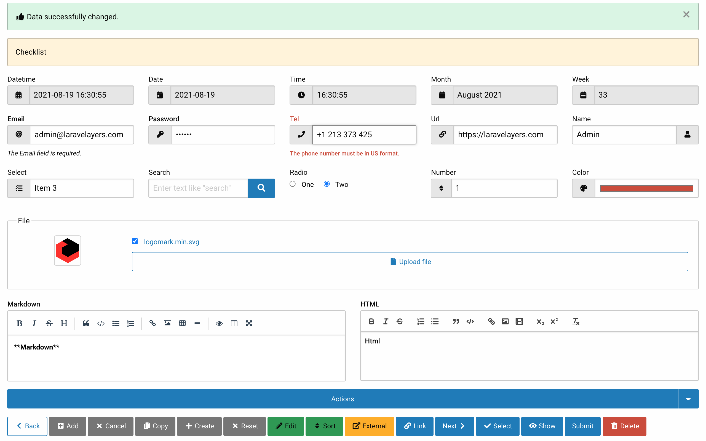
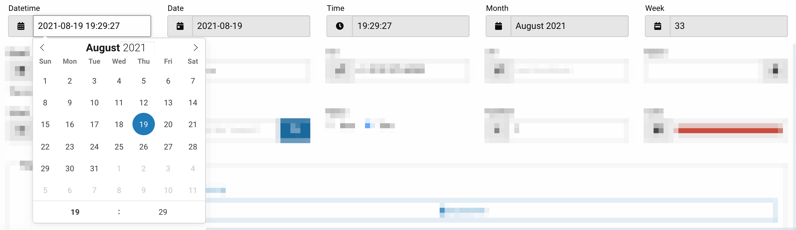
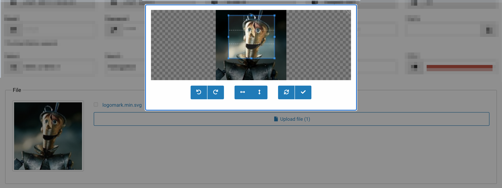
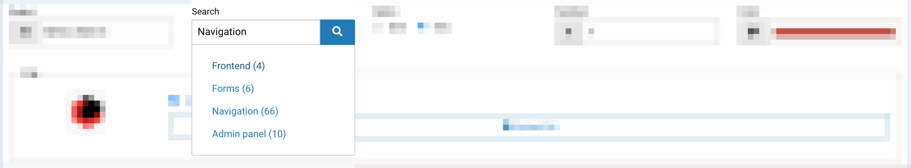
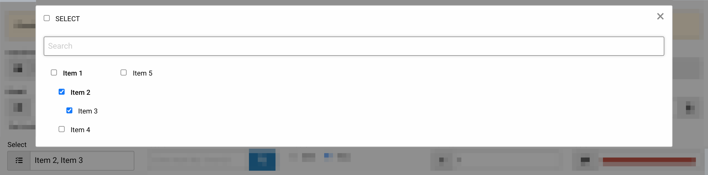

# Формы

- [Введение](#introduction)
- [Инициализация элементов формы](#initialization-of-form-elements)
	- [Типы](#types)
	- [Скрытые элементы](#hidden-elements)
	- [Ярлыки](#labels)
	- [Текст справки](#help-text)
	- [Текст ошибки](#error-text)
	- [Группировка элементов](#group)
	- [Правила проверки](#rules)
- [Получение элементов формы](#get-form-elements)
	- [Декоратор формы](#form-decorator) 
	- [Декоратор элемента формы](#form-element-decorator)
	- [Интерфейс элемента формы](#form-element-interface)
- [Получение ввода](#retrieving-input)
	- [Загрузка файлов](#uploading-files)
	- [Загрузка изображений](#uploading-images)
- [Валидация](#validation)
	- [Валидация Javascript](#javascript-validation)

<a name="introduction"></a>
## Введение

Для инициализации и [отображения](#render) элементов формы предназначен декоратор формы.



<a name="initialization-of-form-elements"></a>
## Инициализация элементов формы

Для инициализации элементов формы необходимо в [декораторе данных](decorators.md#data-decorator) внедрить трейт `Laravelayers\Form\Decorators\Form` в декоратор и определить метод `initElements`, требуемый трейтом, для инициализации элементов формы:

```php
<?php

namespace App\Decorators\Feedback;

use Laravelayers\Form\Decorators\Form;
use Laravelayers\Foundation\Decorators\DataDecorator;

class FeedbackDecorator extends DataDecorator
{
	use Form;

	/**
	 * Initialize form elements.
	 *
	 * @return array
	 */
	protected function initElements()
	{
		return [
			'form' => [
				'type' => 'form.js',
				'method' => 'POST',
				'action' => route('feedback.store')
			],
			'feedback_name' => [
				'type' => 'text',
				'value' => $this->feedback_name,
				'label' => 'Name',
				'required' => '',
				'rules' => 'required|max:255'
			],
			'feedback_message' => [
				'type' => 'textarea',
				'value' => $this->feedback_message,
				'label' => 'Message',
				'rows' => 3,
				'required' => '',
				'rules' => 'required|max:1000'
			],				
			'button' => [
				'type' => 'button',
				'value' => 'submit'
			]
		];
	}
}
```

> Обратите внимание, на то что метод `initElements` должен возвращать массив с элементами формы. Значение каждого элемента массива должно содержать массив ключей и значений, с помощью которых указывается тип HTML элемента формы, HTML атрибуты, правила валидации и другие параметры. Если атрибут `name` не указан для элемента формы, то по умолчанию используется ключ элемента массива формы. Если атрибут `id` не указан, то по умолчанию используется значение атрибута `name`.

Вы также можете использовать класс [`Laravelayers\Form\Decorators\FormElementDecorator`](#form-element-decorator) для создание элемента формы с помощью метода `make` и методы с префиксом `add` для добавления соответствующих параметров:

```php
protected function initElements()
{
	return [
		FormElementDecorator::make('form')
			->addType('form.js')
			->addValue([
				'method' => 'POST',
				'action' => route('feedback.store')
			]),
			
		FormElementDecorator::make('button')
			->addType('button')
			->addValue('submit'),
			
		FormElementDecorator::make('feedback_name')
			->addType('text')
			->addValue('')
			->addLabel('Name')
			->addRules('required|max:255')
			->addAttribute('required', ''),
			
		FormElementDecorator::make('button')
			->addType('button')
			->addValue('submit')
	];
}
```

Если вы не используйте трейт, то вы можете определить в декораторе свой метод для получения элементов формы, передав массив с элементами формы в метод [`make`](#make) декоратора формы:

```php
/**
 * Get the form elements.
 *
 * @param string $id
 * @return \Laravelayers\Form\Decorators\FormDecorator
 */
public function getElements()
{
	$elements = [
		'form' => [
			'type' => 'form',
			'method' => 'POST'
		],
		'feedback_name' => [
			'type' => 'text',
			'value' => $this->feedback_name
		]	
	];
	
	return app(FormDecorator::class, [$elements])->getElements($this);
	
	//return FormDecorator::make($elements)->getElements($this)
}
```

<a name="types"></a>
### Типы

Значение параметра `type` содержит тип элемента формы. В таблице ниже указаны типы и соответствующие подтипы по умолчанию, которые предоставляют дополнительные варианты отображения и использования элементов формы:

Type            								| Subtype             
----------------------------------------|--------------------------
[button](#type-button)						| button.dropdown, button.group, button.inline
[checkbox](#type-checkbox)					| checkbox.group, checkbox.readonly, checkbox.tree
[color](#type-color)						| color.group
[date](#type-date)							| date.group, date.js
[datetime](#type-datetime)					| datetime.group, datetime.js
[datetime-local](#type-datetime-local)	| datetime-local.group, datetime-local.js
[email](#type-email)           			| email.group, email.js
[file](#type-file)            			| file.group, file.js
[form](#type-form)            			| form.js
[hidden](#type-hidden)          			| -
[month](#type-month)         				| month.group, month.js
[number](#type-number)          			| number.group, number.js
[password](#type-password)        		| password.group
[radio](#type-radio)           			| radio.group, radio.readonly, radio.tree
[search](#type-search)          			| search.group. search.js
[select](#type-select)          			| select.js
[tel](#type-tel)              			| tel.group, tel.js
[text](#type-text)            			| text.group
[textarea](#type-textarea)        		| textarea.js
[time](#type-time)            			| time.group, time.js
[url](#type-url)             				| url.group, url.js
[week](#type-week)            			| week.group, week.js

<!--form:checklist-link-->

По умолчанию, каждому типу соответствует представление вида `form::layouts.{$type}.element`, где `{$type}` - это тип элемента формы, например: `form::layouts.button.element` или `form::layouts.button.dropdown.element`.

Для публикации представлений и переводов элементов формы, выполните команду:

```php
php artisan vendor:publish --tag=laravelayers-form
```
	
Также для добавления нового типа элемента формы, можно создать представление в директории `resources/views/layouts/form/`, например, для типа `button.test` необходимо создать представление  `resources/views/layouts/form/button/test/element.blade.php`.

После [получения элементов формы](#get-form-elements), для каждого элемента формы автоматически определяется представление, если оно не указано в качестве значения для параметра `view` элемента формы:

```php
'button' => [
	'type' => 'button',
	'view' => `layouts.form.button.test.element'
],
```	
	
<a name="type-button"></a>	
#### button

Тип элемента формы `button` предназначен для отображения HTML элементов `<button>`. 

Параметр `value` элемента формы `button` должен содержать массив или [коллекцию](#form-element-interface) HTML элементов `<button>`. Ключ каждого элемента массива используется по умолчанию в качестве параметра `type`. Значение элемента должно содержать массив ключей и значений, с помощью которых указываются HTML атрибуты и другие параметры:

```php
'button' => [
	'type' => 'button',
	'class' => 'callout',
	'value' => [
		'submit' => [
			'type' => 'submit',
			'class' => 'expanded'
		]
	]
],
	
/*
	<div id="button" class="callout">
		<button type="submit" name="button" value="" id="button_submit" class="button primary expanded">
    		<nobr><i class="icon icon-paper-plane"></i> Send</nobr>
		</button>
	</div>
*/
```

<!--form:button-->
	
> Обратите внимание, что атрибуты добавляемые для элемента формы `button` применяются к HTML элементу `<div>` внутри которого отображаются HTML элементы `<button>`, кроме атрибутов `name` и `id`. 

**Параметр `type` для HTML элемента `<button>`** используется для указания типа представления. В списке ниже указаны типы представлений по умолчанию, которые предоставляют дополнительные варианты отображения элементов `<button>`:

- `add`
- `back`
- `cancel`
- `copy`
- `create`
- `delete`
- `edit`
- `external`
- `link`
- `next`
- `reset`
- `select`
- `show`
- `sort`
- `submit`

<!--form:buttons-->

По умолчанию, каждому типу представления соответствует представление вида `form::layouts.button.action.{$type}`, где `{$type}` - это тип представления для HTML элемента `<button>`, например: `form::layouts.button.action.submit`.

Также для добавления нового типа представления HTML элемента `<button>`, можно создать представление в директории `resources/views/layouts/form/button/action`, например, для типа представления `test` необходимо создать представление `resources/views/layouts/form/button/action/test.blade.php`.

Чтобы для существующего типа изменить представление, необходимо добавить его в качестве значения для параметра `view` HTML элемента `<button>`:

```php
'button' => [
	'type' => 'button',
	'value' => [
		'submit' => [
			'view' => 'layouts.form.button.action.test'
		]
	]
],
```

По умолчанию, каждому типу представления соответствует перевод вида `form::form.button_{$type}`, где `{$type}` - это тип представления для HTML элемента `<button>`, например: `form::form.button_submit`.

Также для добавления перевода для нового типа представления HTML элемента `<button>`, можно создать файл перевода `form.php` в директории `resources/lang`, например, для типа представления `test` необходимо добавить строку перевода `resources/lang/en/form.button_test`.

**Параметр `text` для HTML элемента `<button>`** используется для указания текста внутри элемента:

```php
'button' => [
	'type' => 'button',
	'value' => [
		'submit' => [
			'text' => 'Text'
		]
	]
],
	
/*
	<div id="button" class="">
		<button type="submit" name="button" value="" id="button_submit" class="button primary">
    		<nobr>Text</nobr>
		</button>
	</div>
*/
```

<!--form:button_text-->

**Параметр `icon` для HTML элемента `<button>`** используется для указания класса [иконки](frontend.md#icons). Для отображения иконки справа от текста, следует добавить параметр `reverse`:

```php	
'button' => [
	'type' => 'button',
	'value' => [[
		'type' => 'submit',
		'icon' => 'icon-paper-plane',
		'reverse' => true,
		'class' => 'warning'
	]]
],
	
/*
	<div id="button" class="">
		<button type="submit" name="button" value="" id="button_back" class="button warning">
			<nobr>Submit <i class="icon icon-paper-plane"></i></nobr>
		</button>
	</div>
*/
```

<!--form:button_icon-->
	
**Параметр `link` для HTML элемента `<button>`** используется для преобразования кнопки в ссылку:

```php
'button' => [
	'type' => 'button',
	'value' => [[
		'type' => 'back',
		'link' => url()->previous()
	]]
],
	
/*
	<div id="button" class="">
		<a href="https://localhost" id="button_back" class="button primary hollow">
			<nobr><i class="icon icon-chevron-left"></i> Back</nobr>
		</a>
	</div>
*/
```

<!--form:button_link-->
	
**Параметр `hidden` для HTML элемента `<button>`** используется, чтобы скрыть элемент.

```php
'button' => [
	'type' => 'button',
	'value' => [
		'edit' => [
			'hidden' => false
		],
		'delete' => [
			'hidden' => true
		]		
	]
],

/*
	<div id="button" class="">
		<button type="submit" name="button" value="" id="button_edit" class="button success">
			<nobr><i class="icon icon-pencil-alt"></i> Edit</nobr>
		</button>
	</div>
*/
```	

<a name="type-button-dropdown"></a>		
**Подтип `button.dropdown`** используется для отображения выпадающего меню кнопок:

```php
'button' => [
	'type' => 'button.dropdown',
	'text' => 'Actions',
	'value' => [
		'edit' => [
			'value' => 'edit',
			'group' => 1
		],
		'back' => [
			'link' => url()->previous(),
			'group' => 2
		],			
		'delete' => [
			'value' => 'delete',
			'group' => 1
		],			
	]
],

/*
	<div class="dropdown-button">
	    <div class="button-group expanded" data-toggle="button">
	        <a class="dropdown button">Actions</a>
	    </div>
	    <div id="button" class="dropdown-pane" data-dropdown data-hover="true" data-hover-pane="true">
	        <div class="menu vertical">
				<li>
					<button type="submit" name="button" value="edit" id="button2_edit" class="button success ">
						<nobr><i class="icon icon-pencil-alt"></i> Edit</nobr>
					</button>
				</li>
				<li>
					<button type="submit" name="button" value="delete" id="button2_delete" class="button alert ">
						<nobr><i class="icon icon-trash-alt"></i> Delete</nobr>
					</button>
				</li>
				</div>
				<div class="menu vertical">
					<li>
						<a href="https://localhost" id="button_back" class="button primary hollow">
							<nobr><i class="icon icon-chevron-left"></i> Back</nobr>
						</a>
					</li>
				</div>				
		</div>
	</div>	
*/
```

<!--form:button_dropdown-->

> Обратите внимание, что параметр `group` для HTML элемента `<button>` используется, чтобы сгруппировать элементы и отобразить группы в представлении.

<a name="type-button-group"></a>	
**Подтип `button.group`** используется для отображения группы кнопок:

```php	
'button' => [
	'type' => 'button.group',
	'value' => [
		'edit' => 'Edit message',
		'delete' => 'Delete message',
	]
],
	
/*
	<div id="button" class="button-group expanded-for-medium stacked-for-small">
		<button type="submit" name="button" value="edit" id="button_edit" class="button success">
			<nobr><i class="icon icon-pencil-alt"></i> Edit message</nobr>
		</button>
		<button type="submit" name="button" value="delete" id="button_delete" class="button alert">
			<nobr><i class="icon icon-trash-alt"></i> Delete message</nobr>
		</button>
	</div>
*/
```

<!--form:button_group-->
	
> Обратите внимание, что если значение элемента массива HTML элементов `<button>` содержит строку, то она используется в качестве параметра `text`, а ключ элемента массива используется в качестве параметра `value`.		

<a name="type-button-inline"></a>	
**Подтип `button.inline`** используется для исключения HTML элемента `<div>` при отображении кнопок:

```php
'button' => [
	'type' => 'button.inline',
	'value' => 'submit'
],
	
/*
	<button type="submit" name="button" value="" id="button_submit" class="button primary ">
    	<nobr>Send</nobr>
	</button>
*/
```

> Обратите внимание, что если параметр `value` элемента формы `button` содержит строку, то она используется в качестве параметра `type`.

<a name="type-checkbox"></a>	
#### checkbox

Тип элемента формы `checkbox` предназначен для отображения HTML элемента `<input type="checkbox">`. 

Параметр `value` элемента формы `checkbox` должен содержать массив или [коллекцию](#form-element-interface) HTML элементов `<input type="checkbox">`. Ключ каждого элемента массива используется по умолчанию в качестве атрибута `value`. Значение элемента содержит массив ключей и значений, с помощью которых указываются HTML атрибуты и другие параметры:

```php
'checkbox' => [
	'type' => 'checkbox',
	'class' => 'callout',
	'value' => [
		1 => [
			'value' => 1,
			'text' => 'One'
		],
		2 => [
			'value' => 2,
			'text' => 'Two',
			'checked' => true, //'selected' => true
			'class' => 'stat'
		]
	]
],
    
/*        
	<div class="callout">
	    <div>
			<nobr>
				<input type="checkbox" name="checkbox[1]" value="1" id="checkbox_1">
				<label for="checkbox_1" class="">One</label>
			</nobr>
		</div>
		<div>
			<nobr>
				<input type="checkbox" name="checkbox[2]" value="1" id="checkbox_2" checked>
				<label for="checkbox_2" class="stat">Two</label>
			</nobr>
	    </div>  
	</div>	
*/
```

<!--form:checkbox-->

> Обратите внимание, что атрибуты добавляемые для элемента формы `button` применяются к HTML элементу `<div>` внутри которого отображаются HTML элементы `<input type="checkbox">`, кроме атрибутов `name` и `id`.   

**Параметр `text` для HTML элемента `<input type="checkbox"`** используется для указания текста внутри элемента `<label>`:

```php
'checkbox' => [
	'type' => 'checkbox',
	'value' => [
		1 => [
			'text' => 'One'
		],
		2 => 'Two'
	]
],
    
/*        
	<div class="">
	    <div>
			<nobr>
				<input type="checkbox" name="checkbox[1]" value="1" id="checkbox_1">
				<label for="checkbox_1" class="">One</label>
			</nobr>
		</div>
		<div>
			<nobr>
				<input type="checkbox" name="checkbox[2]" value="1" id="checkbox_2" checked>
				<label for="checkbox_2" class="">Two</label>
			</nobr>
	    </div>  
	</div>	
*/
```

> Обратите внимание, что если значение элемента массива HTML элементов `<input type="checkbox">` содержит строку, то она используется в качестве параметра `text`, а ключ элемента массива используется в качестве параметра `value`.

**Параметр `hidden` для HTML элемента `<input type="checkbox"`** используется, чтобы скрыть элемент:

```php
'checkbox' => [
	'type' => 'checkbox',
	'value' => [
		1 => [
			'text' => 'One',
			'hidden' => true
		],
		2 => 'Two'		
	]
],
	
/*        
	<div class="">
	    <div>
			<nobr>
				<input type="checkbox" name="checkbox[2]" value="2" id="checkbox_2">
				<label for="checkbox_2" class="">Two</label>
			</nobr>
		</div> 
	</div>	
*/
```

**Подтип `checkbox.group`** используется для отображения группы HTML элементов `<input type="checkbox">`:

```php
'checkbox' => [
	'type' => 'checkbox.group',
	'value' => [
		1 => 'One',
		2 => 'Two'
	]
],
    
/*        
	<div class="">
	    <div>
			<nobr>
				<input type="checkbox" name="checkbox[1]" value="1" id="checkbox_1">
				<label for="checkbox_1" class="">One</label>
			</nobr>
			<nobr>
				<input type="checkbox" name="checkbox[2]" value="1" id="checkbox_2" checked>
				<label for="checkbox_2" class="">Two</label>
			</nobr>
	    </div>  
	</div>	
*/
```

<!--form:checkbox_group-->

**Подтип `checkbox.readonly`** используется для отображения HTML элемента `<input type="checkbox">` доступного только для чтения:

```php
'checkbox' => [
	'type' => 'checkbox.readonly',
	'value' => 1
],

/*
	<div class="">
	    <nobr>
	        <input type="checkbox" disabled="">
	        <input type="hidden" name="checkbox" value="1" id="checkbox_1" class="">
	    </nobr>
	</div>
*/
```

<!--form:checkbox_readonly-->
	
> Обратите внимание, что если параметр `value` элемента формы `button` содержит строку, то она используется в качестве атрибута `value` для HTML элемента `<input type="checkbox">`.

<a name="type-checkbox-tree"></a>
**Подтип `checkbox.tree`** используется для отображения дерева HTML элементов `<input type="checkbox">`, для этого параметр `value` должен содержать [объект декоратора меню с деревом элементов](navigation.md#getting-tree), в котором каждый элемент должен реализовывать [интерфейс элемента формы](#form-element-interface):

```php
'checkbox' => [
	'type' => 'checkbox.tree',
	'value' => MenuDecorator::make([
		0 => [
			'id' => 1,
			'name' => 'Category 1',
			'url' => '#category1',
			'sorting' => 1,
			'parent_id' => 0,
		],
		1 => [
			'id' => 2,
			'name' => 'Category 2',
			'url' => '#category2',
			'sorting' => 2,
			'parent_id' => 1,
		],
	])->getMenu()->getTree()
],
	
/*
	<ul class="menu ">        
		<li class="is-subtree-parent">
	    	<a>
	    		<nobr>
	    			<input type="checkbox" name="checkbox[1]" value="1" id="checkbox_1">
					<label for="checkbox_1" class="is-status-opened">Category 1</label>
				</nobr>
			</a>
	    	<ul class="menu nested vertical is-subtree">
				<li class="">
				<a>
	        		<nobr>
	    				<input type="checkbox" name="checkbox[2]" value="2" id="checkbox_2">
						<label for="checkbox_2" class="is-status-opened">Category 2</label>
	    			</nobr>
	    		</a>
				</li>
			</ul>
		</li>
	</ul>
*/
```

<!--form:checkbox_tree-->

<a name="type-color"></a>	
#### color

Тип элемента формы `color` предназначен для отображения HTML элемента `<input type="color">`.

Используется также как элемент формы [`text`](#type-text):

```php
'color' => [
	'type' => 'color.group'
],
	
/*
	<div class="input-group">
		<span class="input-group-label"><i class="icon icon-palette"></i></span>
	   <input type="text" name="color" value="" id="color" class="input-group-field">
	</div>
*/
```

<!--form:color-->

<a name="type-date"></a>	
#### date

Тип элемента формы `date` предназначен для отображения HTML элемента `<input type="date">`.

Используется также как элемент формы [`datetime`](#type-datetime):

```php
'date' => [
    'type' => 'date.js'
],

/*
	<div class="input-group">
		<span class="input-group-label"><i class="icon icon-calendar-day"></i></span>
		<input type="text" name="date" value="" id="date" class="input-group-field form-datetime flatpickr-input" data-form-datetime data-date-format="Y-m-d H:i:s" data-alt-format="Y-m-d" data-enable-time="false" readonly="readonly">
	</div>
*/
```

<!--form:date_js-->

<a name="type-datetime"></a>	
#### datetime

Тип элемента формы `datetime` предназначен для отображения HTML элемента `<input type="datetime">`.

Используется также как элемент формы [`text`](#type-text):

```php
'datetime' => [
	'type' => 'datetime.group'
],
	
/*
	<div class="input-group">
		<span class="input-group-label"><i class="icon icon-calendar-alt"></i></span>
	   <input type="datetime" name="datetime" value="" id="datetime" class="input-group-field">
	</div>
*/
```

**Подтип `datetime.js`** используется для добавления в HTML элемент `<input type="text">` JavaScript календаря выбора даты и времени:

```php
'datetime' => [
    'type' => 'datetime.js',
    'value' => Carbon::now(),
    'data-date-format' => 'Y-m-d H:i:s',
    'data-alt-format' => "d.m.Y H:i:S"
],

/*
	<div class="input-group">
		<span class="input-group-label"><i class="icon icon-calendar-alt"></i></span>
		<input type="text" name="datetime" value="2019-08-19 12:22:21" id="datetime" class="input-group-field form-datetime flatpickr-input" data-form-datetime data-date-format="Y-m-d H:i:s" data-alt-format="d.m.Y H:i:S" readonly="readonly">
	</div>
*/
```



<!--form:datetime_js-->
	
С помощью атрибута `data-form-datetime` к HTML элементу `<input type="text">` подключается плагин `resources/js/vendor/foundation/formDatetime.js`, в который встроен JavaScript инструмент выбора даты и времени [github.com/flatpickr/flatpickr](https://github.com/flatpickr/flatpickr). В таблице ниже указаны доступные названия и описания атрибутов для конфигурации плагина:

Название              | Описание
----------------------|-----------------------
`data-lang`           | Используется для изменения локализации плагина. Принимает в качестве значения 2-х буквенный код языка. По умолчанию используется значение языка HTML элемента `<html lang="en">` или Javascript переменной `window.Laravel.lang`.
`data-date-format`.   | Используется для указания оригинального формата даты, например: `Y-m-d H:i:s`. По умолчанию используется значение конфигурационной переменной [`config('date.datetime.format')`](date.md#configuration).
`data-alt-format`.   | Используется для указания отображаемого формата даты, например: `d.m.Y H:i:S`. По умолчанию используется значение `data-date-format`.
`data-default-date`.  | Дата и время по умолчанию. Например: `2020-12-20`.
`data-enable-time`    | Разрешить выбор времени. По умолчанию - `true`.
`data-enable-seconds` | Разрешить выбор секунд. По умолчанию - `false`.
`data-week-numbers`.  | Разрешить отображение номеров неделей. По умолчанию - `false`.
`data-min-date`       | Минимальная дата доступная для выбора. Например: `2020-01-01`.
`data-max-date`.      | Максимальная дата доступная для выбора. Например: `2020-12-31`.
`data-min-time`.      | Минимальное время доступное для выбора. Например: `09:00:00`.
`data-max-time`.      | Максимальное время доступное для выбора. Например: `22:00:00`.
`data-multiple-dates`.      | Выбор нескольких дат. По умолчанию - `false`.
`data-dates-separator`.     | Разделитель для несколькизх дат. По умолчанию - `, `.
`data-date-range`.         | Разрешить выбор интервала дат. По умолчанию - `false`.
`data-disable-dates`. | Запрещенные даты. Например: `2020-01-01,2020-01-10`.
`data-enable-dates`.  | Разрешенные даты. Например: `2020-01-01,2020-01-10`.
`data-picker-options`        | Опции для инструмента выбора даты в формате JSON. Например: `htmlspecialchars('{"disable":[{"from":"2020-01-01", "to":"2020-01-10"}]}')`.

<a name="type-datetime-local"></a>	
#### datetime-local

Тип элемента формы `date` предназначен для отображения HTML элемента `<input type="date">`.

Используется также как элемент формы [`datetime`](#type-datetime).

<a name="type-email"></a>	
#### email

Тип элемента формы `email` предназначен для отображения HTML элемента `<input type="email">`.

Используется также как элемент формы [`text`](#type-text).
	
**Подтип `email.js`** используется для добавления в HTML элемент `<input type="email">` проверки e-mail c помощью [валидатора JavaScript](#javascript-validation):

```php
'email' => [
	'type' => 'email.js'
],

/*
	<div class="input-group">
		<span class="input-group-label"><i class="icon icon-at"></i></span>
		<input type="email" name="email" value="" id="email" class="input-group-field" data-validator="validator" data-validator-name="email">
	</div>
*/
```

<!--form:email_js-->

<a name="type-file"></a>	
#### file

Тип элемента формы `file` предназначен для отображения HTML элемента `<input type="file">`:

```php
'form' => [
	'type' => 'form.js',
	'method' => 'POST',
	'action' => route('feedback.store'),
	//'enctype' => 'multipart/form-data'
],
'feedback_files' => [
	'type' => 'file',
	'multiple' => true,
	'class' => 'expanded',
	'accept' => [
	    'image/jpeg',
	    'image/png'
	],
	'rules' => 'mimes:jpg,png'		
],	
    
/*
	<span>
		<label id="label_file_feedback_files" for="feedback_files" class="button expanded">Upload files</label>
		<input type="file" name="feedback_files[]" id="feedback_files" class="show-for-sr" multiple accept="image/jpeg,image/png">
	</span>
*/
```

Сохранить загруженные файлы на диске файловой системы вы можете с помощью [трейта для загрузки файлов](#uploading-files). 

**Подтип `file.group`** используется для отображения [иконки](frontend.md#icons), которая изменяется с помощью параметра `icon`. Для отображения иконки справа, следует добавить параметр `reverse`:

```php	
'feedback_files' => [
	'type' => 'file',
	//'icon' => 'icon-file-alt',
	//'reverse' => true
],
	
/*
	<span>
		<label id="label_file_feedback_files" for="feedback_files" class="button hollow expanded ">
			<i class="icon icon-file-alt"></i> Upload file
		</label>
		<input type="file" name="feedback_files" id="feedback_files" class="show-for-sr">
	</span>	
*/
```
	
<a name="type-file-js"></a>	
**Подтип `file.js`** используется для добавления в HTML элемент `<input type="file">` Javascript плагина для предварительного просмотра и редактирования изображения перед загрузкой, а также для отображения иконки, соответствующей типу выбранного файла, и отображения количества выбранных файлов:

```php
'feedback_files' => [
	'type' => 'file.js',
	'text' => 'Upload file',
	'data-image-mode' => 3,
	'accept' => [
		'image/jpeg',
		'image/png'
	],
	'rules' => 'mimes:jpg,png'     
],

/*
	<div class="grid-x grid-padding-x" id="file_wrapper_feedback_files">
		<div class="cell medium-3 large-2 hide" id="image_preview_feedback_files">
	    	<div data-open="file_container_feedback_files" class="text-center">
	        	
	    	</div>
		</div>
		<div class="cell shrink hide" id="file_preview_feedback_files">
	    	<i class="icon icon-file icon-5x secondary"></i>
	    </div>
	    <div class="cell auto">         
	        <label id="label_file_feedback_files" for="feedback_files" class="button hollow expanded">
	        	<i class="icon icon-file"></i> Upload file
	    	</label>
	    	<input type="file" name="feedback_files[" id="feedback_files" class="show-for-sr" data-form-file data-image-mode="3" accept="image/jpeg,image/png">
	    </div> 
	</div>
	
	<div class="reveal " id="file_container_feedback_files" data-reveal data-multiple-opened="true">
		...
	</div>
*/
```



<!--form:file_js-->
		
С помощью атрибута `data-form-file` к HTML элементу `<input type="file">` подключается плагин `resources/js/vendor/foundation/formFile.js`, в который встроен Javascript инструмент для редактирования изображения перед загрузкой [github.com/fengyuanchen/cropperjs](https://github.com/fengyuanchen/cropperjs). В таблице ниже указаны доступные названия и описания атрибутов для конфигурации плагина:	

Название                  | Описание
--------------------------|-----------------------
`data-image-mode`         | Режим предварительного просмотра и редактирования изображений перед загрузкой. По умолчанию - `0`. Значение `1` - только предварительный просмотр изображения; `2` - активировать инструмент для обрезки изображения; `3` - активировать инструмент для редактирования изображения. Данные обрезаемого или редактируемого изображения передаются в скрытом элементе формы имя которого состоит из префикса `cropped_` и имени элемента формы `file.js`, например: `cropped_feedback_image`.
`data-image-aspect-ratio` | Настройка параметра [`aspectRatio`](https://github.com/fengyuanchen/cropperjs#aspectratio) при вызове плагина `cropperjs` для распределения фиксированного соотношения сторон рамки кадрирования.
`data-file-extensions`.   | Параметр используется для указания названий иконок и соответствующих им расширений файлов. Значение по умолчанию - {"image": ["jpg", "jpeg", "png", "gif", "svg"], "word": ["doc", "docx"], "excel": ["xls", "xlsx"], "powerpoint": ["ppt", "pptx"], "pdf": ["pdf"], "archive": ["zip","rar"]}. Имена иконок указываются без префикса, префикс указывается с помощью атрибута `data-file-icon-prefix`, имеющего значение по умолчанию - `icon-file-`.
`data-ajax-url`           | В значение атрибута указывается ссылка для отправки данных методом PUT с помощью Ajax. Используется для отображения, загрузки и удаления изображений, указанных в параметре `value` элемента формы `file.js` в виде массива URL изображений. Изображения для удаления выбираются с помощью HTML элемента `<input type="checkbox">` имя которого состоит из префикса `delete_` и имени элемента формы `file.js`, например: `delete_feedback_files[]`. Используется при получении галереи изображений с помощью Ajax для элемента формы [`textarea.js`](#type-textarea-js).
`data-ajax-url-to-get`    | В значение атрибута указывается ссылка для обновления с помощью Ajax HTML-кода элемента формы `file.js` после загрузки или удаления изображений. По умолчанию в качестве значения ссылки используется текущий URL.
`debugAjax`               | Используется для отображения в консоле ошибок при сохранении или удалении файлов. По умолчанию - `false`.  

Сохранить загруженные изображения на диске файловой системы вы можете с помощью [трейта для загрузки изображений](#uploading-images).

<a name="type-form"></a>	
#### form

Тип элемента формы `form` предназначен для отображения HTML элемента `<form>`:

```php
'form' => [
    'type' => 'form',
    'method' => 'POST',
    'methodField' => 'POST',
    'action' => route('feedback.store'),
    'hidden' => session()->has('success'),
],
    
/*    	
	<form method="POST" action="https://localhost/feedback" name="form" id="form" class="expanded">
	    <input type="hidden" name="_token" value="kwEvUSIe2I35rm96qg9LpjTKc8MCoTshzMH18Oto">
	    <input type="hidden" name="_method" value="POST">
	    ...
	</form>    	
*/
```
    
> Обратите внимание, что скрытое поле формы `_token` добавляется автоматически. После отправки формы будет отображено сообщение об ошибке или успешной отправке. C помощью параметра `hidden` форма не отображается после успешной отправки.

<a name="type-form-js"></a>	    
**Подтип `form.js`** используется для добавления в HTML элемент `<form>` плагина [Foundation.Abide](https://get.foundation/sites/docs/abide.html) с помощью атрибута `data-abide` для расширенной валидации формы, а также для добавления в родительский HTML элемент `<span>` плагина `resources/js/vendor/foundation/formBeforeunload.js` для вывода на экран сообщения о не сохраненных изменениях в форме при уходе со страницы.

```php
'form' => [
    'type' => 'form.js',
    'method' => 'POST',
    'action' => route('feedback.store'),
    //'data-confirm' => ''
],
        
/*
	<span data-form-beforeunload class="form-beforeunload">
    	<form method="POST" action="https://localhost/feedback" name="form" id="form" class="abide expanded" data-abide novalidate data-unsaved="false">
		    <input type="hidden" name="_token" value="kwEvUSIe2I35rm96qg9LpjTKc8MCoTshzMH18Oto">
		    <input type="hidden" name="_method" value="POST">
		    <div class="callout success" id="5f583dfd5cc7f" style="display: none;" data-closable>
				<button class="close-button" aria-label="Dismiss alert" type="button" data-close>
					<span aria-hidden="true">×</span>
				</button>
		        <p><i class="icon icon-thumbs-up icon-fw"></i> Data successfully changed.</p>
		    </div>
		    <div class="callout alert" style="display: none;">    
		    	<p><i class="icon icon-exclamation-triangle"></i> There are errors in the form.</p>
		    </div>	    	
				...
		</form>
	</span>
*/
```

<!--form:form_js-->
	
> Обратите внимание, что скрытые блоки уведомления об успешном сохранении формы и предупреждения об ошибках в форме добавляются автоматически.

Когда в форму вносится изменение, плагин `formBeforeunload.js` добавляет для HTML элемента `<form>` атрибут `data-unsaved="true"`. Для отключения плагина необходимо добавить атрибут `data-confirm=""` с пустым значением.

При закрытии модального окна с классом `.reveal`, не сохраненная форма будет автоматически отправлена, для отключения этой функции необходимо добавить атрибут `data-form-container=""` с пустым значением.

<a name="type-hidden"></a>	
#### hidden

Тип элемента формы `hidden` предназначен для отображения HTML элемента `<input type="hidden">`.

Используется также как элемент формы [`text`](#type-text):

```php
'hidden' => [
	//'type' => 'hidden',
	'value' => 1
],
	
/*
	<span>
		<input type="hidden" name="hidden" value="1" id="hidden" class="">
	</span>	
*/
```

<a name="type-month"></a>	
#### month

Тип элемента формы `month` предназначен для отображения HTML элемента `<input type="month">`.

Используется также как элемент формы [`datetime`](#type-datetime):

```php
'month' => [
    'type' => 'month.js'
],

/*
	<div class="input-group">
		<span class="input-group-label"><i class="icon icon-calendar"></i></span>
		<input type="text" name="month" value="" id="month" class="input-group-field form-datetime flatpickr-input" data-form-datetime data-date-format="Y-m-d H:i:s" data-alt-format="F Y" data-enable-time="false" readonly="readonly">
	</div>	
*/
```

<!--form:month_js-->

<a name="type-number"></a>	
#### number

Тип элемента формы `number` предназначен для отображения HTML элемента `<input type="number">`.

Используется также как элемент формы [`text`](#type-text).
	
**Подтип `number.js`** используется для добавления в HTML элемент `<input type="number">` проверки чисел c помощью [валидатора JavaScript](#javascript-validation):

```php
'number' => [
	'type' => 'number.js',
	'data-validator-options' => htmlspecialchars('{"min": 0, "max": 99}')
],

/*
	<div class="input-group">
		<span class="input-group-label"><i class="icon icon-sort"></i></span>
		<input type="number" name="number" value="" id="number" class="input-group-field" data-validator="number" data-validator-options="{&quot;min&quot;: 0, &quot;max&quot;: 99}">
	</div>
*/
```

<!--form:number_js-->

<a name="type-password"></a>	
#### password

Тип элемента формы `password` предназначен для отображения HTML элемента `<input type="password">`.

Используется также как элемент формы [`text`](#type-text):

```php
'password' => [
	'type' => 'password',
	'required' => ''
],

/*
	<div class="input-group">
		<span class="input-group-label"><i class="icon icon-key"></i></span>
	   <input type="password" name="password" value="" id="password" class="input-group-field">
	</div>
*/
```

<!--form:password-->

<a name="type-radio"></a>	
#### radio

Тип элемента формы `radio` предназначен для отображения HTML элемента `<input type="radio">`.

Используется также как элемент формы [`checkbox`](#type-checkbox):

```php
'radio' => [
	'type' => 'radio',
	'value' => [
		1 => 'One',
		2 => [
			'value' => 2,
			'text' => 'Two',
			'checked' => true,
		]
	]
],
    
/*        
	<div class="">
		<nobr>
			<input type="radio" name="radio" value="1" id="radio_1">
			<label for="radio_1" class="">One</label>
		</nobr>
		<nobr>
			<input type="radio" name="radio" value="2" id="radio_2" checked>
			<label for="radio_2" class="">Two</label>
		</nobr>
	</div>	
*/
```

<!--form:radio_group-->
	
> Обратите внимание, что при добавлении атрибута `multiple`, будут отображаться HTML элементы `<input type="checkbox">`.

<a name="type-search"></a>	
#### search

Тип элемента формы `search` предназначен для отображения HTML элемента `<input type="search">`.

Используется также как элемент формы [`text`](#type-text):

```php
'search' => [
	'type' => 'search.group',
	//'text' => 'icon-search',
],
	
/*
	<div class="input-group">
		<input type="search" name="search" value="" id="search" class="input-group-field">
		<div class="input-group-button">
			<button type="submit" class="button"><i class="icon icon-search"></i></button>
		</div>
	</div>
*/
```

> Обратите внимание, что с помощью параметра `text` вы можете изменить текст кнопки или класс [иконки](frontend.md#icons), если значение начинается с префикса `icon-`. Чтобы скрыть кнопку, необходимо добавить значение `false` для параметра `text`.

<a name="type-search-js"></a>	
**Подтип `search.js`** используется для добавления в HTML элемент `<input type="search">` JavaScript плагина для выбора элементов.

```php
'text' => [
    'type' => 'search.js',
    //'name' => 'text',
    'text' => 'icon-search',
    'data-ajax-url' => route('search')
],

/*
	<div class="form-search-wrapper">
	    <div class="input-group ">
			<input type="search"name="text" value="" id="text" class="input-group-field form-search" data-form-search data-toggle="search_pane_text" autocomplete="off" >
	            <div class="input-group-button">
	                <button type="submit" class="button ">
	                    <i class="icon icon-search" ></i>
	                </button>
	            </div>
		</div>
		<div class="dropdown-pane" id="search_pane_text" data-dropdown data-auto-focus="true" data-close-on-click="true"></div>
	</div>
*/
```


<!--form:search_js-->
	
С помощью атрибута `data-form-search` к HTML элементу `<input type="search">` подключается плагин `resources/js/vendor/foundation/formSearch.js`, с помощью которого при вводе текста осуществляется запрос с помощью Ajax, для получения результата в формате HTML, который отображается в выпадающей панели снизу, если результат не пустая строка. По умолчанию, в качестве Url для запроса Ajax, используется значение атрибута `action ` из родительского элемента `<form>`, иначе используется текущий Url, если не указано значение для атрибута `data-ajax-url`.

<a name="type-select"></a>	
#### select

Тип элемента формы `select` предназначен для отображения HTML элемента `<select>`.

Параметр `value` элемента формы `select` должен содержать массив или [коллекцию](#form-element-interface) вложенных HTML элементов `<option>`. Ключ каждого элемента массива используется по умолчанию в качестве параметра `name`. Значение элемента должно содержать массив ключей и значений, с помощью которых указываются HTML атрибуты и другие параметры:

```php
'select' => [
	'type' => 'select',
	'multiple' => true,
	'required' => '',
	'value' => [
		1 => [
			'value' => 1,
			'text' => 'One'
		],
		2 => [
			'value' => 2,
			'text' => 'Two',
			'selected' => true
		]
	],
],

/*
	<span>
		<select name="select[]" id="select" class="" required multiple">
			<option value="1" id="select_1">One</option>
			<option value="2" id="select_2" selected>Two</option>
		</select>
	</span>
*/
```
	
> Также параметр `value` может содержать [объект декоратора меню с деревом элементов](navigation.md#getting-tree), в котором каждый элемент должен реализовывать [интерфейс элемента формы](#form-element-interface).

<a name="type-select-js"></a>	
**Подтип `select.js`** используется для добавления в HTML элемент `<input type="text">` JavaScript плагина для выбора элементов.

```php
'category_id' => [
	'type' => 'select.js',
	'value' => MenuDecorator::make([
		0 => [
			'id' => 1,
			'name' => 'Item 1',
			'url' => '/menu/1',
			'sorting' => 1,
			'parent_id' => 0,
		],
		1 => [
			'id' => 2,
			'name' => 'Item 2',
			'url' => '/menu/2',
			'sorting' => 2,
			'parent_id' => 1,
		],
		2 => [
			'id' => 3,
			'name' => 'Item 3',
			'url' => '/menu/3',
			'sorting' => 3,
			'parent_id' => 2,
		],
	])->getMenu()->setSelectedItems(3)->getTree(),
	'label' => 'Items',
	'multiple' => true,
	//'data-multiple' => true,
	'required' => '',
	//'data-ajax-url' => route('category.index')
],

/*
	<div class="input-group">
		<span class="input-group-label"><i class="icon icon-tasks"></i></span>
		<input type="text" value="Two" id="category_id" class="input-group-field form-select" data-form-select data-open="container_category_id" data-multiple="true" required> 
		<span id="from_container_category_id">
			<input type="hidden" name="category_id[2]" value="2" id="category_id_2" data-abide-ignore="">
		</span>			
	</div>
	
	<div class="reveal large" id="container_category_id" data-reveal data-multiple-opened="true" data-deep-link="true" data-update-history="true" aria-labelledby="header_container_select">
		...
	</div>
*/
```



<!--form:select_js-->

> Обратите внимание, что HTML элемент `<input type="text">` не содержит атрибута `name`, а в атрибуте `value` отображается только текст выбранных элементов из списка в модальном окне, которое открывается при клике на HTML элемент. После выбора элемента из списка, его название и значение добавляется в форму с помощью HTML элемента `<input type="hidden">`. 
	
С помощью атрибута `data-form-select` к HTML элементу `<input type="text">` подключается плагин `resources/js/vendor/foundation/formSelect.js`, с помощью которого элементы можно выбирать из списка или дерева в модальном окне с возможностью поиска. В таблице ниже указаны доступные названия и описания атрибутов для конфигурации плагина:

Название                | Описание
--------------------------|-----------------------
`data-select-parent`      | Разрешить выбор родительских элементов дерева. По умолчанию - `true`.
`data-multiple`           | Разрешить выбор множества элементов. Значение используется для добавлении параметра `multiple` к ссылке, указанной в атрибуте `data-ajax-url`. По умолчанию - `false`.
`data-disabled-ids`.      | Используется для указания ИД элементов, разделенных запятыми, которые должны быть отключены для выбора.
`data-select-by-id`       | Разрешить использовать в значении атрибута `value` HTML элемента `<input type="text">` ИД элементов для их выбора из списка в модальном окне. По умолчанию - `true`.
`data-list-separator`     | Разделитель для ИД элементов в значении атрибута `value` HTML элемента `<input type="text">`. По умолчанию `, `.
`data-container-header`   | Текст заголовка для модального окна. По умолчанию используется текст родительского HTML элемента `<label>`.
`data-link-to-create`     | Используется для отображения ссылки на страницу добавления нового элемента в модальном окне, если в результате поиска не было найдено совпадений.
`data-link-text-to-create`| Используется для изменения текста ссылки на страницу добавления нового элемента в модальном окне. 
`data-ajax-url`           | Используется для загрузки элементов в модальном окне с помощью Ajax по указанной ссылке, к которой по умолчанию добавляются параметры получаемые из HTML элемента `<input type="text">`: `name`, `prefixName`, `prefix`, `multiple`. По ссылке должен возвращаться HTML-код элемента формы [`radio.tree`](#type-radio) или [`checkbox.tree`](#type-checkbox-tree) в зависимости от параметра `multiple`.
`data-allow-input-name`   | Разрешить использовать атрибут `name` для HTML элемента `<input type="text">` при загрузке элементов с помощью Ajax. По умолчанию - `false`.

Ниже приведен пример кода, в котором возвращается HTML-код элемента формы `checkbox.tree` при загрузке элементов с помощью Ajax по ссылке `route('category.index')`:

```php	
// App\Http\Controllers\Category\CategoryController

/**
 * Display a listing of repository items.
 *
 * @param Request $request
 * @return \Illuminate\Support\HtmlString|\Illuminate\View\View
 * @throws \Throwable
 */
 public function index(Request $request)
 {
	if (request()->ajax()) {
	    return $this->service->select($request);
	}
            
	$items = $this->service->getCategories($request);

	return view("admin::layouts.action.index", compact('items'));
}

// App\Services\Category\CategoryService
	
/**
 * Display a listing of the repository items for selection.
 *
 * @param Request $request
 * @return \Illuminate\Support\HtmlString
 * @throws \Throwable
 */
public function select(Request $request)
{
	return FormDecorator::make([
		'categories' => [
			'type' => 'radio.tree',
			'name' => $request->get('name'),
			'value' => $this->getCategories()->getTree(),
			'multiple' => (bool) $request->get('multiple'),
			'data-link-to-add' => route('admin.category.create'),
			'data-link-text-to-add' => 'Add a new category.'
		]
	])->setElementsPrefix($request->get('prefix'), $request->get('prefix_name'))
		->getElements()
		->first()
		->render();    
}	
	
/*
	<ul class="menu" data-link-to-create="https://localhost/category/create" data-link-text-to-create="Add a new category.">
		...
	</ul>
*/
```
	
> Обратите внимание, что в возвращаемом HTML коде для HTML элемента `<ul class="menu">` допустимо использовать атрибуты `data-link-to-create` и `data-link-text-to-create`.

<a name="type-tel"></a>	
#### tel

Тип элемента формы `tel` предназначен для отображения HTML элемента `<input type="tel">`.

Используется также как элемент формы [`text`](#type-text).

**Подтип `tel.js`** используется для добавления в HTML элемент `<input type="tel">` JavaScript валидатора телефонного номера:

```php
'feedback_phone' => [
    'type' => 'tel.js',
    'value' => $this->feedback_phone,
    'required' => true,
    'data-validator-options' => "'isNotTollFreePhone': false, 'country': 'US'",
    'rules' => 'phone:US'
],

/*
	<div class="input-group">
		<span class="input-group-label"><i class="icon icon-phone"></i></span>
		<input type="tel" name="feedback_phone" value="" id="feedback_phone" class="input-group-field" data-validator="phone" required data-validator-options="'isMobilePhone': true">  
	</div>
*/
```

<!--form:phone_js-->
	
> Обратите внимание, что по умолчанию опция `isNotTollFreePhone` равна `true` и опция `country` равна `window.Laravel.country`. Для использования правила валидации `phone` в процессе [установки Laravelayers](installation.md) будет установлен пакет [Laravel Phone](https://github.com/Propaganistas/Laravel-Phone) с помощью Composer.

С помощью атрибута `data-validator="phone"` к элементу формы подключается JavaScript валидатор телефонных номеров [github.com/catamphetamine/libphonenumber-js](https://github.com/catamphetamine/libphonenumber-js), который встроен в скрипт `resources/js/vendor/foundation/foundation.abide.js`. В атрибуте `data-validator-options` указываются опции валидатора.

<a name="type-text"></a>	
#### text

Тип элемента формы `text` предназначен для отображения HTML элемента `<input type="text">`:

```php
'feedback_name' => [
	'type' => 'text',
	'value' => $this->feedback_name,
	'required' => ''
],

/*
	<span>
		<input type="text" name="feedback_name" value="" id="feedback_name" class="" required>
	<span>		
*/
```

**Подтип `text.group`** используется для отображения [иконки](frontend.md#icons), которая указывается с помощью параметра `icon` и кнопки, для которой указывается текст или класс иконки с помощью параметра `text`, например, для формы [`поиска`](#type-search). Для отображения иконки справа, следует добавить параметр `reverse`:

```php
'feedback_name' => [
	'type' => 'text.group',
	'value' => $this->feedback_name,
	'icon' => 'icon-user',
	'reverse' => true
],
	
/*
	<div class="input-group">
	    <input type="text" name="feedback_name" value="" id="feedback_name" class="input-group-field">
		<span class="input-group-label"><i class="icon icon-user"></i></span>
	</div>
*/
```

<!--form:text_group-->

<a name="type-textarea"></a>	
#### textarea

Тип элемента формы `textarea` предназначен для отображения HTML элемента `<textarea>`:

```php
'feedback_message' => [
	'type' => 'textarea',
	'value' => $this->feedback_message,
	'row' => 3
],

/*
	<span>
		<textarea name="feedback_message" id="feedback_message" class="" rows="3"></textarea>
	</span>
*/
```

<a name="type-textarea-js"></a>	
**Подтип `textarea.js`** используется для добавления в HTML элемент `<textarea>` Markdown или HTML редактора:

```php
'feedback_message' => [
    'type' => 'textarea.js',
    'value' => '',
    'data-editor-toolbar' => 'medium',
    'data-editor-gallery' => true
],   

/*
	<textarea name="feedback_message" id="feedback_message" class="form-editor" data-form-editor data-editor-toolbar="medium" data-editor-gallery="true" data-editor-gallery-url="https://localhost/feedback/images"></textarea>
	<div class="reveal large" id="image_container_feedback_message" data-reveal data-multiple-opened="true" data-deep-link="true" data-update-history="true">
*/
```

<!--form:textarea_js-->
<!--form:textarea_js_html-->
	
С помощью атрибута `data-form-editor` к HTML элементу `<textarea>` подключается плагин `resources/js/vendor/foundation/formEditor.js`, в который встроен Markdown редактор [github.com/sparksuite/simplemde-markdown-editor](https://github.com/sparksuite/simplemde-markdown-editor) и Html редактор [github.com/quilljs/quill](https://github.com/quilljs/quill). В таблице ниже указаны доступные названия и описания атрибутов для конфигурации плагина:

Название                      | Описание
------------------------------|-----------------------
`data-editor-type`				| Тип редактора `markdown` или `html`. По умолчанию используется `markdown`.
`data-editor-height`        	| Минимальная высота текстовой области редактора в пикселях. Значение `auto` применяется для автоматического изменения высоты.
`data-editort-toolbar`     	| Панель инструментов редактора. Значение `simple` используется для отображения простой панели инструментов; `medium` - для расширенной; `full` - для полной.
`data-editor-options`			| Опции для встроенных редакторов в формате JSON. Например: `htmlspecialchars('{"status": ["lines", "words", "cursor"]}')` или `htmlspecialchars(json_encode(['spellChecker' => true]))`.
`data-editor-gallery`			| Включение [Ajax галереи изображений](#ajax-image-gallery) для загрузки и вставки изображений в область редактора.
`data-editor-gallery-url`		| В значение атрибута указывается ссылка для получения галереи изображений с помощью Ajax. По ссылке должен возвращаться HTML-код элемента формы [`file.js`](#type-file-js) с атрибутом `data-ajax-url`. По умолчанию в качестве значения ссылки используется текущий URL.

<a name="type-time"></a>	
#### time

Тип элемента формы `time` предназначен для отображения HTML элемента `<input type="time">`.

Используется также как элемент формы [`datetime`](#type-datetime):

```php
'time' => [
    'type' => 'time.js'
],

/*
	<div class="input-group">
		<span class="input-group-label"><i class="icon icon-clock"></i></span>
		<input type="text" name="time" value="" id="time" class="input-group-field form-datetime flatpickr-input" data-form-datetime data-date-format="Y-m-d H:i:s" data-alt-format="H:i:S" data-enable-date="false" readonly="readonly">
	</div>
*/
```

<!--form:time_js-->

<a name="type-url"></a>	
#### url

Тип элемента формы `url` предназначен для отображения HTML элемента `<input type="url">`.

Используется также как элемент формы [`text`](#type-text).
	
**Подтип `url.js`** используется для добавления в HTML элемент `<input type="url">` проверки URL c помощью [валидатора JavaScript](#javascript-validation):

```php
'url' => [
	'type' => 'url.js',
	'data-validator-options' => htmlspecialchars(json_encode([
		//'require_protocol' => true,
		'protocols' => ["https","http"]
	]))
],

/*
	<div class="input-group">   
		<span class="input-group-label"><i class="icon icon-link"></i></span>
		<input type="url" name="url" value="" id="url" class="input-group-field" data-validator="url" data-validator-options="{&quot;protocols&quot;:[&quot;https&quot;,&quot;http&quot;]}">
	</div>	
*/
```

<!--form:url_js-->

<a name="type-week"></a>	
#### week

Тип элемента формы `week` предназначен для отображения HTML элемента `<input type="week">`.

Используется также как элемент формы [`datetime`](#type-datetime):

```php
'week' => [
    'type' => 'week.js'
],

/*
	<div class="input-group">
		<span class="input-group-label"><i class="icon icon-calendar-week"></i></span>
		<input type="text" name="week" value="" id="week" class="input-group-field form-datetime flatpickr-input" data-form-datetime data-date-format="Y-m-d H:i:s" data-alt-format="W" data-enable-time="false" data-week-numbers="true" readonly="readonly">
	</div>	
*/
```

<!--form:week_js-->

<a name="hidden-elements"></a>	
### Скрытые элементы

При инициализации элемента формы с параметром `hidden` со значением `true` он будет скрыт при отображении:

```php
'feedback_name' => [
	'type' => 'text',
	'value' => $this->feedback_name,
	'hidden' => true
],
```

<a name="labels"></a>	
### Ярлыки

Значение параметра `label` используется в качестве отображаемого текста перед элементом формы внутри HTML элемента `<label>`:

```php
'feedback_name' => [
	'type' => 'text',
	'label' => 'Label'
],

/*
	<label id="label_feedback_name" class="">
		Label
		<input type="text" name="feedback_name" value="" id="feedback_name" class="" required>
	</label>		
*/
```

<!--form:text_label-->
	
<a name="help-text"></a>	
### Текст справки

Значение параметра `help` используется в качестве отображаемого текста подсказки после элемента формы:

```php
'feedback_name' => [
	'type' => 'text',
	'label' => 'Help',
	'help' => 'Required field.',
	'required' => '',
],
	
/*
	<label id="label_feedback_name">
		<strong>Help</strong> 
		<input type="text" name="feedback_name" value="" id="feedback_name" class="" aria-describedby="feedback_name_help">  
	</label>
	<p id="feedback_name_help" class="help-text">Required field.</p>
*/
```

<!--form:text_help-->

<a name="tooltip-text"></a>	
Значение параметра `tooltip` используется в качестве отображаемого текста всплывающей подсказки для элемента формы с помощью плагина [`Foundation.Tooltip`](https://get.foundation/sites/docs/tooltip.html):

```php
'feedback_name' => [
	'type' => 'text',
	'label' => 'Tooltip',
	'tooltip' => 'Required field.',
	'required' => ''
],
	
/*
	<label id="label_feedback_name" data-tooltip data-trigger-class="" data-alignment="left" data-tooltip-class="tooltip form-tooltip" title="Help text.">
		<strong>Tooltip</strong> 
		<input type="text" name="feedback_name" value="" id="feedback_name" class="">
	</label>
*/
```

<!--form:text_tooltip-->

<a name="error-text"></a>	
### Текст ошибки

Значение параметра `error` используется в качестве отображаемого текста ошибки c помощью Javascript после элемента формы, поэтому используется подтип элемента формы [`form.js`](#type-form-js):

```php
'form' => [
    'type' => 'form.js',
    'method' => 'POST',
    'action' => route('feedback.store')
],
'feedback_name' => [
	'type' => 'text',
	'label' => 'Error',
	'required' => '',
	'error' => trans('validation.required', ['attribute' => 'Error'])
],
	
/*
	<label id="label_feedback_name">
		<strong>Error</strong>
		<input type="text" name="feedback_name" value="" id="feedback_name" class="" required>
		<span id="feedback_name_error" class="form-error" data-form-error-for="feedback_name">
			<i class="icon icon-exclamation-triangle"></i> The Error field is required.	
		</span>
	</label>
*/
```

<!--form:text_error-->

<a name="group"></a>	
### Группировка элементов

Значение параметра `group` используется в качестве названия для группы элементов формы, отображаемых внутри HTML элемента `<fieldset>`:

```php
'first_name' => [
	'type' => 'text',
	'value' => $this->feedback_name,
	'label' => 'First Name',
	'required' => '',
	'group' => 'Name'
],
'second_name' => [
	'type' => 'text',
	'value' => $this->feedback_name,
	'label' => 'Second Name',
	'required' => '',
	'group' => 'Name',
],

/*
	<fieldset class="fieldset">
		<legend>Name</legend>
		<label id="label_first_name">
			<strong>First Name</strong>
			<input type="text" name="first_name" value="" id="first_name" class="" required>
		</label>
		<label id="label_second_name">
			<strong>Second Name</strong>
			<input type="text" name="second_name" value="" id="second_name" class="" required>
		</label>
	</fieldset>
*/
```

<!--form:text_grouping-->

Значение параметра `line` используется для объединения элементов и отображения их в одной строке:

```php	
'first_name' => [
	'type' => 'text',
	'value' => $this->feedback_name,
	'label' => 'First Name',
	'required' => '',
	'line' => 'Name'
],
'second_name' => [
	'type' => 'text',
	'value' => $this->feedback_name,
	'label' => 'Second Name',
	'required' => '',
	'line' => 'Name',
],
	
/*
	<div class="grid-x grid-padding-x">
	    <div class="medium-auto cell">
	    	<label id="label_first_name">
				<strong>First Name</strong>
				<input type="text" name="first_name" value="" id="first_name" class="" required>  
			</label>
		</div>
		<div class="medium-auto cell">
	    	<label id="label_second_name">
	    		<strong>Second Name</strong>
	    		<input type="text" name="second_name" value="" id="second_name" class="" required>    
			</label>
		</div>
	</div>
*/
```

<!--form:text_line-->

<a name="rules"></a>	
### Правила проверки

Значение параметра `rules` используется для указания [доступных правил проверки Laravel](#https://laravel.com/docs/validation#available-validation-rules), которые используются при [валидации](#validation):

```php
'email' => [
	'type' => 'email',
	'value' => $this->feedback_email,
	'required' => '',
	'rules' => 'required|email|max:255'
],
```
	
<a name="get-form-elements"></a>
## Получение элементов формы

После [инициализации элементов формы](#initialization-of-form-elements) в декораторе данных, для их получения необходимо вызвать метод `getElements` трейта `Laravelayers\Form\Decorators\Form`, который вернет объект [декоратора формы](#form-decorator) с коллекцией элементов, где каждый элемент является [декоратором элемента формы](#form-element-decorator).

> Обратите внимание, что при повторном вызове метода `getElements` трейта, будет возвращен тот же объект декоратора формы.

Ниже приведен пример кода, где сначала в [сервисном слое](services.md#inject-repository) устанавливается декоратор данных, затем в контроллере декорированные данные передаются в представление, в котором используется метод `getElements` для получения элементов формы и вызывается метод [`render`](#render) для их отображения:

```php
// App\Services\Feedback\FeedbackService

/**
 * Create a new FeedbackService instance.
 *
 * @param \App\Repositories\Feedback\FeedbackRepository $feedbackRepository
 */
public function __construct(FeedbackRepository $feedbackRepository)
{
	$this->repository = $feedbackRepository;

	$this->setDecorators([
		FeedbackDecorator::class
	]);
}
	
// App\Http\Controllers\Feedback\FeedbackController
	
/**
 * Display a listing of repository items.
 *
 * @return \Illuminate\Contracts\View\Factory|\Illuminate\View\View
 */
public function index()
{
	$item = $this->service->getColumns();
	
	return view('feedback.index', compact('item'));
}	
	
// resources/views/feedback/index.blade.php
	
{{ $item->getElements()->render() }}	
{{-- $item->getElements() --}}	
	
/*
	<span data-form-beforeunload class="form-beforeunload">
    	<form method="POST" action="https://localhost/feedback" name="form" id="form" class="abide expanded" data-abide novalidate data-unsaved="false">
    		...
    	</form>
    </span>
*/
```

> Обратите внимание, что при преобразовании объекта декоратора формы в строку также будет вызываться метод `render`.

<a name="form-decorator"></a>
### Декоратор формы

В декораторе формы определены следующие методы:

- [`make`](#make)
- [`getElements`](#get-elements)
- [`getForm`](#get-form)
- [`getElementsPrefix`](#get-elements-prefix)
- [`getRules`](#get-rules)
- [`getErrors`](#get-errors)
- [`getMessages`](#get-messages)
- [`getWarnings`](#get-warnings)
- [`getSuccess`](#get-success)
- [`render`](#render)
- [`validate`](#validate)
- [`getRequest`](#get-request)

<a name="make"></a>
**`make()`**

Статический метод `make` создает объект декоратора формы, принимая массив элементов:

```php
FormDecorator::make($this->initElements());
	
/*
    FormDecorator {
        #original: null
        #form: array:6 []
        #elementsPrefix: null
        #rules: []
        #errors: []
        #warnings: []
        #success: null
        +redirectToPrevious: false
        #dataKey: "items"
        #items: Collection {
            #items: array:4 [
                "feedback_name" => array: 6 []
                ...
            ]
        }
        ...
    }
*/
```
	
Если же передать объект декоратора, в котором [инициализированы элементы формы](#initialization-of-form-elements), то сразу будет вызван метод [`getElements`](#get-elements), в который будет передан объект декоратора данных:

```php
FormDecorator::make($this);
```

<a name="get-elements"></a>
**`getElements()`**

Метод `getElements` возвращает объект декоратора формы с коллекцией элементов, в которой каждый элемент декорирован с помощью [декоратора элемента формы](#form-element-decorator). Метод `getElements` принимает объект декоратора данных `$this`, чтобы после отправки формы обновить значения элементов декоратора данных:

```php
FormDecorator::make($this->initElements())->getElements($this);
	
/*
	FormDecorator {
		#original: Collection {}
		#form: FormElementDecorator {}
		#elementsPrefix: null
		#rules: []
		#errors: []
		#warnings: []
		#success: null
		+redirectToPrevious: false
		#dataKey: "items"
		#items: Collection {
			#items: array:4 [
				"feedback_name" => FormElementDecorator {}
				...
			]
		}
		...
	}
*/
```
	
> Обратите внимание, что при повторном вызове метода `getElements`, будет возращен тот же объект декоратора формы, поэтому если необходимо добавить новый элемент в коллекции, то необходимо сделать это перед вызовов метода `getElements`.

<a name="get-form"></a>
**`getForm()`**

Метод `getForm` возвращается объект декоратора элемента формы `form`, который хранится отдельно от коллекции остальных элементов формы:

```php
$elements = FormDecorator::make($this->initElements())->getElements($this);

$elements->getForm();
	
/*
	FormElementDecorator {
		#elementsPrefix: null
		#isRendered: false
		#dataKey: "data"
		#data: array:19 [
			"type" => "form"
			"hidden" => false
			"value" => array:4 [
				"method" => "POST"
				"methodField" => "POST"
				"action" => "https://localhost/feedback"
				"type" => ""
			]
			"name" => "form"
			"attributes" => Collection {}
			"view" => "form::layouts.form.element"
			"id" => "form"
			...
		]
		...
	}
*/
```
	
> Обратите внимание, что элемент формы выбирается из коллекции элементов по ключу `form` или по [типу формы](#type-form).

Метод также может принимать строку, которая используется в качестве ключа для получения значения из объекта формы, содержащегося в атрибуте `value`, с помощью метода [`getValue`](#get-value):

```php
$elements->getForm('method');
	
// POST
```

Установить новые данные элемента формы `form` можно также с помощью метода `setForm`, передав массив с параметрами формы:

```php
$elements = FormDecorator::make($this->initElements())
	
$elements->setForm([
	'type' => 'form',
	'method' => 'POST',
	'action' => route('feedback.store')
]);
	
$elements->getElements($this);
```
	
<a name="get-elements-prefix"></a>
**`getElementsPrefix()`**

Метод `getElementsPrefix` возвращается префикс для имени элемента формы, установленный с помощью метода `setElementsPrefix`:

```php
$elements = FormDecorator::make($this->initElements());
	
$elements->setElementsPrefix(1)->getElements($this);
	
/*
	FormDecorator {
		#original: Collection {}
		#form: FormElementDecorator {}
		#elementsPrefix: "element[1]"
		#rules: []
		#errors: []
		#warnings: []
		#success: null
		+redirectToPrevious: false
		#dataKey: "items"
		#items: Collection {
			#items: array:4 [
				"feedback_name" => FormElementDecorator {
					#elementPrefix: "element[1]"
					#isRendered: false
					#dataKey: "data"
					#data: array:19 [...]
					...
				}
				...
			]
		}
		...
	}
*/
	
$item->getElements()->feedback_name->render();
	
/*
	<label id="label_element1_feedback_name">
		<strong>First Name</strong>
		<input type="text" name="element[1][feedback_name]" value="" id="element1_feedback_name" class="" required>
	</label>
*/
```	
	
Изменить имя префикса можно с помощью статического метода `setElementsPrefixName` перед вызовом метода `setElementsPrefix`:

```php
$elements = FormDecorator::make($this->initElements());
	
$elements->getElementsPrefixName();
	
// element
	
$elements->setElementsPrefixName('new')->setElementsPrefix(1);
	
$elements->getElements($this)->getElementsPrefix();
	
// new[1]
```

<a name="get-rules"></a>
**`getRules()`**

Метод `getRules` возвращает все [правила проверки](#rules), установленные для элементов формы или добавленные с помощью метода `addRules`, принимающего имя элемента формы и правила проверки:

```php
$item->getElements()
	->addRules('feedback_name', 'required|max:50')
	->addRules('feedback_message', '')
	->getRules();	

/*
	array:1 [
	  "feedback_name" => "required|max:50"
	]
*/
```

<a name="get-messages"></a>
**`getMessages()`**

Метод `getMessages` возвращает все пользовательские сообщения об ошибках добавленные с помощью метода `setMessages`, принимающего массив сообщений:
	
```php
$item->getElements()
	->setMessages(['required' => 'The :attribute field is required.'])
	->getMessages();

/*
	array:1 [
	  "required" => "The :attribute field is required."
	]
*/
```

<a name="get-errors"></a>
**`getErrors()`**

Метод `getErrors` возвращает ошибки добавленные с помощью метода `setError`, принимающего имя элемента формы и текст ошибки, или с помощью метода `setErrors`, принимающего массив ошибок:

```php
$item->getElements()
	->setError('feedback_name', 'Error text.')
	->getErrors();

/*
	array:1 [
	  "feedback_name" => "Error text."
	]
*/
```
	
> Обратите внимание, что при добавление ошибок после отправки формы, [валидация](#validation) не будет пройдена и ошибки будут отображены при вызове метода [`render`](#render).

<a name="get-warnings"></a>
**`getWarnings()`**

Метод `getWarnings` возвращает предупреждения добавленные с помощью метода `setWarning`, принимающего текст предупреждения, или с помощью метода `setWarnings`, принимающего массив предупреждений:

```php
$item->getElements()
	->setWarning('Warning text.')
	->getWarnings();

/*
	Collection {
		#items: array:1 [
			0 => "Warning text."
		]
	}
*/
```
	
> Обратите внимание, что добавленные предупреждения будут отображены при вызове метода [`render`](#render).

<a name="get-success"></a>
**`getSuccess()`**

Метод `getSuccess` возвращает уведомление об успешной отправке формы, текст которого можно изменить с помощью метода `setSuccess`, принимающего текст уведомления:

```php
$item->getElements()->getSuccess();
	
// Data successfully changed.

$item->getElements()
	->setSuccess('Successfully.')
	->validate();

$item->getElements()->getSuccess();
	
// Successfully.
```
	
> Обратите внимание, что уведомление об успешной отправке формы будет отображено при вызове метода [`render`](#render).
	
<a name="render"></a>
**`render()`**

Метод `render` используется для отображения формы и всех ее элементов с помощью шаблонов представлений, совместимых c фронтенд фреймворком [Foundation](https://get.foundation/sites/docs/):

```php	
$item->getElements()->render();
// (string) $item->getElements()
	
/*
	<span data-form-beforeunload class="form-beforeunload">
    	<form method="POST" action="https://localhost/feedback" name="form" id="form" class="abide expanded" data-abide novalidate data-unsaved="false">
    		...
    	</form>
    </span>
*/
```
	
> Обратите внимание, что при преобразовании объекта декоратора формы в строку будет вызван метод `render`.
	
Для отображения отдельного элемента формы необходимо использовать метод [render](#render-element) декоратора элемента формы.
	
<a name="validate"></a>
**`validate()`**	
	
Метод `validate` используется для [валидации](#validation), который в свою очередь использует фасад `Illuminate\Support\Facades\Validator` для создания экземпляра валидатора вручную и вызова метода `validate` на существующем экземпляре.

При создании экземпляра валидатора, вызываются три метода декоратора формы, результат вызова метода [`getRequest`](#get-request) передается в качестве первого аргумента, [`getRules`](#get-rules) - в качестве второго аргумента, [`getMessages`](#get-messages) - в качестве второго аргумента.

Метод `validate` может принимать коллекцию элементов для каждого из которых будет вызван метод `getElements` для получения объекта [декоратора формы](#form-decorator), для которого будет вызван метод `validate`. 

<a name="get-request"></a>
**`getRequest()`**

Метод `getRequest()` возвращает объект текущего HTTP-запроса. 

Объект HTTP-запроса можно изменить с помощью метода `setRequest`, который принимает в качестве аргумента объект HTTP-запроса `Illuminate\Http\Request`. Если передать `null` или вызвать метод без аргумента, то объект запроса не будет установлен, и значения элементов формы не будут обновлены из HTTP-запроса.

<a name="form-element-decorator"></a>
### Декоратор элемента формы

Декоратор элемента формы `Laravelayers\Form\Decorators\FormElementDecorator` реализует [интерфейс элемента формы](#form-element-interface). В декораторе определены следующие методы:

- [`make`](#make-element)
- [`getType`](#get-type)
- [`getView`](#get-view)
- [`getName`](#get-name)
- [`getId`](#get-id)
- [`getValue`](#get-value)
- [`getText`](#get-text)
- [`getIsSelected`](#get-is-selected)
- [`getMultiple`](#get-multiple)
- [`getLabel`](#get-label)
- [`getClass`](#get-class)
- [`getHelp`](#get-help)
- [`getIcon`](#get-icon)
- [`getGroup`](#get-group)
- [`getLine`](#get-line)
- [`getHidden`](#get-hidden)
- [`getAttributes`](#get-attributes)
- [`getError`](#get-error)
- [`getTooltip`](#get-tooltip)
- [`getRules`](#get-rules-of-element)
- [`getElement`](#get-element)
- [`getElementPrefix`](#get-element-prefix)
- [`render`](#render-element)

<a name="make-element"></a>
**`make()`**

Статический метод `make` создает объект декоратора элемента формы, принимая массив параметров элемента:

```php
FormDecorator::make([
	'type' => 'text',
	'value' => $this->feedback_name,
	'label' => 'Name',
	'required' => '',
	'rules' => 'required|max:255'
]);
	
/*
	FormElementDecorator {
		#original: null
		#elementPrefix: null
		#isRendered: false
		#dataKey: "data"
		#data: array:5 [
			"type" => "text"
			"value" => null
			"label" => "Name"
			"required" => ""
			"rules" => "required|max:255"
		]
		...
	}
*/
```
> Обратите внимание, что для подготовки данных для отображения, необходимо также вызвать метод [`getElement`](#get-element).

Если в метод передать строку, то она будет использована в качестве значения для параметра `name`:

```php
$element = FormElementDecorator::make('feedback_name')
	->addType('text')
	->addValue('')
	->addLabel('Name')
	->addRules('required|max:255')
	->addAttribute('required', '')
);

$element->getElement()->render();

/*
	<label id="label_feedback_name">
		<strong>Name</strong>
		<input type="text" name="feedback_name" value="" id="feedback_name" class="" required="">
	</label>
*/

```

<a name="get-type"></a>
**`getType()`**

Метод `getType` возвращает значение параметра [`type`](#types) элемента формы без подтипа.

С помощью метода `addType` вы можете добавить или изменить значение параметра `type`:

```php
$element = FormElementDecorator::make()->addType('text.group');

$element->getType();

// text

$element->get('type');

// text.group

```

<a name="get-view"></a>
**`getView()`**

Метод `getView` возвращает значение параметра `view` элемента формы.

С помощью метода `addView` вы можете добавить или изменить значение параметра `view`:

```php
FormElementDecorator::make()
	->addType('text')
	->addView('layouts.form.text.element');
```	

<a name="get-name"></a>
**`getName()`**

Метод `getName` возвращает значение атрибута `name` элемента формы c учетом [префикса](#get-element-prefix).

Метод может принимать объект декоратора, реализующего [интерфейс элемента формы](#form-element-interface), например:

```php
$element = FormElementDecorator::make([
	'type' => 'checkbox',
	'name' => 'option',
	'value' => [
		1 => [
			'name' => 1,
			'text' => 'One'
		],
		2 => 'Two'
	]
])->getElement();

$checkbox = $element->getValue()->first();

$element->getName($checkbox);
    
// option[1]
	
$element->getName();
	
// option[]
	
$checkbox->getName();
	
// 1
```
	
Метод `getNameDot` возвращает имя элемента в точечной нотации:

```php
$element->getName($checkbox);
    
// checkbox.1
```	
	
Метод `getPrefixedName` возвращает имя элемента c указанным префиксом:

```php
$element->getPrefixedName('prefix');
	
// prefix_checkbox[]	
```

С помощью метода `addName` вы можете добавить или изменить значение параметра `name`:

```php
$element->addName('option_name');
```
	
<a name="get-id"></a>
**`getId()`**

Метод `getId` возвращает значение атрибута `id` элемента формы c учетом [префикса](#get-element-prefix).

Метод может принимать объект декоратора, реализующего [интерфейс элемента формы](#form-element-interface), например:

```php
$element = FormElementDecorator::make([
	'type' => 'checkbox',
	'name' => 'option',
	'value' => [
		1 => [
			'name' => 1,
			'text' => 'One'
		],
		2 => 'Two'
	]
])->getElement();

$checkbox = $element->getValue()->first();
	
$element->getId($checkbox);
    
// option_1
	
$element->getId();
	
// option
	
$checkbox->getId();
	
// 1
```

С помощью метода `addId` вы можете добавить или изменить значение параметра `id`:

```php
$element->addId('option_id');
```
	
<a name="get-value"></a>
**`getValue()`**

Метод `getValue` возвращает значение атрибута `value` элемента формы.

Метод может принимать объект декоратора, реализующего [интерфейс элемента формы](#form-element-interface), в таком случае возвращается значение элемента `value` объекта декоратора, если элемент существует, или результат метода `getFormElementId` объекта декоратора.

Также метод `getValue` может принимать строку, которая используется в качестве ключа для получения значения из объекта, содержащегося в атрибуте `value`:

```php
$element = FormElementDecorator::make('option')
	->addType('checkbox')
	->addValue([
		'yes' => [
			'text' => 'Yes',
			'value' => 1,
		],
		'no' => [
			'text' => 'No',
			'value' => 0,
		]
	]);

$element->getValue('yes');
	
/*
DataDecorator {
	#dataKey: "data"
	#data: array:8 [
		"text" => "Yes"
		"value" => 1
		"name" => "yes"
		"selected" => false
		"attributes" => Collection {}
		"id" => "yes"
		"class" => null
		"hidden" => false
	]
	...
}
*/
```

С помощью метода `addValue` вы можете добавить или изменить значение параметра `value`:

```php
FormElementDecorator::make()
	->addType('checkbox')
	->addName('option')
	->addValue([
		1 => [
			'id' => 1,
			'text' => 'One'
		],
		2 => 'Two'
	]);
```	

<a name="get-text"></a>
**`getText()`**

Метод `getText` возвращает значение параметра `text` элемента формы. 

Метод может принимать объект декоратора, реализующего [интерфейс элемента формы](#form-element-interface), в таком случае возвращается результат метода `getFormElementText` объекта декоратора.

С помощью метода `addText` вы можете добавить или изменить значение параметра `text`:

```php
FormElementDecorator::make()->addText('Send');
```

<a name="get-is-selected"></a>
**`getIsSelected()`**

Метод `getIsSelected` возвращает значение параметра `selected` элемента формы.

Метод может принимать объект декоратора, реализующего [интерфейс элемента формы](#form-element-interface), в таком случае возвращается результат метода `getIsFormElementSelected` объекта декоратора.

<a name="get-multiple"></a>
**`getMultiple()`**

Метод `getMultiple` возвращает значение атрибута `multiple` элемента формы.

С помощью метода `addMultiple` вы можете добавить или изменить значение параметра `multiple`:

```php
FormElementDecorator::make()->addMultiple(true);
```

<a name="get-label"></a>
**`getLabel()`**

Метод `getLabel` возвращает значение атрибута [`label`](#labels) элемента формы.

С помощью метода `addLabel` вы можете добавить или изменить значение параметра `label`:

```php
FormElementDecorator::make()->addLabel('Names');
```

<a name="get-class"></a>
**`getClass()`**

Метод `getClass` возвращает значение атрибута `class` элемента формы. 

Метод может принимать объект декоратора, реализующего [интерфейс элемента формы](#form-element-interface), в таком случае возвращается результат метода `getFormElementClass` объекта декоратора.

Также метод может принимать массив или строку значений для фильтрации классов:

```php
$element = $item->getElements()->first();
	
$element->getClass();
	
// "test hide example"
	
$element->getClass('hide);
	
// "hide"
```

С помощью метода `addClass` вы можете добавить или изменить значение параметра `class`:

```php
FormElementDecorator::make()->addClass('secondary');
```

<a name="get-help"></a>
**`getHelp()`**

Метод `getHelp` возвращает значение параметра `help` элемента формы. 

Метод `getHelpId` возвращает ИД элемента с [текстом справки](#help-text).

С помощью метода `addHelp` вы можете добавить или изменить значение параметра `help`:

```php
FormElementDecorator::make()->addHelp('secondary');
```

<a name="get-icon"></a>
**`getIcon()`**

Метод `getIcon` возвращает результат отображения представления для [иконки](frontend.md#icons), указанной для параметра `icon` элемента формы.

С помощью метода `addIcon` вы можете добавить или изменить значение параметра `icon`:

```php
FormElementDecorator::make()->addIcon('icon-plus');
```

<a name="get-group"></a>
**`getGroup()`**

Метод `getGroup` возвращает значение параметра [`group`](#group) элемента формы.

С помощью метода `addGroup` вы можете добавить или изменить значение параметра `group`:

```php
FormElementDecorator::make()->addGroup('names');
```

<a name="get-line"></a>
**`getLine()`**

Метод `getLine` возвращает значение параметра [`line`](#group) элемента формы.

С помощью метода `addLine` вы можете добавить или изменить значение параметра `line`:

```php
FormElementDecorator::make()->addLine('names');
```

<a name="get-hidden"></a>
**`getHidden()`**

Метод `getHidden` возвращает значение параметра [`hidden`](#hidden-elements) элемента формы.

С помощью метода `addHidden` вы можете добавить или изменить значение параметра `hidden`:

```php
FormElementDecorator::make()->addHidden(true);
```

<a name="get-attributes"></a>
**`getAttributes()`**

Метод `getAttributes` возвращает значение параметра `attributes` элемента формы, который содержит все дополнительные атрибуты указанные для элемента формы при инициализации.

```php
// App\Decorators\Feedback\FeedbackDecorator::initElements()
	
'feedback_name' => [
	'type' => 'text',
	'value' => $this->feedback_name,
	'placeholder' => 'Name',
	'required' => true,    
],
	
// App\Http\Controllers\Feedback\FeedbackController::index()
	
$item->getElements()->feedback_name;

/*
	FormElementDecorator {
		#elementPrefix: null
		#isRendered: false
		#dataKey: "data"
		#data: array:19 [
		"type" => "text"
		"value" => ""
		"name" => "feedback_name"
		"attributes" => Collection {
		  #items: array:2 [
			"placeholder" => "Name"
			"required" => ''
		  ]
		}
		"view" => "form::layouts.text.group.element"
		"id" => "feedback_name"
		...
		]
		...
	}
*/
	
$item->getElements()->feedback_name->getAttributes();
	
// placeholder="Name" required=""
```

Если передать в метод имя атрибута, то будет возвращено его значение:

```php
$item->getElements()->feedback_name->getAttributes('placeholder');

// Name
```
	
Метод `getAttributesExcept` вернет все дополнительные атрибуты, кроме указанных:

```php
$item->getElements()->feedback_name->getAttributesExcept(['required']);
	
// placeholder="Name"
```
	
Метод `getAttributesOnly` вернет только указанные дополнительные атрибуты:

```php
$item->getElements()->feedback_name->getAttributesOnly(['required']);
	
// required=""	
```

Метод `addAttributes` позволяет добавлять атрибуты:

```php
$item->getElements()->feedback_name->addAttributes(['data-test' => 'test'])->getAttributes()
	
// placeholder="Name" required="" data-test="test"
```

С помощью метода `addAttribute` вы можете добавить атрибут:

```php
FormElementDecorator::make()->addAttribute('data-test', 'test');
```

<a name="get-error"></a>
**`getError()`**

Метод `getError` возвращает первую ошибку из сессии `session('errors')` для ключа соответствующего имени элемента формы или значение параметра [`error`](#error-text) элемента формы.

Метод `getErrors` возвращает все ошибки из сессии `session('errors')` для ключа соответствующего имени элемента формы.

С помощью метода `addError` вы можете добавить или изменить значение параметра `error`:

```php
FormElementDecorator::make()->addError('Error message.');
```

<a name="get-tooltip"></a>
**`getTooltip()`**

Метод `getTooltip` возвращает [текст всплывающей подсказки](#help-text).

С помощью метода `addTooltip` вы можете добавить или изменить значение параметра `tooltip`:

```php
FormElementDecorator::make()->addTooltip('Tooltip text.');
```

<a name="get-rules-of-element"></a>
**`getRules()`**

Метод `getRules` возвращает [правила проверки](#rules), установленные для элемента формы:

С помощью метода `addRules` вы можете добавить или изменить значение параметра `rules`:

```php
FormElementDecorator::make()->addRules('required|email|max:255');
```

<a name="get-element"></a>
**`getElement()`**

При вызове метода `getElement` создается экземпляр класса `Laravelayers\Form\Form`, который принимает массив элемента формы, и возвращает подготовленный для отображения массив элемента формы. Класс реализует интерфейс `Laravelayers\Contracts\Form\Form`, который связан с ним в сервис-провайдере `Laravelayers\Form\FormServiceProvider`:

```php
// Laravelayers\Form\FormServiceProvider::register()
	
$this->app->bind(
    \Laravelayers\Contracts\Form\Form::class,
    Form::class
);
```
	
Метод вызывается при создании коллекции элементов в [декораторе формы](#form-decorator).

С помощью данного метода можно передать массив параметров, которые нужно изменить в элементе формы.

```php
$item->getElements()
	->get('feedback_name')
	->getElement(['type' => 'hidden]);
```	

<a name="get-element-prefix"></a>
**`getElementPrefix()`**

Метод `getElementPrefix` возвращает префикс для имени элемента формы, установленный с помощью метода `setElementPrefix` в [`декораторе формы`](#get-elements-prefix).

<a name="render-element"></a>
**`render()`**

Метод `render` используется для отображения элемента формы:

```php
@component('form::layouts.form.js.element', ['elements' => $item->getElements()])
	
	{!! $item->getElements()->feedback_name !!}
	
@endcomponent
	
/*
    <form method="POST" action="https://localhost/feedback" name="form" id="form" class="expanded">
    	<input type="hidden" name="_token" value="kwEvUSIe2I35rm96qg9LpjTKc8MCoTshzMH18Oto">
    	<input type="hidden" name="_method" value="POST">
		<span>
		    <input type="text" name="feedback_name" value="" id="feedback_name" class="" placeholder="Name" required>
		</span>
	</form>
*/
```
	
> Обратите внимание, что при преобразовании объекта декоратора элемента формы в строку будет вызван метод `render`.	
<a name="form-element-interface"></a>
### Интерфейс элемента формы

Интерфейс `Laravelayers\Contracts\Form\FormElement` реализуется декоратором элемента формы и элементами коллекции, используемыми в значении элемента формы.

Например, элемент формы [`checkbox.tree`](#type-checkbox-tree) может содержать в атрибуте `value` [объект декоратора меню с деревом элементов](navigation.md#building-tree), в котором каждый элемент должен реализовывать интерфейс элемента формы.

В декораторе данных, для реализации интерфейса элемента формы необходимо использовать трейт `Laravelayers\Form\Decorators\FormElement` в котором определены абстрактные частные методы:

```php
<?php
	
namespace App\Decorators\Feedback\Category;
	
use Laravelayers\Contracts\Form\FormElement as FormElementContract;
use Laravelayers\Form\Decorators\FormElement;
use Laravelayers\Foundation\Decorators\DataDecorator;
	
class CategoryDecorator extends DataDecorator implements FormElementContract
{
	use FormElement;
	
	/**
	 * Get the form element text.
	 *
	 * @return string
	 */
	protected function getFormElementText()
	{
		return $this->name;
	}   
	
	/**
	 * Get the value of the HTML attribute of the class of the form element.
	 *
	 * @return string
	 */
	protected function getFormElementClass()
	{
		return $this->get('status') === 0 ? 'is-status-closed' : '';
	}
	
	//...
}
```

<a name="get-form-element-text"></a>
**`getFormElementText()`**

Метод `getFormElementText` возвращает текст отображаемый для элемента формы.

<a name="get-form-element-text"></a>
**`getFormElementClass()`**

Метод `getFormElementClass` возвращает значение HTML атрибута класса для элемента формы.

<a name="retrieving-input"></a>
## Получение ввода

Если ключу элемента массива формы соответствует ключ элемента декоратора данных, то после отправки формы и вызова метода `getElements` объекта декоратора, будет обновлен атрибут `value` элемента формы, если его значение и значение запроса являются строкой, а также будет обновлено значение элемента декоратора данных:

```php
// App\Decorators\Feedback\FeedbackDecorator::initElements()

'feedback_name' => [
	'type' => 'text',
	'name' => 'name',
	'value' => $this->feedback_name
],
	
// App\Http\Controllers\Feedback\FeedbackController::store()
	
$item->getElements()->feedback_name->value;
	
// Test
	
$item->feedback_name;	
	
// Test
```

> Обратите внимание, что если значение декоратора данных является объектом `Carbon\Carbon`, то значение изменяется с помощью метода объекта `setTimeFromTimeString`.
	
**Также данные можно обновить после отправки формы с помощью метода сеттера для декоратора данных,** состоящего из префикса `set` и имени элемента формы в стиле CamelCase. Метод принимает в качестве первого аргумента значение запроса, в качестве второго аргумента - массив с данными элемента формы:
	
```php	
// App\Decorators\Feedback\FeedbackDecorator
	
/**
 * Get the feedback name.
 *
 * @return string
 */
public function getName()
{
	return $this->feedback_name;
}
	
/**
 * Set the feedback name.
 *
 * @param string $value
 * @param array $element
 * @return array|string|$this
 */
public function setName($value, $element = [])
{
	$this->put('feedback_name', $value);
		
	return array_merge($element, [
		'value' => $value
	]);
}
	
/*
	array:2 [
		"type" => "text"
		"value" => "Test"
	]
*/
```
	
> Обратите внимание, что метод должен возвращать массив с данными элемента формы, строку или текущий объект декоратора, в таком случае значение элемента формы будет получено из объекта декоратора по ключу, соответствующему имени элемента формы, если не определен метод с префиксом [`get`](decorators.md#defining-decorators) и именем элемента формы.

<a name="uploading-files"></a>
### Загрузка файлов

Для загрузки файлов с помощью элемента формы [`<input type="file">`](#type-file) и сохранения их на диске файловой системы, необходимо вызвать метод [`storeFiles`](services.md#store-files) сервиса, который принимает объект декоратора данных, использующего трейт `Laravelayers\Form\Decorators\Files`, включенный в трейт [`Laravelayers\Form\Decorators\Form`](#initialization-of-form-elements):

```php
<?php

namespace App\Decorators\Feedback;

use Laravelayers\Form\Decorators\Form;
use Laravelayers\Foundation\Decorators\DataDecorator;

class FeedbackDecorator extends DataDecorator
{
	use Form;

	/**
	 * Initialize form elements.
	 *
	 * @return array
	 */
	protected function initElements()
	{
		return [
			'form' => [
				'type' => 'form',
				'method' => 'POST',
				'action' => route('feedback.update', $this->getKey()),
				//'enctype' => 'multipart/form-data'
			],
			'files' => [
				'type' => 'file',
				'value' => $this->getStoredFiles('public', 'path/to/file'),
				'multiple' => true,
				'accept' => [
					'application/pdf
				   'image/jpeg',
				   'image/png'
				],
				'rules' => 'mimes:pdf,jpg,png'	
			],
			'button' => [
				'type' => 'button',
				'value' => 'submit'
			]
		];
	}	

	/**
	 * Set the uploaded files.
	 *
	 * @param array|\Illuminate\Http\UploadedFile $value
	 * @return array
	 */
	public function setFiles($value)
	{
		return $this->setUploadedFiles($value, 'public', 'path/to/file');
	}				
}
```

Прежде чем сохранить файлы на диске файловой системы, необходимо  вызвать метод `setUploadedFiles` внутри метода [сеттера](#retrieving-input) для типа элемента формы `file`.

В метод `setUploadedFiles` должен быть обязательно передан объект загруженного файла `Illuminate\Http\UploadedFile` или массив файлов. В качестве второго аргумента должно быть передано имя диска [файлового хранилища](https://laravel.com/docs/filesystem). В качестве третьего аргумента может быть передан путь к файлу на диске. В качестве четвертого аргумента может быть передано имя префикса для файла, которое также можно изменить переопределив метод `getFilePrefix` трейта.

> Обратите внимание, что по умолчанию, в качестве префикса используется [первичный ключ](decorators.md#get-primary-key), а в качестве имени файла используется значение возвращаемое методом `hashName` объекта файла, которое можно изменить, переопределив метод `getFileName` трейта.

Метод `setUploadedFiles` возвращает массив URL для загруженных файлов.

С помощью метода `getStoredFiles` вы можете получить массив с URL сохраненных файлов и передать его в качестве параметра `value` для типа элемента формы `file`, чтобы отобразить загруженные файлы для просмотра и удаления выбранных. В метод должно быть обязательно передано имя диска. В качестве второго параметра может быть передан путь к файлу на диске. В качестве третьего параметра может быть передано имя префикса для файла.

<a name="uploading-images"></a>
### Загрузка изображений

Для загрузки изображений с помощью элемента формы [`<input type="file.js">`](#type-file-js) и сохранения их на диске файловой системы, необходимо вызвать метод [`storeImages`](services.md#store-images) сервиса, который принимает объект декоратора данных, использующего трейт `Laravelayers\Form\Decorators\Images`, включенный в трейт [`Laravelayers\Form\Decorators\Form`](#initialization-of-form-elements):

```php
<?php

namespace App\Decorators\Feedback;

use Laravelayers\Form\Decorators\Form;
use Laravelayers\Foundation\Decorators\DataDecorator;

class FeedbackDecorator extends DataDecorator
{
	use Form;

	/**
	 * Initialize form elements.
	 *
	 * @return array
	 */
	protected function initElements()
	{
		return [
			'form' => [
				'type' => 'form.js',
				'method' => 'POST',
				'action' => route('feedback.update', $this->getKey()),
			],
			'file' => [
				'type' => 'file',
				'value' => $this->getImageSize($this->image, '', 'public', 'path/to/file'),
				'accept' => [
				    'image/jpeg',
				    'image/png'
				],
				'data-image-mode' => 3,
				'rules' => 'mimes:jpg,png'	
			],
			'button' => [
				'type' => 'button',
				'value' => 'submit'
			]			
		];
	}	
	
	/**
	 * Set the uploaded image.
	 *
	 * @param \Illuminate\Http\UploadedFile|string $value
	 * @return array
	 */
	public function setFile($value)
	{
		$this->setUploadedImages($value, 'public', 'path/to/file')
			->setImageSize('preview', 100, 100, 90)
			->setImageSize('');
	
		return $this->put('image', basename($this->getImageUrls('')) ?: null)->getImageUrls('');
	}
	
	/**
	 * Set data of cropped image.
	 *
	 * @param string $value
	 * @return void
	 */
	public function setCroppedFile($value)
	{
		$this->setCroppedImage($value);
	}					
}
```

Прежде чем сохранить изображение на диске файловой системы, необходимо  вызвать метод `setUploadedImages` внутри метода [сеттера](#retrieving-input) для типа элемента формы `file`.

В метод `setUploadedImages` должен быть передан объект загруженного файла `Illuminate\Http\UploadedFile`, URL сохраненного файла или пустая строка, в таком случае сохраненный файл будет удален. В качестве второго аргумента должно быть передано имя диска [файлового хранилища](https://laravel.com/docs/filesystem). В качестве третьего аргумента может быть передан путь к файлу на диске. В качестве четвертого аргумента может быть передано имя префикса для файла, которое также можно изменить переопределив метод `getImagePrefix` трейта.

> Обратите внимание, что по умолчанию, в качестве имени используется [первичный ключ](decorators.md#get-primary-key).

Для загрузки нескольких размеров изображения, необходимо использовать метод `setImageSize`, в который необходимо передать имя размера изображения или пустую строку. Имя размера изображения, используется в качестве имени файла с префиксом, соответствующим первичному ключу. Чтобы изменить размер изображения, необходимо передать максимальную ширину и высоту с помощью второго и третьего аргументов соответственно. В качестве четвертого аргумента может быть передано качество изображения при сжатии, по умолчанию `90`.

Чтобы установить загруженные имена файлов для сохранения в БД, используйте метод `getImageUrls` для получения массива URL, или URL указанного имени размера изображения, которое вы можете установить для сохранения в БД.

При использования атрибута `data-image-mode` со значением больше чем `1` для обрезания и редактирования изображения необходимо вызвать вызвать метод `setCroppedImage` внутри метода [сеттера](#retrieving-input) с префиксом `setCropped` и именем для типа элемента формы `file.js`, для получения данных обрезанного изображения из скрытого поля формы, состоящего из префикса `cropped_` и имени элемента формы.

> Обратите внимание, если имя элемента формы равно `image`, то метод `setCroppedImage` вызывать не нужно. 

Для получения URL указанного размера изображения, сохраненного в БД, необходимо использовать метод `getImageSize`, в который необходимо передать URL файла, имя файла изображения или расширение файла изображения. В качестве второго аргумента должно быть передано имя размера изображения или пустая строка. В качестве третьего аргумента должно быть передано имя диска. В качестве четвертого аргумента может быть передан путь к файлу на диске. В качестве пятого аргумента может быть передано имя префикса для файла.

> Обратите внимание, что для использования метода `getImageSize` достаточно хранить в БД только одно имя изображения, чтобы использовать его расширение для получение других файлов в соответствии с именем размера изображения.

Переопределить установленные параметры для получения и сохранения изображения можно перед вызовом методов `getImageSize` и `storeImages`:

```php
// App\Http\Controllers\Feedback\FeedbackController

public function edit($id)
{
	$item = $this->service->find($id);
	
	$item->setUploadedImages('png', 'local', 'new/path/to/file');

	return view('admin::layouts.action.edit', compact('item'));
}

public function update($id)
{
	$item = $this->service->find($id);

	$item->getElements()->validate();

	$item->setUploadedImages($item->getUploadedImages()->file, 'local', 'new/path/to/file')
		->setImageExtension('png');

	$this->service->save($item);

	$this->service->storeImages($item);

	return back();
}
```

> Обратите внимание, что метод `setUploadedImages` может принимать расширение изображения, перед вызовом метода `getImageSize`.

С помощью метода `getStoredImages` вы можете получить массив с URL загруженных размеров изображения и передать его в качестве параметра `value` для типа элемента формы `file.js`, чтобы отобразить загруженные файлы размеров изображения для просмотра и удаления. В метод должно быть обязательно передано имя диска. В качестве второго параметра может быть передан путь к файлу на диске. В качестве третьего параметра может быть передано имя префикса для файла.

<a name="ajax-image-gallery"></a>
#### Ajax галерея изображений

Для отображения галереи изображений, сохранения и удаления изображений с помощью Ajax, необходимо добавить для типа элемента формы [`file.js`](#type-file-js) атрибут `data-ajax-url` с ссылкой для отправки данных методом `PUT` с помощью Ajax.

В примере ниже, для элемента формы [`textarea.js`](#type-textarea-js) в атрибуте `data-image-gallery-ajax-url` указана ссылка, по которой возвращается HTML код скрытого элемента формы `files` с атрибутом `data-ajax-url` при Ajax запросе, для отображения галереи изображений, используемой в текстовом редакторе:

```php
<?php

namespace App\Decorators\Feedback;

use Laravelayers\Form\Decorators\Form;
use Laravelayers\Foundation\Decorators\DataDecorator;

class FeedbackDecorator extends DataDecorator
{
	use Form;

	/**
	 * Initialize form elements.
	 *
	 * @return array
	 */
	protected function initElements()
	{
		return [
			'form' => [
				'type' => 'form.js',
				'method' => 'POST',
				'action' => route('feedback.update', $this->getKey()),
			],
			'text' => [
				'type' => 'textarea.js',
				'value' => '',
				'data-editor-toolbar' => 'medium',
				'data-image-gallery' => true,
				'data-image-gallery-ajax-url' => route('feedback.edit', $this->getKey()),
				'hidden' => request()->ajax()
			],
			'files' => [
				'type' => 'file',
				'value' => $this->getImageSize($this->image, '', 'public', 'path/to/file'),
				'accept' => [
				    'image/jpeg',
				    'image/png'
				],
				'multiple' => true,
				'data-ajax-url' => route('feedback.update', $this->getKey()),
				'data-ajax-url-to-get' => route('feedback.edit', $this->getKey()),
				'rules' => 'mimes:jpg,png',
				'hidden' => !request()->ajax()
			],
			'button' => [
				'type' => 'button',
				'value' => 'submit'
			]			
		];
	}	
	
	/**
	 * Set the uploaded images.
	 *
	 * @param array $value
	 * @return array
	 */
	public function setFiles($value)
	{	
		return $this->setUploadedImages($value, 'public', 'path/to/file');
	}					
}
```

> Обратите внимание, что элемент формы `files` отображается только при Ajax запросе, а все остальные элементы формы должны быть скрыты при Ajax запросе, чтобы они не учитывались при валидации.

Для получения изображений методом `GET` с помощью Ajax по умолчанию используется текущий URL, который можно изменить с помощью атрибута `data-ajax-url-to-get`. По URL должен возвращаться HTML код элемента формы `files.js` при Ajax запросе:

```php
// App\Http\Controllers\Feedback\FeedbackController

public function edit($id)
{
	$item = $this->service->find($id);

	return $item->getElements()->files->toHtml()
		?: view('admin::layouts.action.edit', compact('item'));
}
```

При запросе методом `PUT` по URL указанном для атрибута `data-ajax-url` должна возвращаться пустая строка при Ajax запросе:

```php
// App\Http\Controllers\Feedback\FeedbackController

public function update($id)
{
	$item = $this->service->find($id);
	
	$item->getElements()->validate();
	
	$this->service->save($item);
	
	$this->service->storeImages($item);
	
	return $item->getElements()->files->hidden ? back() : '';
}
```
		
<a name="validation"></a>
## Валидация

Для проверки входящего HTTP-запроса используется метод [`validate()`](#validate) декоратора формы:

```php
// App\Http\Controllers\Feedback\FeedbackController
	
/**
 * Store a newly created item in repository.
 *
 * @return \Illuminate\Http\Response
 */
public function store()
{
	$item = $this->service->getColumns();
	
	$item->getElements()->validate();
	
  	$this->service->save($item);
	
	return redirect()->back();
}
```
	
> Обратите внимание, что если для перехода на URL формы был использован параметр [предыдущего URL](previous.md), то после возврата на URL формы при использовании перехватчика `previous.url`, будет выполнен редирект на предыдущий URL, при условии отправки формы с помощью кнопки `submit` со значением `submit` в атрибуте `value` и значением `true` для свойства `redirectToPrevious` декоратора формы, если не установлено значение `false` с помощью метода `setRedirectToPrevious` до вызова метода `validate`.

<a name="javascript-validation"></a>
### Валидация Javascript

С помощью атрибута `data-validator="validator"` к элементу формы подключается валидатор [github.com/chriso/validator.js](https://github.com/chriso/validator.js), который встроен в скрипт `resources/js/vendor/foundation/foundation.abide.js`, поэтому используется подтип элемента формы [`form.js`](#type-form). Имя валидатора указывается в атрибуте `data-validator-name`, опции валидатора - в атрибуте `data-validator-options`:

```php
'form' => [
    'type' => 'form.js',
    'method' => 'POST',
    'action' => route('feedback.store')
],
'feedback_name' => [
	'type' => 'text',
	'value' => $this->feedback_name,
	//'required' => '',
	'data-validator' => 'validator',
	'data-validator-name' => 'isLength',
	'data-validator-options' => htmlspecialchars(json_encode([
		'min' => 5,
		'max' => 50
	])),
	//'data-validator-options' => htmlspecialchars('{"min":"5", "max":"50"}'),
	//'data-validator-options' => "'min':5,'max':50"     
],
    
/*
	<span>
	    <input type="text" name="feedback_name" value="" id="feedback_name" class="" required data-validator="validator" data-validator-name="isLength" data-validator-options="'min':5,'max':50">
	</span>
*/
```
