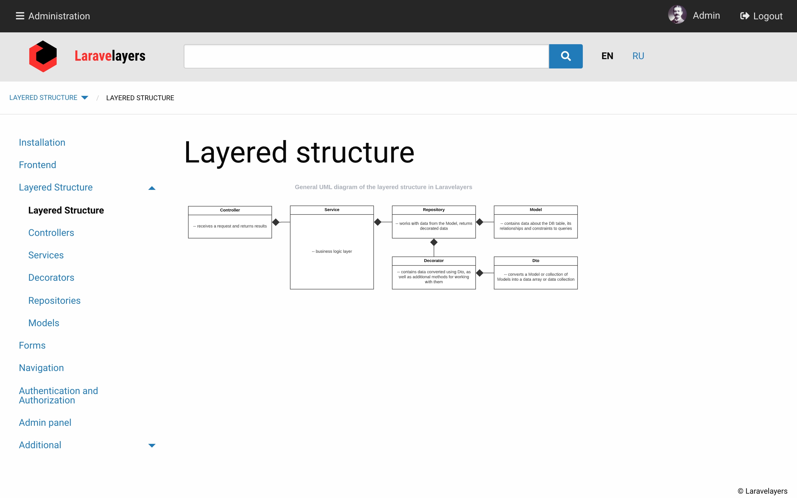

# Фронтенд

- [Введение](#introduction)
- [Установка Foundation и других NPM пакетов](#installation)
- [Представления](#view)
	- [Макет страницы](#page-layout)
	- [Дополнительные макеты](#additional-layouts)
- [SASS](#sass)
	- [Иконки](#icons)
- [Javascript](#javascript)
	- [Добавление Javascript плагинов](#adding-javascript-plugins)

<a name="introduction"></a>
## Введение
	
В качестве фронтенд фреймворка используется [Foundation ZURB](https://get.foundation/sites).



<a name="installation"></a>
## Установка Foundation и других NPM пакетов

В процессе [установки Laravelayers](installation.md) необходимо сначала выполнить следующую Artisan-команду:

```php
php artisan laravelayers:install --no-interaction
```
	
Затем установить зависимости из `package.json` и скомпилировать CSS и JS файлы:
	
```php
npm install && npm run dev
```
	
В результате вместе с Foundation будут установлены следующие NPM пакеты:

- [Cropper.js](https://fengyuanchen.github.io/cropperjs/)
- [Flatpickr](https://flatpickr.js.org)
- [Font Awesome](https://fontawesome.com)
- [jQuery UI](https://jqueryui.com)
- [LibPhoneNumber](https://github.com/catamphetamine/libphonenumber-js)
- [Quill](https://quilljs.com)
- [SimpleMDE](https://simplemde.com)
- [Validator.js](https://github.com/validatorjs/validator.js)

Будут скопированы следующие файлы и директории:

```php
|-resources/
|	|-js/
|	|	|-vendor/
|	|	|	|-admin/
|	|	|	|-foundation/
|	|	|
|	|	|-app.js
|	|	|-app.admin.js
|	|	|-bootstrap.js
|	|
|	|-sass/
|	|	|-default/
|	|	|	|-layouts/
|	|	|	|-settings/
|	|	|		|-_settings.scss
|	|	|
|	|	|-vendor/
|	|	|	|-admin/
|	|	|	|-foundation/
|	|	|
|	|	|-app.scss
|	|	|-app.admin.scss
|	|
|	|-lang/
|	|	|-vendor/
|	|		|-admin/
|	|		|-foundation/
|	|
|	|
|	|-views/
|		|-vendor/
|			|-admin/
|			|-foundation/
|
|-webpack.mix.js
```	

> Обратите внимание, что при копировании все существующие файлы с таким же именем будут переименованы в файлы с расширением `.bak`.

Для повторного копирования всех Javascript и Sass файлов, выполните Artisan-команду без опции `--no-interaction`:

```php
php artisan laravelayers:install
```
	
> Обратите внимание, что файл с настройками Sass для фронтенд фреймворка Foundation будет скопирован в `resources/sass/default/settings/_settings.scss`, только если файла не существует.
	
Для повторного копирования файлов только в директорию `resources`, выполните следующие Artisan-команды:

```php
php artisan vendor:publish --tag laravelayers-foundation
php artisan vendor:publish --tag laravelayers-admin
```

<a name="view"></a>
## Представления

Директория `/resources/view/vendor/foundation/layouts` содержит представления по умолчанию, которые подключаются с помощью пространства имен `foundation`.

<a name="page-layout"></a>
### Макет страницы

Макет страницы `foundation::layouts.app` по умолчанию включает в себя следующие представления:

```php
|- admin::layouts.menuBar
|
|- header
|	|- topBar
|	|	|- admin::layouts.topBar
|	|	|
|	|	|- titleBar
|	|	|	|- titleBarLeft
|	|	|	|- titleBarRight 
|	|	|
|	|	|- topBarLeft
|	|	|- topBarCenter
|	|	|
|	|	|- topBarRight
|	|		|- auth::layouts.auth
|	|
|	|- breadcrumbs
|	|- headerBar
|	|
|	|- simpleTopBar
|		|- simpleTitleBar
|		|	|- titleBarLeft
|		|	|- titleBarRight
|		|
|		|- topBarLeft
|		|- auth::layouts.auth
|
|- main
|	|- sidebarLeft
|	|- content
|	|- sidebarRight
|	
|- footer
```

Пример использования макета страницы:

```php
@extends('foundation::layouts.app', ['class' => 'app', 'title' => 'App', 'simple' => false, 'clear' => false, 'full' => false])

@push('head')

	<style>
		body {background-color: white;}
	</style>

@endpush

@section('breadcrumbs')

	{{ $path->render('breadcrumbs.menu') }}

@endsection

@section('breadcrumbsRight')

	<div data-responsive-toggle="sidebar_left" data-hide-for="large">
		<a data-toggle="sidebar_left">
			@icon('icon-bars')
		</a>
	</div>

@endsection

@section('headerBar')

	{{--heade bar--}}

@endsection

@section('sidebarLeft')

	@component('foundation::layouts.sidebarLeft')

		<div class="sticky" data-sticky data-anchor="main" data-sticky-on="large" data-margin-top="4">
			Sidebar left
		</div>

	@endcomponent

@endsection

@section('content')

	@component('foundation::layouts.content')

        {!! $content !!}

	@endcomponent
	
@endsection

@section('sidebarRight')

    @if (!empty($content_right))

        @component('foundation::layouts.sidebarRight')

            {!! $content_right !!}

        @endcomponent

    @endif

@endsection

@push('scripts')

	<script>
		console.log('app');
	</script>

@endpush

@section('footer')

	@component('foundation::layouts.footer')

		<div class="cell text-right">
			<small>&#169; {{ config('app.name', 'Laravel') }}</small>
		</div>

	@endcomponent

@endsection
```

> Обратите внимание, что представление `foundation::layouts.app` включает разделы, благодаря чему вы можете заменять содержимое этих разделов на странице.

**`$class`**

Значение переменной `class`, переданной в макет страницы, будет добавлено в качестве класса для тела страницы.

**`$title`**

Значение переменной `title`, переданной в макет страницы, будет добавлено для HTML элемента `<title>`.

**`$simple`**

Если передана не пустая переменная `$simple` в макет страницы, то переменная будет передана в представление `foundation::layouts.header`.

**`$clear`**

Если передана не пустая переменная `clear`, то в макете страницы не будут включены представления `foundation::layouts.header` и `foundation::layouts.footer`.

**`$full`**

Если передана не пустая переменная `$full`, то в макете страницы не будут включены представления `foundation::layouts.header` и `foundation::layouts.footer`, а также переменная будет передана в представление `foundation::layouts.main` для добавления `100%` высоты  содержимому и выравнивания содержимого по высоте и ширине, например, по центру `<div class="grid-x grid-padding-x grid-padding-y align-middle">`.  

**`head`**

С помощью раздела `head` вы можете передать дополнительное содержимое внутрь HTML элемента `<head>`.

**`foundation::layouts.header`**

Представление `foundation::layouts.header` включает представления `admin::layouts.topBar`, `foundation::layouts.topBar`, `foundation::layouts.breadcrumbs`, `foundation::layouts.headerBar`.

> Обратите внимание, что представление `foundation::layouts.header` включает разделы, благодаря чему вы можете заменять содержимое этих разделов на странице.
 
Если передана не пустая переменная `$simple`, то будут включены только представления `admin::layouts.topBar` и `foundation::layouts.simpleTopBar`.

> Обратите внимание, что представления включенные в `foundation::layouts.header`, включают представления из директории `/resources/view/layouts`, соответствующие названиям представлений `foundation::layouts`, если они существуют.

**`admin::layouts.topBar`**

Представление `admin::layouts.topBar` - это верхняя панель для пользователей [авторизованных](auth.md#authorization) с правами администратора, с помощью которой раскрывается боковая панель меню администрирования, для отображения которой используется представление `admin::layouts.menuBar`, подключаемое в макете страницы.

**`foundation::layouts.topBar`**

Представление `foundation::layouts.topBar` - это верхняя панель, которая включает представление `foundation::layouts.titleBar`, для отображения на [маленьких экранах](https://get.foundation/sites/docs/media-queries.html).

**`foundation::layouts.simpleTopBar`**

Представление `foundation::layouts.simpleTopBar` - это простая верхняя панель, которая включает представление `foundation::layouts.simpleTitleBar`, для отображения на [маленьких экранах](https://get.foundation/sites/docs/media-queries.html). 

Простая верхняя панель включается в представлениях [аутентификации](auth.md#publishing-views-and-translations).

**`foundation::layouts.breadcrumbs`**

Представление `foundation::layouts.breadcrumbs` используется для отображения цепочки навигации и дополнительного содержимого справа, которое можно передать с помощью раздела `breadcrumbsRight`. Также включается в `admin::layouts.breadcrumbs`.

> Обратите внимание, что на примере выше, по использованию макета страницы, с помощью раздела `breadcrumbsRight`, добавляет иконка меню, отображаемая на среднем и маленьком экранах, с помощью которой отображается содержимое левой боковой панели.

**`foundation::layouts.headerBar`**

Представление `foundation::layouts.headerBar` используется для отображения дополнительного содержимого снизу под цепочкой навигации. Также включается в `admin::layouts.headerBar`.

**`foundation::layouts.main`**

Представление `foundation::layouts.main` - это макет основного содержимого страницы, которое включает в себя также разделы боковых панелей.

**`foundation::layouts.sidebarLeft`**

Представление `foundation::layouts.sidebarLeft` - это содержимое левой боковой панели.

> Обратите внимание, что на примере выше, по использованию макета страницы, в левой боковой панели используется Javascript плагин [Foundation Sticky](https://get.foundation/sites/docs/sticky.html).

**`foundation::layouts.content`**

Представление `foundation::layouts.main` - это основное содержимое страницы.

**`foundation::layouts.sidebarRight`**

Представление `foundation::layouts.sidebarRight` - это содержимое правой боковой панели.

**`scripts`**

С помощью раздела `scripts` вы можете передать дополнительное содержимое в конец HTML элемента `<body>`.

**`foundation::layouts.footer`**

Представление `footer` используется для отображения в конце страницы и можете быть передано с помощью раздела `footer`, либо добавлено в представлении `/resources/view/layouts/footer.blade.php`.

<a name="additional-layouts"></a>
### Дополнительные макеты

Следующие представления являются базовыми и используются другими представлениями, в том числе представлениями [`form::layouts`](forms.md#types):

- `foundation::layouts.icon` - используется для отображения [иконок](#icons).
- `foundation::layouts.callout` - используется для отображения [предупреждений](https://get.foundation/sites/docs/callout.html).
- `foundation::layouts.preloader` - используется для включения скрытого блока с изображением иконки загрузки `icon-spinner`.

Следующие представления являются базовыми и используются в PHP классах, в том числе в трейте [`Laravelayers\Admin\Decorators\DataDecorator`](admin.md#data-decorators) панели администрирования в методах, используемых для [преобразования отображаемого текста](#render-methods):

- `foundation::layouts.a` - предназначено для отображения ссылок, с возможностью добавления классов для каждой ссылки. Также включается в `admin::layouts.table.a`.
- `foundation::layouts.div` - включает представление `foundation::layouts.span` внутри HTML элемента `<div>`. Также включается в `admin::layouts.table.div`.
- `foundation::layouts.span` - предназначено для отображения текста внутри HTML элементов `<span>`, с возможностью добавления классов для каждого элемента.
- `foundation::layouts.tooltip` - предназначено для отображения текста со всплывающей подсказкой. Также включается в `admin::layouts.table.tooltip`.
- `foundation::layouts.ul` - предназначено для отображения текста внутри HTML элементов `<li>` для списка или нумерованного списка. Также включается в `admin::layouts.table.ul`.

<a name="sass"></a>
## SASS

Структура директории `/resources/sass/vendor/foundation` по умолчанию аналогична структуре директории `scss` NPM пакета `foundation-sites`.

Поддиректория `layouts` содержит SCSS файлы, соответствующие представлениям в директории `/resources/sass/vendor/foundation/layouts`.

Директория `/resources/sass/default` по умолчанию предназначена для пользовательских файлов, вместо того чтобы вносить изменения в `/resources/sass/vendor/foundation`. В директории по умолчанию расположен файл `settings/_settings.scss` с настройками Sass для фронтенд фреймворка Foundation.

Все SCSS файлы подключаются в `/resources/sass/vendor/foundation/app.scss`, который добавлен по умолчанию в `webpack.mix.js`. 

Аналогичная структура в директориии `/resources/sass/vendor/admin`. SCSS файлы подключаются в файле `/resources/sass/vendor/foundation/app.admin.scss`, который добавлен по умолчанию в `webpack.mix.js`.

<a name="icons"></a>
### Иконки

В файле `/resources/sass/_fontawesome.scss` подключаются иконки из NPM пакета `@fortawesome`.

> Обратите внимание, что в файле `/resources/sass/layouts/_icon.scss` определен префикс `icon` вместо `fa` для классов иконок [Font Awesome](https://fontawesome.com). 

Также добавлена возможность для изменения цветов иконок, путем добавления классов в соответствии с картой цветов (`primary`, `secondary`, `success`, `warning`, и `alert`), которые можно изменить в переменной `$foundation-palette` в файле `/resources/sass/default/settings/_settings.scss`.

В классе `Laravelayers\Foundation\BladeDirectives` установлена [Blade директива](https://laravel.com/docs/blade#extending-blade) `@icon`, использующая представление `foundation::layouts.icon` для отображения иконок:

```php
@icon('icon-plus icon-fw alert', 'id="test"')
	
/**
	<i class="icon icon-plus icon-fw alert" id="test"></i>
**/
```

<a name="javascript"></a>
## Javascript

Структура директории `/resources/js/vendor/foundation` по умолчанию аналогична структуре директории `js` NPM пакета `foundation-sites`.

Все Javascript файлы подключаются в `/resources/js/vendor/foundation/app.js`, который добавлен по умолчанию в `webpack.mix.js`.

Аналогичная структура в директориии `/resources/js/vendor/admin`. Javascript файлы подключаются в файле `/resources/js/vendor/foundation/app.admin.js`, который добавлен по умолчанию в `webpack.mix.js`.

<a name="adding-javascript-plugins"></a>
### Добавление Javascript плагинов

Простейший способ создать собственный Javascript плагин для фреймворка Foundation в вашем приложении — выполнить Artisan-команду:

```php
php artisan make:js charts --app
```

В результате выполнения данной команды будет создан плагин `resources/js/plugins/charts.js`:

```javascript
'use strict';
	
import $ from 'jquery';
	
/**
* Charts plugin.
* @module foundation.charts
*/
class Charts {
/**
 * Creates a new instance of Charts.
 * @class
 * @name Charts
 * @fires Charts#init
 * @param {Object} element - jQuery object to add the trigger to.
 * @param {Object} options - Overrides to the default plugin settings.
 */
constructor(element, options = {}) {
	this.$element = element;
	this.options  = $.extend(true, {}, Charts.defaults, this.$element.data(), options);
	
	this.className = 'Charts'; // ie9 back compat
	
	this._init();
	
	Foundation.registerPlugin(this, this.className);
}
	
/**
 * Initializes the Charts plugin.
 * @private
 */
_init() {
	//
	
	this._events();
}
	
/**
 * Initializes events for Charts.
 * @private
 */
_events() {
	//
}
	
/**
 * Destroys an instance of Charts.
 * @function
 */
_destroy() {
	Foundation.unregisterPlugin(this, this.className);
}
}
	
/**
* Default settings for plugin
*/
Charts.defaults = {
//
};
	
export {Charts};
```

C помощью опции `--app` плагин будет включен в файл `resources/js/plugins/plugins.js`:

```javascript
//...

import { Charts } from './charts.js';
Foundation.plugin(Charts, 'Charts');
```

Файл `plugins.js` будет включен в файл `resources/js/app.js`, если он еще не включен:

```javascript
//...

require('./plugins/plugins.js');
```	

По умолчанию плагины создаются в директории `resources/js/plugins/`, но если при указании имени плагина в начале указать слэш `/charts`, то плагин будет создан в директории `resources/js/`.

В этом случае или если не используется опция `--app`, в конце плагина будет добавлена строчка:

```javascript
Foundation.plugin(Charts, 'Charts');
```	

Теперь необходимо импортировать в плагин необходимые модули, например, [Frappe Charts](https://github.com/frappe/charts):

```javascript
import $ from 'jquery';
import { Chart } from "frappe-charts"
```

Метод `_init` используется для инициализиации плагина, например:

```javascript
_init() {
	this._get();

	this._events();
}

/**
 * Get data and draw a chart.
 * @returns {object}
 * @private
 */
_get() {
	let _this = this;

	$.ajax({
		headers: {'X-CSRF-TOKEN': $('meta[name="csrf-token"]').attr('content')},
		url: this.options.ajaxUrl,
		data: 'chart=1',
		dataType: "json"
	}).done(function (data) {
		let $options = {
			title: _this.options.title,
			data: data,
			type: "axis-mixed", // or 'bar', 'line', 'scatter', 'pie', 'percentage'
			height: 250
		};

		if (typeof _this.options.chartsOptions === 'object') {
			$.extend($options, _this.options.chartsOptions);
		}

		new Chart('#' + _this.$element.attr('id'), $options);
	});
}
```

Метод `_events` используется для инициализиации событий плагина, например:

```javascript
_events() {
	this.$element.on('click.foundation.charts', (event) => {
		this._destroy();
	});
}
```

При использовании представления `foundation::layouts.app` плагин будет зарегистрирован автоматически:

```html
<script src=" {{ mix('/js/app.js') }} "></script>
<script>
	$(document).foundation();
</script>
```

Метод `_destroy` используется для отмены регистрации плагина, например:

```javascript
_destroy() {	
	this.$element.html('');
	
	Foundation.unregisterPlugin(this, this.className);
}
	
// $('#chart').foundation('_destroy');
```
	
Также можно добавить дополнительные настройки для плагина, которые можно изменять с помощью соответствующих атрибутов HTML элемента:

```javascript
/**
 * Default settings for plugin
 */
Charts.defaults = {
    /**
     * URL to load data using Ajax.
     * @option
     * @type {string}
     * @default window.location.href
     */
    ajaxUrl: window.location.href,

    /**
     * Chart title.
     * @option
     * @type {string}
     * @default ''
     */
    title: '',

    /**
     * List of options in JSON format.
     * @option
     * @type {string}
     * @default ''
     */
    chartsOptions: ''
};
```
	
После того как будут скомпилированы JS файлы с помощью команды `npm run dev`, необходимо привязать плагин к HTML элементу и добавить атрибуты для настройки, например:

```php
<div id="chart" data-charts data-ajax-url="{{ url()->current() }}" data-title="My Awesome Chart"
	 data-charts-options="{{ htmlspecialchars(json_encode(['colors' => ['red', 'green']])) }}">
</div>
```	

В данному примере, данные для диаграммы будут получены с помощью Ajax запроса к текущему URL:

```php
/**
 * Display a listing of the resource.
 *
 * @param Request $request
 * @return \Illuminate\View\View|string
 */
public function index(Request $request)
{
	if ($request->ajax()) {
		return json_encode([
			"labels" => [
				"12am-3am", "3am-6pm", "6am-9am", "9am-12am", "12pm-3pm", "3pm-6pm", "6pm-9pm", "9am-12am"
			],
			"datasets" => [
				[
					"name" => "Some Data",
					"type" => "bar",
					"values" => [25, 40, 30, 35, 8, 52, 17, -4]
				],
				[
					"name" => "Another Set",
					"type" => "line",
					"values" => [25, 50, -10, 15, 18, 32, 27, 14]
				]
			]
		]);
	}

	$items = $this->service->paginate($request);

	return view("admin::layouts.action.index", compact('items'));
}
```
