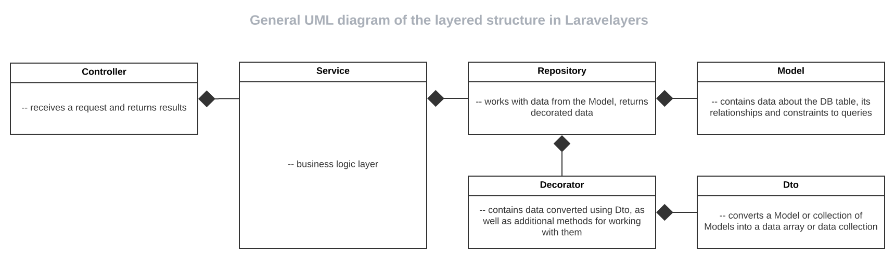
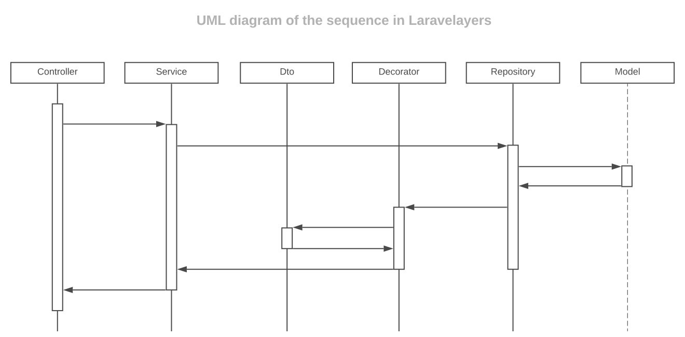
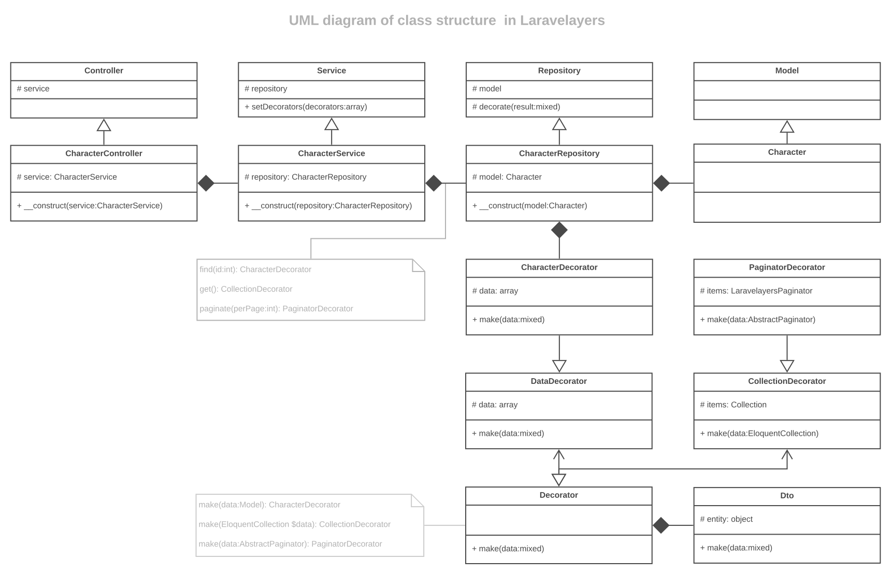

# Слоистая структура

- [Введение](#introduction)
- [Слои](#layers)
	- [Контроллеры](#controllers)
	- [Сервисы](#services)
	- [Декораторы](#decorators)
	- [Репозитории](#repositories)
	- [Модели](#models)
- [Определение классов](#defining-classes)

<a name="introduction"></a>
## Введение

Реализация слоистой структуры классов основана на идее  <https://www.toptal.com/php/maintain-slim-php-mvc-frameworks-with-a-layered-structure>
([на русском](http://developer.uz/blog/layered-structure-for-yii-app/)).

В контроллер внедряется сервис, в который внедряется репозиторий, в который внедряются модель и декоратор, с помощью которого данные, полученные из модели, преобразуются и возвращаются в объекте декоратора.

**Общая UML диаграмма слоистой структуры**

[](https://lucid.app/documents/view/16a364a8-19b7-4136-a555-02f58b0c696e)

**UML диаграмма последовательности взаимодействия слоев**

[
](https://lucid.app/documents/view/6c217ff3-3a7a-4806-bdf8-7a9b117c9de4)

<a name="layers"></a>
## Слои

<a name="controllers"></a>
### Контроллеры

[Контроллер](controllers.md) - это тонкий слой, он только получает запрос и возвращает ответ, поэтому он может вызывать только методы сервисного слоя и ничего не знает о репозитории. Ниже приведен класс контроллера использующего сервис.

```php
<?php
	
namespace App\Http\Controllers\Character;
	
use Laravelayers\Foundation\Controllers\Controller;
	
class CharacterController extends Controller
{
    /**
     * Create a new CharacterController instance.
     *
     * @param CharacterService $characterService
     */
    public function __construct(CharacterService $characterService)
    {
        $this->service = $characterService;
    }
    
    /**
     * Display a listing of repository items.
     *
     * @param Request $request
     * @return \Illuminate\View\View
     */
    public function index(Request $request)
    {
        $items = $this->service->paginate($request);
	
        return view("character.index", compact('items'));
    }
    
	 /**
     * Display the specified repository item.
     *
     * @param int $id
     * @return \Illuminate\View\View
     */
    public function show($id)
    {
        $item = $this->service->find($id);
	
        return view('character.show', compact('item'));
    }
}
```

<a name="services"></a>	
### Сервисы

[Сервисный слой](services.md) - это слой бизнес-логики, в котором обрабатывается запрос поступающий из контроллера, т.е. используются условия с помощью которых вызываются необходимые методы репозитория.

```php
<?php
	
namespace App\Services\Character;
	
use App\Decorators\Character\CharacterDecorator;
use App\Repositories\Character\CharacterRepository;
use Laravelayers\Foundation\Services\Service;
	
class CharacterService extends Service
{
    /**
     * Create a new CharacterService instance.
     *
     * @param CharacterRepository $characterRepository
     */
    public function __construct(CharacterRepository $characterRepository)
    {
        $this->repository = $characterRepository;
        
        $this->setDecorators([
            CharacterDecorator::class
        ]);
    }
    
    /**
     * Find the repository item by the specified ID.
     *
     * @param int $id
     * @return CharacterDecorator
     */
    public function find($id)
    {         	
    	return $this->repository
    		->withBooks()
    		->findOrFail($id)
    }
    
    /**
     * Paginate repository items.
     *
     * @param \Illuminate\Http\Request $request
     * @return \Laravelayers\Foundation\Pagination\Decorators\PaginatorDecorator
     */
    public function paginate(Request $request)
    {
    	if ($request->has('search')) {
    		$this->repository->search($request->get('search'));
    	}
    	
		return $this->repository
        	->withBooks()
        	->sorting($request->get('desc') ? 'desc' : 'asc')
        	->paginate();
    }
}
```

<a name="repositories"></a>
### Репозитории

[Репозиторий](repositories.md) вызывает методы модели и возвращает преобразованные данные в объекте декоратора.

```php
<?php
	
namespace App\Repositories\Character;
	
use App\Models\Book\Character;
use Laravelayers\Foundation\Repositories\Repository;
	
class CharacterRepository extends Repository
{
    /**
     * Create a new CharacterRepository instance.
     *
     * @param Character $character
     */
    public function __construct(Character $character)
    {
        $this->model = $character;
    }
    
	/**
	 * Loading books for the character.
	 *
	 * @return $this
	 */
	public function withBooks()
	{
		return $this->query(
			$this->model->with(['books' => function($query) {
				$query->with('author')->Sorting();
			}])
		);
	}	    
}
```

<a name="decorators"></a>	
### Декораторы

[Декоратор](decorators.md) создает объект с дополнительными методами для работы с данными, полученными репозиторием из модели и преобразованными с помощью класса DTO в массив данных или коллекцию данных.

```php
<?php

namespace App\Decorators\Character;
	
use App\Decorators\Book\BookDecorator;
use Laravelayers\Foundation\Decorators\DataDecorator;
	
class CharacterDecorator extends DataDecorator
{
    /**
     * Get the name.
     *
     * @return string
     */	    
    function getName()
    {
        return strtoupper($this->get('name'));
    }
    
    /**
     * Get books.
     *
     * @return \Laravelayers\Foundation\Decorators\CollectionDecorator
     */	    
    function getBooks()
    {
        return BookDecorator::make($this->get('books', collect()));
    }		    
}
```

<a name="models"></a>
### Модели

[Модель](models.md) содержит данные о таблице базы данных и ее связях, а также области запросов.

```php
<?php
	
namespace App\Models\Character;
	
use App\Models\Book\Book;
use App\Models\Book\Book2Character;
use Laravelayers\Foundation\Models\Model;
	
class Character extends Model
{
	/**
	 * Define the relationship to the book.
	 *
	 * @return \Illuminate\Database\Eloquent\Relations\HasOne
	 */
	public function books()
	{
		return $this->hasManyThrough(
			Book::class,
			Book2Character::class,
			'character_id',
			'book_id',
			'id',
			'id'
		);
	} 
	   
	/**
	 * Search by default.
	 *
	 * @param $query
	 * @param $search
	 * @return \Illuminate\Database\Eloquent\Builder
	 */
	public function scopeSearch($query, $search)
	{
	    return $query->whereKey($search);
	}
	
	/**
	 * Sorting by default.
	 *
	 * @param $query
	 * @param string $direction
	 * @return \Illuminate\Database\Eloquent\Builder
	 */
	public function scopeSorting($query, $direction = 'desc')
	{
	    return $query->orderBy($this->getQualifiedKeyName(), $direction);
	}	
}
```
	
<a name="defining-classes"></a>	
## Определение классов

Простейший способ создать все слои сразу — [создать контроллер с внедренным сервисным слоем](controllers.md#inject-service-layer), выполнив Artisan-команду `make:controller` с опцией `--service`:

```php
php artisan make:controller Character/Character -s
```

UML диаграмма структуры классов:

[](https://lucid.app/documents/view/4f287ac4-f718-4216-b508-105fa1b035f4)
