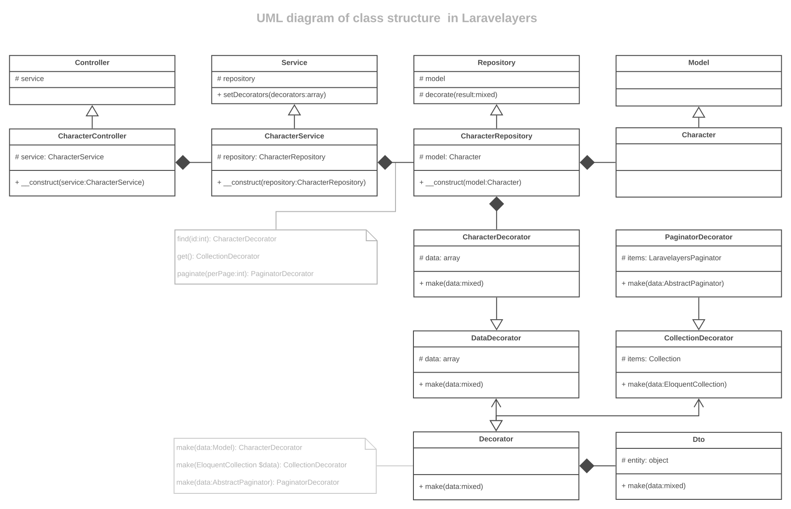

# Модели

- [Введение](#introduction)
- [Определение моделей](#defining-models)
- [Базовая модель](#base-model)	

<a name="introduction"></a>
## Введение

[Слой](layers.md) модель внедряется в репозиторий, содержит данные о таблице базы данных и ее связях, а также заготовки запросов.

**Общая UML диаграмма слоистой структуры**

[](https://lucid.app/documents/view/16a364a8-19b7-4136-a555-02f58b0c696e)

**UML диаграмма последовательности взаимодействия слоев**

[
](https://lucid.app/documents/view/6c217ff3-3a7a-4806-bdf8-7a9b117c9de4)

<a name="defining-models"></a>
## Определение моделей

Ниже приведен класс модели.

> Обратите внимание, что модель расширяет базовый класс модели, включенный в Laravelayers, который в свою очередь расширяет базовый класс модели, включенный в Laravel.

```php
<?php
	
namespace App\Models\Character;
	
use App\Models\Book\Book;
use App\Models\Book\Book2Character;
use Laravelayers\Foundation\Models\Model;
	
class Character extends Model
{
	/**
     * Define the relationship to the book.
     *
     * @return \Illuminate\Database\Eloquent\Relations\HasOne
     */
    public function books()
    {
		return $this->hasManyThrough(
			Book::class,
			Book2Character::class,
			'character_id',
			'book_id',
			'id',
			'id'
		);
    }
    
	/**
	 * Search by default.
	 *
	 * @param $query
	 * @param string $search
	 * @param string|null $column
	 * @return \Illuminate\Database\Eloquent\Builder
	 */
	public function scopeSearch($query, $search, $column = null)
	{
		return $query->where($column ?: $this->getQualifiedKeyName(), 'like', "{$search}%");
	}
	
	/**
	 * Sort by default.
	 *
	 * @param $query
	 * @param string $direction
	 * @param string|null $column
	 * @return \Illuminate\Database\Eloquent\Builder
	 */
	public function scopeSort($query, $direction = 'desc', $column = null)
	{
		return $query->orderBy($column ?: $this->getQualifiedKeyName(), $direction);
	}	
}
```
	
> Все пользовательские модели, используемые для представления промежуточных таблиц отношений, должны расширять класс `Laravelayers\Foundation\Models\Pivot`, включенный в Laravelayers, который расширяет класс `Illuminate\Database\Eloquent\Relations\Pivot`, включенный в Laravel.
	
Простейший способ создать модель — выполнить Artisan-команду `make:model`:

```php
php artisan make:model Character/Character
```

В результате выполнения данной команды будет создан класс модели `App\Models\Character\Character`.

UML диаграмма структуры классов:

[](https://lucid.app/documents/view/4f287ac4-f718-4216-b508-105fa1b035f4)

По умолчанию модели создаются в директории `app/Models`, но если при указании имени модели в начале указать слэш `/Character/Character`, то модель будет создана в директории приложения `app/Character/Character`.

По умолчанию, имя класса, файла и директории будут преобразованы в строку СamelCase с большой буквой в начале. Для отмены преобразования следует использовать опцию `--nm`:

```php
php artisan make:model Character/Character --nm
```
	
Для генерации шаблона модели по умолчанию следует использовать опцию `--template`:	

```php	
php artisan make:model Character/Character -t App/Models/Model
```	
	
Для изменения имени класса базовой модели следует использовать опцию `--rp`:

```php
php artisan make:model Character/Character --rp App/Models/Model
```

Или переопределить вызов команды создания модели в сервис-провайдере:

```php
<?php
	
namespace App\Providers;
	
use Illuminate\Support\ServiceProvider;
	
class AppServiceProvider extends ServiceProvider
{
    /**
     * Bootstrap any application services.
     *
     * @return void
     */
    public function boot()
    {
        $this->app->extend('command.model.make', function () {
            return $this->app
                ->make(\Laravelayers\Foundation\Console\Commands\ModelMakeCommand::class)
                ->setBaseClass('App/Model/Model');
        });
    }
}
```
	
Также можно настроить файлы заглушек, используемых при выполнении команды создания модели. Для этого следует выполнить команду публикации наиболее распространенных заглушек:

```php
php artisan stub:publish
```	

<a name="base-model"></a>
## Базовая модель

Базовый класс модели `Laravelayers\Foundation\Models\Model` определяет дополнительные методы:

- [`scopePaginateManually`](#scope-paginate-manually)
- [`scopeJoinModel`](#scope-join-model)
- [`getColumnListing`](#get-column-listing)
- [`getColumnTypes`](#get-column-types)

<a name="scope-paginate-manually"></a>	
**`scopePaginateManually()`**

Метод `scopePaginateManually` получает результат базового метода `paginate`, но результат возвращает в объекте `Laravelayers\Pagination\Paginator`, включенного в Laravelayers:

```php
// Laravelayers\Foundation\Repositories\Repository
	
/**
 * Paginate the given query and make it.
 *
 * @param int|null $perPage
 * @param string $pageName
 * @param int|null $page
 * @return \Laravelayers\Foundation\Pagination\Decorators\PaginatorDecorator
 */
public function paginate($perPage = null, $pageName = 'page', $page = null)
{
    return $this->decorate(
        $this->model->PaginateManually($perPage, ['*'], $pageName, $page)
    );
}
```
	
> Обратите внимание, что если запрос содержит оператор `distinct` или `groupBy`, то для получения количества строк выполняется запрос `$query->distinct()->count($this->getQualifiedKeyName())`. Чтобы изменить столбец, передаваемый в метод `count`, необходимо передать его имя в качестве второго аргумента в метод `PaginateManually`, вместо массива столбцов.

<a name="simple-paginate-manually"></a>
Метод `simplePaginateManually` получает результат базового метода `simplePaginate`, но результат возвращает в объекте `Laravelayers\Pagination\SimplePaginator`, включенного в Laravelayers:

```php
// Laravelayers\Foundation\Repositories\Repository
	
/**
 * Simple paginate the given query and make it.
 *
 * @param int|null $perPage
 * @param string $pageName
 * @param int|null $page
 * @return \Laravelayers\Foundation\Pagination\Decorators\PaginatorDecorator
 */
public function simplePaginate($perPage = null, $pageName = 'page', $page = null)
{
    return $this->decorate(
        $this->model->simplePaginateManually($perPage, ['*'], $pageName, $page)
    );
}
```

<a name="scope-join-model"></a>	
**`scopeJoinModel()`**

Методы `scopeJoinModel`, `scopeLeftJoinModel` и `scopeRightJoinModel` принимают в качестве первого параметра название метода отношения модели или массив с функцией обратного вызова, как в методе [`with`](https://laravel.com/docs/eloquent-relationships#eager-loading). Из отношения получаются названия таблиц и столбцов первичных ключей, передаваемых в базовые методы объединения таблиц `join`, `leftJoin` или `rightJoin`.

```php	
// App\Models\Character\Character
	
public function scopeSortingByRating($query, $direction = 'desc')
{
    return $query->leftJoinModel(['rating' => function($query) use($direction) {
        $query->sorting($direction);
    }]);
}
```	
	
<a name="get-column-listing"></a>	
**`getColumnListing()`**

Метод `getColumnListing` получает список столбцов таблицы БД.

<a name="get-column-types"></a>	
**`getColumnTypes()`**

Метод `getColumnTypes` получает список типов для столбцов таблицы БД.

Перед получением типов столбцов, обязательно добавьте зависимость `doctrine/dbal` в ваш файл `composer.json`: 

```php
composer require doctrine/dbal
```
